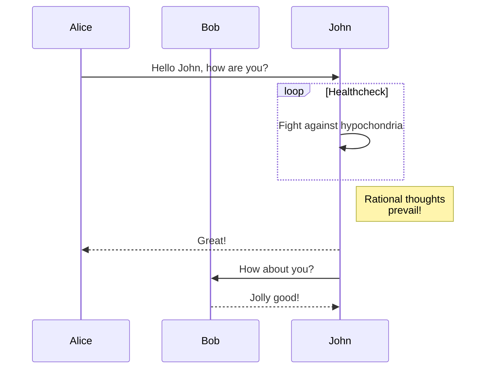

================
CODE SNIPPETS
================
TITLE: Hugo Version Check
DESCRIPTION: Verifies that the installed Hugo version meets the minimum requirement for the tutorial. This is a crucial first step before proceeding with site creation.

SOURCE: https://github.com/gohugoio/hugo/blob/master/docs/content/en/getting-started/quick-start.md#_snippet_0

LANGUAGE: text
CODE:
```
hugo version
```

--------------------------------

TITLE: Install and Serve Hugo Locally
DESCRIPTION: Commands to install dependencies and start the Hugo development server. Note that the need for `npm i` is being addressed.

SOURCE: https://github.com/gohugoio/hugo/blob/master/docs/README.md#_snippet_0

LANGUAGE: sh
CODE:
```
npm i
hugo server
```

--------------------------------

TITLE: Hugo Site Configuration (hugo.toml)
DESCRIPTION: Example of a Hugo site configuration file (hugo.toml) showing essential parameters like baseURL, languageCode, title, and theme.

SOURCE: https://github.com/gohugoio/hugo/blob/master/docs/content/en/getting-started/quick-start.md#_snippet_5

LANGUAGE: toml
CODE:
```
baseURL = 'https://example.org/'
languageCode = 'en-us'
title = 'My New Hugo Site'
theme = 'ananke'
```

--------------------------------

TITLE: Example Markdown Content with Front Matter
DESCRIPTION: An example of a Markdown file for a Hugo post, including front matter with title, date, and draft status, along with Markdown content for the body.

SOURCE: https://github.com/gohugoio/hugo/blob/master/docs/content/en/getting-started/quick-start.md#_snippet_4

LANGUAGE: markdown
CODE:
```
+++
title = 'My First Post'
date = 2024-01-14T07:07:07+01:00
draft = true
+++
## Introduction

This is **bold** text, and this is *emphasized* text.

Visit the [Hugo](https://gohugo.io) website!
```

--------------------------------

TITLE: Hugo Server Start (with Drafts)
DESCRIPTION: Starts Hugo's development server, including draft content. This allows previewing content that is marked as a draft before publishing.

SOURCE: https://github.com/gohugoio/hugo/blob/master/docs/content/en/getting-started/quick-start.md#_snippet_2

LANGUAGE: text
CODE:
```
hugo server --buildDrafts
```

LANGUAGE: text
CODE:
```
hugo server -D
```

--------------------------------

TITLE: Create New Hugo Site
DESCRIPTION: Initializes a new Hugo static site generator project in the current directory.

SOURCE: https://github.com/gohugoio/hugo/blob/master/testscripts/commands/new_content.txt#_snippet_0

LANGUAGE: bash
CODE:
```
hugo new site myblog
```

--------------------------------

TITLE: Hugo Site Configuration Example
DESCRIPTION: Demonstrates how to use the `code-toggle` shortcode to display site configuration settings.

SOURCE: https://github.com/gohugoio/hugo/blob/master/docs/content/en/contribute/documentation.md#_snippet_10

LANGUAGE: text
CODE:
```

baseURL = 'https://example.org/'
languageCode = 'en-US'
title = 'My Site'

```

--------------------------------

TITLE: Navigate to Hugo Site Directory
DESCRIPTION: Changes the current working directory to the newly created Hugo site.

SOURCE: https://github.com/gohugoio/hugo/blob/master/testscripts/commands/new_content.txt#_snippet_1

LANGUAGE: bash
CODE:
```
cd myblog
```

--------------------------------

TITLE: Build Static Site
DESCRIPTION: Builds the complete static website for deployment. By default, this command excludes draft, future, and expired content.

SOURCE: https://github.com/gohugoio/hugo/blob/master/docs/content/en/getting-started/quick-start.md#_snippet_6

LANGUAGE: text
CODE:
```
hugo
```

--------------------------------

TITLE: Create Hugo Site and Add Ananke Theme
DESCRIPTION: Commands to create a new Hugo site, initialize a Git repository, add the Ananke theme as a submodule, and configure the site to use the theme. These commands set up the basic project structure.

SOURCE: https://github.com/gohugoio/hugo/blob/master/docs/content/en/getting-started/quick-start.md#_snippet_1

LANGUAGE: text
CODE:
```
hugo new site quickstart
cd quickstart
git init
git submodule add https://github.com/theNewDynamic/gohugo-theme-ananke.git themes/ananke
echo "theme = 'ananke'" >> hugo.toml
hugo server
```

--------------------------------

TITLE: Hugo Template Code Example
DESCRIPTION: An example of Go HTML template code demonstrating conditional logic and printing formatted strings.

SOURCE: https://github.com/gohugoio/hugo/blob/master/docs/content/en/contribute/documentation.md#_snippet_6

LANGUAGE: go-html-template
CODE:
```
{{ if eq $foo $bar }}
  {{ fmt.Printf "%s is %s" $foo $bar }}
{{ end }}
```

--------------------------------

TITLE: Create and Initialize Hugo Site
DESCRIPTION: This snippet demonstrates the basic commands to create a new Hugo project directory, navigate into it, and run the Hugo executable for the first time. It also shows expected output for an empty directory.

SOURCE: https://github.com/gohugoio/hugo/blob/master/testscripts/commands/hugo__noconfig.txt#_snippet_0

LANGUAGE: bash
CODE:
```
mkdir mysite
cd mysite
! hugo
```

LANGUAGE: bash
CODE:
```
stderr 'Unable to locate config file or config directory'
ls .
stdout 'Empty dir'
```

--------------------------------

TITLE: Hugo Site Configuration
DESCRIPTION: Example Hugo configuration file demonstrating multi-language setup with default content language and language-specific settings.

SOURCE: https://github.com/gohugoio/hugo/blob/master/docs/content/en/methods/site/Sites.md#_snippet_0

LANGUAGE: toml
CODE:
```
defaultContentLanguage = 'de'
defaultContentLanguageInSubdir = false

[languages.de]
languageCode = 'de-DE'
languageDirection = 'ltr'
languageName = 'Deutsch'
title = 'Projekt Dokumentation'
weight = 1

[languages.en]
languageCode = 'en-US'
languageDirection = 'ltr'
languageName = 'English'
title = 'Project Documentation'
weight = 2
```

--------------------------------

TITLE: Create New Content Page
DESCRIPTION: Creates a new Markdown file for a blog post within the content directory. This is the standard way to add new pages or posts to a Hugo site.

SOURCE: https://github.com/gohugoio/hugo/blob/master/docs/content/en/getting-started/quick-start.md#_snippet_3

LANGUAGE: text
CODE:
```
hugo new content content/posts/my-first-post.md
```

--------------------------------

TITLE: Configuration Example
DESCRIPTION: Example of setting a parameter in the site configuration.

SOURCE: https://github.com/gohugoio/hugo/blob/master/docs/content/en/methods/page/Param.md#_snippet_1

LANGUAGE: toml
CODE:
```
[params]
display_toc = true
```

--------------------------------

TITLE: Create New Content File
DESCRIPTION: Creates a new content file for a post within the 'post' kind.

SOURCE: https://github.com/gohugoio/hugo/blob/master/testscripts/commands/new_content.txt#_snippet_2

LANGUAGE: bash
CODE:
```
hugo new content --kind post post/first-post.md
```

--------------------------------

TITLE: Hugo Mod Get Examples
DESCRIPTION: Illustrates various ways to use the 'hugo mod get' command to manage module dependencies, including installing specific versions, updating all dependencies, and performing recursive updates.

SOURCE: https://github.com/gohugoio/hugo/blob/master/docs/content/en/commands/hugo_mod_get.md#_snippet_3

LANGUAGE: bash
CODE:
```
Install the latest version possible for a given module:

    hugo mod get github.com/gohugoio/testshortcodes

Install a specific version:

    hugo mod get github.com/gohugoio/testshortcodes@v0.3.0

Install the latest versions of all direct module dependencies:

    hugo mod get
    hugo mod get ./... (recursive)

Install the latest versions of all module dependencies (direct and indirect):

    hugo mod get -u
    hugo mod get -u ./... (recursive)
```

--------------------------------

TITLE: Find Draft Posts
DESCRIPTION: Searches for content files where the 'draft' attribute is set to true.

SOURCE: https://github.com/gohugoio/hugo/blob/master/testscripts/commands/new_content.txt#_snippet_4

LANGUAGE: bash
CODE:
```
grep 'draft = true' content/post/first-post.md
```

--------------------------------

TITLE: Hugo Mounts Example Configuration
DESCRIPTION: An example Hugo configuration file demonstrating how to set up multiple mounts. It includes examples of excluding specific directories and mounting different source directories to target locations.

SOURCE: https://github.com/gohugoio/hugo/blob/master/docs/content/en/configuration/module.md#_snippet_6

LANGUAGE: hcl
CODE:
```
[module]
[[module.mounts]]
    source="content"
    target="content"
    excludeFiles="docs/*"
[[module.mounts]]
    source="node_modules"
    target="assets"
[[module.mounts]]
    source="assets"
    target="assets"
```

--------------------------------

TITLE: Hugo Front Matter Example
DESCRIPTION: Demonstrates the minimum required front matter fields for a Hugo page, including title and description.

SOURCE: https://github.com/gohugoio/hugo/blob/master/docs/content/en/contribute/documentation.md#_snippet_4

LANGUAGE: text
CODE:
```
title: The title
description: The description
categories: []
keywords: []
```

--------------------------------

TITLE: Installing Hugo with Mage
DESCRIPTION: Using Mage to install the Hugo executable to the Go bin directory.

SOURCE: https://github.com/gohugoio/hugo/blob/master/CONTRIBUTING.md#_snippet_18

LANGUAGE: bash
CODE:
```
mage install
```

--------------------------------

TITLE: Site Configuration Example
DESCRIPTION: Example of site configuration parameters used with resources.ExecuteAsTemplate.

SOURCE: https://github.com/gohugoio/hugo/blob/master/docs/content/en/functions/resources/ExecuteAsTemplate.md#_snippet_1

LANGUAGE: json
CODE:
```
[params.style]
bg_color = '#fefefe'
text_color = '#222'
```

--------------------------------

TITLE: Build Configuration Example
DESCRIPTION: Example TOML configuration for Hugo's build section, demonstrating build stats and cache buster settings.

SOURCE: https://github.com/gohugoio/hugo/blob/master/docs/content/en/configuration/build.md#_snippet_0

LANGUAGE: toml
CODE:
```
[build]
  [build.buildStats]
    enable = true
  [[build.cachebusters]]
    source = "assets/watching/hugo_stats\.json"
    target = "styles\.css"
  [[build.cachebusters]]
    source = "(postcss|tailwind)\.config\.js"
    target = "css"
  [[build.cachebusters]]
    source = "assets/.*\.(js|ts|jsx|tsx)"
    target = "js"
  [[build.cachebusters]]
    source = "assets/.*\.(.*)$"
    target = "$1"
```

--------------------------------

TITLE: Start Hugo Server and Test Rendering
DESCRIPTION: Starts the Hugo server in memory and performs an initial HTTP GET request to verify the rendered content. Assumes `waitServer` is a function that waits for the server to be ready.

SOURCE: https://github.com/gohugoio/hugo/blob/master/testscripts/commands/server__edit_config.txt#_snippet_0

LANGUAGE: shell
CODE:
```
hugo server --renderToMemory &

waitServer

httpget $HUGOTEST_BASEURL_0 'Title: Hugo Server Test' $HUGOTEST_BASEURL_0
```

--------------------------------

TITLE: Example HTML Content
DESCRIPTION: Provides an example of the content within an HTML file that might be deployed.

SOURCE: https://github.com/gohugoio/hugo/blob/master/testscripts/withdeploy/deploy.txt#_snippet_2

LANGUAGE: html
CODE:
```
<html><body>hello</body></html>
```

--------------------------------

TITLE: HTML Block Example: Closing Tag Start
DESCRIPTION: Demonstrates an HTML block that begins with a closing tag (`</div>`), followed by Markdown content, and then the end of the block.

SOURCE: https://github.com/gohugoio/hugo/blob/master/hugolib/testdata/what-is-markdown.md#_snippet_70

LANGUAGE: markdown
CODE:
```
```````````````````````````````` example
</div>
*foo*
.
</div>
*foo*
````````````````````````````````
```

--------------------------------

TITLE: Hugo Version Output Example
DESCRIPTION: Example output from the 'hugo version' command, showing the Hugo version, commit hash, operating system, architecture, and build date.

SOURCE: https://github.com/gohugoio/hugo/blob/master/docs/content/en/getting-started/usage.md#_snippet_6

LANGUAGE: text
CODE:
```
hugo v0.123.0-3c8a4713908e48e6523f058ca126710397aa4ed5+extended linux/amd64 BuildDate=2024-02-19T16:32:38Z VendorInfo=gohugoio
```

--------------------------------

TITLE: Check for Resources Directory
DESCRIPTION: Checks if the 'resources' directory exists in the current Hugo site.

SOURCE: https://github.com/gohugoio/hugo/blob/master/testscripts/commands/new_content.txt#_snippet_3

LANGUAGE: bash
CODE:
```
! exists resources
```

--------------------------------

TITLE: HTML Block Example: Div tag with Attributes on New Lines
DESCRIPTION: Provides an example of an HTML block starting with a `<div>` tag where attributes are placed on separate lines, showcasing the parser's flexibility.

SOURCE: https://github.com/gohugoio/hugo/blob/master/hugolib/testdata/what-is-markdown.md#_snippet_73

LANGUAGE: markdown
CODE:
```
```````````````````````````````` example
 <div>
  *hello*
         <foo><a>
.
 <div>
  *hello*
         <foo><a>
````````````````````````````````
```

--------------------------------

TITLE: Test Hugo Installation
DESCRIPTION: Verify your Hugo installation by running the 'hugo version' command. This will display the installed Hugo version and build information.

SOURCE: https://github.com/gohugoio/hugo/blob/master/docs/content/en/getting-started/usage.md#_snippet_0

LANGUAGE: sh
CODE:
```
hugo version
```

--------------------------------

TITLE: Hugo Site Configuration Example
DESCRIPTION: An example of how to configure sitemap settings at the project level in Hugo's configuration file.

SOURCE: https://github.com/gohugoio/hugo/blob/master/docs/content/en/methods/page/Sitemap.md#_snippet_1

LANGUAGE: toml
CODE:
```
[sitemap]
changeFreq = 'monthly'
```

--------------------------------

TITLE: Redis Installation and Usage
DESCRIPTION: Instructions for installing and running Redis on different platforms, including Windows and Unix-like systems (Linux, macOS). It also covers connecting to the Redis server using the command-line interface and checking the server status with the 'info' command.

SOURCE: https://github.com/gohugoio/hugo/blob/master/hugolib/testdata/redis.cn.md#_snippet_0

LANGUAGE: bash
CODE:
```
wget http://redis.googlecode.com/files/redis-2.4.6.tar.gz
tar xzf redis-2.4.6.tar.gz
cd redis-2.4.6
make
cd src
./redis-server
./redis-cli
info
```

LANGUAGE: bash
CODE:
```
brew install redis
```

LANGUAGE: bash
CODE:
```
select 1
select 0
```

--------------------------------

TITLE: Hugo Configuration Example
DESCRIPTION: A general example of Hugo configuration, likely for setting the default markdown handler.

SOURCE: https://github.com/gohugoio/hugo/blob/master/docs/content/en/configuration/markup.md#_snippet_3

LANGUAGE: toml
CODE:
```
[markup]
defaultMarkdownHandler = "goldmark"
```

--------------------------------

TITLE: Hugo Front Matter Example with Code-Toggle
DESCRIPTION: Shows how to use the `code-toggle` shortcode to display front matter content for a specific file.

SOURCE: https://github.com/gohugoio/hugo/blob/master/docs/content/en/contribute/documentation.md#_snippet_11

LANGUAGE: text
CODE:
```

title = 'My first post'
date = 2023-11-09T12:56:07-08:00
draft = false

```

--------------------------------

TITLE: Hugo glossary-term Shortcode
DESCRIPTION: Example of the `glossary-term` shortcode used to insert definitions from the project's glossary.

SOURCE: https://github.com/gohugoio/hugo/blob/master/docs/content/en/contribute/documentation.md#_snippet_16

LANGUAGE: gohtml
CODE:
```
{}
```

--------------------------------

TITLE: Shortcode Template and Rendering Example
DESCRIPTION: Provides an example of a Hugo shortcode template (`foo.html`) and its corresponding content file (`example.md`) to demonstrate how different shortcode notations are processed and rendered into HTML.

SOURCE: https://github.com/gohugoio/hugo/blob/master/docs/content/en/content-management/shortcodes.md#_snippet_11

LANGUAGE: go-html-template
CODE:
```
{{ .Inner }}
```

LANGUAGE: text
CODE:
```
{} ## Section 1 {}

 ## Section 2 
```

LANGUAGE: html
CODE:
```
<h2 id="heading">Section 1</h2>

## Section 2
```

--------------------------------

TITLE: Hugo Server Local URL Example
DESCRIPTION: Example output from the 'hugo server' command, indicating the local URL where the development server is available.

SOURCE: https://github.com/gohugoio/hugo/blob/master/docs/content/en/getting-started/usage.md#_snippet_7

LANGUAGE: text
CODE:
```
Web Server is available at http://localhost:1313/ 
```

--------------------------------

TITLE: Hugo Site Configuration
DESCRIPTION: Example Hugo site configuration demonstrating multilingual setup with default content language and subdirectory configuration.

SOURCE: https://github.com/gohugoio/hugo/blob/master/docs/content/en/functions/urls/RelLangURL.md#_snippet_0

LANGUAGE: toml
CODE:
```
defaultContentLanguage = 'en'
defaultContentLanguageInSubdir = true

[languages.en]
weight = 1

[languages.es]
weight = 2
```

--------------------------------

TITLE: Hugo Configuration File Example
DESCRIPTION: An example of a Hugo configuration file (hugo.toml) showing basic site settings like baseURL and title.

SOURCE: https://github.com/gohugoio/hugo/blob/master/testscripts/commands/config.txt#_snippet_4

LANGUAGE: toml
CODE:
```
baseURL="https://example.com/"
title="My New Hugo Site"
```

--------------------------------

TITLE: Hugo code-toggle Shortcode
DESCRIPTION: Example of the `code-toggle` shortcode for displaying and copying code snippets. It can render site configuration, front matter, or data files.

SOURCE: https://github.com/gohugoio/hugo/blob/master/docs/content/en/contribute/documentation.md#_snippet_13

LANGUAGE: gohtml
CODE:
```

baseURL = 'https://example.org/'
languageCode = 'en-US'
title = 'My Site'

```

LANGUAGE: gohtml
CODE:
```

expiryDate: 2027-02-17 # deprecated 2025-02-17 in v0.144.0

```

--------------------------------

TITLE: Asciidoctor Command Log Example
DESCRIPTION: An example log output showing Hugo's call to the Asciidoctor executable. It details the arguments passed, including header/footer options, loaded extensions, backend format, and base directory.

SOURCE: https://github.com/gohugoio/hugo/blob/master/docs/content/en/configuration/markup.md#_snippet_13

LANGUAGE: txt
CODE:
```
INFO 2019/12/22 09:08:48 Rendering book-as-pdf.adoc with C:\\Ruby26-x64\\bin\\asciidoctor.bat using asciidoc args [--no-header-footer -r asciidoctor-html5s -b html5s -r asciidoctor-diagram --base-dir D:\\prototypes\\hugo_asciidoc_ddd\\docs -a outdir=D:\\prototypes\\hugo_asciidoc_ddd\\build -] ...
```

--------------------------------

TITLE: Hugo Blog Configuration Example
DESCRIPTION: This snippet demonstrates a typical Hugo site configuration, including multilingual settings, date, and description. It highlights the project's focus on a simple yet powerful multilingual blog.

SOURCE: https://github.com/gohugoio/hugo/blob/master/docs/content/en/showcase/hapticmedia/index.md#_snippet_0

LANGUAGE: yaml
CODE:
```
---
title: Hapticmedia Blog
date: 2019-10-01
description: 'Showcase: "A simple, but powerful, multilingual blog."
siteURL: https://hapticmedia.fr/blog/en/
byline: "[Cyril Bonnet](https://github.com/monsieurnebo), Web Developer"
---
```

--------------------------------

TITLE: Hugo Glossary Term Shortcode Example
DESCRIPTION: Demonstrates the usage of the glossary-term shortcode to insert a term definition within Hugo documentation. This ensures consistent linking and display of glossary terms.

SOURCE: https://github.com/gohugoio/hugo/blob/master/docs/content/en/contribute/documentation.md#_snippet_0

LANGUAGE: go
CODE:
```
{}
```

--------------------------------

TITLE: Hugo Site Configuration
DESCRIPTION: Example Hugo site configuration demonstrating multilingual setup with default content language and subdirectory settings.

SOURCE: https://github.com/gohugoio/hugo/blob/master/docs/content/en/functions/urls/AbsLangURL.md#_snippet_0

LANGUAGE: toml
CODE:
```
defaultContentLanguage = "en"
defaultContentLanguageInSubdir = true

[languages.en]
weight = 1

[languages.es]
weight = 2
```

--------------------------------

TITLE: Basic Go HTML Template Example
DESCRIPTION: Demonstrates initializing variables and performing a calculation within an HTML template. It shows how to use Go's text/template and html/template packages for generating textual and HTML output, respectively.

SOURCE: https://github.com/gohugoio/hugo/blob/master/docs/content/en/templates/introduction.md#_snippet_0

LANGUAGE: go-html-template
CODE:
```
{{ $v1 := 6 }}
{{ $v2 := 7 }}
<p>The product of {{ $v1 }} and {{ $v2 }} is {{ mul $v1 $v2 }}.</p>
```

--------------------------------

TITLE: Hugo Hero Section
DESCRIPTION: Renders the hero section of the Hugo homepage, including the logo, tagline, a link to getting started, and a search button.

SOURCE: https://github.com/gohugoio/hugo/blob/master/docs/layouts/home.html#_snippet_1

LANGUAGE: gohtml
CODE:
```
{{ define "hero" }}


The world’s fastest framework for building websites
===================================================

Hugo is one of the most popular open-source static site generators. With its amazing speed and flexibility, Hugo makes building websites fun again.

{{ with site.GetPage "/getting-started" }} [{{ .LinkTitle }}]({{ .RelPermalink }}) {{ end }}

{{ partial "layouts/search/button.html" (dict "page" . "standalone" true) }}

{{ end }}
```

--------------------------------

TITLE: Ordered List Delimiter Change Example
DESCRIPTION: Shows how changing the ordered list delimiter ('.' or ')') creates new ordered lists with potentially different starting numbers.

SOURCE: https://github.com/gohugoio/hugo/blob/master/hugolib/testdata/what-is-markdown.md#_snippet_190

LANGUAGE: markdown
CODE:
```
1. foo
2. bar
3) baz
.
```

LANGUAGE: html
CODE:
```
<ol>
<li>foo</li>
<li>bar</li>
</ol>
<ol start="3">
<li>baz</li>
</ol>
```

--------------------------------

TITLE: HTML Block Example: Partial Tag Start
DESCRIPTION: Shows an HTML block where the opening tag is split across lines due to whitespace, demonstrating Hugo's ability to parse such structures correctly.

SOURCE: https://github.com/gohugoio/hugo/blob/master/hugolib/testdata/what-is-markdown.md#_snippet_72

LANGUAGE: markdown
CODE:
```
```````````````````````````````` example
<div id="foo" class="bar
  baz">
</div>
````````````````````````````````
```

--------------------------------

TITLE: urls.AbsLangURL Examples (No Leading Slash)
DESCRIPTION: Demonstrates the output of `urls.AbsLangURL` when the input path does not start with a slash, showing variations based on `baseURL`.

SOURCE: https://github.com/gohugoio/hugo/blob/master/docs/content/en/functions/urls/AbsLangURL.md#_snippet_1

LANGUAGE: go-html-template
CODE:
```
{{ absLangURL "" }}           → https://example.org/en/
{{ absLangURL "articles" }}   → https://example.org/en/articles
{{ absLangURL "style.css" }}  → https://example.org/en/style.css
```

LANGUAGE: go-html-template
CODE:
```
{{ absLangURL "" }}           → https://example.org/docs/en/
{{ absLangURL "articles" }}   → https://example.org/docs/en/articles
{{ absLangURL "style.css" }}  → https://example.org/docs/en/style.css
```

--------------------------------

TITLE: Develop and Serve Hugo Site
DESCRIPTION: Start a local development server for your Hugo site by running 'hugo server' in your project directory. The server provides live reloading and watches for file changes.

SOURCE: https://github.com/gohugoio/hugo/blob/master/docs/content/en/getting-started/usage.md#_snippet_4

LANGUAGE: sh
CODE:
```
hugo server
```

--------------------------------

TITLE: Install Hugo CLI
DESCRIPTION: Installs the Hugo extended version for Linux AMD64 by downloading a .deb package and installing it using dpkg.

SOURCE: https://github.com/gohugoio/hugo/blob/master/docs/content/en/host-and-deploy/host-on-github-pages/index.md#_snippet_3

LANGUAGE: yaml
CODE:
```
      - name: Install Hugo CLI
        run: |
          wget -O ${{ runner.temp }}/hugo.deb https://github.com/gohugoio/hugo/releases/download/v${HUGO_VERSION}/hugo_extended_${HUGO_VERSION}_linux-amd64.deb \
          && sudo dpkg -i ${{ runner.temp }}/hugo.deb
```

--------------------------------

TITLE: Installing Mage
DESCRIPTION: Command to install Mage, a build tool used for various development tasks in the Hugo project.

SOURCE: https://github.com/gohugoio/hugo/blob/master/CONTRIBUTING.md#_snippet_12

LANGUAGE: bash
CODE:
```
go install github.com/magefile/mage
```

--------------------------------

TITLE: Hugo Server Test Workflow
DESCRIPTION: This snippet details the workflow for testing the Hugo server. It includes starting the server, performing HTTP GET requests, manipulating content files, and verifying rendered output.

SOURCE: https://github.com/gohugoio/hugo/blob/master/testscripts/commands/server__edit_content.txt#_snippet_0

LANGUAGE: shell
CODE:
```
# We run these tests in parallel so let Hugo decide which port to use.
# Render to disk so we can check the /public dir.
hugo server &

waitServer

httpget ${HUGOTEST_BASEURL_0}p1/ 'Title: P1' $HUGOTEST_BASEURL_0

ls public/p2
cp stdout lsp2_1.txt
ls public/staticfiles
stdout 'static\.txt'
cp stdout lsstaticfiles_1.txt

replace $WORK/content/p1/index.md 'P1' 'P1 New'

httpget ${HUGOTEST_BASEURL_0}p1/ 'Title: P1 New' $HUGOTEST_BASEURL_0

ls public/p2
cp stdout lsp2_2.txt
cmp lsp2_1.txt lsp2_2.txt
ls public/staticfiles
cp stdout lsstaticfiles_2.txt
cmp lsstaticfiles_1.txt lsstaticfiles_2.txt

stopServer
! stderr .
```

--------------------------------

TITLE: RelRef Method Examples
DESCRIPTION: Demonstrates the usage of the RelRef method with different options for path, language, and output format.

SOURCE: https://github.com/gohugoio/hugo/blob/master/docs/content/en/methods/shortcode/RelRef.md#_snippet_0

LANGUAGE: go-html-template
CODE:
```
{{ $opts := dict "path" "/books/book-1" }}
{{ .RelRef $opts }} → /en/books/book-1/

{{ $opts := dict "path" "/books/book-1" "lang" "de" }}
{{ .RelRef $opts }} → /de/books/book-1/

{{ $opts := dict "path" "/books/book-1" "lang" "de" "outputFormat" "json" }}
{{ .RelRef $opts }} → /de/books/book-1/index.json
```

--------------------------------

TITLE: List Delimiter Change Example
DESCRIPTION: Demonstrates how changing the list marker (bullet or ordered delimiter) starts a new list in Markdown and its corresponding HTML output.

SOURCE: https://github.com/gohugoio/hugo/blob/master/hugolib/testdata/what-is-markdown.md#_snippet_189

LANGUAGE: markdown
CODE:
```
- foo
- bar
+ baz
.
```

LANGUAGE: html
CODE:
```
<ul>
<li>foo</li>
<li>bar</li>
</ul>
<ul>
<li>baz</li>
</ul>
```

--------------------------------

TITLE: Hugo Project Configuration Files
DESCRIPTION: Displays example configuration files for a Hugo project and its theme, including `hugo.toml` and archetype files.

SOURCE: https://github.com/gohugoio/hugo/blob/master/testscripts/commands/new.txt#_snippet_4

LANGUAGE: APIDOC
CODE:
```
-- myexistingsite/hugo.toml --
theme = "mytheme"
-- myexistingsite/content/p1.md --
---
title: "P1"
---
-- myexistingsite/themes/mytheme/hugo.toml --
-- myexistingsite/themes/mytheme/archetypes/post.md --
---
title: "{{ replace .Name \"-\" \" \" | title }}"
date: {{ .Date }}
draft: true
---

Dummy content.
```

--------------------------------

TITLE: Run Hugo Server and Test Rendering
DESCRIPTION: Starts the Hugo server in parallel, renders content to memory and disk, and then performs HTTP GET requests to verify the rendered content and static files. It also checks for the existence of specific files and stops the server.

SOURCE: https://github.com/gohugoio/hugo/blob/master/testscripts/commands/server_render_static_to_disk.txt#_snippet_0

LANGUAGE: shell
CODE:
```
# We run these tests in parallel so let Hugo decide which port to use.
hugo server --renderToMemory --renderStaticToDisk &

waitServer

httpget $HUGOTEST_BASEURL_0 'Title: Hugo Server Test' $HUGOTEST_BASEURL_0
httpget ${HUGOTEST_BASEURL_0}mystatic.txt 'This is a static file.'

! exists public/index.html
exists public/mystatic.txt

stopServer
! stderr .
```

--------------------------------

TITLE: Hugo Get Parameter and Error Handling
DESCRIPTION: This Go template code retrieves a parameter by name, attempts to access it as a page parameter, and provides specific error messages if the parameter is missing or not found. It's useful for dynamic content generation in Hugo.

SOURCE: https://github.com/gohugoio/hugo/blob/master/tpl/tplimpl/embedded/templates/_shortcodes/param.html#_snippet_0

LANGUAGE: go
CODE:
```
{{- $name := (.Get 0) -}} {{- with $name -}} {{- with ($.Page.Param .) }}{{ . }}{{ else }}{{ errorf "Param %q not found: %s" $name $.Position }}{{ end -}} {{- else }}{{ errorf "Missing param key: %s" $.Position }}{{ end -}}
```

--------------------------------

TITLE: Install Node.js Packages
DESCRIPTION: Installs necessary Node.js packages for PostCSS, Autoprefixer, and PurgeCSS.

SOURCE: https://github.com/gohugoio/hugo/blob/master/docs/content/en/functions/resources/PostProcess.md#_snippet_3

LANGUAGE: sh
CODE:
```
npm i -D postcss postcss-cli autoprefixer @fullhuman/postcss-purgecss
```

--------------------------------

TITLE: Automated Deployment Setup for Codeberg
DESCRIPTION: This snippet shows the initial steps for setting up automated deployment of a Hugo site to Codeberg. It involves initializing a Git repository, adding the output directory to `.gitignore`, committing changes, and pushing to a remote repository. This setup is typically followed by configuring a CI/CD tool like Woodpecker CI.

SOURCE: https://github.com/gohugoio/hugo/blob/master/docs/content/en/host-and-deploy/host-on-codeberg-pages.md#_snippet_1

LANGUAGE: sh
CODE:
```
# initialize new git repository
git init

# add /public directory to our .gitignore file
echo "/public" >> .gitignore

# commit and push code to main branch
git add .
git commit -m "Initial commit"
git remote add origin https://codeberg.org/<YourUsername>/<YourWebsite>.git
git push -u origin main
```

--------------------------------

TITLE: Front Matter Example
DESCRIPTION: An example of front matter content for a Hugo page, demonstrating key-value pairs for metadata.

SOURCE: https://github.com/gohugoio/hugo/blob/master/docs/content/en/methods/shortcode/Page.md#_snippet_2

LANGUAGE: toml
CODE:
```
title = 'Les Misérables'
author = 'Victor Hugo'
publication_year = 1862
isbn = '978-0451419439'
```

--------------------------------

TITLE: Install Hugo from Specific Commit
DESCRIPTION: Builds and installs the extended edition of Hugo from a specific commit hash using the Go build command.

SOURCE: https://github.com/gohugoio/hugo/blob/master/docs/content/en/contribute/development.md#_snippet_7

LANGUAGE: sh
CODE:
```
CGO_ENABLED=1 go install -tags extended github.com/gohugoio/hugo@0851c17
```

--------------------------------

TITLE: Hugo Workspace Configuration Example
DESCRIPTION: An example of a `hugo.work` file used to configure Go module workspaces for Hugo projects. It specifies the Go version and lists the modules to include in the workspace, typically the main project and its themes.

SOURCE: https://github.com/gohugoio/hugo/blob/master/docs/content/en/hugo-modules/use-modules.md#_snippet_8

LANGUAGE: go
CODE:
```
go 1.20

use .
use ../gohugoioTheme
```

--------------------------------

TITLE: Build Hugo Standard Edition
DESCRIPTION: Installs the latest standard edition of Hugo using the Go toolchain. This command fetches the latest stable release and installs it.

SOURCE: https://github.com/gohugoio/hugo/blob/master/README.md#_snippet_3

LANGUAGE: text
CODE:
```
go install github.com/gohugoio/hugo@latest
```

--------------------------------

TITLE: Babel Configuration Example
DESCRIPTION: An example Babel configuration file (`babel.config.js`) demonstrating how to set up presets, specifically `@babel/preset-env`, with options for `useBuiltIns` and `corejs`.

SOURCE: https://github.com/gohugoio/hugo/blob/master/docs/content/en/functions/js/Babel.md#_snippet_3

LANGUAGE: js
CODE:
```
module.exports = {
  presets: [
    [
      require("@babel/preset-env"),
      {
        useBuiltIns: "entry",
        corejs: 3,
      },
    ],
  ],
};

```

--------------------------------

TITLE: Hugo Shortcode Syntax
DESCRIPTION: Provides the correct syntax for calling Hugo shortcodes, including examples for self-closing and block shortcodes.

SOURCE: https://github.com/gohugoio/hugo/blob/master/docs/content/en/contribute/documentation.md#_snippet_9

LANGUAGE: text
CODE:
```

{}
```

--------------------------------

TITLE: Run Hugo Server and Test Rendering
DESCRIPTION: Starts the Hugo server in the background, waits for it to be ready, and then performs an HTTP GET request to verify the rendered content. It also checks for the absence of the 'public/index.html' and 'public/mystatic.txt' files, indicating that rendering is happening in memory.

SOURCE: https://github.com/gohugoio/hugo/blob/master/testscripts/commands/server_render_to_memory.txt#_snippet_0

LANGUAGE: shell
CODE:
```
hugo serve --renderToMemory &

waitServer

httpget $HUGOTEST_BASEURL_0 'Title: Hugo Server Test' $HUGOTEST_BASEURL_0

! exists public/index.html
! exists public/mystatic.txt

stopServer
! stderr .
```

--------------------------------

TITLE: Example Usage of hugo new
DESCRIPTION: Demonstrates a basic command-line usage of the 'hugo new' command to create a new content file.

SOURCE: https://github.com/gohugoio/hugo/blob/master/docs/content/en/commands/hugo_new.md#_snippet_1

LANGUAGE: bash
CODE:
```
hugo new posts/my-first-post.md
```

--------------------------------

TITLE: Build Standard Hugo Edition
DESCRIPTION: Builds the standard edition of Hugo using the Go install command.

SOURCE: https://github.com/gohugoio/hugo/blob/master/docs/content/en/_common/installation/04-build-from-source.md#_snippet_0

LANGUAGE: sh
CODE:
```
go install github.com/gohugoio/hugo@latest
```

--------------------------------

TITLE: path.Dir Examples
DESCRIPTION: Demonstrates the usage of the path.Dir function with various input paths, showing the expected output for each case.

SOURCE: https://github.com/gohugoio/hugo/blob/master/docs/content/en/functions/path/Dir.md#_snippet_0

LANGUAGE: go-html-template
CODE:
```
{{ path.Dir "a/news.html" }} → a
{{ path.Dir "news.html" }} → .
{{ path.Dir "a/b/c" }} → a/b
{{ path.Dir "/a/b/c" }} → /a/b
{{ path.Dir "/a/b/c/" }} → /a/b/c
{{ path.Dir "" }} → .
```

--------------------------------

TITLE: ExecuteAsTemplate Example
DESCRIPTION: Demonstrates using resources.ExecuteAsTemplate to process a CSS file with site parameters.

SOURCE: https://github.com/gohugoio/hugo/blob/master/docs/content/en/functions/resources/ExecuteAsTemplate.md#_snippet_0

LANGUAGE: go-html-template
CODE:
```
body {
  background-color: {{ site.Params.style.bg_color }};
  color: {{ site.Params.style.text_color }};
}
```

LANGUAGE: go-html-template
CODE:
```
{{ with resources.Get "css/template.css" }}
  {{ with resources.ExecuteAsTemplate "css/main.css" $ . }}
    <link rel="stylesheet" href="{{ .RelPermalink }}">
  {{ end }}
{{ end }}
```

LANGUAGE: css
CODE:
```
body {
  background-color: #fefefe;
  color: #222;
}
```

--------------------------------

TITLE: Get Image Height
DESCRIPTION: Retrieves the height of an image resource using `resources.Get` and the `Height` method. The example shows how to access and display the height.

SOURCE: https://github.com/gohugoio/hugo/blob/master/docs/content/en/methods/resource/Height.md#_snippet_0

LANGUAGE: go-html-template
CODE:
```
{{ with resources.Get "images/a.jpg" }}
  {{ .Height }} → 400
{{ end }}
```

--------------------------------

TITLE: Redis Replication Setup
DESCRIPTION: Illustrates how to configure a Redis instance as a slave to a master instance using the slaveof command or configuration file.

SOURCE: https://github.com/gohugoio/hugo/blob/master/hugolib/testdata/redis.cn.md#_snippet_25

LANGUAGE: redis
CODE:
```
slaveof <masterip> <masterport>
```

--------------------------------

TITLE: Rendered HTML Output
DESCRIPTION: Example of the HTML output generated by a Hugo template that iterates over weighted pages retrieved using the Taxonomy.Get method.

SOURCE: https://github.com/gohugoio/hugo/blob/master/docs/content/en/methods/taxonomy/Get.md#_snippet_2

LANGUAGE: html
CODE:
```
<h2><a href="/books/jamaica-inn/">Jamaica inn</a></h2>
<h2><a href="/books/death-on-the-nile/">Death on the nile</a></h2>
<h2><a href="/books/and-then-there-were-none/">And then there were none</a></h2>
```

--------------------------------

TITLE: RelLangURL Examples: Input with leading slash
DESCRIPTION: Demonstrates the output of `relLangURL` when the input string starts with a slash, showing how it affects URL generation relative to the `baseURL`.

SOURCE: https://github.com/gohugoio/hugo/blob/master/docs/content/en/functions/urls/RelLangURL.md#_snippet_2

LANGUAGE: go-html-template
CODE:
```
{{ relLangURL "/" }}          → /en/
{{ relLangURL "/articles" }}  → /en/articles
{{ relLangURL "/style.css" }} → /en/style.css
```

LANGUAGE: go-html-template
CODE:
```
{{ relLangURL "/" }}          → /en/
{{ relLangURL "/articles" }}  → /en/articles
{{ relLangURL "/style.css" }} → /en/style.css
```

--------------------------------

TITLE: Shim Implementation Example
DESCRIPTION: Provides example implementations for shim files used with Hugo's `js.Build` function. These files export global variables, enabling seamless imports of libraries like React and ReactDOM.

SOURCE: https://github.com/gohugoio/hugo/blob/master/docs/content/en/_common/functions/js/options.md#_snippet_4

LANGUAGE: js
CODE:
```
// js/shims/react.js
module.exports = window.React;
```

LANGUAGE: js
CODE:
```
// js/shims/react-dom.js
module.exports = window.ReactDOM;
```

--------------------------------

TITLE: Install Dart Sass
DESCRIPTION: Installs Dart Sass by downloading a tarball, extracting it, moving it to /usr/local/bin, and adding it to the system's PATH.

SOURCE: https://github.com/gohugoio/hugo/blob/master/docs/content/en/host-and-deploy/host-on-github-pages/index.md#_snippet_4

LANGUAGE: yaml
CODE:
```
      - name: Install Dart Sass
        run: |
          wget -O ${{ runner.temp }}/dart-sass.tar.gz https://github.com/sass/dart-sass/releases/download/${DART_SASS_VERSION}/dart-sass-${DART_SASS_VERSION}-linux-x64.tar.gz \
          && tar -xf ${{ runner.temp }}/dart-sass.tar.gz --directory ${{ runner.temp }} \
          && mv ${{ runner.temp }}/dart-sass/ /usr/local/bin \
          && echo "/usr/local/bin/dart-sass" >> $GITHUB_PATH
```

--------------------------------

TITLE: Install Hugo on NetBSD
DESCRIPTION: Installs Hugo on NetBSD using the `pkgin` package manager.

SOURCE: https://github.com/gohugoio/hugo/blob/master/docs/content/en/installation/bsd.md#_snippet_2

LANGUAGE: sh
CODE:
```
sudo pkgin install go-hugo
```

--------------------------------

TITLE: Hugo Shortcode Example
DESCRIPTION: An example of how KeyCDN writers use Hugo shortcodes to enhance Markdown content, providing dynamic functionality within their static site.

SOURCE: https://github.com/gohugoio/hugo/blob/master/docs/content/en/showcase/keycdn/index.md#_snippet_4

LANGUAGE: Go
CODE:
```

// Example of a custom shortcode usage in Markdown
// 

```

--------------------------------

TITLE: Markdown Example
DESCRIPTION: Presents the equivalent Markdown formatting for the same structured document content shown in the AsciiDoc example.

SOURCE: https://github.com/gohugoio/hugo/blob/master/hugolib/testdata/what-is-markdown.md#_snippet_1

LANGUAGE: markdown
CODE:
```
1.  List item one.

    List item one continued with a second paragraph followed by an
    Indented block.

        $ ls *.sh
        $ mv *.sh ~\/tmp

    List item continued with a third paragraph.

2.  List item two continued with an open block.

    This paragraph is part of the preceding list item.

    1. This list is nested and does not require explicit item continuation.

       This paragraph is part of the preceding list item.

    2. List item b.

    This paragraph belongs to item two of the outer list.

```

--------------------------------

TITLE: Basic Hugo Deployment with Rclone
DESCRIPTION: This snippet demonstrates the basic commands to build a Hugo site and then synchronize the output directory to a remote server using rclone over SFTP. It includes optional flags for garbage collection and minification for the Hugo build.

SOURCE: https://github.com/gohugoio/hugo/blob/master/docs/content/en/host-and-deploy/deploy-with-rclone.md#_snippet_0

LANGUAGE: hugo
CODE:
```
hugo --gc --minify
```

LANGUAGE: txt
CODE:
```
rclone sync --interactive --sftp-host sftp.example.com --sftp-user www-data --sftp-ask-password public/ :sftp:www/
```

--------------------------------

TITLE: RelLangURL Examples: Input without leading slash
DESCRIPTION: Demonstrates the output of `relLangURL` when the input string does not start with a slash, considering different `baseURL` configurations.

SOURCE: https://github.com/gohugoio/hugo/blob/master/docs/content/en/functions/urls/RelLangURL.md#_snippet_1

LANGUAGE: go-html-template
CODE:
```
{{ relLangURL "" }}                         → /en/
{{ relLangURL "articles" }}                 → /en/articles
{{ relLangURL "style.css" }}                → /en/style.css
{{ relLangURL "https://example.org" }}      → https://example.org
{{ relLangURL "https://example.org/" }}       → /en
{{ relLangURL "https://www.example.org" }}  → https://www.example.org
{{ relLangURL "https://www.example.org/" }} → https://www.example.org/
```

LANGUAGE: go-html-template
CODE:
```
{{ relLangURL "" }}                           → /docs/en/
{{ relLangURL "articles" }}                   → /docs/en/articles
{{ relLangURL "style.css" }}                  → /docs/en/style.css
{{ relLangURL "https://example.org" }}        → https://example.org
{{ relLangURL "https://example.org/" }}       → https://example.org/
{{ relLangURL "https://example.org/docs" }}   → https://example.org/docs
{{ relLangURL "https://example.org/docs/" }}  → /docs/en
{{ relLangURL "https://www.example.org" }}    → https://www.example.org
{{ relLangURL "https://www.example.org/" }}   → https://www.example.org/
```

--------------------------------

TITLE: Cloning Hugo Repository
DESCRIPTION: Instructions for cloning the Hugo repository and setting up the build environment using Go Modules.

SOURCE: https://github.com/gohugoio/hugo/blob/master/CONTRIBUTING.md#_snippet_11

LANGUAGE: bash
CODE:
```
mkdir $HOME/src
cd $HOME/src
git clone https://github.com/gohugoio/hugo.git
cd hugo
go install
```

--------------------------------

TITLE: 21YunBox Setup for Hugo
DESCRIPTION: Configuration details for setting up a Hugo site on 21YunBox. This includes the environment type, build command, and publish directory.

SOURCE: https://github.com/gohugoio/hugo/blob/master/docs/content/en/host-and-deploy/host-on-21yunbox.md#_snippet_0

LANGUAGE: APIDOC
CODE:
```
Environment:
  Static Site
Build Command:
  hugo --gc --minify
Publish Directory:
  ./public
```

--------------------------------

TITLE: HTML Block Example: Basic Type 6
DESCRIPTION: Illustrates basic usage of HTML blocks of type 6, which start with common HTML tags like `<table>` and contain content that is rendered as raw HTML.

SOURCE: https://github.com/gohugoio/hugo/blob/master/hugolib/testdata/what-is-markdown.md#_snippet_68

LANGUAGE: markdown
CODE:
```
```````````````````````````````` example
<table>
  <tr>
    <td>
           hi
    </td>
  </tr>
</table>

okay.
.
<table>
  <tr>
    <td>
           hi
    </td>
  </tr>
</table>
<p>okay.</p>
````````````````````````````````
```

--------------------------------

TITLE: path.Base Usage Examples
DESCRIPTION: Demonstrates the usage of the `path.Base` function with different path inputs, showing the expected output for each case.

SOURCE: https://github.com/gohugoio/hugo/blob/master/docs/content/en/functions/path/Base.md#_snippet_0

LANGUAGE: go-html-template
CODE:
```
{{ path.Base "a/news.html" }} → news.html
{{ path.Base "news.html" }} → news.html
{{ path.Base "a/b/c" }} → c
{{ path.Base "/x/y/z/" }} → z
{{ path.Base "" }} → .

```

--------------------------------

TITLE: Hugo Configuration
DESCRIPTION: Example Hugo configuration file ('hugo.toml') demonstrating basic settings like baseURL, disabling certain output kinds, and specifying the publish directory.

SOURCE: https://github.com/gohugoio/hugo/blob/master/testscripts/commands/hugo__publishdir_in_config.txt#_snippet_2

LANGUAGE: toml
CODE:
```
baseURL = "http://example.org/"
disableKinds = ["RSS", "sitemap", "robotsTXT", "404", "taxonomy", "term"]
publishDir = "newpublic"
```

--------------------------------

TITLE: HTML Block Example: Div tag with Whitespace
DESCRIPTION: Shows an HTML block starting with a `<div>` tag where the tag definition spans multiple lines due to whitespace, demonstrating flexible parsing of tag structures.

SOURCE: https://github.com/gohugoio/hugo/blob/master/hugolib/testdata/what-is-markdown.md#_snippet_69

LANGUAGE: markdown
CODE:
```
```````````````````````````````` example
<div id="foo"
  class="bar">
</div>
.
<div id="foo"
  class="bar">
</div>
````````````````````````````````
```

--------------------------------

TITLE: Starting Hugo Server with Workspace Enabled
DESCRIPTION: Command to start the Hugo server with a specified workspace configuration. The `HUGO_MODULE_WORKSPACE` environment variable points to the workspace file, and `--ignoreVendorPaths "**"` is used to exclude vendored dependencies.

SOURCE: https://github.com/gohugoio/hugo/blob/master/docs/content/en/hugo-modules/use-modules.md#_snippet_9

LANGUAGE: sh
CODE:
```
HUGO_MODULE_WORKSPACE=hugo.work hugo server --ignoreVendorPaths "**"
```

--------------------------------

TITLE: Hugo Template: Including and Processing CSS
DESCRIPTION: This Go HTML template example shows how to get a CSS resource, minify it, fingerprint it, and then post-process it. It then outputs the relative permalink of the processed CSS file and the page title.

SOURCE: https://github.com/gohugoio/hugo/blob/master/testscripts/commands/hugo__path-warnings-postprocess.txt#_snippet_1

LANGUAGE: go-html-template
CODE:
```
{{ $css := resources.Get "css/styles.css" }}
{{ $css := $css | minify | fingerprint | resources.PostProcess  }}
CSS: {{ $css.RelPermalink }}
{{ .Title }}
```

--------------------------------

TITLE: Install Hugo on openSUSE
DESCRIPTION: Installs the extended edition of Hugo on openSUSE and its derivatives using the zypper package manager.

SOURCE: https://github.com/gohugoio/hugo/blob/master/docs/content/en/installation/linux.md#_snippet_8

LANGUAGE: sh
CODE:
```
sudo zypper install hugo
```

--------------------------------

TITLE: Setext Heading Examples
DESCRIPTION: Demonstrates the creation of level 1 and level 2 setext headings using '=' and '-' characters for underlines, respectively. Includes examples with multi-line content and varying underline lengths.

SOURCE: https://github.com/gohugoio/hugo/blob/master/hugolib/testdata/what-is-markdown.md#_snippet_33

LANGUAGE: markdown
CODE:
```
Foo *bar*
=========

Foo *bar*
---------
```

LANGUAGE: html
CODE:
```
<h1>Foo <em>bar</em></h1>
<h2>Foo <em>bar</em></h2>
```

LANGUAGE: markdown
CODE:
```
Foo *bar
baz*
====
```

LANGUAGE: html
CODE:
```
<h1>Foo <em>bar
baz</em></h1>
```

LANGUAGE: markdown
CODE:
```
  Foo *bar
baz*→
====
```

LANGUAGE: html
CODE:
```
<h1>Foo <em>bar
baz</em></h1>
```

LANGUAGE: markdown
CODE:
```
Foo
-------------------------

Foo
=
```

LANGUAGE: html
CODE:
```
<h2>Foo</h2>
<h1>Foo</h1>
```

LANGUAGE: markdown
CODE:
```
   Foo
---

  Foo
-----

  Foo
  ===

```

LANGUAGE: html
CODE:
```
<h2>Foo</h2>
<h2>Foo</h2>
<h1>Foo</h1>
```

LANGUAGE: markdown
CODE:
```
Foo
   ----
      
```

LANGUAGE: html
CODE:
```
<h2>Foo</h2>
```

LANGUAGE: markdown
CODE:
```
Foo  
-----
```

LANGUAGE: html
CODE:
```
<h2>Foo</h2>
```

LANGUAGE: markdown
CODE:
```
Foo\
----
```

LANGUAGE: html
CODE:
```
<h2>Foo\</h2>
```

LANGUAGE: markdown
CODE:
```
`Foo
----
`

<a title="a lot
---
of dashes"/>
```

LANGUAGE: html
CODE:
```
<h2>`Foo</h2>
<p>`</p>
<h2>&lt;a title=&quot;a lot</h2>
<p>of dashes&quot;/&gt;</p>
```

LANGUAGE: markdown
CODE:
```
> Foo
---
```

LANGUAGE: html
CODE:
```
<blockquote>
<p>Foo</p>
</blockquote>
<hr />
```

LANGUAGE: markdown
CODE:
```
- Foo
---
```

LANGUAGE: html
CODE:
```
<ul>
<li>Foo</li>
</ul>
<hr />
```

LANGUAGE: markdown
CODE:
```
Foo
Bar
---
```

LANGUAGE: html
CODE:
```
<h2>Foo
Bar</h2>
```

LANGUAGE: markdown
CODE:
```
---
Foo
---
Bar
---
Baz
```

LANGUAGE: html
CODE:
```
<hr />
<h2>Foo</h2>
<h2>Bar</h2>
<p>Baz</p>
```

--------------------------------

TITLE: Markdown Delimiter Run Examples
DESCRIPTION: Provides examples of different types of delimiter runs (left-flanking, right-flanking, both, neither) based on surrounding characters and punctuation.

SOURCE: https://github.com/gohugoio/hugo/blob/master/hugolib/testdata/what-is-markdown.md#_snippet_237

LANGUAGE: markdown
CODE:
```
  - left-flanking but not right-flanking:

    ```
    ***abc
      _abc
    **"abc"
     _"abc"
    ```

  - right-flanking but not left-flanking:

    ```
     abc***
     abc_
    "abc"**
    "abc"_
    ```

  - Both left and right-flanking:

    ```
     abc***def
    "abc"_"def"
    ```

  - Neither left nor right-flanking:

    ```
    abc *** def
    a _ b
    ```
```

--------------------------------

TITLE: ATX Headings
DESCRIPTION: Provides examples of simple ATX headings, demonstrating the use of '#' characters for different heading levels and the requirement for a space after the opening '#'.

SOURCE: https://github.com/gohugoio/hugo/blob/master/hugolib/testdata/what-is-markdown.md#_snippet_25

LANGUAGE: markdown
CODE:
```
# foo
## foo
### foo
#### foo
##### foo
```

--------------------------------

TITLE: Get Hugo Version
DESCRIPTION: Displays the current version of the Hugo binary using the `hugo.Version` function within a Go HTML template. This is useful for displaying build information or verifying the installed Hugo version.

SOURCE: https://github.com/gohugoio/hugo/blob/master/docs/content/en/functions/hugo/Version.md#_snippet_0

LANGUAGE: go-html-template
CODE:
```
{{ hugo.Version }} → 0.147.9
```

--------------------------------

TITLE: Hugo Menu Definition Example
DESCRIPTION: An example of a Hugo menu definition in TOML format, showing how to define menu items with names, page references, and weights.

SOURCE: https://github.com/gohugoio/hugo/blob/master/docs/content/en/methods/menu/ByName.md#_snippet_2

LANGUAGE: toml
CODE:
```
[[menus.main]]
name = 'Services'
pageRef = '/services'
weight = 10

[[menus.main]]
name = 'About'
pageRef = '/about'
weight = 20

[[menus.main]]
name = 'Contact'
pageRef = '/contact'
weight = 30
```

--------------------------------

TITLE: Process Sass to Minified CSS with Fingerprint
DESCRIPTION: This example demonstrates a common Hugo Pipes workflow: getting a Sass file, processing it with Sass, minifying it, and fingerprinting it for cache-busting. It shows how to link the processed stylesheet in an HTML document.

SOURCE: https://github.com/gohugoio/hugo/blob/master/docs/content/en/hugo-pipes/introduction.md#_snippet_0

LANGUAGE: go-html-template
CODE:
```
{{ $style := resources.Get "sass/main.scss" | css.Sass | resources.Minify | resources.Fingerprint }}
<link rel="stylesheet" href="{{ $style.Permalink }}">
```

--------------------------------

TITLE: Import Jekyll Site Example
DESCRIPTION: Demonstrates importing a Jekyll site into a Hugo project, including file verification and configuration checks.

SOURCE: https://github.com/gohugoio/hugo/blob/master/testscripts/commands/import_jekyll.txt#_snippet_2

LANGUAGE: bash
CODE:
```
hugo import jekyll myjekyllsite myhugosite
checkfilecount 1 myhugosite/content/post
grep 'example\.org' myhugosite/hugo.yaml
```

--------------------------------

TITLE: Configure and Install Hugo on Gentoo
DESCRIPTION: Configures and installs the extended edition of Hugo on Gentoo by setting the USE flag and using the Portage package manager.

SOURCE: https://github.com/gohugoio/hugo/blob/master/docs/content/en/installation/linux.md#_snippet_6

LANGUAGE: text
CODE:
```
Specify the `extended` [USE] flag in /etc/portage/package.use/hugo:

    www-apps/hugo extended

Build using the Portage package manager:

sudo emerge www-apps/hugo
```

--------------------------------

TITLE: Configure and Install Hugo on Exherbo
DESCRIPTION: Configures and installs the extended edition of Hugo on Exherbo by modifying options and using the Paludis package manager.

SOURCE: https://github.com/gohugoio/hugo/blob/master/docs/content/en/installation/linux.md#_snippet_4

LANGUAGE: text
CODE:
```
Add this line to /etc/paludis/options.conf:

    www-apps/hugo extended

Install using the Paludis package manager:

cave resolve -x repository/heirecka
cave resolve -x hugo
```

--------------------------------

TITLE: Hugo Build and File Operations
DESCRIPTION: Demonstrates basic Hugo commands and file system operations within the project context.

SOURCE: https://github.com/gohugoio/hugo/blob/master/testscripts/commands/hugo__static_composite.txt#_snippet_1

LANGUAGE: bash
CODE:
```
hugo
ls public/files
checkfile public/files/f1.txt
checkfile public/files/f2.txt
checkfile public/f3.txt
```

--------------------------------

TITLE: Hugo Page Front Matter Example
DESCRIPTION: An example of how to configure sitemap settings for an individual page using its front matter.

SOURCE: https://github.com/gohugoio/hugo/blob/master/docs/content/en/methods/page/Sitemap.md#_snippet_2

LANGUAGE: yaml
CODE:
```
title = 'News'
[sitemap]
changeFreq = 'hourly'
```

--------------------------------

TITLE: Install Hugo via Snap
DESCRIPTION: Installs the extended edition of Hugo using the Snap package manager. Also includes commands to control automatic updates and access to removable media and SSH keys.

SOURCE: https://github.com/gohugoio/hugo/blob/master/docs/content/en/installation/linux.md#_snippet_0

LANGUAGE: sh
CODE:
```
sudo snap install hugo

# disable automatic updates
sudo snap refresh --hold hugo

# enable automatic updates
sudo snap refresh --unhold hugo

# allow access to removable media
snap connect hugo:removable-media

# revoke access to removable media
snap disconnect hugo:removable-media

# allow access to SSH keys
snap connect hugo:ssh-keys

# revoke access to SSH keys
snap disconnect hugo:ssh-keys
```

--------------------------------

TITLE: Hugo Site Configuration
DESCRIPTION: Example Hugo site configuration defining taxonomies.

SOURCE: https://github.com/gohugoio/hugo/blob/master/docs/content/en/methods/page/Data.md#_snippet_0

LANGUAGE: toml
CODE:
```
[taxonomies]
genre = "genres"
author = "authors"
```

--------------------------------

TITLE: Hugo urls.RelURL Function Examples
DESCRIPTION: Demonstrates the behavior of the `urls.RelURL` function in Hugo's Go HTML template engine. It shows how the function generates relative URLs based on the input string and the site's `baseURL` configuration, covering cases where the input does and does not start with a slash.

SOURCE: https://github.com/gohugoio/hugo/blob/master/docs/content/en/functions/urls/RelURL.md#_snippet_0

LANGUAGE: go-html-template
CODE:
```
{{ relURL "" }}                         → /
{{ relURL "articles" }}                 → /articles
{{ relURL "style.css" }}                → /style.css
{{ relURL "https://example.org" }}      → https://example.org
{{ relURL "https://example.org/" }}     → /
{{ relURL "https://www.example.org" }}  → https://www.example.org
{{ relURL "https://www.example.org/" }} → https://www.example.org/
```

LANGUAGE: go-html-template
CODE:
```
{{ relURL "" }}                           → /docs/
{{ relURL "articles" }}                   → /docs/articles
{{ relURL "style.css" }}                  → /docs/style.css
{{ relURL "https://example.org" }}        → https://example.org
{{ relURL "https://example.org/" }}       → https://example.org/
{{ relURL "https://example.org/docs" }}   → https://example.org/docs
{{ relURL "https://example.org/docs/" }}  → /docs
{{ relURL "https://www.example.org" }}    → https://www.example.org
{{ relURL "https://www.example.org/" }}   → https://www.example.org/
```

LANGUAGE: go-html-template
CODE:
```
{{ relURL "/" }}          → /
{{ relURL "/articles" }}  → /articles
{{ relURL "/style.css" }} → /style.css
```

LANGUAGE: go-html-template
CODE:
```
{{ relURL "/" }}          → /
{{ relURL "/articles" }}  → /articles
{{ relURL "/style.css" }} → /style.css
```

--------------------------------

TITLE: Build Hugo Site
DESCRIPTION: Build your Hugo site by navigating to your project directory and running the 'hugo' command. This generates the static site files, typically in the 'public' directory. You can specify a different output directory using the '--destination' flag or the 'publishDir' configuration.

SOURCE: https://github.com/gohugoio/hugo/blob/master/docs/content/en/getting-started/usage.md#_snippet_2

LANGUAGE: sh
CODE:
```
hugo
```

--------------------------------

TITLE: Get Word Count
DESCRIPTION: This snippet demonstrates how to access the WordCount method on a page object in Hugo's go-html-template syntax. It shows the method call and an example output.

SOURCE: https://github.com/gohugoio/hugo/blob/master/docs/content/en/methods/page/WordCount.md#_snippet_0

LANGUAGE: go-html-template
CODE:
```
{{ .WordCount }} → 103
```

--------------------------------

TITLE: Install and Login Firebase CLI
DESCRIPTION: Installs the Firebase command-line tools globally using npm and logs the user into their Firebase account. This is a prerequisite for initializing and deploying Firebase projects.

SOURCE: https://github.com/gohugoio/hugo/blob/master/docs/content/en/host-and-deploy/host-on-firebase.md#_snippet_0

LANGUAGE: sh
CODE:
```
npm install -g firebase-tools
firebase login
```

--------------------------------

TITLE: Install Hugo on FreeBSD
DESCRIPTION: Installs the extended edition of Hugo on FreeBSD using the `pkg` package manager.

SOURCE: https://github.com/gohugoio/hugo/blob/master/docs/content/en/installation/bsd.md#_snippet_1

LANGUAGE: sh
CODE:
```
sudo pkg install gohugo
```

--------------------------------

TITLE: Hugo Deploy Command Usage
DESCRIPTION: Demonstrates the basic usage and options of the Hugo deploy command, including help, target deployment, and dry run functionality.

SOURCE: https://github.com/gohugoio/hugo/blob/master/testscripts/withdeploy/deploy.txt#_snippet_0

LANGUAGE: bash
CODE:
```
hugo deploy -h
grep 'hello' mybucket/index.html
replace  public/index.html 'hello' 'changed'
hugo deploy --target mydeployment --dryRun
stdout 'Would upload: index.html'
stdout 'Would invalidate CloudFront CDN with ID foobar'
```

--------------------------------

TITLE: Hugo Resource Title - Remote Resource
DESCRIPTION: For remote resources, the Title method returns a hashed file name. This example shows how to get the title of a remote image resource.

SOURCE: https://github.com/gohugoio/hugo/blob/master/docs/content/en/methods/resource/Title.md#_snippet_3

LANGUAGE: go-html-template
CODE:
```
{{ with resources.GetRemote "https://example.org/images/a.jpg" }}
  {{ .Title }} → /a_18432433023265451104.jpg
{{ end }}
```

--------------------------------

TITLE: Hugo Ref Method Examples
DESCRIPTION: Examples of using the `Ref` method in Hugo templates to generate absolute URLs for different scenarios, including specifying language and output format.

SOURCE: https://github.com/gohugoio/hugo/blob/master/docs/content/en/methods/page/Ref.md#_snippet_1

LANGUAGE: go-html-template
CODE:
```
{{ $opts := dict "path" "/books/book-1" }}
{{ .Ref $opts }} → https://example.org/en/books/book-1/

{{ $opts := dict "path" "/books/book-1" "lang" "de" }}
{{ .Ref $opts }} → https://example.org/de/books/book-1/

{{ $opts := dict "path" "/books/book-1" "lang" "de" "outputFormat" "json" }}
{{ .Ref $opts }} → https://example.org/de/books/book-1/index.json
```

--------------------------------

TITLE: Display Available Hugo Commands
DESCRIPTION: View a list of all available Hugo commands and their flags by running 'hugo help'. To get specific help for a subcommand, use the '--help' flag with that subcommand.

SOURCE: https://github.com/gohugoio/hugo/blob/master/docs/content/en/getting-started/usage.md#_snippet_1

LANGUAGE: sh
CODE:
```
hugo help
```

LANGUAGE: sh
CODE:
```
hugo server --help
```

--------------------------------

TITLE: Install Hugo on OpenBSD
DESCRIPTION: Installs Hugo on OpenBSD using the `pkg_add` command, which may prompt for edition selection.

SOURCE: https://github.com/gohugoio/hugo/blob/master/docs/content/en/installation/bsd.md#_snippet_3

LANGUAGE: sh
CODE:
```
doas pkg_add hugo
```

--------------------------------

TITLE: Compile and Install Hugo Editions
DESCRIPTION: Provides commands to compile and install different editions of Hugo from source. This includes the standard, extended, and extended/deploy editions, with specific build tags for enabling features like CGO.

SOURCE: https://github.com/gohugoio/hugo/blob/master/docs/content/en/contribute/development.md#_snippet_1

LANGUAGE: text
CODE:
```
go install
```

LANGUAGE: text
CODE:
```
CGO_ENABLED=1 go install -tags extended
```

LANGUAGE: text
CODE:
```
CGO_ENABLED=1 go install -tags extended,withdeploy
```

--------------------------------

TITLE: Get Page Length
DESCRIPTION: This snippet demonstrates how to use the `.Len` function in Hugo's go-html-template to retrieve the byte length of a rendered page. The output shows an example where the length is 42.

SOURCE: https://github.com/gohugoio/hugo/blob/master/docs/content/en/methods/page/Len.md#_snippet_0

LANGUAGE: go-html-template
CODE:
```
{{ .Len }} → 42

```

--------------------------------

TITLE: Publish Resource Example
DESCRIPTION: Demonstrates how to use the Publish method on a Hugo Resource object to write it to the publish directory. It also shows the relationship with Permalink and RelPermalink.

SOURCE: https://github.com/gohugoio/hugo/blob/master/docs/content/en/methods/resource/Publish.md#_snippet_0

LANGUAGE: go-html-template
CODE:
```
{{ with resources.Get "images/a.jpg" }}
  {{ .Publish }}
{{ end }}

{{ $resource.Publish }}

{{ $noop := $resource.Permalink }}
```

--------------------------------

TITLE: HTML Block Parsing Example: Pre tag within Table
DESCRIPTION: Demonstrates how a `<pre>` tag inside an HTML block started by `<table>` is handled. The HTML block is terminated by a blank line, and subsequent Markdown is parsed normally.

SOURCE: https://github.com/gohugoio/hugo/blob/master/hugolib/testdata/what-is-markdown.md#_snippet_67

LANGUAGE: markdown
CODE:
```
```````````````````````````````` example
<table><tr><td>
<pre>
**Hello**,

_world_.
</pre>
</td></tr></table>
.
<table><tr><td>
<pre>
**Hello**,
<p><em>world</em>.
</pre></p>
</td></tr></table>
````````````````````````````````
```

--------------------------------

TITLE: Hugo Front Matter Example for Page Description
DESCRIPTION: Illustrates how to define the 'title', 'linkTitle', and 'description' fields in the front matter of a Hugo content file. The 'description' field should use imperative present tense.

SOURCE: https://github.com/gohugoio/hugo/blob/master/docs/content/en/contribute/documentation.md#_snippet_1

LANGUAGE: markdown
CODE:
```
title: Data functions
linkTitle: data
description: Use these functions to read local or remote data files.
```

--------------------------------

TITLE: Conditional PostCSS Plugin based on Environment
DESCRIPTION: An example of a JavaScript PostCSS configuration that conditionally includes the `autoprefixer` plugin based on the `HUGO_ENVIRONMENT` variable. This allows for different PostCSS setups in development versus production.

SOURCE: https://github.com/gohugoio/hugo/blob/master/docs/content/en/functions/css/PostCSS.md#_snippet_5

LANGUAGE: js
CODE:
```
const autoprefixer = require('autoprefixer');
module.exports = {
  plugins: [
    process.env.HUGO_ENVIRONMENT !== 'development' ? autoprefixer : null
  ]
}
```

--------------------------------

TITLE: Hugo Contrived Shortcode Example
DESCRIPTION: Demonstrates extracting inner content and a title from a shortcode using the `Inner` and `Get` methods. The `RenderString` method is used to convert Markdown within the inner content to HTML.

SOURCE: https://github.com/gohugoio/hugo/blob/master/docs/content/en/templates/shortcode.md#_snippet_15

LANGUAGE: text
CODE:
```

This is a **bold** word, and this is an _emphasized_ word.

```

LANGUAGE: go-html-template
CODE:
```
<div class="contrived">
  <h2>{{ .Get "title" }}</h2>
  {{ .Inner | .Page.RenderString }}
</div>
```

--------------------------------

TITLE: Manual Deployment with hut CLI
DESCRIPTION: This snippet demonstrates the manual deployment process using the `hut` CLI tool. It involves building the Hugo site, creating a tarball, and publishing it to SourceHut Pages. Ensure you have a SourceHut personal access token and the `hut` CLI installed and configured.

SOURCE: https://github.com/gohugoio/hugo/blob/master/docs/content/en/host-and-deploy/host-on-sourcehut-pages.md#_snippet_0

LANGUAGE: sh
CODE:
```
hugo
tar -C public -cvz . > site.tar.gz
hut init
hut pages publish -d <YourUsername>.srht.site site.tar.gz
```

--------------------------------

TITLE: Install Latest Hugo Release
DESCRIPTION: Builds and installs the extended edition of Hugo from the latest release using the Go build command.

SOURCE: https://github.com/gohugoio/hugo/blob/master/docs/content/en/contribute/development.md#_snippet_4

LANGUAGE: sh
CODE:
```
CGO_ENABLED=1 go install -tags extended github.com/gohugoio/hugo@latest
```

--------------------------------

TITLE: Hugo Configuration for Modules
DESCRIPTION: Example Hugo configuration file (hugo.toml) demonstrating how to import external Hugo modules.

SOURCE: https://github.com/gohugoio/hugo/blob/master/testscripts/commands/mod_init.txt#_snippet_1

LANGUAGE: toml
CODE:
```
title = "Hugo Modules Test"
[module]
[[module.imports]]
path="github.com/bep/empty-hugo-module"
```

--------------------------------

TITLE: Start Hugo Server
DESCRIPTION: Starts the Hugo development server with specific flags for rendering to memory and disabling live reload. It then waits for the server to be ready.

SOURCE: https://github.com/gohugoio/hugo/blob/master/testscripts/commands/server__watch_moduleconfig.txt#_snippet_0

LANGUAGE: shell
CODE:
```
hugo server --renderToMemory --disableLiveReload  &

waitServer
stopServer
wait
! stderr .
stdout 'Watching for config changes in.*mytheme'
```

--------------------------------

TITLE: Install Hugo on NixOS
DESCRIPTION: Installs the extended edition of Hugo on NixOS using the nix-env command.

SOURCE: https://github.com/gohugoio/hugo/blob/master/docs/content/en/installation/linux.md#_snippet_7

LANGUAGE: sh
CODE:
```
nix-env -iA nixos.hugo
```

--------------------------------

TITLE: Build Hugo Extended/Deploy Edition
DESCRIPTION: Installs the latest extended/deploy edition of Hugo, which includes deployment capabilities to cloud storage services. Requires CGO and specific build tags.

SOURCE: https://github.com/gohugoio/hugo/blob/master/README.md#_snippet_5

LANGUAGE: text
CODE:
```
CGO_ENABLED=1 go install -tags extended,withdeploy github.com/gohugoio/hugo@latest
```

--------------------------------

TITLE: Hugo Full Call Stack as VS Code Links Example
DESCRIPTION: Provides an example of rendering the entire template call stack as clickable links that open each template file in VS Code.

SOURCE: https://github.com/gohugoio/hugo/blob/master/docs/content/en/functions/templates/Current.md#_snippet_6

LANGUAGE: go-html-template
CODE:
```
{{ with templates.Current }}
  <div class="debug">
    {{ range .Ancestors }}
      <a href="vscode://file/{{ .Filename }}">{{ .Filename }}</a><br>
      {{ with .Base }}
        <a href="vscode://file/{{ .Filename }}">{{ .Filename }}</a><br>
      {{ end }}
    {{ end }}
  </div>
{{ end }}
```

--------------------------------

TITLE: Hugo Multihost Configuration Example
DESCRIPTION: This TOML snippet demonstrates how to configure Hugo for a multihost setup. It defines a default content language and specifies unique base URLs, language names, titles, and weights for English and French language versions of the site.

SOURCE: https://github.com/gohugoio/hugo/blob/master/docs/content/en/configuration/languages.md#_snippet_5

LANGUAGE: toml
CODE:
```
defaultContentLanguage = 'fr'

[languages]
  [languages.en]
    baseURL = 'https://en.example.org/'
    languageName = 'English'
    title = 'In English'
    weight = 2
  [languages.fr]
    baseURL = 'https://fr.example.org'
    languageName = 'Français'
    title = 'En Français'
    weight = 1
```

--------------------------------

TITLE: Git Initialization and Push for Automated Deployment
DESCRIPTION: This snippet shows the Git commands required to initialize a repository, configure `.gitignore`, commit the project files, and push them to a SourceHut repository for automated deployment. This is typically done after setting up the `.build.yml` file.

SOURCE: https://github.com/gohugoio/hugo/blob/master/docs/content/en/host-and-deploy/host-on-sourcehut-pages.md#_snippet_2

LANGUAGE: sh
CODE:
```
# initialize new git repository
git init

# add /public directory to our .gitignore file
echo "/public" >> .gitignore

# commit and push code to main branch
git add .
git commit -m "Initial commit"
git remote add origin https://git.sr.ht/~<YourUsername>/<YourUsername>.srht.site
git push -u origin main
```

--------------------------------

TITLE: GetPage Method Examples
DESCRIPTION: Demonstrates how to use the GetPage method with various path types relative to the current page or the content directory.

SOURCE: https://github.com/gohugoio/hugo/blob/master/docs/content/en/methods/page/GetPage.md#_snippet_0

LANGUAGE: go-html-template
CODE:
```
{{ with .GetPage "starry-night" }}
  {{ .Title }} → Starry Night
{{ end }}

{{ with .GetPage "./starry-night" }}
  {{ .Title }} → Starry Night
{{ end }}

{{ with .GetPage "../paintings/starry-night" }}
  {{ .Title }} → Starry Night
{{ end }}

{{ with .GetPage "/works/paintings/starry-night" }}
  {{ .Title }} → Starry Night
{{ end }}

{{ with .GetPage "../sculptures/david" }}
  {{ .Title }} → David
{{ end }}

{{ with .GetPage "/works/sculptures/david" }}
  {{ .Title }} → David
{{ end }}
```

--------------------------------

TITLE: Install Hugo on Void Linux
DESCRIPTION: Installs the extended edition of Hugo on Void Linux using the xbps-install package manager.

SOURCE: https://github.com/gohugoio/hugo/blob/master/docs/content/en/installation/linux.md#_snippet_10

LANGUAGE: sh
CODE:
```
sudo xbps-install -S hugo
```

--------------------------------

TITLE: Install Hugo on Solus
DESCRIPTION: Installs the extended edition of Hugo on Solus using the eopkg package manager.

SOURCE: https://github.com/gohugoio/hugo/blob/master/docs/content/en/installation/linux.md#_snippet_9

LANGUAGE: sh
CODE:
```
sudo eopkg install hugo
```

--------------------------------

TITLE: Get First Matching Global Resource
DESCRIPTION: Retrieves the first global resource that matches the specified glob pattern and displays it in an image tag. This example uses a glob pattern to find JPG images in the 'images' directory.

SOURCE: https://github.com/gohugoio/hugo/blob/master/docs/content/en/functions/resources/GetMatch.md#_snippet_0

LANGUAGE: go-html-template
CODE:
```
{{ with resources.GetMatch "images/*.jpg" }}
  
{{ end }}
```

--------------------------------

TITLE: Hugo Glossary Term Linking Examples
DESCRIPTION: Shows various ways to link to glossary terms using the `(g)` syntax. Hugo's term lookup is case-insensitive and ignores formatting, supporting singular and plural forms.

SOURCE: https://github.com/gohugoio/hugo/blob/master/docs/content/en/contribute/documentation.md#_snippet_3

LANGUAGE: markdown
CODE:
```
[global resource](g)
[Global Resource](g)
[Global Resources](g)
[`Global Resources`](g)
```

--------------------------------

TITLE: Install Node.js Dependencies
DESCRIPTION: Installs Node.js dependencies using npm ci if a package-lock.json or npm-shrinkwrap.json file exists.

SOURCE: https://github.com/gohugoio/hugo/blob/master/docs/content/en/host-and-deploy/host-on-github-pages/index.md#_snippet_6

LANGUAGE: yaml
CODE:
```
      - name: Install Node.js dependencies
        run: "[[ -f package-lock.json || -f npm-shrinkwrap.json ]] && npm ci || true"
```

--------------------------------

TITLE: Install Hugo on Debian
DESCRIPTION: Installs the extended edition of Hugo on Debian and its derivatives using the apt package manager.

SOURCE: https://github.com/gohugoio/hugo/blob/master/docs/content/en/installation/linux.md#_snippet_3

LANGUAGE: sh
CODE:
```
sudo apt install hugo
```

--------------------------------

TITLE: Hugo Site Configuration with Params
DESCRIPTION: A more comprehensive example of a Hugo site configuration file, including parameters for a subtitle and contact information. This demonstrates how to structure configuration data using TOML.

SOURCE: https://github.com/gohugoio/hugo/blob/master/docs/content/en/configuration/introduction.md#_snippet_1

LANGUAGE: toml
CODE:
```
baseURL = 'https://example.org/'
languageCode = 'en-us'
title = 'ABC Widgets, Inc.'
[params]
subtitle = 'The Best Widgets on Earth'
[params.contact]
email = 'info@example.org'
phone = '+1 202-555-1212'
```

--------------------------------

TITLE: Install Hugo with Winget
DESCRIPTION: Installs the extended edition of Hugo on Windows using Winget, Microsoft's official package manager. Winget is free and open-source.

SOURCE: https://github.com/gohugoio/hugo/blob/master/docs/content/en/installation/windows.md#_snippet_2

LANGUAGE: sh
CODE:
```
winget install Hugo.Hugo.Extended
```

--------------------------------

TITLE: AsciiDoc Example
DESCRIPTION: Demonstrates a sample of AsciiDoc formatting for structured documents, including lists and indented blocks.

SOURCE: https://github.com/gohugoio/hugo/blob/master/hugolib/testdata/what-is-markdown.md#_snippet_0

LANGUAGE: asciidoc
CODE:
```
1. List item one.
+
List item one continued with a second paragraph followed by an
Indented block.
+
.................
$ ls *.sh
$ mv *.sh ~\/tmp
.................
+
List item continued with a third paragraph.

2. List item two continued with an open block.
+
--
This paragraph is part of the preceding list item.

a. This list is nested and does not require explicit item
continuation.
+
This paragraph is part of the preceding list item.

b. List item b.

This paragraph belongs to item two of the outer list.
--

```

--------------------------------

TITLE: Hugo Content File Example
DESCRIPTION: This is an example of a Hugo content file ('content/p1.md'). It includes front matter defining the title of the page as 'P1'.

SOURCE: https://github.com/gohugoio/hugo/blob/master/testscripts/commands/hugo_build.txt#_snippet_4

LANGUAGE: markdown
CODE:
```
---
title: "P1"
---

```

--------------------------------

TITLE: Install Specific Hugo Release
DESCRIPTION: Builds and installs the extended edition of Hugo from a specified version tag using the Go build command.

SOURCE: https://github.com/gohugoio/hugo/blob/master/docs/content/en/contribute/development.md#_snippet_5

LANGUAGE: sh
CODE:
```
CGO_ENABLED=1 go install -tags extended github.com/gohugoio/hugo@v0.147.1
```

--------------------------------

TITLE: Build Hugo Site
DESCRIPTION: This command builds the Hugo site, generating static files in the `public` directory. It's the primary command for preparing your site for deployment.

SOURCE: https://github.com/gohugoio/hugo/blob/master/docs/content/en/getting-started/usage.md#_snippet_8

LANGUAGE: sh
CODE:
```
hugo
```

--------------------------------

TITLE: Install Latest Hugo from Master Branch
DESCRIPTION: Builds and installs the extended edition of Hugo from the latest commit on the master branch using the Go build command.

SOURCE: https://github.com/gohugoio/hugo/blob/master/docs/content/en/contribute/development.md#_snippet_6

LANGUAGE: sh
CODE:
```
CGO_ENABLED=1 go install -tags extended github.com/gohugoio/hugo@master
```

--------------------------------

TITLE: Install Hugo with Scoop
DESCRIPTION: Installs the extended edition of Hugo on Windows using the Scoop package manager. Scoop is a free and open-source package manager for Windows.

SOURCE: https://github.com/gohugoio/hugo/blob/master/docs/content/en/installation/windows.md#_snippet_1

LANGUAGE: sh
CODE:
```
scoop install hugo-extended
```

--------------------------------

TITLE: Redis Configuration and Info
DESCRIPTION: Demonstrates how to get Redis version information and retrieve configuration settings using the INFO and CONFIG GET commands.

SOURCE: https://github.com/gohugoio/hugo/blob/master/hugolib/testdata/redis.cn.md#_snippet_23

LANGUAGE: redis
CODE:
```
info
```

LANGUAGE: redis
CODE:
```
config get *log*
```

--------------------------------

TITLE: Markdown and HTML Side-by-Side Example
DESCRIPTION: Illustrates the side-by-side comparison of Markdown syntax and its corresponding HTML output, used for testing and documentation.

SOURCE: https://github.com/gohugoio/hugo/blob/master/hugolib/testdata/what-is-markdown.md#_snippet_17

LANGUAGE: Markdown
CODE:
```
# Preliminaries

## Characters and lines

Any sequence of [characters] is a valid CommonMark
document.

A [character](@) is a Unicode code point.  Although some
code points (for example, combining accents) do not correspond to
characters in an intuitive sense, all code points count as characters
for purposes of this spec.

This spec does not specify an encoding; it thinks of lines as composed
of [characters] rather than bytes.  A conforming parser may be limited
to a certain encoding.

A [line](@) is a sequence of zero or more [characters]
other than newline (`U+000A`) or carriage return (`U+000D`),
followed by a [line ending] or by the end of file.

A [line ending](@) is a newline (`U+000A`), a carriage return
(`U+000D`) not followed by a newline, or a carriage return and a
following newline.

A line containing no characters, or a line containing only spaces
(`U+0020`) or tabs (`U+0009`), is called a [blank line](@).

The following definitions of character classes will be used in this spec:

A [whitespace character](@) is a space
(`U+0020`), tab (`U+0009`), newline (`U+000A`), line tabulation (`U+000B`),
form feed (`U+000C`), or carriage return (`U+000D`).

[Whitespace](@) is a sequence of one or more [whitespace
characters].

A [Unicode whitespace character](@) is
any code point in the Unicode `Zs` general category, or a tab (`U+0009`),
carriage return (`U+000D`), newline (`U+000A`), or form feed
(`U+000C`).

[Unicode whitespace](@) is a sequence of one
or more [Unicode whitespace characters].

A [space](@) is `U+0020`.

A [non-whitespace character](@) is any character
that is not a [whitespace character].

An [ASCII punctuation character](@)
is `!`, `"`, `#`, `$`, `%`, `&`, `'`, `(`, `)`,
`*`, `+`, `,`, `-`, `.`, `/` (U+0021–2F), 
`:`, `;`, `<`, `=`, `>`, `?`, `@` (U+003A–0040),
`[`, `\`, `]`, `^`, `_`, `` ` `` (U+005B–0060), 
`{`, `|`, `}`, or `~` (U+007B–007E).

A [punctuation character](@) is an [ASCII
punctuation character] or anything in
the general Unicode categories  `Pc`, `Pd`, `Pe`, `Pf`, `Pi`, `Po`, or `Ps`.
```

--------------------------------

TITLE: Example Usage with Image Filter
DESCRIPTION: An example demonstrating how to apply the 'Overlay' image filter with specific arguments (overlay image path and coordinates) to an image using the `img` shortcode.

SOURCE: https://github.com/gohugoio/hugo/blob/master/docs/content/en/functions/images/Overlay.md#_snippet_3

LANGUAGE: go-html-template
CODE:
```

```

--------------------------------

TITLE: Page Front Matter Example
DESCRIPTION: An example of front matter for a Hugo page, showing how the 'weight' parameter is defined. This value is used by the Page.Weight method.

SOURCE: https://github.com/gohugoio/hugo/blob/master/docs/content/en/methods/page/Weight.md#_snippet_1

LANGUAGE: yaml
CODE:
```
title = 'How to make spicy tuna hand rolls'
weight = 42
```

--------------------------------

TITLE: Hugo Deployment Configuration
DESCRIPTION: Example TOML configuration for setting up a deployment target in Hugo. This specifies the target name and the URL of the storage bucket.

SOURCE: https://github.com/gohugoio/hugo/blob/master/docs/content/en/host-and-deploy/deploy-with-hugo-deploy.md#_snippet_0

LANGUAGE: toml
CODE:
```
[deployment]
  [[deployment.targets]]
    name = 'production'
    url = 's3://my_bucket?region=us-west-1'
```

--------------------------------

TITLE: Hugo Menu Configuration Example
DESCRIPTION: Defines a 'main' menu with three entries (Home, Books, Films) and a 'footer' menu with two entries (Legal, Privacy) using TOML configuration. This demonstrates how to structure menu items with names, page references, and weights.

SOURCE: https://github.com/gohugoio/hugo/blob/master/docs/content/en/methods/site/Menus.md#_snippet_0

LANGUAGE: toml
CODE:
```
[[menus.main]]
name = 'Home'
pageRef = '/'
weight = 10

[[menus.main]]
name = 'Books'
pageRef = '/books'
weight = 20

[[menus.main]]
name = 'Films'
pageRef = '/films'
weight = 30

[[menus.footer]]
name = 'Legal'
pageRef = '/legal'
weight = 10

[[menus.footer]]
name = 'Privacy'
pageRef = '/privacy'
weight = 20
```

--------------------------------

TITLE: images.Process Examples
DESCRIPTION: Demonstrates various ways to use the images.Process function to manipulate images. It covers actions, dimensions, anchor points, rotation, target formats, quality, hints, background colors, and resampling filters.

SOURCE: https://github.com/gohugoio/hugo/blob/master/docs/content/en/functions/images/Process.md#_snippet_0

LANGUAGE: go-html-template
CODE:
```
{{ $filter := images.Process "resize 300x" }}
```

LANGUAGE: go-html-template
CODE:
```
{{ $filter := images.Process "crop 200x200" }}
```

LANGUAGE: go-html-template
CODE:
```
{{ $filter := images.Process "crop 200x200 center" }}
```

LANGUAGE: go-html-template
CODE:
```
{{ $filter := images.Process "r90" }}
```

LANGUAGE: go-html-template
CODE:
```
{{ $filter := images.Process "crop 200x200 center r90" }}
```

LANGUAGE: go-html-template
CODE:
```
{{ $filter := images.Process "webp" }}
```

LANGUAGE: go-html-template
CODE:
```
{{ $filter := images.Process "crop 200x200 center r90 webp" }}
```

LANGUAGE: go-html-template
CODE:
```
{{ $filter := images.Process "q50" }}
```

LANGUAGE: go-html-template
CODE:
```
{{ $filter := images.Process "crop 200x200 center r90 webp q50" }}
```

LANGUAGE: go-html-template
CODE:
```
{{ $filter := images.Process "webp" "icon" }}
```

LANGUAGE: go-html-template
CODE:
```
{{ $filter := images.Process "crop 200x200 center r90 webp q50 icon" }}
```

LANGUAGE: go-html-template
CODE:
```
{{ $filter := images.Process "jpeg #000" }}
```

LANGUAGE: go-html-template
CODE:
```
{{ $filter := images.Process "crop 200x200 center r90 q50 jpeg #000" }}
```

LANGUAGE: go-html-template
CODE:
```
{{ $filter := images.Process "resize 300x lanczos" }}
```

LANGUAGE: go-html-template
CODE:
```
{{ $filter := images.Process "resize 300x r90 q50 jpeg #000 lanczos" }}
```

LANGUAGE: go-html-template
CODE:
```
{{ $filter := images.Process "resize 256x q40 webp" }}
```

--------------------------------

TITLE: Start Hugo Server
DESCRIPTION: Starts the Hugo development server in the background and waits for it to become available. It also includes commands to stop the server and check for a specific file.

SOURCE: https://github.com/gohugoio/hugo/blob/master/testscripts/commands/server__watch_hugo_stats.txt#_snippet_0

LANGUAGE: shell
CODE:
```
hugo server --renderToMemory &

waitServer
stopServer
! stderr .

exists hugo_stats.json
```

--------------------------------

TITLE: Hugo Shortcode Call Example
DESCRIPTION: An example of how a Hugo shortcode named 'book-details' is invoked within a content file.

SOURCE: https://github.com/gohugoio/hugo/blob/master/docs/content/en/methods/shortcode/Page.md#_snippet_1

LANGUAGE: text
CODE:
```

```

--------------------------------

TITLE: Install Sanity Plugins
DESCRIPTION: Command to install necessary Sanity plugins, including sanity-plugin-media and @sanity/code-input, which are required for media handling and code input fields in the studio.

SOURCE: https://github.com/gohugoio/hugo/blob/master/docs/content/en/functions/transform/PortableText.md#_snippet_4

LANGUAGE: bash
CODE:
```
npm i sanity-plugin-media @sanity/code-input
```

--------------------------------

TITLE: Hugo Data Directory Structure Example
DESCRIPTION: Provides an example structure of the `data` directory, showing how different data files (YAML, JSON, XML, TOML) can be organized.

SOURCE: https://github.com/gohugoio/hugo/blob/master/docs/content/en/methods/site/Data.md#_snippet_4

LANGUAGE: text
CODE:
```
data/
├── books/
│   ├── fiction.yaml
│   └── nonfiction.yaml
├── films.json
├── paintings.xml
└── sculptures.toml
```

--------------------------------

TITLE: Install Hugo on Arch Linux
DESCRIPTION: Installs the extended edition of Hugo on Arch Linux and its derivatives using the pacman package manager.

SOURCE: https://github.com/gohugoio/hugo/blob/master/docs/content/en/installation/linux.md#_snippet_2

LANGUAGE: sh
CODE:
```
sudo pacman -S hugo
```

--------------------------------

TITLE: compare.Le Function Examples
DESCRIPTION: Demonstrates the usage of the `compare.Le` function with numerical inputs, showing comparisons between two and multiple arguments.

SOURCE: https://github.com/gohugoio/hugo/blob/master/docs/content/en/functions/compare/Le.md#_snippet_0

LANGUAGE: go-html-template
CODE:
```
{{ le 1 1 }} → true
{{ le 1 2 }} → true
{{ le 2 1 }} → false

{{ le 1 1 1 }} → true
{{ le 1 1 2 }} → true
{{ le 1 2 1 }} → true
{{ le 1 2 2 }} → true

{{ le 2 1 1 }} → false
{{ le 2 1 2 }} → false
{{ le 2 2 1 }} → false
```

--------------------------------

TITLE: Display Site Configuration Help
DESCRIPTION: Shows the help message for the 'hugo config' command, detailing its usage and options.

SOURCE: https://github.com/gohugoio/hugo/blob/master/testscripts/commands/config.txt#_snippet_0

LANGUAGE: bash
CODE:
```
hugo config -h
stdout 'Display site configuration'
```

--------------------------------

TITLE: Install Hugo on Alpine Linux
DESCRIPTION: Installs the extended edition of Hugo on Alpine Linux using the apk package manager.

SOURCE: https://github.com/gohugoio/hugo/blob/master/docs/content/en/installation/linux.md#_snippet_1

LANGUAGE: sh
CODE:
```
doas apk add --no-cache --repository=https://dl-cdn.alpinelinux.org/alpine/edge/community hugo
```

--------------------------------

TITLE: Install Hugo on DragonFly BSD
DESCRIPTION: Installs the extended edition of Hugo on DragonFly BSD using the `pkg` package manager.

SOURCE: https://github.com/gohugoio/hugo/blob/master/docs/content/en/installation/bsd.md#_snippet_0

LANGUAGE: sh
CODE:
```
sudo pkg install gohugo
```

--------------------------------

TITLE: Hugo Module Configuration
DESCRIPTION: Configuration example in hugo.toml specifying module imports and their configurations.

SOURCE: https://github.com/gohugoio/hugo/blob/master/testscripts/commands/mod_get.txt#_snippet_1

LANGUAGE: toml
CODE:
```
title = "Hugo Modules Test"
[module]
[[module.imports]]
path="github.com/gohugoio/hugo-mod-integrationtests/withconfigtoml"
disable = true
[[module.imports]]
path="github.com/gohugoio/hugo-mod-integrationtests/withhugotoml"
```

--------------------------------

TITLE: Install Hugo on Fedora
DESCRIPTION: Installs the extended edition of Hugo on Fedora and its derivatives using the dnf package manager.

SOURCE: https://github.com/gohugoio/hugo/blob/master/docs/content/en/installation/linux.md#_snippet_5

LANGUAGE: sh
CODE:
```
sudo dnf install hugo
```

--------------------------------

TITLE: Hugo New Site Command
DESCRIPTION: Demonstrates creating a new Hugo site with different format options (YAML, JSON, TOML) and verifies the generated directory structure and configuration files.

SOURCE: https://github.com/gohugoio/hugo/blob/master/testscripts/commands/new.txt#_snippet_0

LANGUAGE: bash
CODE:
```
hugo new site -h
hugo new site my-yaml-site --format yml
checkfile my-yaml-site/hugo.yml
hugo new site mysite -f
cd mysite
checkfile archetypes/default.md
checkfile hugo.toml
exists assets
exists content
exists data
exists i18n
exists layouts
exists static
exists themes
! exists resources
```

LANGUAGE: bash
CODE:
```
hugo new site json-site --format json
[!windows] cmp json-site/archetypes/default.md archetype-golden-json.md
hugo new site toml-site --format toml
[!windows] cmp toml-site/archetypes/default.md archetype-golden-toml.md
hugo new site yaml-site --format yaml
[!windows] cmp yaml-site/archetypes/default.md archetype-golden-yaml.md
```

--------------------------------

TITLE: Template Lookup Order Examples
DESCRIPTION: Provides examples of template file names based on the template lookup order for different page kinds and output formats. This helps in organizing templates for specific content types.

SOURCE: https://github.com/gohugoio/hugo/blob/master/docs/content/en/configuration/output-formats.md#_snippet_4

LANGUAGE: text
CODE:
```
layouts/list.atom.atom
```

LANGUAGE: text
CODE:
```
layouts/section.html.html
```

LANGUAGE: text
CODE:
```
layouts/section.json.json
```

LANGUAGE: text
CODE:
```
layouts/section.rss.xml
```

--------------------------------

TITLE: Start Hugo Development Server
DESCRIPTION: Starts the Hugo development server, which automatically rebuilds the site upon changes. It's a common command for local development.

SOURCE: https://github.com/gohugoio/hugo/blob/master/testscripts/commands/server_disablelivereload__config.txt#_snippet_0

LANGUAGE: shell
CODE:
```
hugo server
```

--------------------------------

TITLE: Markdown Parsing Example
DESCRIPTION: Demonstrates the step-by-step parsing of Markdown text into a document tree structure, showing how lines are processed to create blocks and add content.

SOURCE: https://github.com/gohugoio/hugo/blob/master/hugolib/testdata/what-is-markdown.md#_snippet_362

LANGUAGE: markdown
CODE:
```
> Lorem ipsum dolor
sit amet.
> - Qui *quodsi iracundia*
> - aliquando id
```

--------------------------------

TITLE: Install Babel Dependencies
DESCRIPTION: Installs the necessary Babel core and CLI packages as development dependencies using npm.

SOURCE: https://github.com/gohugoio/hugo/blob/master/docs/content/en/functions/js/Babel.md#_snippet_1

LANGUAGE: sh
CODE:
```
npm install --save-dev @babel/core @babel/cli
```

--------------------------------

TITLE: Automatic Summary Example Output
DESCRIPTION: An example of how an automatic summary is rendered based on a `summaryLength` of 7. It includes the first two paragraphs of the content.

SOURCE: https://github.com/gohugoio/hugo/blob/master/docs/content/en/content-management/summaries.md#_snippet_3

LANGUAGE: html
CODE:
```
<p>This is the first paragraph.</p>
<p>This is the second paragraph.</p>

```

--------------------------------

TITLE: Render Glossary Section
DESCRIPTION: A Go HTML template example for rendering a glossary section. It iterates over the pages within the section and displays their titles and content.

SOURCE: https://github.com/gohugoio/hugo/blob/master/docs/content/en/content-management/build-options.md#_snippet_7

LANGUAGE: go-html-template
CODE:
```
<dl>
  {{ range .Pages }}
    <dt>{{ .Title }}</dt>
    <dd>{{ .Content }}</dd>
  {{ end }}
</dl>
```

--------------------------------

TITLE: Hugo Server Test Workflow
DESCRIPTION: This snippet outlines the sequence of shell commands used to test the Hugo server. It includes starting the server, performing HTTP GET requests to check content, simulating an error by modifying a file's front matter, verifying the error, correcting the front matter, and finally stopping the server.

SOURCE: https://github.com/gohugoio/hugo/blob/master/testscripts/commands/server__error_recovery_edit_content.txt#_snippet_0

LANGUAGE: shell
CODE:
```
hugo server &

waitServer

httpget ${HUGOTEST_BASEURL_0}p1/ 'Title: P1'

replace $WORK/content/p1/index.md 'title:' 'titlecolon'
httpget ${HUGOTEST_BASEURL_0}p1/ 'failed'

replace $WORK/content/p1/index.md 'titlecolon' 'title:'
httpget ${HUGOTEST_BASEURL_0}p1/ 'Title: P1'

stopServer
```

--------------------------------

TITLE: Image Processing Examples using imgproc
DESCRIPTION: Demonstrates various image processing operations using the `imgproc` shortcode, including resizing, filling, fitting, cropping, and applying quality settings.

SOURCE: https://github.com/gohugoio/hugo/blob/master/docs/content/en/content-management/image-processing/index.md#_snippet_17

LANGUAGE: go-html-template
CODE:
```

```

LANGUAGE: go-html-template
CODE:
```

```

LANGUAGE: go-html-template
CODE:
```

```

LANGUAGE: go-html-template
CODE:
```

```

LANGUAGE: go-html-template
CODE:
```

```

LANGUAGE: go-html-template
CODE:
```

```

--------------------------------

TITLE: Hugo Installation Edition Error
DESCRIPTION: This error message appears when a feature is used that is not supported by the installed edition of Hugo. To resolve this, install a different edition of Hugo that supports the required feature.

SOURCE: https://github.com/gohugoio/hugo/blob/master/docs/content/en/troubleshooting/faq.md#_snippet_0

LANGUAGE: go-html-template
CODE:
```
this feature is not available in this edition of Hugo
```

--------------------------------

TITLE: Future Content File Example
DESCRIPTION: Example front matter for a content file scheduled for future publication.

SOURCE: https://github.com/gohugoio/hugo/blob/master/testscripts/commands/list.txt#_snippet_8

LANGUAGE: toml
CODE:
```
---
date: 2030-01-01
---
```

--------------------------------

TITLE: Archetype Directory Structure Example
DESCRIPTION: Provides an example of how to structure archetype directories for leaf bundles. It shows the placement of the `index.md` file and any necessary subdirectories with placeholder files like `.gitkeep`.

SOURCE: https://github.com/gohugoio/hugo/blob/master/docs/content/en/content-management/archetypes.md#_snippet_8

LANGUAGE: text
CODE:
```
archetypes/
├── galleries/
│   ├── images/
│   │   └── .gitkeep
│   └── index.md      <-- same format as default.md
└── default.md
```

--------------------------------

TITLE: Hugo Taxonomies Data Structure Example
DESCRIPTION: Provides a concrete example of the data structure generated for taxonomies based on specific content and site configuration, including genres and authors.

SOURCE: https://github.com/gohugoio/hugo/blob/master/docs/content/en/methods/site/Taxonomies.md#_snippet_6

LANGUAGE: go-html-template
CODE:
```
genres:
  - suspense:
    - And Then There Were None
    - Death on the Nile
    - Jamaica Inn
  - romance:
    - Jamaica Inn
    - Pride and Prejudice
authors:
  - achristie:
    - And Then There Were None
    - Death on the Nile
  - ddmaurier:
    - Jamaica Inn
  - jausten:
    - Pride and Prejudice
```

--------------------------------

TITLE: Redis Time Complexity Examples
DESCRIPTION: Illustrates the time complexity of various Redis commands using Big O notation. Covers O(1), O(log N), O(N), and O(log N + M) complexities with examples like SISMEMBER, ZADD, LTRIM, and ZREMRANGEBYSCORE.

SOURCE: https://github.com/gohugoio/hugo/blob/master/hugolib/testdata/redis.cn.md#_snippet_11

LANGUAGE: APIDOC
CODE:
```
SISMEMBER key member
  - Time Complexity: O(1)
  - Description: Checks if a member is part of a set.

ZADD key score member [score member ...]
  - Time Complexity: O(log(N)) where N is the number of elements in the sorted set.
  - Description: Adds members to a sorted set.

LTRIM key start stop
  - Time Complexity: O(N) where N is the number of elements to be removed.
  - Description: Trims a list to keep only the specified range of elements.

ZREMRANGEBYSCORE key min max
  - Time Complexity: O(log(N) + M) where N is the total number of elements in the sorted set and M is the number of elements removed.
  - Description: Removes elements from a sorted set within a given score range.
```

--------------------------------

TITLE: Build and Deploy Hugo Site
DESCRIPTION: Builds the Hugo static site using the `hugo` command and then deploys it to Firebase Hosting. This is the standard command for manual deployment after initial setup.

SOURCE: https://github.com/gohugoio/hugo/blob/master/docs/content/en/host-and-deploy/host-on-firebase.md#_snippet_2

LANGUAGE: sh
CODE:
```
hugo && firebase deploy
```

--------------------------------

TITLE: Install Hugo with Homebrew
DESCRIPTION: Installs the extended edition of Hugo using the Homebrew package manager. Homebrew is a popular package manager for macOS and Linux.

SOURCE: https://github.com/gohugoio/hugo/blob/master/docs/content/en/_common/installation/homebrew.md#_snippet_0

LANGUAGE: sh
CODE:
```
brew install hugo
```

--------------------------------

TITLE: Hugo Shortcode Lookup Order Examples
DESCRIPTION: Provides examples of Hugo's shortcode template lookup order, showing how Hugo selects templates based on shortcode name, output format, and language.

SOURCE: https://github.com/gohugoio/hugo/blob/master/docs/content/en/templates/shortcode.md#_snippet_2

LANGUAGE: APIDOC
CODE:
```
Shortcode name|Output format|Language|Template path
:--|:--|:--|:--
foo|html|en|`layouts/_shortcodes/foo.en.html`
foo|html|en|`layouts/_shortcodes/foo.html.html`
foo|html|en|`layouts/_shortcodes/foo.html`
foo|html|en|`layouts/_shortcodes/foo.html.en.html`

Shortcode name|Output format|Language|Template path
:--|:--|:--|:--
foo|json|en|`layouts/_shortcodes/foo.en.json`
foo|json|en|`layouts/_shortcodes/foo.json`
foo|json|en|`layouts/_shortcodes/foo.json.json`
foo|json|en|`layouts/_shortcodes/foo.json.en.json`
```

--------------------------------

TITLE: Install Hugo with Chocolatey
DESCRIPTION: Installs the extended edition of Hugo on Windows using the Chocolatey package manager. Chocolatey is a free and open-source package manager for Windows.

SOURCE: https://github.com/gohugoio/hugo/blob/master/docs/content/en/installation/windows.md#_snippet_0

LANGUAGE: sh
CODE:
```
choco install hugo-extended
```

--------------------------------

TITLE: Building Hugo with Mage
DESCRIPTION: Using Mage to build the Hugo executable.

SOURCE: https://github.com/gohugoio/hugo/blob/master/CONTRIBUTING.md#_snippet_17

LANGUAGE: bash
CODE:
```
mage hugo
```

--------------------------------

TITLE: Example Directory Structure
DESCRIPTION: Illustrates the organization of content and resources within a Hugo project using page bundles, showing both a simple page bundle and a more complex one with multiple resources.

SOURCE: https://github.com/gohugoio/hugo/blob/master/docs/content/en/content-management/page-bundles.md#_snippet_0

LANGUAGE: text
CODE:
```
content/
├── about/
│   ├── index.md
│   └── welcome.jpg
└── privacy.md
```

LANGUAGE: text
CODE:
```
content/
├── about
│   └── index.md
├── posts
│   ├── my-post
│   │   ├── content-1.md
│   │   ├── content-2.md
│   │   ├── image-1.jpg
│   │   ├── image-2.png
│   │   └── index.md
│   └── my-other-post
│       └── index.md
└── another-section
    ├── foo.md
    └── not-a-leaf-bundle
        ├── bar.md
        └── another-leaf-bundle
            └── index.md
```

--------------------------------

TITLE: Hugo Convert Command Help
DESCRIPTION: Displays help information for the main `hugo convert` command, outlining its subcommands and general usage.

SOURCE: https://github.com/gohugoio/hugo/blob/master/testscripts/commands/convert.txt#_snippet_0

LANGUAGE: bash
CODE:
```
hugo convert -h
```

--------------------------------

TITLE: Install Hugo with MacPorts
DESCRIPTION: Installs the extended edition of Hugo on macOS using the MacPorts package manager. This command requires administrator privileges.

SOURCE: https://github.com/gohugoio/hugo/blob/master/docs/content/en/installation/macos.md#_snippet_0

LANGUAGE: sh
CODE:
```
sudo port install hugo
```

--------------------------------

TITLE: Hugo Site Configuration Example
DESCRIPTION: Illustrates a sample Hugo site configuration block for defining language-specific settings, including language code, direction, name, and weight.

SOURCE: https://github.com/gohugoio/hugo/blob/master/docs/content/en/methods/site/Language.md#_snippet_1

LANGUAGE: toml
CODE:
```
[languages.de]
languageCode = 'de-DE'
languageDirection = 'ltr'
languageName = 'Deutsch'
weight = 1
```

--------------------------------

TITLE: Hugo Mod Get Options
DESCRIPTION: Lists the available options and flags for the 'hugo mod get' command, including help flags and configuration-related options inherited from parent commands.

SOURCE: https://github.com/gohugoio/hugo/blob/master/docs/content/en/commands/hugo_mod_get.md#_snippet_1

LANGUAGE: bash
CODE:
```
  -h, --help   help for get
```

--------------------------------

TITLE: Content Example
DESCRIPTION: Example of overriding a site parameter at the page level in a content file.

SOURCE: https://github.com/gohugoio/hugo/blob/master/docs/content/en/methods/page/Param.md#_snippet_2

LANGUAGE: toml
CODE:
```
title = 'Example'
date = 2023-01-01
draft = false
[params]
display_toc = false
```

--------------------------------

TITLE: Hugo Highlight Shortcode Example (Go)
DESCRIPTION: An example of the Hugo highlight shortcode used with Go code, including options for inline line numbers, highlighting specific lines, and applying a style.

SOURCE: https://github.com/gohugoio/hugo/blob/master/docs/content/en/shortcodes/highlight.md#_snippet_1

LANGUAGE: go
CODE:
```
package main

import "fmt"

func main() {
    for i := 0; i < 3; i++ {
        fmt.Println("Value of i:", i)
    }
}
```

LANGUAGE: text
CODE:
```
{{</* highlight go "linenos=inline, hl_lines=3 6-8, style=emacs" */>
package main

import "fmt"

func main() {
    for i := 0; i < 3; i++ {
        fmt.Println("Value of i:", i)
    }
}
{{</* /highlight */>
}}
```

--------------------------------

TITLE: Shortcode with Content Example
DESCRIPTION: Demonstrates calling a shortcode ('details') that accepts content between its opening and closing tags. The content can include Markdown formatting.

SOURCE: https://github.com/gohugoio/hugo/blob/master/docs/content/en/content-management/shortcodes.md#_snippet_5

LANGUAGE: text
CODE:
```

This is a **bold** word.

```

--------------------------------

TITLE: Install Tailwind CSS CLI
DESCRIPTION: Installs the Tailwind CSS CLI v4.0 or later using npm. This is a prerequisite for using the `css.TailwindCSS` function.

SOURCE: https://github.com/gohugoio/hugo/blob/master/docs/content/en/functions/css/TailwindCSS.md#_snippet_0

LANGUAGE: sh
CODE:
```
npm install --save-dev tailwindcss @tailwindcss/cli
```

--------------------------------

TITLE: Ordered List Start Number Validation
DESCRIPTION: Illustrates Hugo's handling of start numbers for ordered lists, including valid and invalid cases.

SOURCE: https://github.com/gohugoio/hugo/blob/master/hugolib/testdata/what-is-markdown.md#_snippet_169

LANGUAGE: markdown
CODE:
```
123456789. ok
```

LANGUAGE: html
CODE:
```
<ol start="123456789">
<li>ok</li>
</ol>
```

LANGUAGE: markdown
CODE:
```
1234567890. not ok
```

LANGUAGE: html
CODE:
```
<p>1234567890. not ok</p>
```

LANGUAGE: markdown
CODE:
```
0. ok
```

LANGUAGE: html
CODE:
```
<ol start="0">
<li>ok</li>
</ol>
```

LANGUAGE: markdown
CODE:
```
003. ok
```

LANGUAGE: html
CODE:
```
<ol start="3">
<li>ok</li>
</ol>
```

LANGUAGE: markdown
CODE:
```
-1. not ok
```

LANGUAGE: html
CODE:
```
<p>-1. not ok</p>
```

--------------------------------

TITLE: Hugo new-in Shortcode
DESCRIPTION: Demonstrates the `new-in` shortcode to highlight new features, including the version they were introduced in and optional descriptive text.

SOURCE: https://github.com/gohugoio/hugo/blob/master/docs/content/en/contribute/documentation.md#_snippet_18

LANGUAGE: gohtml
CODE:
```

```

--------------------------------

TITLE: Basic Block Quote Example
DESCRIPTION: Demonstrates a standard block quote with a heading and paragraphs, showing the expected HTML output.

SOURCE: https://github.com/gohugoio/hugo/blob/master/hugolib/testdata/what-is-markdown.md#_snippet_144

LANGUAGE: markdown
CODE:
```
> # Foo
> bar
> baz
```

LANGUAGE: html
CODE:
```
<blockquote>
<h1>Foo</h1>
<p>bar
baz</p>
</blockquote>
```

--------------------------------

TITLE: Example Content Structure
DESCRIPTION: Illustrates a typical content directory structure in Hugo, showing nested pages with front matter configurations.

SOURCE: https://github.com/gohugoio/hugo/blob/master/docs/content/en/_common/methods/page/next-and-prev.md#_snippet_1

LANGUAGE: text
CODE:
```
content/
├── pages/
│   ├── _index.md
│   ├── page-1.md   <-- front matter: weight = 10
│   ├── page-2.md   <-- front matter: weight = 20
│   └── page-3.md   <-- front matter: weight = 30
└── _index.md
```

--------------------------------

TITLE: Basic Fenced Code Block (Tildes)
DESCRIPTION: Demonstrates a simple fenced code block using tildes. The info string 'example' specifies the language for rendering.

SOURCE: https://github.com/gohugoio/hugo/blob/master/hugolib/testdata/what-is-markdown.md#_snippet_44

LANGUAGE: markdown
CODE:
```
~~~example
<
 >
~~~
```

--------------------------------

TITLE: Hugo Site Configuration
DESCRIPTION: Example of Hugo site configuration, including the title and baseURL, which are relevant for permalinks.

SOURCE: https://github.com/gohugoio/hugo/blob/master/docs/content/en/methods/page/RelPermalink.md#_snippet_0

LANGUAGE: toml
CODE:
```
title = 'Documentation'
baseURL = 'https://example.org/docs/'
```

--------------------------------

TITLE: Hugo Project Configuration
DESCRIPTION: The main Hugo configuration file for the project. It defines the project's title.

SOURCE: https://github.com/gohugoio/hugo/blob/master/testscripts/commands/mod__themesdir.txt#_snippet_1

LANGUAGE: toml
CODE:
```
title = "Hugo Module"
```

--------------------------------

TITLE: Hugo Mod Get Command Usage
DESCRIPTION: Provides the basic syntax for the 'hugo mod get' command, including placeholders for flags and arguments. This command is used to resolve dependencies in a Hugo project.

SOURCE: https://github.com/gohugoio/hugo/blob/master/docs/content/en/commands/hugo_mod_get.md#_snippet_0

LANGUAGE: bash
CODE:
```
hugo mod get [flags] [args]
```

--------------------------------

TITLE: Example Content Structure
DESCRIPTION: Illustrates a typical Hugo content directory structure where a content adapter might create a page that could collide with an existing content file.

SOURCE: https://github.com/gohugoio/hugo/blob/master/docs/content/en/content-management/content-adapters.md#_snippet_14

LANGUAGE: text
CODE:
```
content/
└── books/
    ├── _content.gotmpl  <-- content adapter
    ├── _index.md
    └── the-hunchback-of-notre-dame.md
```

--------------------------------

TITLE: Install Dart Sass and Hugo on GitLab Pages
DESCRIPTION: This configuration installs Dart Sass and Hugo for GitLab Pages. It downloads prebuilt binaries for Dart Sass and a .deb package for Hugo, then builds the site.

SOURCE: https://github.com/gohugoio/hugo/blob/master/docs/content/en/functions/css/Sass.md#_snippet_3

LANGUAGE: yaml
CODE:
```
variables:
  HUGO_VERSION: 0.147.9
  DART_SASS_VERSION: 1.89.2
  GIT_DEPTH: 0
  GIT_STRATEGY: clone
  GIT_SUBMODULE_STRATEGY: recursive
  TZ: America/Los_Angeles
image:
  name: golang:1.20-buster
pages:
  script:
    # Install Dart Sass
    - curl -LJO https://github.com/sass/dart-sass/releases/download/${DART_SASS_VERSION}/dart-sass-${DART_SASS_VERSION}-linux-x64.tar.gz
    - tar -xf dart-sass-${DART_SASS_VERSION}-linux-x64.tar.gz
    - cp -r dart-sass/* /usr/local/bin
    - rm -rf dart-sass*
    # Install Hugo
    - curl -LJO https://github.com/gohugoio/hugo/releases/download/v${HUGO_VERSION}/hugo_extended_${HUGO_VERSION}_linux-amd64.deb
    - apt install -y ./hugo_extended_${HUGO_VERSION}_linux-amd64.deb
    - rm hugo_extended_${HUGO_VERSION}_linux-amd64.deb
    # Build
    - hugo --gc --minify
  artifacts:
    paths:
      - public
  rules:
    - if: $CI_COMMIT_BRANCH == $CI_DEFAULT_BRANCH
```

--------------------------------

TITLE: Redis Set and Get Commands
DESCRIPTION: Demonstrates the basic usage of Redis's `set` and `get` commands to store and retrieve string values associated with keys. The `set` command stores a value under a specified key, and the `get` command retrieves the value associated with that key. Keys can include delimiters like colons for organization.

SOURCE: https://github.com/gohugoio/hugo/blob/master/hugolib/testdata/redis.cn.md#_snippet_1

LANGUAGE: redis
CODE:
```
set users:leto "{name: leto, planet: dune, likes: [spice]}"
get users:leto
```

--------------------------------

TITLE: Hugo List All Command Options
DESCRIPTION: This snippet details the specific options available for the 'hugo list all' command, including help flags and inherited configurations.

SOURCE: https://github.com/gohugoio/hugo/blob/master/docs/content/en/commands/hugo_list_all.md#_snippet_1

LANGUAGE: bash
CODE:
```
-h, --help   help for all
--clock string               set the clock used by Hugo, e.g. --clock 2021-11-06T22:30:00.00+09:00
--config string              config file (default is hugo.yaml|json|toml)
-d, --destination string         filesystem path to write files to
-e, --environment string         build environment
--ignoreVendorPaths string   ignores any _vendor for module paths matching the given Glob pattern
--logLevel string            log level (debug|info|warn|error)
--noBuildLock                don't create .hugo_build.lock file
--quiet                      build in quiet mode
-M, --renderToMemory             render to memory (mostly useful when running the server)
-s, --source string              filesystem path to read files relative from
--themesDir string           filesystem path to themes directory
```

--------------------------------

TITLE: Hugo Mod Get Inherited Options
DESCRIPTION: Details the options inherited from parent Hugo commands that can be used with 'hugo mod get'. These include settings for clock, configuration, destination, environment, logging, and more.

SOURCE: https://github.com/gohugoio/hugo/blob/master/docs/content/en/commands/hugo_mod_get.md#_snippet_2

LANGUAGE: bash
CODE:
```
      --clock string               set the clock used by Hugo, e.g. --clock 2021-11-06T22:30:00.00+09:00
      --config string              config file (default is hugo.yaml|json|toml)
      --configDir string           config dir (default "config")
  -d, --destination string         filesystem path to write files to
  -e, --environment string         build environment
      --ignoreVendorPaths string   ignores any _vendor for module paths matching the given Glob pattern
      --logLevel string            log level (debug|info|warn|error)
      --noBuildLock                don't create .hugo_build.lock file
      --quiet                      build in quiet mode
  -M, --renderToMemory             render to memory (mostly useful when running the server)
  -s, --source string              filesystem path to read files relative from
      --themesDir string           filesystem path to themes directory
```

--------------------------------

TITLE: Archetype Lookup Order Example
DESCRIPTION: Illustrates the directory structure for archetypes, showing a specific archetype for 'posts' and the default archetype.

SOURCE: https://github.com/gohugoio/hugo/blob/master/docs/content/en/content-management/archetypes.md#_snippet_3

LANGUAGE: text
CODE:
```
archetypes/
├── default.md
└── posts.md
```

--------------------------------

TITLE: urls.AbsURL Examples
DESCRIPTION: Demonstrates how `urls.AbsURL` generates absolute URLs with different `baseURL` configurations and input paths, illustrating the effect of leading slashes.

SOURCE: https://github.com/gohugoio/hugo/blob/master/docs/content/en/functions/urls/AbsURL.md#_snippet_0

LANGUAGE: go-html-template
CODE:
```
{{ absURL "" }}          → https://example.org/
{{ absURL "articles" }}  → https://example.org/articles
{{ absURL "style.css" }} → https://example.org/style.css
```

LANGUAGE: go-html-template
CODE:
```
{{ absURL "" }}          → https://example.org/docs/
{{ absURL "articles" }}  → https://example.org/docs/articles
{{ absURL "style.css" }} → https://example.org/docs/style.css
```

LANGUAGE: go-html-template
CODE:
```
{{ absURL "/" }}          → https://example.org/
{{ absURL "/articles" }}  → https://example.org/articles
{{ absURL "/style.css" }} → https://example.org/style.css
```

LANGUAGE: go-html-template
CODE:
```
{{ absURL "/" }}          → https://example.org/
{{ absURL "/articles" }}  → https://example.org/articles
{{ absURL "/style.css" }} → https://example.org/style.css
```

--------------------------------

TITLE: Archetype for Populating Content Structure
DESCRIPTION: An example archetype ('archetypes/functions.md') designed to pre-populate content for function documentation, including sections for description, signature, examples, and notes.

SOURCE: https://github.com/gohugoio/hugo/blob/master/docs/content/en/content-management/archetypes.md#_snippet_5

LANGUAGE: markdown
CODE:
```
---
date: '{{ .Date }}'
draft: true
title: '{{ replace .File.ContentBaseName `-` ` ` | title }}'
---

A brief description of what the function does, using simple present tense in the third person singular form. For example:

`someFunction` returns the string `s` repeated `n` times.

## Signature

```text
func someFunction(s string, n int) string
```

## Examples

One or more practical examples, each within a fenced code block.

## Notes

Additional information to clarify as needed.
```

--------------------------------

TITLE: Base64 Decode Example
DESCRIPTION: Demonstrates the basic usage of the `base64Decode` function to decode a Base64 string.

SOURCE: https://github.com/gohugoio/hugo/blob/master/docs/content/en/functions/encoding/Base64Decode.md#_snippet_0

LANGUAGE: go-html-template
CODE:
```
{{ "SHVnbw==" | base64Decode }} → Hugo
```

--------------------------------

TITLE: Hugo Ref Shortcode Examples
DESCRIPTION: Demonstrates the usage of the Hugo `ref` shortcode to create links to pages. It shows how to specify the page path and optionally the language and output format.

SOURCE: https://github.com/gohugoio/hugo/blob/master/docs/content/en/shortcodes/ref.md#_snippet_0

LANGUAGE: markdown
CODE:
```
[Link A]({})

[Link B]({})

[Link C]({})

[Link D]({})
```

--------------------------------

TITLE: Git Initialization and Push to GitLab
DESCRIPTION: This shell script demonstrates the process of initializing a new Git repository, adding the '/public' directory to .gitignore to exclude build artifacts, committing the project files, setting the remote origin to a GitLab repository, and pushing the code to the master branch.

SOURCE: https://github.com/gohugoio/hugo/blob/master/docs/content/en/host-and-deploy/host-on-gitlab-pages.md#_snippet_1

LANGUAGE: sh
CODE:
```
# initialize new git repository
git init

# add /public directory to our .gitignore file
echo "/public" >> .gitignore

# commit and push code to master branch
git add .
git commit -m "Initial commit"
git remote add origin https://gitlab.com/YourUsername/your-hugo-site.git
git push -u origin master
```

--------------------------------

TITLE: Draft Future Content File Example
DESCRIPTION: Example front matter for a content file that is both a draft and scheduled for future publication.

SOURCE: https://github.com/gohugoio/hugo/blob/master/testscripts/commands/list.txt#_snippet_9

LANGUAGE: toml
CODE:
```
---
date: 2030-01-01
draft: true
---
```

--------------------------------

TITLE: Hugo Configuration Example
DESCRIPTION: Demonstrates disabling various site kinds in Hugo's configuration file (hugo.toml). This is useful for creating highly customized site structures or specific types of content.

SOURCE: https://github.com/gohugoio/hugo/blob/master/testscripts/commands/hugo__path-warnings_issue13164.txt#_snippet_0

LANGUAGE: toml
CODE:
```
disableKinds = ["page","rss","section","sitemap","taxonomy","term"]
```

--------------------------------

TITLE: Hugo Layout Files
DESCRIPTION: Contains example Hugo layout files for the index page and a default single page, demonstrating how to use site parameters and the current time.

SOURCE: https://github.com/gohugoio/hugo/blob/master/testscripts/commands/hugo__flags.txt#_snippet_3

LANGUAGE: toml
CODE:
```
-- mysource/layouts/index.html --
<body>
Home: {{ .Permalink }}, Time: {{ now }}
</body>
Environment: {{ hugo.Environment }}, foo: {{ .Site.Params.foo }}, bar: {{ .Site.Params.bar }}

```

LANGUAGE: toml
CODE:
```
-- mysource/layouts/_default/single.html --
Title: {{ .Title }}

```

--------------------------------

TITLE: VS Code Tasks for Hugo Live Server
DESCRIPTION: This entry describes how Visual Studio Code can be configured with project-scoped tasks to run a live Hugo server, simplifying the workflow for contributors who may not be comfortable with the command line.

SOURCE: https://github.com/gohugoio/hugo/blob/master/docs/content/en/showcase/ampio-help/index.md#_snippet_1

LANGUAGE: markdown
CODE:
```
The project's repository tracks project-scoped configuration of the editor, which includes a set of _tasks_ allowing to run a live server from the GUI level. This is very useful for those who are easily frightened when faced with the mighty terminal.
```

--------------------------------

TITLE: math.Mul Function Example
DESCRIPTION: Demonstrates the usage of the math.Mul function in Hugo templates to multiply numbers. The example shows multiplying integers and the expected output.

SOURCE: https://github.com/gohugoio/hugo/blob/master/docs/content/en/functions/math/Mul.md#_snippet_0

LANGUAGE: go-html-template
CODE:
```
{{ mul 12 3 2 }} → 72

```

--------------------------------

TITLE: Home Page Template Example
DESCRIPTION: An example of a home page template (`home.html`) that defines the 'main' block, rendering the site's content and a list of regular pages.

SOURCE: https://github.com/gohugoio/hugo/blob/master/docs/content/en/templates/types.md#_snippet_2

LANGUAGE: go-html-template
CODE:
```
{{ define "main" }}
  {{ .Content }}
  {{ range .Site.RegularPages }}
    <h2><a href="{{ .RelPermalink }}">{{ .LinkTitle }}</a></h2>
  {{ end }}
{{ end }}
```

--------------------------------

TITLE: js.Build with Options (Externals, Defines)
DESCRIPTION: An example showcasing advanced usage of js.Build with options such as specifying external dependencies and defining environment variables or constants for the build process.

SOURCE: https://github.com/gohugoio/hugo/blob/master/docs/content/en/functions/js/Build.md#_snippet_5

LANGUAGE: go-html-template
CODE:
```
{{ $externals := slice "react" "react-dom" }}
{{ $defines := dict "process.env.NODE_ENV" "\"development\"" }}

{{ $opts := dict "targetPath" "main.js" "externals" $externals "defines" $defines }}
{{ $built := resources.Get "scripts/main.js" | js.Build $opts }}
<script src="{{ $built.RelPermalink }}" defer></script>
```

--------------------------------

TITLE: Basic Alert Syntax Examples
DESCRIPTION: Demonstrates the basic Markdown syntax for creating alerts (callouts/admonitions) using different types like NOTE, TIP, IMPORTANT, WARNING, and CAUTION. This syntax is compatible with GitHub, Obsidian, and Typora.

SOURCE: https://github.com/gohugoio/hugo/blob/master/docs/content/en/render-hooks/blockquotes.md#_snippet_4

LANGUAGE: text
CODE:
```
> [!NOTE]
> Useful information that users should know, even when skimming content.

> [!TIP]
> Helpful advice for doing things better or more easily.

> [!IMPORTANT]
> Key information users need to know to achieve their goal.

> [!WARNING]
> Urgent info that needs immediate user attention to avoid problems.

> [!CAUTION]
> Advises about risks or negative outcomes of certain actions.
```

--------------------------------

TITLE: Draft Content File Example
DESCRIPTION: Example front matter for a draft content file, specifying title, slug, draft status, and various dates.

SOURCE: https://github.com/gohugoio/hugo/blob/master/testscripts/commands/list.txt#_snippet_6

LANGUAGE: toml
CODE:
```
---
title: "The Draft"
slug: "draft"
draft: true
date: 2019-01-01
expiryDate: 2032-01-01
publishDate: 2018-01-01
---
```

--------------------------------

TITLE: Hugo Partial Include Examples
DESCRIPTION: Demonstrates various ways to use the `partial` function in Hugo, including passing different types of context (slices, pages, maps) and handling return values from partials.

SOURCE: https://github.com/gohugoio/hugo/blob/master/docs/content/en/functions/partials/Include.md#_snippet_0

LANGUAGE: go-html-template
CODE:
```
{{ $numbers := slice 1 6 7 42 }}
{{ $average := partial "average.html" $numbers }}
```

LANGUAGE: go-html-template
CODE:
```
{{ partial "breadcrumbs.html" . }}
```

LANGUAGE: go-html-template
CODE:
```
{{ partial "footer.html" }}
```

LANGUAGE: go-html-template
CODE:
```
{{ $ctx := dict 
  "page" . 
  "name" "John Doe" 
  "major" "Finance"
  "gpa" 4.0
}}
{{ partial "render-student-info.html" $ctx }}
```

LANGUAGE: go-html-template
CODE:
```
<p>{{ .name }} is majoring in {{ .major }}.</p>
<p>Their grade point average is {{ .gpa }}.</p>
<p>See <a href="{{ .page.RelPermalink }}">details.</a></p>
```

LANGUAGE: go-html-template
CODE:
```
{{ $result := "" }}
{{ if math.ModBool . 2 }}
  {{ $result = "even" }}
{{ else }}
  {{ $result = "odd" }}
{{ end }}
{{ return $result }}
```

--------------------------------

TITLE: Relref Shortcode Usage Examples
DESCRIPTION: Demonstrates how to use the relref shortcode in Markdown to create links to other pages. It shows examples with different arguments, including specifying a language and an output format.

SOURCE: https://github.com/gohugoio/hugo/blob/master/docs/content/en/shortcodes/relref.md#_snippet_0

LANGUAGE: markdown
CODE:
```
[Link A]({})

[Link B]({})

[Link C]({})

[Link D]({})
```

--------------------------------

TITLE: compare.Gt Function Examples
DESCRIPTION: Demonstrates the usage of the `compare.Gt` function with various numerical inputs to illustrate its comparison logic.

SOURCE: https://github.com/gohugoio/hugo/blob/master/docs/content/en/functions/compare/Gt.md#_snippet_0

LANGUAGE: go-html-template
CODE:
```
{{ gt 1 1 }} → false
{{ gt 1 2 }} → false
{{ gt 2 1 }} → true

{{ gt 1 1 1 }} → false
{{ gt 1 1 2 }} → false
{{ gt 1 2 1 }} → false
{{ gt 1 2 2 }} → false

{{ gt 2 1 1 }} → true
{{ gt 2 1 2 }} → false
{{ gt 2 2 1 }} → false
```

--------------------------------

TITLE: Copy Resource Example
DESCRIPTION: Demonstrates how to use the resources.Copy function in Hugo to copy an image resource to a new path and display it.

SOURCE: https://github.com/gohugoio/hugo/blob/master/docs/content/en/functions/resources/Copy.md#_snippet_0

LANGUAGE: go-html-template
CODE:
```
{{ with resources.Get "images/a.jpg" }}
  {{ with resources.Copy "img/new-image-name.jpg" . }}
    
  {{ end }}
{{ end }}

The relative URL of the new published resource will be:

/img/new-image-name.jpg
```

--------------------------------

TITLE: Automated Deployment with .build.yml
DESCRIPTION: This YAML configuration file defines the build process for automated deployment to SourceHut Pages. It specifies the Docker image, required packages (Hugo and hut), OAuth token for access, environment variables, and the tasks for packaging and uploading the site. This method requires a paid SourceHut account.

SOURCE: https://github.com/gohugoio/hugo/blob/master/docs/content/en/host-and-deploy/host-on-sourcehut-pages.md#_snippet_1

LANGUAGE: yaml
CODE:
```
image: alpine/edge
packages:
  - hugo
  - hut
oauth: pages.sr.ht/PAGES:RW
environment:
  site: <YourUsername>.srht.site
tasks:
- package: |
    cd $site
    hugo
    tar -C public -cvz . > ../site.tar.gz
- upload: |
    hut pages publish -d $site site.tar.gz
```

--------------------------------

TITLE: Hugo Taxonomy Get Method
DESCRIPTION: Demonstrates how to use the Get method on a Hugo Taxonomy object to retrieve weighted pages associated with a specific term. It also shows alternative syntaxes like direct property access and the index function, especially when terms are not valid identifiers.

SOURCE: https://github.com/gohugoio/hugo/blob/master/docs/content/en/methods/taxonomy/Get.md#_snippet_0

LANGUAGE: go-html-template
CODE:
```
{{ $weightedPages := $taxonomyObject.Get "suspense" }}
```

LANGUAGE: go-html-template
CODE:
```
{{ $weightedPages := $taxonomyObject.suspense }}
```

LANGUAGE: go-html-template
CODE:
```
{{ $weightedPages := index $taxonomyObject "my-genre" }}
```

LANGUAGE: go-html-template
CODE:
```
{{ $weightedPages := $taxonomyObject.Get "suspense" }}
{{ range $weightedPages }}
  <h2><a href="{{ .RelPermalink }}">{{ .LinkTitle }}</a></h2>
{{ end }}
```

--------------------------------

TITLE: Function call with multiple arguments
DESCRIPTION: Provides an example of calling a function with multiple arguments separated by spaces, demonstrating the standard syntax for function invocation in Hugo templates.

SOURCE: https://github.com/gohugoio/hugo/blob/master/docs/content/en/templates/introduction.md#_snippet_15

LANGUAGE: go-html-template
CODE:
```
{{ $total := add 1 2 3 4 }}
```

--------------------------------

TITLE: Full Multilingual Site Configuration Example
DESCRIPTION: A comprehensive example showcasing the configuration for a multilingual Hugo site with two languages (German and English), including base settings and detailed language-specific configurations.

SOURCE: https://github.com/gohugoio/hugo/blob/master/docs/content/en/configuration/languages.md#_snippet_4

LANGUAGE: toml
CODE:
```
defaultContentLanguage = 'de'
defaultContentLanguageInSubdir = true
disableDefaultLanguageRedirect = false

[languages.de]
contentDir = 'content/de'
disabled = false
languageCode = 'de-DE'
languageDirection = 'ltr'
languageName = 'Deutsch'
title = 'Projekt Dokumentation'
weight = 1

[languages.de.params]
subtitle = 'Referenz, Tutorials und Erklärungen'

[languages.en]
contentDir = 'content/en'
disabled = false
languageCode = 'en-US'
languageDirection = 'ltr'
languageName = 'English'
title = 'Project Documentation'
weight = 2

[languages.en.params]
subtitle = 'Reference, Tutorials, and Explanations'
```

--------------------------------

TITLE: Example: Displaying Taxonomy by Count
DESCRIPTION: An example template that iterates over an ordered taxonomy (sorted by count) and displays each term along with its associated pages sorted by title.

SOURCE: https://github.com/gohugoio/hugo/blob/master/docs/content/en/methods/taxonomy/ByCount.md#_snippet_3

LANGUAGE: go-html-template
CODE:
```
{{ range $taxonomyObject.ByCount }}
  <h2><a href="{{ .Page.RelPermalink }}">{{ .Page.LinkTitle }}</a> ({{ .Count }})</h2>
  <ul>
    {{ range .Pages.ByTitle }}
      <li><a href="{{ .RelPermalink }}">{{ .Title }}</a></li>
    {{ end }}
  </ul>
{{ end }}
```

--------------------------------

TITLE: Language Key Examples
DESCRIPTION: Illustrates the correct format for language keys, adhering to RFC 5646 standards. It shows examples for standard languages and artificial languages using private use subtags.

SOURCE: https://github.com/gohugoio/hugo/blob/master/docs/content/en/configuration/languages.md#_snippet_3

LANGUAGE: toml
CODE:
```
defaultContentLanguage = 'de'
[languages.de]
  weight = 1
[languages.en-US]
  weight = 2
[languages.pt-BR]
  weight = 3
```

LANGUAGE: toml
CODE:
```
defaultContentLanguage = 'en'
[languages.en]
weight = 1
[languages.hugolang]
weight = 2
```

--------------------------------

TITLE: Rendered Output of Relref Shortcode Examples
DESCRIPTION: Shows the HTML output generated by the relref shortcode examples, illustrating how the permalinks are resolved for different language and output format configurations.

SOURCE: https://github.com/gohugoio/hugo/blob/master/docs/content/en/shortcodes/relref.md#_snippet_1

LANGUAGE: html
CODE:
```
<a href="/en/books/book-1/">Link A</a>

<a href="/en/books/book-1/">Link B</a>

<a href="/de/books/book-1/">Link C</a>

<a href="/de/books/book-1/index.json">Link D</a>
```

--------------------------------

TITLE: Draft Expired Content File Example
DESCRIPTION: Example front matter for a content file that is a draft and has already expired.

SOURCE: https://github.com/gohugoio/hugo/blob/master/testscripts/commands/list.txt#_snippet_10

LANGUAGE: toml
CODE:
```
---
date: 2018-01-01
expiryDate: 2019-01-01
draft: true
---
```

--------------------------------

TITLE: Hugo Pager Navigation Example
DESCRIPTION: Demonstrates how to use the `First` method along with other pager navigation methods (`Prev`, `Next`, `Last`) to create pagination controls in a Hugo website. It first filters site pages by type 'posts', then paginates them, and finally iterates through the paginated pages to display titles. The example shows how to conditionally render navigation links based on the existence of first, previous, next, and last pages.

SOURCE: https://github.com/gohugoio/hugo/blob/master/docs/content/en/methods/pager/First.md#_snippet_0

LANGUAGE: go-html-template
CODE:
```
{{ $pages := where site.RegularPages "Type" "posts" }}
{{ $paginator := .Paginate $pages }}

{{ range $paginator.Pages }}
  <h2><a href="{{ .RelPermalink }}">{{ .LinkTitle }}</a></h2>
{{ end }}

{{ with $paginator }}
  <ul>
    {{ with .First }}
      <li><a href="{{ .URL }}">First</a></li>
    {{ end }}
    {{ with .Prev }}
      <li><a href="{{ .URL }}">Previous</a></li>
    {{ end }}
    {{ with .Next }}
      <li><a href="{{ .URL }}">Next</a></li>
    {{ end }}
    {{ with .Last }}
      <li><a href="{{ .URL }}">Last</a></li>
    {{ end }}
  </ul>
{{ end }}
```

--------------------------------

TITLE: Expired Content File Example
DESCRIPTION: Example front matter for an expired content file, indicating its expiry date.

SOURCE: https://github.com/gohugoio/hugo/blob/master/testscripts/commands/list.txt#_snippet_7

LANGUAGE: toml
CODE:
```
---
date: 2018-01-01
expiryDate: 2019-01-01
---
```

--------------------------------

TITLE: Hugo Configuration for Deployment
DESCRIPTION: Shows how to configure deployment targets and settings within the hugo.toml file, including specifying cloud provider details and CDN information.

SOURCE: https://github.com/gohugoio/hugo/blob/master/testscripts/withdeploy/deploy.txt#_snippet_1

LANGUAGE: toml
CODE:
```
disableKinds = ["RSS", "sitemap", "robotsTXT", "404", "taxonomy", "term"]
baseURL = "https://example.org/"
[deployment]
[[deployment.targets]]
name = "myfirst"
url="gs://asdfasdf"
[[deployment.targets]]
name = "mydeployment"
url="file://./mybucket"
cloudFrontDistributionID = "foobar"
```

--------------------------------

TITLE: Image Copying and Hugo Build Commands
DESCRIPTION: This snippet demonstrates the shell commands used to copy image assets into different content bundles and the static directory, followed by the Hugo build command.

SOURCE: https://github.com/gohugoio/hugo/blob/master/testscripts/commands/hugo__processingstats.txt#_snippet_0

LANGUAGE: shell
CODE:
```
cp $SOURCE/resources/testdata/pix.gif content/en/bundle1/pix.gif
cp $SOURCE/resources/testdata/pix.gif content/en/bundle2/pix.gif
cp $SOURCE/resources/testdata/pix.gif content/fr/bundle1/pix.gif
mkdir static/images
cp $SOURCE/resources/testdata/pix.gif static/images/p1.gif
cp $SOURCE/resources/testdata/pix.gif static/images/p2.gif
cp $SOURCE/resources/testdata/pix.gif static/images/p3.gif
cp $SOURCE/resources/testdata/pix.gif static/images/p4.gif

hugo
```

--------------------------------

TITLE: collections.NewScratch - Basic Usage
DESCRIPTION: Demonstrates the basic creation and usage of a scratch pad using collections.NewScratch.

SOURCE: https://github.com/gohugoio/hugo/blob/master/docs/content/en/functions/collections/NewScratch.md#_snippet_0

LANGUAGE: go-html-template
CODE:
```
{{ $s := newScratch }}
```

--------------------------------

TITLE: Hugo Content Structure Example
DESCRIPTION: Demonstrates a typical content directory structure in Hugo, including a main index file and a subdirectory for posts.

SOURCE: https://github.com/gohugoio/hugo/blob/master/docs/content/en/templates/pagination.md#_snippet_9

LANGUAGE: text
CODE:
```
content/
├── posts/
│   ├── _index.md
│   ├── post-1.md
│   ├── post-2.md
│   ├── post-3.md
│   └── post-4.md
└── _index.md
```

--------------------------------

TITLE: Hugo Content Creation and Verification
DESCRIPTION: Demonstrates the creation of a new post within a bundle and verification of its content and language settings using grep commands.

SOURCE: https://github.com/gohugoio/hugo/blob/master/testscripts/commands/new_content_archetypedir.txt#_snippet_0

LANGUAGE: bash
CODE:
```
mkdir content
hugo new content --kind mybundle post/first-post
grep 'First Post' content/post/first-post/index.md
grep 'Site Lang: en' content/post/first-post/index.md
grep 'Site Lang: no' content/post/first-post/index.no.md
grep 'A text file.' content/post/first-post/file.txt
```

--------------------------------

TITLE: Chemistry Equation Example
DESCRIPTION: Demonstrates the use of KaTeX's mhchem extension for rendering chemical equations within Hugo content. The example shows a standard chemical formula with units.

SOURCE: https://github.com/gohugoio/hugo/blob/master/docs/content/en/content-management/mathematics.md#_snippet_7

LANGUAGE: text
CODE:
```
$$C_p[\ce{H2O(l)}] = \pu{75.3 J // mol K}$$
```

--------------------------------

TITLE: Hugo Shortcode Get by Name
DESCRIPTION: Demonstrates how to call a Hugo shortcode using named arguments and retrieve them within a template using the `.Get` method.

SOURCE: https://github.com/gohugoio/hugo/blob/master/docs/content/en/methods/shortcode/Get.md#_snippet_1

LANGUAGE: text
CODE:
```

```

LANGUAGE: go-html-template
CODE:
```
{{ printf "%s %s." (.Get "greeting") (.Get "firstName") }} → Hello world.
```

--------------------------------

TITLE: Hugo Shortcode Get by Position
DESCRIPTION: Demonstrates how to call a Hugo shortcode using positional arguments and retrieve them within a template using the `.Get` method.

SOURCE: https://github.com/gohugoio/hugo/blob/master/docs/content/en/methods/shortcode/Get.md#_snippet_0

LANGUAGE: text
CODE:
```

```

LANGUAGE: go-html-template
CODE:
```
{{ printf "%s %s." (.Get 0) (.Get 1) }} → Hello world.
```

--------------------------------

TITLE: Hugo Mod Get -u Test
DESCRIPTION: Tests the `hugo mod get -u` command, expecting no output to stderr.

SOURCE: https://github.com/gohugoio/hugo/blob/master/testscripts/commands/mod.txt#_snippet_2

LANGUAGE: shell
CODE:
```
hugo mod get -u
! stderr .
```

--------------------------------

TITLE: Collapsed Image Syntax
DESCRIPTION: Explains the collapsed image syntax, a shorthand for reference-style images where the label is the same as the alt text. Includes examples with and without titles, and demonstrates case-insensitivity.

SOURCE: https://github.com/gohugoio/hugo/blob/master/hugolib/testdata/what-is-markdown.md#_snippet_324

LANGUAGE: markdown
CODE:
```
![foo][]

[foo]: /url "title"
.
<p></p>
```

LANGUAGE: markdown
CODE:
```
![*foo* bar][]

[*foo* bar]: /url "title"
.
<p></p>
```

LANGUAGE: markdown
CODE:
```
![Foo]

[foo]: /url "title"
.
<p></p>
```

--------------------------------

TITLE: Markdown List Item with Subparagraph Example
DESCRIPTION: An example demonstrating a list item where a subsequent paragraph ('bar') is indented relative to the list marker, and how this is interpreted as a subparagraph.

SOURCE: https://github.com/gohugoio/hugo/blob/master/hugolib/testdata/what-is-markdown.md#_snippet_187

LANGUAGE: markdown
CODE:
```
 10. foo

   bar  
```

--------------------------------

TITLE: Install Dart Sass on GitHub Pages
DESCRIPTION: This snippet shows how to install Dart Sass using snap for GitHub Pages CI/CD workflows. It ensures Dart Sass is available before Hugo builds the site.

SOURCE: https://github.com/gohugoio/hugo/blob/master/docs/content/en/functions/css/Sass.md#_snippet_2

LANGUAGE: yaml
CODE:
```
- name: Install Dart Sass
  run: sudo snap install dart-sass
```

--------------------------------

TITLE: Site Store Methods
DESCRIPTION: Provides methods to interact with the Site Store, a scratch pad for data manipulation within Hugo templates. Supports setting, getting, adding, and deleting key-value pairs, as well as operations on map-like structures.

SOURCE: https://github.com/gohugoio/hugo/blob/master/docs/content/en/methods/site/Store.md#_snippet_0

LANGUAGE: go-html-template
CODE:
```
{{ site.Store.Set "greeting" "Hello" }}
```

LANGUAGE: go-html-template
CODE:
```
{{ site.Store.Set "greeting" "Hello" }}
{{ site.Store.Get "greeting" }} → Hello
```

LANGUAGE: go-html-template
CODE:
```
{{ site.Store.Set "greeting" "Hello" }}
{{ site.Store.Add "greeting" "Welcome" }}
{{ site.Store.Get "greeting" }} → HelloWelcome
```

LANGUAGE: go-html-template
CODE:
```
{{ site.Store.Set "total" 3 }}
{{ site.Store.Add "total" 7 }}
{{ site.Store.Get "total" }} → 10
```

LANGUAGE: go-html-template
CODE:
```
{{ site.Store.Set "greetings" (slice "Hello") }}
{{ site.Store.Add "greetings" (slice "Welcome" "Cheers") }}
{{ site.Store.Get "greetings" }} → [Hello Welcome Cheers]
```

LANGUAGE: go-html-template
CODE:
```
{{ site.Store.SetInMap "greetings" "english" "Hello" }}
{{ site.Store.SetInMap "greetings" "french" "Bonjour" }}
{{ site.Store.Get "greetings" }} → map[english:Hello french:Bonjour]
```

LANGUAGE: go-html-template
CODE:
```
{{ site.Store.SetInMap "greetings" "english" "Hello" }}
{{ site.Store.SetInMap "greetings" "french" "Bonjour" }}
{{ site.Store.DeleteInMap "greetings" "english" }}
{{ site.Store.Get "greetings" }} → map[french:Bonjour]
```

LANGUAGE: go-html-template
CODE:
```
{{ site.Store.SetInMap "greetings" "english" "Hello" }}
{{ site.Store.SetInMap "greetings" "french" "Bonjour" }}
{{ site.Store.GetSortedMapValues "greetings" }} → [Hello Bonjour]
```

LANGUAGE: go-html-template
CODE:
```
{{ site.Store.Set "greeting" "Hello" }}
{{ site.Store.Delete "greeting" }}
```

--------------------------------

TITLE: Hugo Site Configuration
DESCRIPTION: Example of Hugo site configuration, including the title and baseURL, which are essential for generating permalinks.

SOURCE: https://github.com/gohugoio/hugo/blob/master/docs/content/en/methods/page/Permalink.md#_snippet_0

LANGUAGE: toml
CODE:
```
title = 'Documentation'
baseURL = 'https://example.org/docs/'
```

--------------------------------

TITLE: safe.JSStr Usage Example
DESCRIPTION: Demonstrates how to use the safeJSStr function to safely embed a string within a JavaScript expression in Hugo templates. The first example shows the default behavior where special characters are escaped, while the second example, using the safeJSStr pipe, renders the string literally.

SOURCE: https://github.com/gohugoio/hugo/blob/master/docs/content/en/functions/safe/JSStr.md#_snippet_0

LANGUAGE: go-html-template
CODE:
```
{{ $title := "Lilo & Stitch" }}
<script>
  const a = "Title: " + {{ $title }};
</script>
```

LANGUAGE: go-html-template
CODE:
```
{{ $title := "Lilo & Stitch" }}
<script>
  const a = "Title: " + {{ $title | safeJSStr }};
</script>
```

--------------------------------

TITLE: Install OpenSSH Client
DESCRIPTION: Installs the OpenSSH client on Debian-based systems, which is necessary for SSH operations like copying SSH keys and connecting to remote servers.

SOURCE: https://github.com/gohugoio/hugo/blob/master/docs/content/en/host-and-deploy/deploy-with-rsync.md#_snippet_1

LANGUAGE: sh
CODE:
```
sudo apt-get install openssh-client
```

--------------------------------

TITLE: Basic js.Build with Target Path
DESCRIPTION: A simple example of using js.Build to process a JavaScript file and specify a target output filename.

SOURCE: https://github.com/gohugoio/hugo/blob/master/docs/content/en/functions/js/Build.md#_snippet_4

LANGUAGE: go-html-template
CODE:
```
{{ $built := resources.Get "js/index.js" | js.Build "main.js" }}
```

--------------------------------

TITLE: Hugo Menu Definition Example
DESCRIPTION: Demonstrates a Hugo menu definition where one entry has an identifier and another relies on the name property.

SOURCE: https://github.com/gohugoio/hugo/blob/master/docs/content/en/methods/menu-entry/KeyName.md#_snippet_0

LANGUAGE: toml
CODE:
```
[[menus.main]]
identifier = 'about'
name = 'About'
pageRef = '/about'
weight = 10

[[menus.main]]
name = 'Contact'
pageRef = '/contact'
weight = 20
```

--------------------------------

TITLE: Hugo Example Folder Structure
DESCRIPTION: This snippet displays a typical folder structure for a Hugo project. It shows the organization of layout files, partials, shortcodes, and how specific overrides can be implemented using naming conventions.

SOURCE: https://github.com/gohugoio/hugo/blob/master/docs/content/en/templates/new-templatesystem-overview.md#_snippet_2

LANGUAGE: text
CODE:
```
layouts
├── baseof.html
├── baseof.term.html
├── home.html
├── page.html
├── section.html
├── taxonomy.html
├── term.html
├── term.mylayout.en.rss.xml
├── _markup
│   ├── render-codeblock-go.term.mylayout.no.rss.xml
│   └── render-link.html
├── _partials
│   └── mypartial.html
├── _shortcodes
│   ├── myshortcode.html
│   └── myshortcode.section.mylayout.en.rss.xml
├── docs
│   ├── baseof.html
│   ├── _shortcodes
│   │   └── myshortcode.html
│   └── api
│       ├── mylayout.html
│       ├── page.html
│       └── _markup
│           └── render-link.html
└── tags
    ├── taxonomy.html
    ├── term.html
    └── blue
        └── list.html
```

--------------------------------

TITLE: Translation Table Examples (TOML)
DESCRIPTION: Provides examples of translation table structures using TOML format for both simple and pluralized translations in Hugo.

SOURCE: https://github.com/gohugoio/hugo/blob/master/docs/content/en/functions/lang/Translate.md#_snippet_2

LANGUAGE: toml
CODE:
```
privacy = 'privacy'
security = 'security'
```

LANGUAGE: toml
CODE:
```
[day]
one = 'day'
other = 'days'

[day_with_count]
one = '{{ . }} day'
other = '{{ . }} days'
```

LANGUAGE: toml
CODE:
```
[age]
one = '{{ .name }} is {{ .count }} year old.'
other = '{{ .name }} is {{ .count }} years old.'
```

--------------------------------

TITLE: Hugo Command with Path Warnings
DESCRIPTION: Demonstrates running the Hugo build command and shows an example of stderr output indicating duplicate path warnings. This highlights potential issues in the project's content or configuration.

SOURCE: https://github.com/gohugoio/hugo/blob/master/testscripts/commands/hugo__path-warnings.txt#_snippet_0

LANGUAGE: shell
CODE:
```
hugo --printPathWarnings

stderr 'Duplicate'

-- hugo.toml --
-- assets/css/styles.css --
body {
  background-color: #000;
}
-- content/p1.md --
---
url: /p1/
---
-- content/p2.md --
---
url: /p1/
---
-- content/p3.md --
---
url: /p1/
---
-- layouts/index.html --
Home.
-- layouts/_default/single.html --
Single.
```

--------------------------------

TITLE: Custom robots.txt Template Example
DESCRIPTION: An example of a custom robots.txt template that disallows crawling for all pages on the site. This template is placed in the layouts directory.

SOURCE: https://github.com/gohugoio/hugo/blob/master/docs/content/en/templates/robots.md#_snippet_1

LANGUAGE: go
CODE:
```
User-agent: *
{{ range .Pages }}
Disallow: {{ .RelPermalink }}
{{ end }}
```

--------------------------------

TITLE: Hugo Layout Templates
DESCRIPTION: Demonstrates basic Hugo layout templates. `index.html` is typically used for the homepage, and `_default/single.html` is a fallback for single content pages.

SOURCE: https://github.com/gohugoio/hugo/blob/master/testscripts/commands/hugo__path-warnings.txt#_snippet_3

LANGUAGE: html
CODE:
```
-- layouts/index.html --
Home.

```

LANGUAGE: html
CODE:
```
-- layouts/_default/single.html --
Single.

```

--------------------------------

TITLE: Example Module Output
DESCRIPTION: Example of stdout output showing module versions, likely from a command like 'hugo mod graph' or similar dependency analysis.

SOURCE: https://github.com/gohugoio/hugo/blob/master/testscripts/commands/mod_get_u.txt#_snippet_4

LANGUAGE: bash
CODE:
```
stdout 'commonmod@v1.0.1.*commonmod2@v1.0.2'
```

--------------------------------

TITLE: Get Year from Time
DESCRIPTION: Demonstrates how to get the year from a time.Time object using the Year function in Hugo's templating.

SOURCE: https://github.com/gohugoio/hugo/blob/master/docs/content/en/methods/time/Year.md#_snippet_0

LANGUAGE: go-html-template
CODE:
```
{{ $t := time.AsTime "2023-01-27T23:44:58-08:00" }}
{{ $t.Year }} → 2023
```

--------------------------------

TITLE: Build Hugo Extended Edition
DESCRIPTION: Installs the latest extended edition of Hugo, enabling features like Sass transpilation and advanced image processing. Requires CGO to be enabled.

SOURCE: https://github.com/gohugoio/hugo/blob/master/README.md#_snippet_4

LANGUAGE: text
CODE:
```
CGO_ENABLED=1 go install -tags extended github.com/gohugoio/hugo@latest
```

--------------------------------

TITLE: Get Permalink for a Resource
DESCRIPTION: This snippet demonstrates how to get the permalink for a resource using Hugo's template language. It retrieves an image resource and prints its permalink.

SOURCE: https://github.com/gohugoio/hugo/blob/master/docs/content/en/methods/resource/Permalink.md#_snippet_0

LANGUAGE: go-html-template
CODE:
```
{{ with resources.Get "images/a.jpg" }}
  {{ .Permalink }} → https://example.org/images/a.jpg
{{ end }}
```

--------------------------------

TITLE: GoAT Diagram Markup Example
DESCRIPTION: Example of GoAT markup used to define a simple diagram with nodes and connections. This markup is processed by Hugo to generate an SVG.

SOURCE: https://github.com/gohugoio/hugo/blob/master/docs/content/en/functions/diagrams/Goat.md#_snippet_0

LANGUAGE: goat
CODE:
```
.---.     .-.       .-.       .-.     .---.
| A +--->| 1 |<--->| 2 |<--->| 3 |<---+ B |
'---'     '-'       '+'       '+'     '---'
```

--------------------------------

TITLE: GitLab CI/CD Configuration for Hugo
DESCRIPTION: This YAML configuration defines the CI/CD pipeline for deploying a Hugo site to GitLab Pages. It sets up build environments, installs necessary tools like Dart Sass and Hugo, installs Node.js dependencies, builds the Hugo site, compresses assets, and defines artifacts and rules for deployment.

SOURCE: https://github.com/gohugoio/hugo/blob/master/docs/content/en/host-and-deploy/host-on-gitlab-pages.md#_snippet_0

LANGUAGE: yaml
CODE:
```
variables:
  DART_SASS_VERSION: 1.89.2
  GIT_DEPTH: 0
  GIT_STRATEGY: clone
  GIT_SUBMODULE_STRATEGY: recursive
  HUGO_VERSION: 0.147.9
  NODE_VERSION: 22.x
  TZ: America/Los_Angeles
image:
  name: golang:1.24.2-bookworm

pages:
  stage: deploy
  script:
    # Install brotli
    - apt-get update
    - apt-get install -y brotli
    # Install Dart Sass
    - curl -LJO https://github.com/sass/dart-sass/releases/download/${DART_SASS_VERSION}/dart-sass-${DART_SASS_VERSION}-linux-x64.tar.gz
    - tar -xf dart-sass-${DART_SASS_VERSION}-linux-x64.tar.gz
    - cp -r dart-sass/ /usr/local/bin
    - rm -rf dart-sass*
    - export PATH=/usr/local/bin/dart-sass:$PATH
    # Install Hugo
    - curl -LJO https://github.com/gohugoio/hugo/releases/download/v${HUGO_VERSION}/hugo_extended_${HUGO_VERSION}_linux-amd64.deb
    - apt-get install -y ./hugo_extended_${HUGO_VERSION}_linux-amd64.deb
    - rm hugo_extended_${HUGO_VERSION}_linux-amd64.deb
    # Install Node.js
    - curl -fsSL https://deb.nodesource.com/setup_${NODE_VERSION} | bash -
    - apt-get install -y nodejs
    # Install Node.js dependencies
    - "[[ -f package-lock.json || -f npm-shrinkwrap.json ]] && npm ci || true"
    # Configure Git
    - git config core.quotepath false
    # Build
    - hugo --gc --minify --baseURL ${CI_PAGES_URL}
    # Compress
    - find public -type f -regex '.*\.\(css\|html\|js\|txt\|xml\)$' -exec gzip -f -k {} \;
    - find public -type f -regex '.*\.\(css\|html\|js\|txt\|xml\)$' -exec brotli -f -k {} \;
  artifacts:
    paths:
      - public
  rules:
    - if: $CI_COMMIT_BRANCH == $CI_DEFAULT_BRANCH
```

--------------------------------

TITLE: Initialize Hugo Module
DESCRIPTION: Initializes a new Hugo Module. Provide the module path if it cannot be automatically detected.

SOURCE: https://github.com/gohugoio/hugo/blob/master/docs/content/en/hugo-modules/use-modules.md#_snippet_0

LANGUAGE: sh
CODE:
```
hugo mod init github.com/<your_user>/<your_project>
```

--------------------------------

TITLE: Basic Hugo Site Configuration
DESCRIPTION: This snippet shows the essential settings required for a new Hugo site. These defaults are often sufficient, and only settings that deviate from the defaults need to be explicitly defined.

SOURCE: https://github.com/gohugoio/hugo/blob/master/docs/content/en/configuration/introduction.md#_snippet_0

LANGUAGE: toml
CODE:
```
baseURL = 'https://example.org/'
languageCode = 'en-us'
title = 'My New Hugo Site'
```

--------------------------------

TITLE: Start and Test Hugo Server
DESCRIPTION: Starts the Hugo server in the background with memory rendering and garbage collection enabled. It then uses httpget to verify various aspects of the server's response, including titles, ports, environment variables, and the presence of livereload.js. It also tests a non-existent path to check for custom 404 handling.

SOURCE: https://github.com/gohugoio/hugo/blob/master/testscripts/commands/server.txt#_snippet_0

LANGUAGE: shell
CODE:
```
hugo server --renderToMemory --gc &

waitServer

httpget $HUGOTEST_BASEURL_0 'Title: Hugo Server Test' $HUGOTEST_BASEURL_0 'ServerPort: \d{4,5}' 'myenv: thedevelopment' 'livereload.js' 'Env: development' 'IsServer: true'
httpget ${HUGOTEST_BASEURL_0}doesnotexist 'custom 404'
httpget ${HUGOTEST_BASEURL_0}livereload.js 'function'

! exists public/index.html

stopServer
! stderr .
```

--------------------------------

TITLE: Nested Shortcode Example
DESCRIPTION: Illustrates how shortcodes can be nested within each other, creating parent-child relationships. This example shows a 'gallery' shortcode containing multiple 'image' shortcodes.

SOURCE: https://github.com/gohugoio/hugo/blob/master/docs/content/en/content-management/shortcodes.md#_snippet_12

LANGUAGE: text
CODE:
```

  
  
  

```

--------------------------------

TITLE: Made-up Scheme Autolink
DESCRIPTION: An example of an autolink with a made-up scheme, demonstrating Hugo's flexibility in parsing URI-like structures.

SOURCE: https://github.com/gohugoio/hugo/blob/master/hugolib/testdata/what-is-markdown.md#_snippet_332

LANGUAGE: go
CODE:
```
```````````````````````````````` example
<made-up-scheme://foo,bar>
.
<p><a href="made-up-scheme://foo,bar">made-up-scheme://foo,bar</a></p>
````````````````````````````````
```

--------------------------------

TITLE: Git Workflow and CI/CD
DESCRIPTION: This section explains the Git workflow adopted by the project contributors and how CI/CD processes manage builds and deployments, simplifying administration to reviewing merge requests and providing a clear contribution history.

SOURCE: https://github.com/gohugoio/hugo/blob/master/docs/content/en/showcase/ampio-help/index.md#_snippet_2

LANGUAGE: git
CODE:
```
The basic skills of the Git workflow were also easily acquired. At the end of the day, builds and deployments are fully managed by [CI/CD](g) processes, so the administration of the service drills down to reviewing and accepting merge requests in the Git frontend. As a side effect, we receive a full and clear history of contributions, which is well appreciated by our quality assurance auditors.
```

--------------------------------

TITLE: Hugo Mod Get Help
DESCRIPTION: Demonstrates how the `hugo mod get` command handles the `-h` flag to display help information. It shows the expected standard output when requesting help.

SOURCE: https://github.com/gohugoio/hugo/blob/master/testscripts/commands/hugo__errors.txt#_snippet_0

LANGUAGE: bash
CODE:
```
hugo mod get -h
stdout 'Resolves dependencies in your current Hugo project'
```

--------------------------------

TITLE: HTML Syntax Highlighting Example
DESCRIPTION: Demonstrates HTML code rendering with a specific Chroma highlighting style.

SOURCE: https://github.com/gohugoio/hugo/blob/master/docs/layouts/_shortcodes/syntax-highlighting-styles.html#_snippet_1

LANGUAGE: html
CODE:
```
[Example](/about.html)
```

--------------------------------

TITLE: HTML Code Snippet
DESCRIPTION: An example of an HTML code snippet found in the documentation.

SOURCE: https://github.com/gohugoio/hugo/blob/master/hugolib/testdata/what-is-markdown.md#_snippet_42

LANGUAGE: html
CODE:
```
<h1>Heading</h1>
<pre><code>foo
</code></pre>
```

LANGUAGE: html
CODE:
```
<h2>Heading</h2>
<pre><code>foo
</code></pre>
```

--------------------------------

TITLE: Hugo Version Command
DESCRIPTION: Retrieves the installed Hugo version, including build date information.

SOURCE: https://github.com/gohugoio/hugo/blob/master/testscripts/commands/version.txt#_snippet_1

LANGUAGE: go
CODE:
```
hugo version
stdout 'hugo v.* BuildDate=unknown'
```

--------------------------------

TITLE: Hugo Server Command Synopsis
DESCRIPTION: The basic syntax for running the Hugo server command.

SOURCE: https://github.com/gohugoio/hugo/blob/master/docs/content/en/commands/hugo_server.md#_snippet_0

LANGUAGE: Go
CODE:
```
hugo server [command] [flags]
```

--------------------------------

TITLE: Section Template Example
DESCRIPTION: An example of a section template (`section.html`) that defines the 'main' block to display the section's title, content, and a list of pages within that section.

SOURCE: https://github.com/gohugoio/hugo/blob/master/docs/content/en/templates/types.md#_snippet_4

LANGUAGE: go-html-template
CODE:
```
{{ define "main" }}
  <h1>{{ .Title }}</h1>
  {{ .Content }}
  {{ range .Pages }}
    <h2><a href="{{ .RelPermalink }}">{{ .LinkTitle }}</a></h2>
  {{ end }}
{{ end }}
```

--------------------------------

TITLE: Hugo Page Kind Examples
DESCRIPTION: Illustrates the different page kinds and their corresponding `IsNode` results within a Hugo project structure.

SOURCE: https://github.com/gohugoio/hugo/blob/master/docs/content/en/methods/page/IsNode.md#_snippet_1

LANGUAGE: text
CODE:
```
content/
├── books/
│   ├── book-1/
│   │   └── index.md    <-- kind = page, node = false
│   ├── book-2.md       <-- kind = page, node = false
│   └── _index.md       <-- kind = section, node = true
├── tags/
│   ├── fiction/
│   │   └── _index.md   <-- kind = term, node = true
│   └── _index.md       <-- kind = taxonomy, node = true
└── _index.md           <-- kind = home, node = true
```

--------------------------------

TITLE: Add JSON Output for Home Page
DESCRIPTION: Example of how to add the 'json' output format for the 'home' page kind in Hugo's configuration. Assumes the necessary template has been created.

SOURCE: https://github.com/gohugoio/hugo/blob/master/docs/content/en/configuration/outputs.md#_snippet_1

LANGUAGE: toml
CODE:
```
[outputs]
home = ["html","rss","json"]
```

--------------------------------

TITLE: Get Unix Timestamp
DESCRIPTION: Demonstrates how to get the Unix timestamp from a given time string using Hugo's time functions.

SOURCE: https://github.com/gohugoio/hugo/blob/master/docs/content/en/methods/time/Unix.md#_snippet_0

LANGUAGE: go-html-template
CODE:
```
{{ $t := time.AsTime "2023-01-27T23:44:58-08:00" }}
{{ $t.Unix }} → 1674891898
```

--------------------------------

TITLE: Related Hugo Commands
DESCRIPTION: This section lists commands related to the main 'hugo' command. These include building, generating completions, managing configuration, converting front matter, deploying, checking environment info, generating assets, importing sites, listing content, managing modules, creating new content, running the server, and checking the version.

SOURCE: https://github.com/gohugoio/hugo/blob/master/docs/content/en/commands/hugo.md#_snippet_2

LANGUAGE: APIDOC
CODE:
```
SEE ALSO:

* [hugo build](/commands/hugo_build/)	 - Build your site
* [hugo completion](/commands/hugo_completion/)	 - Generate the autocompletion script for the specified shell
* [hugo config](/commands/hugo_config/)	 - Display site configuration
* [hugo convert](/commands/hugo_convert/)	 - Convert front matter to another format
* [hugo deploy](/commands/hugo_deploy/)	 - Deploy your site to a cloud provider
* [hugo env](/commands/hugo_env/)	 - Display version and environment info
* [hugo gen](/commands/hugo_gen/)	 - Generate documentation and syntax highlighting styles
* [hugo import](/commands/hugo_import/)	 - Import a site from another system
* [hugo list](/commands/hugo_list/)	 - List content
* [hugo mod](/commands/hugo_mod/)	 - Manage modules
* [hugo new](/commands/hugo_new/)	 - Create new content
* [hugo server](/commands/hugo_server/)	 - Start the embedded web server
* [hugo version](/commands/hugo_version/)	 - Display version
```

--------------------------------

TITLE: Get Absolute Value of Duration
DESCRIPTION: Demonstrates how to get the absolute value of a time.Duration using the `Abs` method in Hugo's go-html-template.

SOURCE: https://github.com/gohugoio/hugo/blob/master/docs/content/en/methods/duration/Abs.md#_snippet_0

LANGUAGE: go-html-template
CODE:
```
{{ $d = time.ParseDuration "-3h" }}
{{ $d.Abs }} → 3h0m0s
```

--------------------------------

TITLE: Basic Code Block
DESCRIPTION: Demonstrates a simple code block within the documentation.

SOURCE: https://github.com/gohugoio/hugo/blob/master/hugolib/testdata/what-is-markdown.md#_snippet_38

LANGUAGE: go
CODE:
```
foo
```

--------------------------------

TITLE: Mermaid Sequence Diagram Example
DESCRIPTION: This is an example of a Mermaid sequence diagram written in Markdown using the `mermaid` language identifier. It demonstrates a simple interaction between participants.

SOURCE: https://github.com/gohugoio/hugo/blob/master/docs/content/en/content-management/diagrams.md#_snippet_3

LANGUAGE: mermaid
CODE:
```

```

--------------------------------

TITLE: Display File Mounts Help
DESCRIPTION: Shows the help message for the 'hugo config mounts' command, explaining how to view file mount configurations.

SOURCE: https://github.com/gohugoio/hugo/blob/master/testscripts/commands/config.txt#_snippet_2

LANGUAGE: bash
CODE:
```
hugo config mounts -h
stdout 'Print the configured file mounts'
```

--------------------------------

TITLE: List Item Parsing Examples
DESCRIPTION: Demonstrates various scenarios of list item parsing in Markdown, illustrating how indentation and list markers affect the structure of the output HTML.

SOURCE: https://github.com/gohugoio/hugo/blob/master/hugolib/testdata/what-is-markdown.md#_snippet_166

LANGUAGE: markdown
CODE:
```
```````````````````````````````` example
A paragraph
with two lines.

    indented code

> A block quote.
.
<p>A paragraph
with two lines.</p>
<pre><code>indented code
</code></pre>
<blockquote>
<p>A block quote.</p>
</blockquote>
````````````````````````````````
```

LANGUAGE: markdown
CODE:
```
```````````````````````````````` example
1.  A paragraph
    with two lines.

        indented code

    > A block quote.
.
<ol>
<li>
<p>A paragraph
with two lines.</p>
<pre><code>indented code
</code></pre>
<blockquote>
<p>A block quote.</p>
</blockquote>
</li>
</ol>
````````````````````````````````
```

LANGUAGE: markdown
CODE:
```
```````````````````````````````` example
- one

 two
.
<ul>
<li>one</li>
</ul>
<p>two</p>
````````````````````````````````
```

LANGUAGE: markdown
CODE:
```
```````````````````````````````` example
- one

  two
.
<ul>
<li>
<p>one</p>
<p>two</p>
</li>
</ul>
````````````````````````````````
```

LANGUAGE: markdown
CODE:
```
```````````````````````````````` example
 -    one

     two
.
<ul>
<li>one</li>
</ul>
<pre><code> two
</code></pre>
````````````````````````````````
```

LANGUAGE: markdown
CODE:
```
```````````````````````````````` example
 -    one

      two
.
<ul>
<li>
<p>one</p>
<p>two</p>
</li>
</ul>
````````````````````````````````
```

LANGUAGE: markdown
CODE:
```
```````````````````````````````` example
   > > 1.  one
>>
>>     two
.
<blockquote>
<blockquote>
<ol>
<li>
<p>one</p>
<p>two</p>
</li>
</ol>
</blockquote>
</blockquote>
````````````````````````````````
```

LANGUAGE: markdown
CODE:
```
```````````````````````````````` example
>>- one
>>
  >  > two
.
<blockquote>
<blockquote>
<ul>
<li>one</li>
</ul>
<p>two</p>
</blockquote>
</blockquote>
````````````````````````````````
```

LANGUAGE: markdown
CODE:
```
```````````````````````````````` example
-one

2.two
.
<p>-one</p>
<p>2.two</p>
````````````````````````````````
```

LANGUAGE: markdown
CODE:
```
```````````````````````````````` example
- foo


  bar
.
<ul>
<li>
<p>foo</p>
<p>bar</p>
</li>
</ul>
````````````````````````````````
```

--------------------------------

TITLE: Hugo LanguagePrefix Examples
DESCRIPTION: Demonstrates the output of `{{ .Site.LanguagePrefix }}` under different Hugo site configurations. It shows the language prefix when visiting German and English sites, and how changing `defaultContentLanguageInSubdir` affects the prefix for the German site.

SOURCE: https://github.com/gohugoio/hugo/blob/master/docs/content/en/methods/site/LanguagePrefix.md#_snippet_0

LANGUAGE: go-html-template
CODE:
```
{{ .Site.LanguagePrefix }} → ""

```

LANGUAGE: go-html-template
CODE:
```
{{ .Site.LanguagePrefix }} → /en

```

LANGUAGE: go-html-template
CODE:
```
{{ .Site.LanguagePrefix }} → /de

```

--------------------------------

TITLE: Hugo Shortcode Example
DESCRIPTION: Demonstrates the usage of a Hugo shortcode with parameters to embed external content, likely from a platform like Twitter.

SOURCE: https://github.com/gohugoio/hugo/blob/master/docs/content/en/showcase/letsencrypt/index.md#_snippet_0

LANGUAGE: go
CODE:
```

```

--------------------------------

TITLE: Hugo Server Command
DESCRIPTION: Illustrates the command to start the Hugo development server. This command sets the environment to 'development' by default.

SOURCE: https://github.com/gohugoio/hugo/blob/master/docs/content/en/quick-reference/glossary/environment.md#_snippet_1

LANGUAGE: bash
CODE:
```
hugo server
```

--------------------------------

TITLE: Build Extended/Deploy Hugo Edition
DESCRIPTION: Builds the extended/deploy edition of Hugo, enabling CGO and specifying both 'extended' and 'withdeploy' tags.

SOURCE: https://github.com/gohugoio/hugo/blob/master/docs/content/en/_common/installation/04-build-from-source.md#_snippet_2

LANGUAGE: sh
CODE:
```
CGO_ENABLED=1 go install -tags extended,withdeploy github.com/gohugoio/hugo@latest
```

--------------------------------

TITLE: compare.Ge Usage Examples
DESCRIPTION: Demonstrates the usage of the `compare.Ge` function with different numerical inputs to check for greater than or equal to conditions.

SOURCE: https://github.com/gohugoio/hugo/blob/master/docs/content/en/functions/compare/Ge.md#_snippet_0

LANGUAGE: go-html-template
CODE:
```
{{ ge 1 1 }} → true
{{ ge 1 2 }} → false
{{ ge 2 1 }} → true

{{ ge 1 1 1 }} → true
{{ ge 1 1 2 }} → false
{{ ge 1 2 1 }} → false
{{ ge 1 2 2 }} → false

{{ ge 2 1 1 }} → true
{{ ge 2 1 2 }} → true
{{ ge 2 2 1 }} → true
```

--------------------------------

TITLE: Example: Render Alphabetical Taxonomy
DESCRIPTION: An example of how to iterate through an alphabetically sorted taxonomy and display terms along with their associated pages. Demonstrates accessing term properties like Page and Count.

SOURCE: https://github.com/gohugoio/hugo/blob/master/docs/content/en/methods/taxonomy/Alphabetical.md#_snippet_3

LANGUAGE: go-html-template
CODE:
```
{{ range $taxonomyObject.Alphabetical }}
  <h2><a href="{{ .Page.RelPermalink }}">{{ .Page.LinkTitle }}</a> ({{ .Count }})</h2>
  <ul>
    {{ range .Pages.ByTitle }}
      <li><a href="{{ .RelPermalink }}">{{ .Title }}</a></li>
    {{ end }}
  </ul>
{{ end }}
```

--------------------------------

TITLE: Get and Display RelPermalink
DESCRIPTION: Demonstrates how to get a resource using `resources.Get` and then display its relative permalink. This function is useful for embedding images or other assets with their correct relative paths.

SOURCE: https://github.com/gohugoio/hugo/blob/master/docs/content/en/methods/resource/RelPermalink.md#_snippet_0

LANGUAGE: go-html-template
CODE:
```
{{ with resources.Get "images/a.jpg" }}
  {{ .RelPermalink }} → /images/a.jpg
{{ end }}
```

--------------------------------

TITLE: Hugo Static File
DESCRIPTION: An example of a static file included in a Hugo project.

SOURCE: https://github.com/gohugoio/hugo/blob/master/testscripts/commands/server__error_recovery_edit_config.txt#_snippet_7

LANGUAGE: text
CODE:
```
static

```

--------------------------------

TITLE: Hugo Content Structure
DESCRIPTION: Example content structure for Hugo demonstrating taxonomy assignments.

SOURCE: https://github.com/gohugoio/hugo/blob/master/docs/content/en/methods/page/Data.md#_snippet_1

LANGUAGE: text
CODE:
```
content/
├── books/
│   ├── and-then-there-were-none.md --> genres: suspense
│   ├── death-on-the-nile.md        --> genres: suspense
│   └── jamaica-inn.md              --> genres: suspense, romance
│   └── pride-and-prejudice.md      --> genres: romance
└── _index.md
```

--------------------------------

TITLE: Install PostCSS Dependencies
DESCRIPTION: Installs necessary Node.js packages for PostCSS processing, including `postcss`, `postcss-cli`, and `autoprefixer`, using npm. This is a prerequisite for using PostCSS in a Hugo project.

SOURCE: https://github.com/gohugoio/hugo/blob/master/docs/content/en/functions/css/PostCSS.md#_snippet_1

LANGUAGE: sh
CODE:
```
npm i -D postcss postcss-cli autoprefixer
```

--------------------------------

TITLE: path.Clean Examples
DESCRIPTION: Demonstrates the usage of the `path.Clean` function with various path inputs, showing how it normalizes paths by replacing separators and resolving relative components like `.` and `..`.

SOURCE: https://github.com/gohugoio/hugo/blob/master/docs/content/en/functions/path/Clean.md#_snippet_0

LANGUAGE: go-html-template
CODE:
```
{{ path.Clean "foo/bar" }} → foo/bar
{{ path.Clean "/foo/bar" }} → /foo/bar
{{ path.Clean "/foo/bar/" }} → /foo/bar
{{ path.Clean "/foo//bar/" }} → /foo/bar
{{ path.Clean "/foo/./bar/" }} → /foo/bar
{{ path.Clean "/foo/../bar/" }} → /bar
{{ path.Clean "/../foo/../bar/" }} → /bar
{{ path.Clean "" }} → .

```

--------------------------------

TITLE: new-in Shortcode Usage
DESCRIPTION: Demonstrates how to use the 'new-in' shortcode to display version information. It shows examples for rendering as a badge (self-closing tag) and as a callout with descriptive text.

SOURCE: https://github.com/gohugoio/hugo/blob/master/docs/layouts/_shortcodes/new-in.html#_snippet_0

LANGUAGE: gohtml
CODE:
```

 Some descriptive text here. 
```

--------------------------------

TITLE: Translation Table Examples (Polish TOML)
DESCRIPTION: Shows translation table examples in Polish using TOML format, demonstrating pluralization categories for the Polish language.

SOURCE: https://github.com/gohugoio/hugo/blob/master/docs/content/en/functions/lang/Translate.md#_snippet_3

LANGUAGE: toml
CODE:
```
privacy = 'prywatność'
security = 'bezpieczeństwo'
```

LANGUAGE: toml
CODE:
```
[day]
one = 'miesiąc'
few = 'miesiące'
many = 'miesięcy'
other = 'miesiąca'

[day_with_count]
one = '{{ . }} miesiąc'
few = '{{ . }} miesiące'
many = '{{ . }} miesięcy'
other = '{{ . }} miesiąca'
```

--------------------------------

TITLE: Example Rendered HTML for Main Menu (Home Page)
DESCRIPTION: The resulting HTML when the 'main' menu is rendered on the home page. The 'Home' link is marked as active.

SOURCE: https://github.com/gohugoio/hugo/blob/master/docs/content/en/methods/site/Menus.md#_snippet_2

LANGUAGE: html
CODE:
```
<nav class="menu">
  <a class="active" aria-current="page" href="/">Home</a>
  <a href="/books/">Books</a>
  <a href="/films/">Films</a>
</nav>
```

--------------------------------

TITLE: Example Rendered HTML for Main Menu (Books Page)
DESCRIPTION: The resulting HTML when the 'main' menu is rendered on the 'books' page. The 'Books' link is marked as active.

SOURCE: https://github.com/gohugoio/hugo/blob/master/docs/content/en/methods/site/Menus.md#_snippet_3

LANGUAGE: html
CODE:
```
<nav class="menu">
  <a href="/">Home</a>
  <a class="active" aria-current="page" href="/books/">Books</a>
  <a href="/films/">Films</a>
</nav>
```

--------------------------------

TITLE: Creating a New Post
DESCRIPTION: Example command to create a new content file named 'my-first-post.md' in the 'posts' directory using Hugo's 'hugo new content' command.

SOURCE: https://github.com/gohugoio/hugo/blob/master/docs/content/en/content-management/archetypes.md#_snippet_1

LANGUAGE: shell
CODE:
```
hugo new content posts/my-first-post.md
```

--------------------------------

TITLE: Theme Configuration
DESCRIPTION: The Hugo configuration file for the theme. It defines the theme's title.

SOURCE: https://github.com/gohugoio/hugo/blob/master/testscripts/commands/mod__themesdir.txt#_snippet_2

LANGUAGE: toml
CODE:
```
title = "My Theme"
```

--------------------------------

TITLE: Contrived Related Content Options Example
DESCRIPTION: A comprehensive example demonstrating the use of all available options (indices, document, namedSlices, fragments) with the Related function in a Go HTML template.

SOURCE: https://github.com/gohugoio/hugo/blob/master/docs/content/en/methods/pages/Related.md#_snippet_3

LANGUAGE: go-html-template
CODE:
```
{{ $page := . }}
{{ $opts := dict
  "indices" (slice "tags" "keywords")
  "document" $page
  "namedSlices" (slice (keyVals "tags" "hugo" "rocks") (keyVals "date" $page.Date))
  "fragments" (slice "heading-1" "heading-2")
}}
{{ $page.Site.RegularPages.Related $opts }}
```

--------------------------------

TITLE: HTML Output for Blockquote in List Item
DESCRIPTION: Presents the HTML rendering for a Markdown example containing a blockquote within a list item, demonstrating the expected indentation and structure.

SOURCE: https://github.com/gohugoio/hugo/blob/master/hugolib/testdata/what-is-markdown.md#_snippet_186

LANGUAGE: html
CODE:
```
<blockquote>
<ul>
<li>
<p>one</p>
<p>two</p>
</li>
</ul>
</blockquote>
```

--------------------------------

TITLE: Shortcode with Optional Content Example
DESCRIPTION: Illustrates calling a shortcode ('qr') that can optionally accept content between its tags, which is then processed as an argument.

SOURCE: https://github.com/gohugoio/hugo/blob/master/docs/content/en/content-management/shortcodes.md#_snippet_7

LANGUAGE: text
CODE:
```

https://gohugo.io

```

--------------------------------

TITLE: urls.JoinPath Usage Examples
DESCRIPTION: Demonstrates various ways to use the urls.JoinPath function, including empty arguments, single/multiple segments, and handling of existing slashes and URLs. It also shows usage with a slice.

SOURCE: https://github.com/gohugoio/hugo/blob/master/docs/content/en/functions/urls/JoinPath.md#_snippet_0

LANGUAGE: go-html-template
CODE:
```
{{ urls.JoinPath }} → "" (empty string)
{{ urls.JoinPath "" }} → /
{{ urls.JoinPath "a" }} → a
{{ urls.JoinPath "a" "b" }} → a/b
{{ urls.JoinPath "/a" "b" }} → /a/b
{{ urls.JoinPath "https://example.org" "b" }} → https://example.org/b

{{ urls.JoinPath (slice "a" "b") }} → a/b
```

--------------------------------

TITLE: Markdown Content with URL Front Matter
DESCRIPTION: Example of Markdown content files (`.md`) used in Hugo. Each file includes front matter specifying a URL, which Hugo uses for routing. The example shows duplicate URLs, which might trigger warnings.

SOURCE: https://github.com/gohugoio/hugo/blob/master/testscripts/commands/hugo__path-warnings.txt#_snippet_2

LANGUAGE: markdown
CODE:
```
-- content/p1.md --
---
url: /p1/
---

```

LANGUAGE: markdown
CODE:
```
-- content/p2.md --
---
url: /p1/
---

```

LANGUAGE: markdown
CODE:
```
-- content/p3.md --
---
url: /p1/
---

```

--------------------------------

TITLE: Error Message Example
DESCRIPTION: An example of an error message generated by the Hugo shortcode when a required argument is missing, indicating the shortcode name, the missing argument, and the file position.

SOURCE: https://github.com/gohugoio/hugo/blob/master/docs/content/en/templates/shortcode.md#_snippet_8

LANGUAGE: text
CODE:
```
ERROR The "image" shortcode requires a 'width' argument: see "/home/user/project/content/example/index.md:7:1"
```

--------------------------------

TITLE: Get Day of Year
DESCRIPTION: Demonstrates how to get the day of the year using the `YearDay` function with a sample time string. The output shows the expected integer representation of the day.

SOURCE: https://github.com/gohugoio/hugo/blob/master/docs/content/en/methods/time/YearDay.md#_snippet_0

LANGUAGE: go-html-template
CODE:
```
{{ $t := time.AsTime "2023-01-27T23:44:58-08:00" }}
{{ $t.YearDay }} → 27
```

--------------------------------

TITLE: Hugo Mod Get -u ./... Test
DESCRIPTION: Tests the `hugo mod get -u ./...` command, expecting no output to stderr.

SOURCE: https://github.com/gohugoio/hugo/blob/master/testscripts/commands/mod.txt#_snippet_3

LANGUAGE: shell
CODE:
```
hugo mod get -u ./...
! stderr .
```

--------------------------------

TITLE: Hugo Mod Get Help Test
DESCRIPTION: Tests the help flag for `hugo mod get` by checking both `-h` and `--help`, expecting the same usage string output to stdout for both.

SOURCE: https://github.com/gohugoio/hugo/blob/master/testscripts/commands/mod.txt#_snippet_8

LANGUAGE: shell
CODE:
```
hugo mod get -h
stdout 'hugo mod get [flags] [args]'
hugo mod get --help
stdout 'hugo mod get [flags] [args]'
```

--------------------------------

TITLE: Asciidoctor Code Block Example
DESCRIPTION: An example of an Asciidoctor code block with a specific ID and language specified for syntax highlighting. The `ruby` language identifier will be used by the configured source highlighter.

SOURCE: https://github.com/gohugoio/hugo/blob/master/docs/content/en/configuration/markup.md#_snippet_14

LANGUAGE: text
CODE:
```
[#hello,ruby]
---- 
require 'sinatra'

get '/hi' do
  "Hello World!"
end
----
```

--------------------------------

TITLE: Create Pages from Remote Data (Hugo)
DESCRIPTION: Example demonstrating how to create Hugo pages from remote JSON data. It includes fetching data, creating page content, and adding page resources like images using Go HTML templates.

SOURCE: https://github.com/gohugoio/hugo/blob/master/docs/content/en/content-management/content-adapters.md#_snippet_8

LANGUAGE: go-html-template
CODE:
```
{{/* Get remote data. */}}
{{ $data := dict }}
{{ $url := "https://gohugo.io/shared/examples/data/books.json" }}
{{ with try (resources.GetRemote $url) }}
  {{ with .Err }}
    {{ errorf "Unable to get remote resource %s: %s" $url . }}
  {{ else with .Value }}
    {{ $data = . | transform.Unmarshal }}
  {{ else }}
    {{ errorf "Unable to get remote resource %s" $url }}
  {{ end }}
{{ end }}

{{/* Add pages and page resources. */}}
{{ range $data }}

  {{/* Add page. */}}
  {{ $content := dict "mediaType" "text/markdown" "value" .summary }}
  {{ $dates := dict "date" (time.AsTime .date) }}
  {{ $params := dict "author" .author "isbn" .isbn "rating" .rating "tags" .tags }}
  {{ $page := dict
    "content" $content
    "dates" $dates
    "kind" "page"
    "params" $params
    "path" .title
    "title" .title
  }}
  {{ $.AddPage $page }}

  {{/* Add page resource. */}}
  {{ $item := . }}
  {{ with $url := $item.cover }}
    {{ with try (resources.GetRemote $url) }}
      {{ with .Err }}
        {{ errorf "Unable to get remote resource %s: %s" $url . }}
      {{ else with .Value }}
        {{ $content := dict "mediaType" .MediaType.Type "value" .Content }}
        {{ $params := dict "alt" $item.title }}
        {{ $resource := dict
          "content" $content
          "params" $params
          "path" (printf "%s/cover.%s" $item.title .MediaType.SubType)
        }}
        {{ $.AddResource $resource }}
      {{ else }}
        {{ errorf "Unable to get remote resource %s" $url }}
      {{ end }}
    {{ end }}
  {{ end }}

{{ end }}
```

--------------------------------

TITLE: Create New Hugo Site
DESCRIPTION: Demonstrates the command to create a new Hugo site skeleton. This command initializes the basic directory structure required for a Hugo project.

SOURCE: https://github.com/gohugoio/hugo/blob/master/docs/content/en/getting-started/directory-structure.md#_snippet_0

LANGUAGE: sh
CODE:
```
hugo new site my-site
```

--------------------------------

TITLE: Go HTML Template Syntax Highlighting Example
DESCRIPTION: Demonstrates Go HTML template code rendering with a specific Chroma highlighting style, including comments.

SOURCE: https://github.com/gohugoio/hugo/blob/master/docs/layouts/_shortcodes/syntax-highlighting-styles.html#_snippet_2

LANGUAGE: go-html-template
CODE:
```
{{ with $.Page.Params.content }}
{{ . | $.Page.RenderString }}
{{/* comment */}}
{{ end }}
```

--------------------------------

TITLE: Page Bundle Structure Example
DESCRIPTION: Illustrates the directory structure of a Hugo page bundle, showing how assets are organized within a page's directory.

SOURCE: https://github.com/gohugoio/hugo/blob/master/docs/content/en/content-management/page-resources.md#_snippet_0

LANGUAGE: text
CODE:
```
content
└── post
    ├── first-post
    │   ├── images
    │   │   ├── a.jpg
    │   │   ├── b.jpg
    │   │   └── c.jpg
    │   ├── index.md (root of page bundle)
    │   ├── latest.html
    │   ├── manual.json
    │   ├── notice.md
    │   ├── office.mp3
    │   ├── pocket.mp4
    │   ├── rating.pdf
    │   └── safety.txt
    └── second-post
        └── index.md (root of page bundle)
```

--------------------------------

TITLE: Redis Pipelining for Performance
DESCRIPTION: Explains and demonstrates Redis pipelining, a technique that allows sending multiple commands to the server without waiting for individual responses, significantly boosting performance.

SOURCE: https://github.com/gohugoio/hugo/blob/master/hugolib/testdata/redis.cn.md#_snippet_16

LANGUAGE: ruby
CODE:
```
redis.pipelined do
  9001.times do
    redis.incr('powerlevel')
  end
end
```

--------------------------------

TITLE: Empty ATX Headings
DESCRIPTION: Shows examples of valid empty ATX headings, where only '#' characters are present, with or without closing sequences.

SOURCE: https://github.com/gohugoio/hugo/blob/master/hugolib/testdata/what-is-markdown.md#_snippet_32

LANGUAGE: markdown
CODE:
```
## 
#
### ###
.
<h2></h2>
<h1></h1>
<h3></h3>
```

--------------------------------

TITLE: Basic Fenced Code Block (Backticks)
DESCRIPTION: Demonstrates a simple fenced code block using backticks. The info string 'example' specifies the language for rendering.

SOURCE: https://github.com/gohugoio/hugo/blob/master/hugolib/testdata/what-is-markdown.md#_snippet_43

LANGUAGE: markdown
CODE:
```
```example
<
 >
```
```

--------------------------------

TITLE: Hugo Site Configuration for Taxonomies
DESCRIPTION: Example of defining custom taxonomies in Hugo's site configuration file.

SOURCE: https://github.com/gohugoio/hugo/blob/master/docs/content/en/_common/methods/taxonomy/get-a-taxonomy-object.md#_snippet_0

LANGUAGE: toml
CODE:
```
[taxonomies]
genre = "genres"
author = "authors"
```

--------------------------------

TITLE: RenderShortcodes Usage Example
DESCRIPTION: Illustrates how to use the `.RenderShortcodes` method on a page object to render shortcodes within its content, preserving surrounding Markdown. This example shows rendering a 'ref' shortcode and preserving emphasized text.

SOURCE: https://github.com/gohugoio/hugo/blob/master/docs/content/en/methods/page/RenderShortcodes.md#_snippet_2

LANGUAGE: go-html-template
CODE:
```
{{ $p := site.GetPage "/about" }}
{{ $p.RenderShortcodes }}
```

--------------------------------

TITLE: Hugo Gen Doc Command Options
DESCRIPTION: Lists the specific options available for the 'hugo gen doc' command, including the directory to write documentation and a help flag.

SOURCE: https://github.com/gohugoio/hugo/blob/master/docs/content/en/commands/hugo_gen_doc.md#_snippet_1

LANGUAGE: bash
CODE:
```
--dir string   the directory to write the doc. (default "/tmp/hugodoc/")
  -h, --help         help for doc
```

--------------------------------

TITLE: Hugo Directory Structure Example
DESCRIPTION: Illustrates the directory structure of Hugo branch bundles, including nested bundles and resources.

SOURCE: https://github.com/gohugoio/hugo/blob/master/docs/content/en/content-management/page-bundles.md#_snippet_1

LANGUAGE: text
CODE:
```
content/
├── branch-bundle-1/
│   ├── _index.md
│   ├── content-1.md
│   ├── content-2.md
│   ├── image-1.jpg
│   └── image-2.png
├── branch-bundle-2/
│   ├── a-leaf-bundle/
│   │   └── index.md
│   └── _index.md
└── _index.md
```

--------------------------------

TITLE: Redis Authentication and Command Renaming
DESCRIPTION: Shows how to set a password for authentication using CONFIG SET and how clients authenticate with the AUTH command. Also demonstrates renaming commands for security.

SOURCE: https://github.com/gohugoio/hugo/blob/master/hugolib/testdata/redis.cn.md#_snippet_24

LANGUAGE: redis
CODE:
```
config set requirepass your_password
```

LANGUAGE: redis
CODE:
```
auth your_password
```

LANGUAGE: redis
CODE:
```
rename-command CONFIG 5ec4db169f9d4dddacbfb0c26ea7e5ef
```

LANGUAGE: redis
CODE:
```
rename-command FLUSHALL 1041285018a942a4922cbf76623b741e
```

--------------------------------

TITLE: Minify CSS Resource
DESCRIPTION: Demonstrates how to get a CSS resource and minify it using the `minify` alias for `resources.Minify`.

SOURCE: https://github.com/gohugoio/hugo/blob/master/docs/content/en/functions/resources/Minify.md#_snippet_0

LANGUAGE: go-html-template
CODE:
```
{{ $css := resources.Get "css/main.css" }}
{{ $style := $css | minify }}
```

--------------------------------

TITLE: Hugo Project Directory Structure (Initial)
DESCRIPTION: Illustrates the default directory structure created when a new Hugo site is generated. This includes essential directories for content, templates, and configuration.

SOURCE: https://github.com/gohugoio/hugo/blob/master/docs/content/en/getting-started/directory-structure.md#_snippet_1

LANGUAGE: txt
CODE:
```
my-site/
├── archetypes/
│   └── default.md
├── assets/
├── content/
├── data/
├── i18n/
├── layouts/
├── static/
├── themes/
└── hugo.toml         <-- site configuration
```

--------------------------------

TITLE: Hugo Page Navigation Example (Defensive Coding)
DESCRIPTION: An example of defensive coding in a Go HTML template for page navigation, ensuring that links are only displayed if a previous or next page exists.

SOURCE: https://github.com/gohugoio/hugo/blob/master/docs/content/en/_common/methods/page/nextinsection-and-previnsection.md#_snippet_3

LANGUAGE: go-html-template
CODE:
```
{{ with .PrevInSection }}
  <a href="{{ .RelPermalink }}">Previous</a>
{{ end }}

{{ with .NextInSection }}
  <a href="{{ .RelPermalink }}">Next</a>
{{ end }}
```

--------------------------------

TITLE: Markdown Content with KaTeX Equations
DESCRIPTION: This example shows how to write inline and block mathematical equations in Markdown content using KaTeX syntax. It includes examples for both inline math with `\(...\)` and block math with `\[...\]` or `$$...$$`.

SOURCE: https://github.com/gohugoio/hugo/blob/master/docs/content/en/functions/transform/ToMath.md#_snippet_7

LANGUAGE: text
CODE:
```
This is an inline \(a^*=x-b^*\) equation.

These are block equations:

\[a^*=x-b^*\]

$$a^*=x-b^*$$
```

--------------------------------

TITLE: HTML Block with Closing Tag
DESCRIPTION: Demonstrates an HTML block starting with a closing tag.

SOURCE: https://github.com/gohugoio/hugo/blob/master/hugolib/testdata/what-is-markdown.md#_snippet_85

LANGUAGE: markdown
CODE:
```
</ins>
*bar*
.
</ins>
*bar*
```

--------------------------------

TITLE: Page and Site Methods
DESCRIPTION: Demonstrates accessing properties of Page and Site objects using chained methods. Shows how to retrieve the site title, page title, and custom parameters.

SOURCE: https://github.com/gohugoio/hugo/blob/master/docs/content/en/templates/introduction.md#_snippet_16

LANGUAGE: go-html-template
CODE:
```
{{ .Site.Title }} → My Site Title
{{ .Title }} → My Page Title
```

LANGUAGE: go-html-template
CODE:
```
{{ $page := .Page.GetPage "/books/les-miserables" }}
{{ $page.Title }} → Les Misérables
```

--------------------------------

TITLE: Content Structure Example
DESCRIPTION: Illustrates how content files can be associated with taxonomy terms.

SOURCE: https://github.com/gohugoio/hugo/blob/master/docs/content/en/_common/methods/taxonomy/get-a-taxonomy-object.md#_snippet_1

LANGUAGE: text
CODE:
```
content/
├── books/
│   ├── and-then-there-were-none.md --> genres: suspense
│   ├── death-on-the-nile.md        --> genres: suspense
│   └── jamaica-inn.md              --> genres: suspense, romance
│   └── pride-and-prejudice.md      --> genres: romance
└── _index.md
```

--------------------------------

TITLE: Rendered Output Example
DESCRIPTION: This HTML output shows the result of rendering the Go HTML template that iterates through site sections.

SOURCE: https://github.com/gohugoio/hugo/blob/master/docs/content/en/methods/site/Sections.md#_snippet_2

LANGUAGE: html
CODE:
```
<h2><a href="/books/">Books</a></h2>
<h2><a href="/films/">Films</a></h2>
```

--------------------------------

TITLE: Markdown List Item Indentation Example
DESCRIPTION: Demonstrates a common Markdown structure for list items with nested content, highlighting indentation for paragraphs and sublists. This example illustrates the ambiguity in Markdown parsing regarding indentation rules.

SOURCE: https://github.com/gohugoio/hugo/blob/master/hugolib/testdata/what-is-markdown.md#_snippet_180

LANGUAGE: markdown
CODE:
```
- foo

  bar

  - baz
```

--------------------------------

TITLE: Hugo Content Directory Structure Example
DESCRIPTION: Illustrates how different content formats can be organized within a Hugo project's content directory.

SOURCE: https://github.com/gohugoio/hugo/blob/master/docs/content/en/content-management/formats.md#_snippet_0

LANGUAGE: text
CODE:
```
content/
└── posts/
    ├── post-1.md
    ├── post-2.adoc
    ├── post-3.org
    ├── post-4.pandoc
    ├── post-5.rst
    └── post-6.html
```

--------------------------------

TITLE: Netlify Configuration File (Basic)
DESCRIPTION: This TOML configuration file specifies build environment variables and the build command for a Hugo site hosted on Netlify. It sets Go, Hugo, and Node versions, along with timezone and publish directory.

SOURCE: https://github.com/gohugoio/hugo/blob/master/docs/content/en/host-and-deploy/host-on-netlify/index.md#_snippet_0

LANGUAGE: toml
CODE:
```
[build.environment]
GO_VERSION = "1.24.2"
HUGO_VERSION = "0.147.9"
NODE_VERSION = "22"
TZ = "America/Los_Angeles"

[build]
publish = "public"
command = "git config core.quotepath false && hugo --gc --minify"
```

--------------------------------

TITLE: Markdown Strong Emphasis Examples
DESCRIPTION: Demonstrates various valid patterns for strong emphasis using triple asterisks and combinations of asterisks and bold text within emphasis.

SOURCE: https://github.com/gohugoio/hugo/blob/master/hugolib/testdata/what-is-markdown.md#_snippet_234

LANGUAGE: markdown
CODE:
```
***strong emph***
***strong** in emph*
***emph* in strong**
**in strong *emph***
*in emph **strong***
```

--------------------------------

TITLE: List Item Starting with Blank Line
DESCRIPTION: Explains how Hugo handles list items that begin with a blank line, preserving blocks and indentation.

SOURCE: https://github.com/gohugoio/hugo/blob/master/hugolib/testdata/what-is-markdown.md#_snippet_176

LANGUAGE: markdown
CODE:
```
1. 

   foo

   bar
```

LANGUAGE: html
CODE:
```
<ol>
<li>
<p>foo</p>
<p>bar</p>
</li>
</ol>
```

--------------------------------

TITLE: Wait for Server to Start
DESCRIPTION: A placeholder command or script that waits for the Hugo development server to become available before proceeding.

SOURCE: https://github.com/gohugoio/hugo/blob/master/testscripts/commands/server_disablelivereload.txt#_snippet_1

LANGUAGE: shell
CODE:
```
waitServer
```

--------------------------------

TITLE: Get Minute from Time
DESCRIPTION: Demonstrates how to get the minute component from a time value using Hugo's template functions. It parses a string into a time object and then accesses the `Minute` property.

SOURCE: https://github.com/gohugoio/hugo/blob/master/docs/content/en/methods/time/Minute.md#_snippet_0

LANGUAGE: go-html-template
CODE:
```
{{ $t := time.AsTime "2023-01-27T23:44:58-08:00" }}
{{ $t.Minute }} → 44
```

--------------------------------

TITLE: Hugo Error Message Example
DESCRIPTION: An example of an error message generated by Hugo when a required shortcode argument is missing, illustrating the use of the `Name` method in providing context about the error.

SOURCE: https://github.com/gohugoio/hugo/blob/master/docs/content/en/methods/shortcode/Name.md#_snippet_1

LANGUAGE: text
CODE:
```
ERROR The "myshortcode" shortcode requires a 'greeting' argument. See "/home/user/project/content/about.md:11:1"
```

--------------------------------

TITLE: Hugo Menu Translation Example
DESCRIPTION: Demonstrates how to use translation tables in Hugo menus. It shows a Go HTML template snippet that falls back to the page name if a translation is not found. It also includes examples of defining menu entries in site configuration and their corresponding translations in TOML format.

SOURCE: https://github.com/gohugoio/hugo/blob/master/docs/content/en/content-management/multilingual.md#_snippet_13

LANGUAGE: go-html-template
CODE:
```
{{ or (T .Identifier) .Name | safeHTML }}
```

LANGUAGE: toml
CODE:
```
[[menus.main]]
  identifier = 'products'
  name = 'Products'
  pageRef = '/products'
  weight = 10
[[menus.main]]
  identifier = 'services'
  name = 'Services'
  pageRef = '/services'
  weight = 20
```

LANGUAGE: toml
CODE:
```
products = 'Produkte'
services = 'Leistungen'
```

--------------------------------

TITLE: IsDescendant Usage Examples
DESCRIPTION: Demonstrates how to use the IsDescendant function to check page hierarchy. It shows examples of checking for descendants and handling cases where a page might not be found using the `with` and `else` statements.

SOURCE: https://github.com/gohugoio/hugo/blob/master/docs/content/en/methods/page/IsDescendant.md#_snippet_0

LANGUAGE: go-html-template
CODE:
```
{{ with .Site.GetPage "/" }}
  {{ $.IsDescendant . }} → true
{{ end }}

{{ with .Site.GetPage "/auctions" }}
  {{ $.IsDescendant . }} → false
{{ end }}

{{ with .Site.GetPage "/auctions/2023-11" }}
  {{ $.IsDescendant . }} → false
{{ end }}

{{ with .Site.GetPage "/auctions/2023-11/auction-2" }}
  {{ $.IsDescendant . }} → false
{{ end }}
```

LANGUAGE: go-html-template
CODE:
```
{{ $path := "/auctions/2023-11" }}
{{ with .Site.GetPage $path }}
  {{ $.IsDescendant . }} → true
{{ else }}
  {{ errorf "Unable to find the section with path %s" $path }}
{{ end }}
```

LANGUAGE: go-html-template
CODE:
```
{{ with .Site.GetPage "/auctions" }}
  {{ $.IsDescendant . }} → true
{{ end }}
```

--------------------------------

TITLE: Partial Caching for Assets
DESCRIPTION: This example demonstrates the use of `partialCached` in Hugo to efficiently load CSS and JavaScript assets. `partialCached` ensures that a partial template is only rendered once and the output is cached, improving performance by avoiding redundant rendering.

SOURCE: https://github.com/gohugoio/hugo/blob/master/create/skeletons/theme/layouts/_partials/head.html#_snippet_1

LANGUAGE: html
CODE:
```
{{ partialCached "head/css.html" . }}
{{ partialCached "head/js.html" . }}
```

--------------------------------

TITLE: collections.NewScratch - Get Method
DESCRIPTION: Illustrates retrieving a value associated with a key from a scratch pad.

SOURCE: https://github.com/gohugoio/hugo/blob/master/docs/content/en/functions/collections/NewScratch.md#_snippet_2

LANGUAGE: go-html-template
CODE:
```
{{ $s := newScratch }}
{{ $s.Set "greeting" "Hello" }}
{{ $s.Get "greeting" }} → Hello
```

--------------------------------

TITLE: Redis Hashes: Field-Value Operations
DESCRIPTION: Shows how to use Redis Hashes to store objects with multiple field-value pairs. Includes commands for setting and getting individual fields, setting multiple fields at once, retrieving multiple fields, getting all fields and values, listing all fields, and deleting fields.

SOURCE: https://github.com/gohugoio/hugo/blob/master/hugolib/testdata/redis.cn.md#_snippet_6

LANGUAGE: redis-cli
CODE:
```
HSET users:goku powerlevel 9000
HGET users:goku powerlevel
HMSET users:goku race saiyan age 737
HMGET users:goku race powerlevel
HGETALL users:goku
HKEYS users:goku
HDEL users:goku age
```

--------------------------------

TITLE: Headless Page Example
DESCRIPTION: Configures a page as 'headless' to prevent it from being rendered or included in collections, while still allowing its resources to be accessed.

SOURCE: https://github.com/gohugoio/hugo/blob/master/docs/content/en/content-management/build-options.md#_snippet_1

LANGUAGE: toml
CODE:
```
title = 'Headless page'
[build]
  list = 'never'
  publishResources = false
  render = 'never'
```

--------------------------------

TITLE: Hugo Configuration File (hugo.toml)
DESCRIPTION: The main configuration file for a Hugo project. This example demonstrates basic settings like title, baseURL, and disabling certain kinds.

SOURCE: https://github.com/gohugoio/hugo/blob/master/testscripts/commands/server__error_recovery_edit_config.txt#_snippet_1

LANGUAGE: toml
CODE:
```
title = "Hugo Server Test"
baseURL = "https://example.org/"
disableKinds = ["taxonomy", "term", "sitemap"]
```

--------------------------------

TITLE: Using the Param Shortcode
DESCRIPTION: Demonstrates how to use the `param` shortcode to insert a parameter from front matter into content. The example shows a simple key-value pair and the resulting HTML output.

SOURCE: https://github.com/gohugoio/hugo/blob/master/docs/content/en/shortcodes/param.md#_snippet_0

LANGUAGE: text
CODE:
```
---
title: Example
date: 2025-01-15T23:29:46-08:00
params:
  color: red
  size: medium
---

We found a {} shirt.

```

LANGUAGE: html
CODE:
```
<p>We found a red shirt.</p>
```

--------------------------------

TITLE: Hugo Page Aliases Front Matter Example
DESCRIPTION: This example demonstrates how to define URL aliases for a Hugo page within its front matter. The `aliases` field accepts a list of strings, where each string is a URL alias.

SOURCE: https://github.com/gohugoio/hugo/blob/master/docs/content/en/methods/page/Aliases.md#_snippet_1

LANGUAGE: html
CODE:
```
title = 'About'
alias = ['/old-url','/really-old-url']
```

--------------------------------

TITLE: Getting Previous and Next Pages
DESCRIPTION: This template demonstrates how to get the previous and next pages relative to the current page within the same section, using the default sorting order (ByWeight). It uses the `Prev` and `Next` methods.

SOURCE: https://github.com/gohugoio/hugo/blob/master/docs/content/en/_common/methods/pages/next-and-prev.md#_snippet_2

LANGUAGE: go-html-template
CODE:
```
{{ $pages := .CurrentSection.Pages.ByWeight }}

{{ with $pages.Prev . }}
  <a href="{{ .RelPermalink }}">Previous</a>
{{ end }}

{{ with $pages.Next . }}
  <a href="{{ .RelPermalink }}">Next</a>
{{ end }}
```

--------------------------------

TITLE: Get Image Configuration
DESCRIPTION: Demonstrates how to use the images.Config function to get the width and height of an image. The function takes a path to the image file as input and returns an image.Config object, from which the Width and Height properties can be accessed.

SOURCE: https://github.com/gohugoio/hugo/blob/master/docs/content/en/functions/images/Config.md#_snippet_0

LANGUAGE: go-html-template
CODE:
```
{{ $ic := images.Config "/static/images/a.jpg" }}

{{ $ic.Width }} → 600 (int)
{{ $ic.Height }} → 400 (int)
```

--------------------------------

TITLE: Template Actions with Variables and Functions
DESCRIPTION: Provides an example of a template action that includes a variable, a literal boolean value, a function (`strings.ToLower`), and a method (`.Title`). It shows how these elements are combined within the template.

SOURCE: https://github.com/gohugoio/hugo/blob/master/docs/content/en/templates/introduction.md#_snippet_4

LANGUAGE: go-html-template
CODE:
```
{{ $convertToLower := true }}
{{ if $convertToLower }}
  <h2>{{ strings.ToLower .Title }}</h2>
{{ end }}
```

--------------------------------

TITLE: Markdown Code Block Example
DESCRIPTION: An example of a Markdown fenced code block with attributes. The info string includes the language ('bash') and custom attributes like 'class', 'id', and highlighting options such as 'lineNos' and 'tabWidth'.

SOURCE: https://github.com/gohugoio/hugo/blob/master/docs/content/en/render-hooks/code-blocks.md#_snippet_3

LANGUAGE: text
CODE:
```
```bash {class="my-class" id="my-codeblock" lineNos=inline tabWidth=2}
declare a=1
echo "$a"
exit
```
```

--------------------------------

TITLE: strings.SliceString Examples
DESCRIPTION: Demonstrates the usage of the strings.SliceString function with different arguments to extract substrings.

SOURCE: https://github.com/gohugoio/hugo/blob/master/docs/content/en/functions/strings/SliceString.md#_snippet_0

LANGUAGE: go-html-template
CODE:
```
{{ slicestr "BatMan" }} → BatMan
{{ slicestr "BatMan" 3 }} → Man
{{ slicestr "BatMan" 0 3 }} → Bat
```

--------------------------------

TITLE: path.BaseName Examples
DESCRIPTION: Demonstrates the usage of the `path.BaseName` function with various input paths. It shows how the function returns the last element of the path, cleaning up separators and extensions.

SOURCE: https://github.com/gohugoio/hugo/blob/master/docs/content/en/functions/path/BaseName.md#_snippet_0

LANGUAGE: go-html-template
CODE:
```
{{ path.BaseName "a/news.html" }} → news
{{ path.BaseName "news.html" }} → news
{{ path.BaseName "a/b/c" }} → c
{{ path.BaseName "/x/y/z/" }} → z
{{ path.BaseName "" }} → .

```

--------------------------------

TITLE: Theme Configuration (themes/mytheme/hugo.toml)
DESCRIPTION: The Hugo configuration file for the 'mytheme' theme, defining theme-specific parameters.

SOURCE: https://github.com/gohugoio/hugo/blob/master/testscripts/commands/server__watch_moduleconfig.txt#_snippet_3

LANGUAGE: toml
CODE:
```
[params]
    foo = "bar"
```

--------------------------------

TITLE: RelRef Method Usage
DESCRIPTION: Demonstrates how to use the RelRef method with different options to generate relative URLs. It shows examples for specifying path, language, and output format.

SOURCE: https://github.com/gohugoio/hugo/blob/master/docs/content/en/methods/page/RelRef.md#_snippet_0

LANGUAGE: go-html-template
CODE:
```
{{ $opts := dict "path" "/books/book-1" }}
{{ .RelRef $opts }} → /en/books/book-1/

{{ $opts := dict "path" "/books/book-1" "lang" "de" }}
{{ .RelRef $opts }} → /de/books/book-1/

{{ $opts := dict "path" "/books/book-1" "lang" "de" "outputFormat" "json" }}
{{ .RelRef $opts }} → /de/books/book-1/index.json
```

--------------------------------

TITLE: Hugo Front Matter Example
DESCRIPTION: This example shows how to define the `title` and `description` fields within the front matter of a Hugo content file (e.g., `sushi.md`). The `description` field is used by Hugo to populate the page's metadata.

SOURCE: https://github.com/gohugoio/hugo/blob/master/docs/content/en/methods/page/Description.md#_snippet_1

LANGUAGE: toml
CODE:
```
title = 'How to make spicy tuna hand rolls'
description = 'Instructions for making spicy tuna hand rolls.'
```

--------------------------------

TITLE: Hugo Layout File
DESCRIPTION: An example of a Hugo layout file (`layouts/index.html`) that defines the basic HTML structure for the homepage of the website.

SOURCE: https://github.com/gohugoio/hugo/blob/master/testscripts/commands/server_disablelivereload.txt#_snippet_6

LANGUAGE: html
CODE:
```
<html>
<head>
</head>
<body>
Home.
</body>
</html>
```

--------------------------------

TITLE: Hugo Shortcode Calls with Named and Positional Arguments
DESCRIPTION: Provides examples of calling a Hugo shortcode using both named parameters and positional parameters. These examples illustrate the input that the `IsNamedParams` method would differentiate.

SOURCE: https://github.com/gohugoio/hugo/blob/master/docs/content/en/methods/shortcode/IsNamedParams.md#_snippet_1

LANGUAGE: text
CODE:
```


```

--------------------------------

TITLE: Include Shortcode Example
DESCRIPTION: Demonstrates how to use the 'include' shortcode to render content from other files, preserving global context for footnotes and ToC. It requires a positional parameter for the logical path of the file to include.

SOURCE: https://github.com/gohugoio/hugo/blob/master/docs/content/en/methods/page/RenderShortcodes.md#_snippet_0

LANGUAGE: go-html-template
CODE:
```
{{ with .Get 0 }}
  {{ with $.Page.GetPage . }}
    {{- .RenderShortcodes }}
  {{ else }}
    {{ errorf "The %q shortcode was unable to find %q. See %s" $.Name . $.Position }}
  {{ end }}
{{ else }}
  {{ errorf "The %q shortcode requires a positional parameter indicating the logical path of the file to include. See %s" .Name .Position }}
{{ end }}
```

--------------------------------

TITLE: Flowchart Example
DESCRIPTION: This snippet demonstrates a flowchart created using the GoAT syntax. It visually represents a decision-making process.

SOURCE: https://github.com/gohugoio/hugo/blob/master/docs/content/en/content-management/diagrams.md#_snippet_8

LANGUAGE: goat
CODE:
```
   _________________                                                              
  ╱                 ╲                                                     ┌─────┐ 
 ╱ DO YOU UNDERSTAND ╲____________________________________________________│GOOD!│ 
 ╲ FLOW CHARTS?      ╱yes                                                 └──┬──┘ 
  ╲_________________╱                                                        │    
           │no                                                               │    
  _________▽_________                    ______________________              │    
 ╱                   ╲                  ╱                      ╲    ┌────┐   │    
╱ OKAY, YOU SEE THE   ╲________________╱ ... AND YOU CAN SEE    ╲___│GOOD│   │    
╲ LINE LABELED 'YES'? ╱yes             ╲ THE ONES LABELED 'NO'? ╱yes└──┬─┘   │    
 ╲___________________╱                  ╲______________________╱       │     │    
           │no                                     │no                 │     │    
   ________▽_________                     _________▽__________         │     │    
  ╱                  ╲    ┌───────────┐  ╱                    ╲        │     │    
 ╱ BUT YOU SEE THE    ╲___│WAIT, WHAT?│ ╱ BUT YOU JUST         ╲___    │     │    
 ╲ ONES LABELED 'NO'? ╱yes└───────────┘ ╲ FOLLOWED THEM TWICE? ╱yes│   │     │    
  ╲__________________╱                   ╲____________________╱    │   │     │    
           │no                                     │no             │   │     │    
       ┌───▽───┐                                   │               │   │     │    
       │LISTEN.│                                   └───────┬───────┘   │     │    
       └───┬───┘                                    ┌──────▽─────┐     │     │    
     ┌─────▽────┐                                   │(THAT WASN'T│     │     │    
     │I HATE YOU│                                   │A QUESTION) │     │     │    
     └──────────┘                                   └──────┬─────┘     │     │    
                                                      ┌────▽───┐       │     │    
                                                      │SCREW IT│       │     │    
                                                      └────┬───┘       │     │    
                                                           └─────┬─────┘     │    
                                                                 │           │    
                                                                 └─────┬─────┘    
                                                               ┌───────▽──────┐   
                                                               │LET'S GO DRING│   
                                                               └───────┬──────┘   
                                                             ┌─────────▽─────────┐
                                                             │HEY, I SHOULD TRY  │
                                                             │INSTALLING FREEBSD!│
                                                             └───────────────────┘
```

--------------------------------

TITLE: Get Milliseconds Since Epoch
DESCRIPTION: Demonstrates how to get the number of milliseconds elapsed since January 1, 1970 UTC from a given time.Time value using the UnixMilli function.

SOURCE: https://github.com/gohugoio/hugo/blob/master/docs/content/en/methods/time/UnixMilli.md#_snippet_0

LANGUAGE: go-html-template
CODE:
```
{{ $t := time.AsTime "2023-01-27T23:44:58-08:00" }}
{{ $t.UnixMilli }} → 1674891898000
```

--------------------------------

TITLE: Hugo Segment Configuration Example
DESCRIPTION: This TOML configuration defines a Hugo segment named 'segment1' with exclude and include filters. Exclude filters are applied first, followed by include filters. This example demonstrates filtering by language, output format, page kind, and logical path.

SOURCE: https://github.com/gohugoio/hugo/blob/master/docs/content/en/configuration/segments.md#_snippet_0

LANGUAGE: toml
CODE:
```
[segments.segment1]
  [[segments.segment1.excludes]]
    lang = "n*"
  [[segments.segment1.excludes]]
    lang   = "en"
    output = "rss"
  [[segments.segment1.includes]]
    kind = "{home,term,taxonomy}"
  [[segments.segment1.includes]]
    path = "{/docs,/docs/**}"
```

--------------------------------

TITLE: len Function Examples
DESCRIPTION: Demonstrates the usage of the `len` function with different data types in Hugo templates.

SOURCE: https://github.com/gohugoio/hugo/blob/master/docs/content/en/functions/go-template/len.md#_snippet_0

LANGUAGE: go-html-template
CODE:
```
{{ "ab" | len }} → 2
{{ "" | len }} → 0
```

LANGUAGE: go-html-template
CODE:
```
{{ slice "a" "b" | len }} → 2
{{ slice | len }} → 0
```

LANGUAGE: go-html-template
CODE:
```
{{ dict "a" 1 "b" 2  | len }} → 2
{{ dict | len }} → 0
```

LANGUAGE: go-html-template
CODE:
```
{{ site.RegularPages | len }} → 42
```

--------------------------------

TITLE: Tab Expansion Examples
DESCRIPTION: Demonstrates how tabs are treated as spaces in different contexts within Hugo's Markdown processing, affecting indentation and code blocks.

SOURCE: https://github.com/gohugoio/hugo/blob/master/hugolib/testdata/what-is-markdown.md#_snippet_18

LANGUAGE: markdown
CODE:
```
```````````````````````````````` example
→foo→baz→→bim
.
<pre><code>foo→baz→→bim
</code></pre>
````````````````````````````````
```

LANGUAGE: markdown
CODE:
```
```````````````````````````````` example
  →foo→baz→→bim
.
<pre><code>foo→baz→→bim
</code></pre>
````````````````````````````````
```

LANGUAGE: markdown
CODE:
```
```````````````````````````````` example
    a→a
    ὐ→a
.
<pre><code>a→a
ὐ→a
</code></pre>
````````````````````````````````
```

LANGUAGE: markdown
CODE:
```
```````````````````````````````` example
  - foo

→bar
.
<ul>
<li>
<p>foo</p>
<p>bar</p>
</li>
</ul>
````````````````````````````````
```

LANGUAGE: markdown
CODE:
```
```````````````````````````````` example
- foo

→→bar
.
<ul>
<li>
<p>foo</p>
<pre><code>  bar
</code></pre>
</li>
</ul>
````````````````````````````````
```

LANGUAGE: markdown
CODE:
```
```````````````````````````````` example
>→→foo
.
<blockquote>
<pre><code>  foo
</code></pre>
</blockquote>
````````````````````````````````
```

LANGUAGE: markdown
CODE:
```
```````````````````````````````` example
-→→foo
.
<ul>
<li>
<pre><code>  foo
</code></pre>
</li>
</ul>
````````````````````````````````
```

LANGUAGE: markdown
CODE:
```
```````````````````````````````` example
    foo
→bar
.
<pre><code>foo
bar
</code></pre>
````````````````````````````````
```

LANGUAGE: markdown
CODE:
```
```````````````````````````````` example
 - foo
   - bar
→ - baz
.
<ul>
<li>foo
<ul>
<li>bar
<ul>
<li>baz</li>
</ul>
</li>
</ul>
</li>
</ul>
````````````````````````````````
```

LANGUAGE: markdown
CODE:
```
```````````````````````````````` example
#→Foo
.
<h1>Foo</h1>
````````````````````````````````
```

LANGUAGE: markdown
CODE:
```
```````````````````````````````` example
*→*→*
.
<hr />
````````````````````````````````
```

--------------------------------

TITLE: Get Second from Time
DESCRIPTION: Demonstrates how to get the second component from a time value using Hugo's `time.Second` function. It parses a string into a time object and then accesses the second.

SOURCE: https://github.com/gohugoio/hugo/blob/master/docs/content/en/methods/time/Second.md#_snippet_0

LANGUAGE: go-html-template
CODE:
```
{{ $t := time.AsTime "2023-01-27T23:44:58-08:00" }}
{{ $t.Second }} → 58
```

--------------------------------

TITLE: Enable Template Metrics
DESCRIPTION: Enables detailed metrics for template execution, helping to identify performance bottlenecks. Use `--templateMetricsHints` to get suggestions for caching.

SOURCE: https://github.com/gohugoio/hugo/blob/master/docs/content/en/troubleshooting/performance.md#_snippet_0

LANGUAGE: sh
CODE:
```
hugo --templateMetrics --templateMetricsHints
```

--------------------------------

TITLE: Hugo CLI Misspelled Command Error
DESCRIPTION: This example illustrates the error message produced when a command is misspelled. The CLI attempts to provide a correction based on the input.

SOURCE: https://github.com/gohugoio/hugo/blob/master/testscripts/commands/commands_errors.txt#_snippet_1

LANGUAGE: bash
CODE:
```
hugo mod clea
stderr 'Did you mean this?'
stderr 'clean'
```

--------------------------------

TITLE: Hugo Configuration Files
DESCRIPTION: Provides example TOML configuration files for Hugo, including the main hugo.toml, a custom configuration file (myconfig.toml), and parameters defined in a configuration directory.

SOURCE: https://github.com/gohugoio/hugo/blob/master/testscripts/commands/hugo__flags.txt#_snippet_2

LANGUAGE: toml
CODE:
```
-- hugo.toml --
title = "Hugo Test"

```

LANGUAGE: toml
CODE:
```
-- myconfig.toml --
baseURL = "http://example.org/"
disableKinds = ["RSS", "sitemap", "robotsTXT", "404", "taxonomy", "term"]
[params]
foo = "bar"

```

LANGUAGE: toml
CODE:
```
-- myconfigdir/_default/params.toml --
bar = "baz"

```

--------------------------------

TITLE: Hugo Page Path Example
DESCRIPTION: Demonstrates how to access the logical path of a page using the `.Path` method in a Go HTML template. This shows the output format.

SOURCE: https://github.com/gohugoio/hugo/blob/master/docs/content/en/methods/page/Path.md#_snippet_0

LANGUAGE: go-html-template
CODE:
```
{{ .Path }} → /posts/post-1
```

--------------------------------

TITLE: HTML Block with Non-Block-Level Tag
DESCRIPTION: Demonstrates starting an HTML block with a non-block-level tag on its own line.

SOURCE: https://github.com/gohugoio/hugo/blob/master/hugolib/testdata/what-is-markdown.md#_snippet_82

LANGUAGE: markdown
CODE:
```
<a href="foo">
*bar*
</a>
.
<a href="foo">
*bar*
</a>
```

--------------------------------

TITLE: Chaining arithmetic functions
DESCRIPTION: Shows how to chain arithmetic functions using the pipe operator, demonstrating a more concise way to perform sequential calculations.

SOURCE: https://github.com/gohugoio/hugo/blob/master/docs/content/en/templates/introduction.md#_snippet_8

LANGUAGE: go-html-template
CODE:
```
{{ mul 6 (add 2 5) }} → 42
{{ 5 | add 2 | mul 6 }} → 42
```

--------------------------------

TITLE: Hugo include Shortcode
DESCRIPTION: Illustrates the `include` shortcode for embedding content from other pages within the documentation.

SOURCE: https://github.com/gohugoio/hugo/blob/master/docs/content/en/contribute/documentation.md#_snippet_17

LANGUAGE: gohtml
CODE:
```
{}
```

--------------------------------

TITLE: TOML Syntax Highlighting Example
DESCRIPTION: Demonstrates TOML code rendering with a specific Chroma highlighting style, including comments.

SOURCE: https://github.com/gohugoio/hugo/blob/master/docs/layouts/_shortcodes/syntax-highlighting-styles.html#_snippet_5

LANGUAGE: toml
CODE:
```
[params]
bool = true # comment
string = 'foo'
```

--------------------------------

TITLE: strings.Trim Example
DESCRIPTION: Demonstrates the usage of the strings.Trim function to remove leading and trailing characters from a string.

SOURCE: https://github.com/gohugoio/hugo/blob/master/docs/content/en/functions/strings/Trim.md#_snippet_0

LANGUAGE: go-html-template
CODE:
```
{{ trim "++foo--" "+- " }} → foo
```

--------------------------------

TITLE: Hugo HTML Parsing Examples
DESCRIPTION: Illustrates various valid and invalid HTML parsing scenarios in Hugo, including custom tags, whitespace handling, attribute quoting, and illegal constructs.

SOURCE: https://github.com/gohugoio/hugo/blob/master/hugolib/testdata/what-is-markdown.md#_snippet_348

LANGUAGE: APIDOC
CODE:
```
Valid Open Tags:
  <a>
  <bab>
  <c2c>
  <p><a><bab><c2c></p>

Empty Elements:
  <a/>
  <b2/>
  <p><a/><b2/></p>

Whitespace Handling:
  <a  />
  <b2 data="foo" >
  <p><a  /><b2 data="foo" ></p>

Attributes:
  <a foo="bar" bam = 'baz <em>"</em>' _boolean zoop:33=zoop:33 />
  <p><a foo="bar" bam = 'baz <em>"</em>' _boolean zoop:33=zoop:33 /></p>

Custom Tag Names:
  <responsive-image src="foo.jpg" />
  <p>Foo <responsive-image src="foo.jpg" /></p>

Illegal Tag Names (Not Parsed as HTML):
  <33>
  <__>
  <p>&lt;33&gt; &lt;__&gt;</p>

Illegal Attribute Names:
  <a h*#ref="hi">
  <p>&lt;a h*#ref=&quot;hi&quot;&gt;</p>

Illegal Attribute Values:
  <a href="hi'>
  <a href=hi'>
  <p>&lt;a href=&quot;hi'&gt; &lt;a href=hi'&gt;</p>

Illegal Whitespace:
  < a>
  < 
foo>
  <bar/ >
  <foo bar=baz
  bim!bop />
  <p>&lt; a&gt;&lt;
foo&gt;&lt;bar/ &gt;
&lt;foo bar=baz
bim!bop /&gt;</p>

Missing Whitespace:
  <a href='bar'title=title>
  <p>&lt;a href='bar'title=title&gt;</p>

Closing Tags:
  </a></foo >
  <p></a></foo ></p>

Illegal Attributes in Closing Tag:
  </a href="foo">
  <p>&lt;/a href=&quot;foo&quot;&gt;</p>

Comments:
  foo <!-- this is a
  comment - with hyphen -->
  <p>foo <!-- this is a
  comment - with hyphen --></p>

Not Comments:
  foo <!--> foo -->
  foo <!-- foo--->
  <p>foo &lt;!--&gt; foo --&gt;</p>
  <p>foo &lt;!-- foo---&gt;</p>
```

--------------------------------

TITLE: Hugo Template Call Stack Example
DESCRIPTION: Illustrates how to display the chain of templates that led to the current one by iterating through `templates.Current.Ancestors`. Each ancestor's filename is displayed.

SOURCE: https://github.com/gohugoio/hugo/blob/master/docs/content/en/functions/templates/Current.md#_snippet_3

LANGUAGE: go-html-template
CODE:
```
{{ with templates.Current }}
  <div class="debug">
    {{ range .Ancestors }}
      {{ .Filename }}<br>
      {{ with .Base }}
        {{ .Filename }}<br>
      {{ end }}
    {{ end }}
  </div>
{{ end }}
```

--------------------------------

TITLE: Axios GET Request for Comments
DESCRIPTION: Illustrates KeyCDN's use of Axios to fetch comment threads via a GET request, using the content's slug as a parameter. This is part of their custom commenting system.

SOURCE: https://github.com/gohugoio/hugo/blob/master/docs/content/en/showcase/keycdn/index.md#_snippet_1

LANGUAGE: JavaScript
CODE:
```
axios.get('/comments', { params: { slug: 'your-content-slug' } })
  .then(response => {
    // Display comments
    console.log(response.data);
  })
  .catch(error => {
    console.error('Error fetching comments:', error);
  });
```

--------------------------------

TITLE: Verification of Hugo Build Output
DESCRIPTION: These shell commands verify the output of the Hugo build process, checking for expected page counts, processed image counts, and static file presence.

SOURCE: https://github.com/gohugoio/hugo/blob/master/testscripts/commands/hugo__processingstats.txt#_snippet_1

LANGUAGE: shell
CODE:
```
stdout 'Pages.*3.*2'
stdout 'Processed images.*2.*1'
stdout 'Static files.*4 |'
```

--------------------------------

TITLE: AsciiDoc Configuration
DESCRIPTION: Demonstrates the default configuration for the AsciiDoc renderer in Hugo, highlighting the use of `markup.asciidocExt` for extensions.

SOURCE: https://github.com/gohugoio/hugo/blob/master/docs/content/en/configuration/markup.md#_snippet_8

LANGUAGE: go
CODE:
```
markup:
  asciidocExt:
    # Default configuration for AsciiDoc renderer
```

--------------------------------

TITLE: InSection Usage Examples
DESCRIPTION: Demonstrates the usage of the InSection method with different page and section paths. It shows how to check if a page belongs to a specific section and includes error handling for non-existent pages.

SOURCE: https://github.com/gohugoio/hugo/blob/master/docs/content/en/methods/page/InSection.md#_snippet_0

LANGUAGE: go-html-template
CODE:
```
{{ with .Site.GetPage "/" }}
  {{ $.InSection . }} → false
{{ end }}

{{ with .Site.GetPage "/auctions" }}
  {{ $.InSection . }} → false
{{ end }}

{{ with .Site.GetPage "/auctions/2023-11" }}
  {{ $.InSection . }} → true
{{ end }}

{{ with .Site.GetPage "/auctions/2023-11/auction-2" }}
  {{ $.InSection . }} → true
{{ end }}
```

LANGUAGE: go-html-template
CODE:
```
{{ $path := "/auctions/2023-11" }}
{{ with .Site.GetPage $path }}
  {{ $.InSection . }} → true
{{ else }}
  {{ errorf "Unable to find the section with path %s" $path }}
{{ end }}
```

LANGUAGE: go-html-template
CODE:
```
{{ with .Site.GetPage "/auctions" }}
  {{ .InSection . }} → true
{{ end }}
```

LANGUAGE: go-html-template
CODE:
```
{{ with .Site.GetPage "/auctions" }}
  {{ $.InSection . }} → true
{{ end }}
```

--------------------------------

TITLE: Redis Key Management and Anti-Patterns
DESCRIPTION: Illustrates the anti-pattern of using the 'keys' command for key matching due to performance issues. Provides a better alternative using HSET and HKEYS for managing related data.

SOURCE: https://github.com/gohugoio/hugo/blob/master/hugolib/testdata/redis.cn.md#_snippet_18

LANGUAGE: redis
CODE:
```
keys bug:1233:*
```

LANGUAGE: redis
CODE:
```
hset bugs:1233 1 "{id:1, account: 1233, subject: '...'}"
hset bugs:1233 2 "{id:2, account: 1233, subject: '...'}"
```

LANGUAGE: redis
CODE:
```
hkeys bugs:1233
```

LANGUAGE: redis
CODE:
```
hdel bugs:1233 2
```

LANGUAGE: redis
CODE:
```
del bugs:1233
```

--------------------------------

TITLE: Hugo eturl Shortcode
DESCRIPTION: Shows how to use the `eturl` shortcode to create a link to the source code of an embedded template.

SOURCE: https://github.com/gohugoio/hugo/blob/master/docs/content/en/contribute/documentation.md#_snippet_15

LANGUAGE: gohtml
CODE:
```
This is a link to the [embedded alias template].

[embedded alias template]: {}
```

--------------------------------

TITLE: List of Hugo Dependencies
DESCRIPTION: This block provides a comprehensive list of all the Go modules and their specific versions that Hugo uses. It's a snapshot of the project's direct and indirect dependencies.

SOURCE: https://github.com/gohugoio/hugo/blob/master/README.md#_snippet_7

LANGUAGE: text
CODE:
```
github.com/BurntSushi/locker="v0.0.0-20171006230638-a6e239ea1c69"
github.com/PuerkitoBio/goquery="v1.10.1"
github.com/alecthomas/chroma/v2="v2.15.0"
github.com/andybalholm/cascadia="v1.3.3"
github.com/armon/go-radix="v1.0.1-0.20221118154546-54df44f2176c"
github.com/bep/clocks="v0.5.0"
github.com/bep/debounce="v1.2.0"
github.com/bep/gitmap="v1.6.0"
github.com/bep/goat="v0.5.0"
github.com/bep/godartsass/v2="v2.3.2"
github.com/bep/golibsass="v1.2.0"
github.com/bep/gowebp="v0.3.0"
github.com/bep/imagemeta="v0.8.4"
github.com/bep/lazycache="v0.7.0"
github.com/bep/logg="v0.4.0"
github.com/bep/mclib="v1.20400.20402"
github.com/bep/overlayfs="v0.9.2"
github.com/bep/simplecobra="v0.5.0"
github.com/bep/tmc="v0.5.1"
github.com/cespare/xxhash/v2="v2.3.0"
github.com/clbanning/mxj/v2="v2.7.0"
github.com/cpuguy83/go-md2man/v2="v2.0.4"
github.com/disintegration/gift="v1.2.1"
github.com/dlclark/regexp2="v1.11.5"
github.com/dop251/goja="v0.0.0-20250125213203-5ef83b82af17"
github.com/evanw/esbuild="v0.24.2"
github.com/fatih/color="v1.18.0"
github.com/frankban/quicktest="v1.14.6"
github.com/fsnotify/fsnotify="v1.8.0"
github.com/getkin/kin-openapi="v0.129.0"
github.com/ghodss/yaml="v1.0.0"
github.com/go-openapi/jsonpointer="v0.21.0"
github.com/go-openapi/swag="v0.23.0"
github.com/go-sourcemap/sourcemap="v2.1.4+incompatible"
github.com/gobuffalo/flect="v1.0.3"
github.com/gobwas/glob="v0.2.3"
github.com/gohugoio/go-i18n/v2="v2.1.3-0.20230805085216-e63c13218d0e"
github.com/gohugoio/hashstructure="v0.5.0"
github.com/gohugoio/httpcache="v0.7.0"
github.com/gohugoio/hugo-goldmark-extensions/extras="v0.2.0"
github.com/gohugoio/hugo-goldmark-extensions/passthrough="v0.3.0"
github.com/gohugoio/locales="v0.14.0"
github.com/gohugoio/localescompressed="v1.0.1"
github.com/golang/freetype="v0.0.0-20170609003504-e2365dfdc4a0"
github.com/google/go-cmp="v0.6.0"
github.com/google/pprof="v0.0.0-20250208200701-d0013a598941"
github.com/gorilla/websocket="v1.5.3"
github.com/hairyhenderson/go-codeowners="v0.7.0"
github.com/hashicorp/golang-lru/v2="v2.0.7"
github.com/jdkato/prose="v1.2.1"
github.com/josharian/intern="v1.0.0"
github.com/kr/pretty="v0.3.1"
github.com/kr/text="v0.2.0"
github.com/kyokomi/emoji/v2="v2.2.13"
github.com/lucasb-eyer/go-colorful="v1.2.0"
github.com/mailru/easyjson="v0.7.7"
github.com/makeworld-the-better-one/dither/v2="v2.4.0"
github.com/marekm4/color-extractor="v1.2.1"
github.com/mattn/go-colorable="v0.1.13"
github.com/mattn/go-isatty="v0.0.20"
github.com/mattn/go-runewidth="v0.0.9"
github.com/mazznoer/csscolorparser="v0.1.5"
github.com/mitchellh/mapstructure="v1.5.1-0.20231216201459-8508981c8b6c"
github.com/mohae/deepcopy="v0.0.0-20170929034955-c48cc78d4826"
github.com/muesli/smartcrop="v0.3.0"
github.com/niklasfasching/go-org="v1.7.0"
github.com/oasdiff/yaml3="v0.0.0-20241210130736-a94c01f36349"
github.com/oasdiff/yaml="v0.0.0-20241210131133-6b86fb107d80"
github.com/olekukonko/tablewriter="v0.0.5"
github.com/pbnjay/memory="v0.0.0-20210728143218-7b4eea64cf58"
github.com/pelletier/go-toml/v2="v2.2.3"
github.com/perimeterx/marshmallow="v1.1.5"
github.com/pkg/browser="v0.0.0-20240102092130-5ac0b6a4141c"
github.com/pkg/errors="v0.9.1"
github.com/rivo/uniseg="v0.4.7"
github.com/rogpeppe/go-internal="v1.13.1"
github.com/russross/blackfriday/v2="v2.1.0"
github.com/sass/libsass="3.6.6"
github.com/spf13/afero="v1.11.0"
github.com/spf13/cast="v1.7.1"
github.com/spf13/cobra="v1.8.1"
github.com/spf13/fsync="v0.10.1"
github.com/spf13/pflag="v1.0.6"
github.com/tdewolff/minify/v2="v2.20.37"
github.com/tdewolff/parse/v2="v2.7.15"
github.com/tetratelabs/wazero="v1.8.2"
github.com/webmproject/libwebp="v1.3.2"
github.com/yuin/goldmark-emoji="v1.0.4"
github.com/yuin/goldmark="v1.7.8"
go.uber.org/automaxprocs="v1.5.3"
golang.org/x/crypto="v0.33.0"
golang.org/x/exp="v0.0.0-20250210185358-939b2ce775ac"
golang.org/x/image="v0.24.0"
golang.org/x/mod="v0.23.0"
golang.org/x/net="v0.35.0"
golang.org/x/sync="v0.11.0"
golang.org/x/sys="v0.30.0"
golang.org/x/text="v0.22.0"
golang.org/x/tools="v0.30.0"
golang.org/x/xerrors="v0.0.0-20240903120638-7835f813f4da"
gonum.org/v1/plot="v0.15.0"
google.golang.org/protobuf="v1.36.5"
gopkg.in/yaml.v2="v2.4.0"
gopkg.in/yaml.v3="v3.0.1"
oss.terrastruct.com/d2="v0.6.9"
oss.terrastruct.com/util-go="v0.0.0-20241005222610-44c011a04896"
rsc.io/qr="v0.2.0"
software.sslmate.com/src/go-pkcs12="v0.2.0"
```

--------------------------------

TITLE: Hugo Configuration References
DESCRIPTION: This section provides references to other configuration sections within Hugo, guiding users to more detailed documentation for specific features.

SOURCE: https://github.com/gohugoio/hugo/blob/master/docs/content/en/configuration/all.md#_snippet_2

LANGUAGE: APIDOC
CODE:
```
imaging:
  description: See [configure imaging](/configuration/imaging/).

languages:
  description: See [configure languages](/configuration/languages/).

markup:
  description: See [configure markup](/configuration/markup/).

mediaTypes:
  description: See [configure media types](/configuration/media-types/).

menus:
  description: See [configure menus](/configuration/menus/).

minify:
  description: See [configure minify](/configuration/minify/).

module:
  description: See [configure modules](/configuration/module/).

outputFormats:
  description: See [configure output formats](/configuration/output-formats/).

outputs:
  description: See [configure outputs](/configuration/outputs/).

page:
  description: See [configure page](/configuration/page/).

pagination:
  description: See [configure pagination](/configuration/pagination/).

params:
  description: See [configure params](/configuration/params/).

permalinks:
  description: See [configure permalinks](/configuration/permalinks/).

privacy:
  description: See [configure privacy](/configuration/privacy/).

related:
  description: See [configure related content](/configuration/related-content/).

security:
  description: See [configure security](/configuration/security/).

```

--------------------------------

TITLE: JavaScript Runner Example with React
DESCRIPTION: A JavaScript example of a runner script using React to render elements based on group data. The script iterates through scripts and instances, finds corresponding DOM elements, and renders React components using provided parameters.

SOURCE: https://github.com/gohugoio/hugo/blob/master/docs/content/en/functions/js/Batch.md#_snippet_3

LANGUAGE: javascript
CODE:
```
import * as ReactDOM from 'react-dom/client';
import * as React from 'react';

export default function Run(group) {
  console.log('Running react-create-elements.js', group);
  const scripts = group.scripts;
  for (const script of scripts) {
    for (const instance of script.instances) {
      /* This is a convention in this project. */
      let elId = `${script.id}-${instance.id}`;
      let el = document.getElementById(elId);
      if (!el) {
        console.warn(`Element with id ${elId} not found`);
        continue;
      }
      const root = ReactDOM.createRoot(el);
      const reactEl = React.createElement(script.binding, instance.params);
      root.render(reactEl);
    }
  }
}
```

--------------------------------

TITLE: Hugo Menu Entry PageRef Example
DESCRIPTION: Demonstrates how Hugo handles menu entries with `pageRef` properties. It shows the difference in rendering when a page exists versus when it does not, and how to use `PageRef` as a fallback in templates.

SOURCE: https://github.com/gohugoio/hugo/blob/master/docs/content/en/methods/menu-entry/PageRef.md#_snippet_0

LANGUAGE: go-html-template
CODE:
```
<ul>
  {{ range .Site.Menus.main }}
    <li><a href="{{ .URL }}">{{ .Name }}</a></li>
  {{ end }}
</ul>
```

LANGUAGE: html
CODE:
```
<ul>
  <li><a href="/products/">Products</a></li>
  <li><a href="">Services</a></li>
</ul>
```

LANGUAGE: go-html-template
CODE:
```
<ul>
  {{ range .Site.Menus.main }}
    <li><a href="{{ or .URL .PageRef }}">{{ .Name }}</a></li>
  {{ end }}
</ul>
```

LANGUAGE: html
CODE:
```
<ul>
  <li><a href="/products/">Products</a></li>
  <li><a href="/services">Services</a></li>
</ul>
```

--------------------------------

TITLE: Hugo Mod Init Command Documentation
DESCRIPTION: Provides detailed information about the 'hugo mod init' command, including its purpose, synopsis, available flags, and inherited options. This command is essential for setting up a Hugo project to utilize Hugo Modules.

SOURCE: https://github.com/gohugoio/hugo/blob/master/docs/content/en/commands/hugo_mod_init.md#_snippet_0

LANGUAGE: APIDOC
CODE:
```
hugo mod init

Initialize this project as a Hugo Module.

Synopsis:
  hugo mod init [flags] [args]

Description:
  Initialize this project as a Hugo Module. It will try to guess the module path, but you may help by passing it as an argument, e.g:

    hugo mod init github.com/gohugoio/testshortcodes

  Note that Hugo Modules supports multi-module projects, so you can initialize a Hugo Module inside a subfolder on GitHub, as one example.

Options:
  -b, --baseURL string
    hostname (and path) to the root, e.g. https://spf13.com/
  --cacheDir string
    filesystem path to cache directory
  -c, --contentDir string
    filesystem path to content directory
  -h, --help
    help for init
  -t, --theme strings
    themes to use (located in /themes/THEMENAME/)

Options inherited from parent commands:
  --clock string
    set the clock used by Hugo, e.g. --clock 2021-11-06T22:30:00.00+09:00
  --config string
    config file (default is hugo.yaml|json|toml)
  --configDir string
    config dir (default "config")
  -d, --destination string
    filesystem path to write files to
  -e, --environment string
    build environment
  --ignoreVendorPaths string
    ignores any _vendor for module paths matching the given Glob pattern
  --logLevel string
    log level (debug|info|warn|error)
  --noBuildLock
    don't create .hugo_build.lock file
  --quiet
    build in quiet mode
  -M, --renderToMemory
    render to memory (mostly useful when running the server)
  -s, --source string
    filesystem path to read files relative from
  --themesDir string
    filesystem path to themes directory

SEE ALSO:
  * hugo mod					  - Manage modules
```

--------------------------------

TITLE: Hugo Page Configuration Example
DESCRIPTION: Demonstrates the TOML configuration for Hugo's page settings, specifically `nextPrevInSectionSortOrder` and `nextPrevSortOrder`. These settings control the default sort order for navigating between pages.

SOURCE: https://github.com/gohugoio/hugo/blob/master/docs/content/en/configuration/page.md#_snippet_0

LANGUAGE: toml
CODE:
```
[page]
  nextPrevInSectionSortOrder = "asc"
  nextPrevSortOrder = "asc"

```

--------------------------------

TITLE: GitLab CI Configuration for KeyCDN Deployment
DESCRIPTION: This YAML configuration sets up a GitLab CI pipeline to build a Hugo site and deploy it. It downloads and installs Hugo, builds the site using a specified BASEURL pointing to KeyCDN, and purges the KeyCDN cache using API credentials.

SOURCE: https://github.com/gohugoio/hugo/blob/master/docs/content/en/host-and-deploy/host-on-keycdn/index.md#_snippet_0

LANGUAGE: yml
CODE:
```
image: alpine:latest

variables:
    BASEURL: "https://cipull-7bb7.kxcdn.com/"
    HUGO_VERSION: "0.26"
    HUGO_CHECKSUM: "67e4ba5ec2a02c8164b6846e30a17cc765b0165a5b183d5e480149baf54e1a50"
    KEYCDN_ZONE_ID: "75544"

before_script:
    - apk update
    - apk add curl

pages:
    stage: deploy
    script:
    - apk add git
    - git submodule update --init
    - curl -sSL https://github.com/gohugoio/hugo/releases/download/v${HUGO_VERSION}/hugo_${HUGO_VERSION}_Linux-64bit.tar.gz -o /tmp/hugo.tar.gz
    - echo "${HUGO_CHECKSUM}  /tmp/hugo.tar.gz" | sha256sum -c
    - tar xf /tmp/hugo.tar.gz hugo -C /tmp/ && cp /tmp/hugo /usr/bin
    - hugo --baseURL ${BASEURL}
    - curl "https://api.keycdn.com/zones/purge/${KEYCDN_ZONE_ID}.json" -u "${KEYCDN_API_KEY}:"
    artifacts:
    paths:
    - public
    only:
    - master

```

--------------------------------

TITLE: CSS Syntax Highlighting Example
DESCRIPTION: Demonstrates CSS code rendering with a specific Chroma highlighting style.

SOURCE: https://github.com/gohugoio/hugo/blob/master/docs/layouts/_shortcodes/syntax-highlighting-styles.html#_snippet_0

LANGUAGE: css
CODE:
```
body { font-size: 16px; /* comment */ }
```

--------------------------------

TITLE: Get Page RelPermalink
DESCRIPTION: Demonstrates how to retrieve a page using `Site.GetPage` and then access its `RelPermalink` in a Go HTML template.

SOURCE: https://github.com/gohugoio/hugo/blob/master/docs/content/en/methods/page/RelPermalink.md#_snippet_1

LANGUAGE: go-html-template
CODE:
```
{{ $page := .Site.GetPage "/about" }}
{{ $page.RelPermalink }} → /docs/about/
```

--------------------------------

TITLE: Get Hour from Time
DESCRIPTION: Demonstrates how to get the hour from a time.Time object using the Hour method in Hugo's templating language. It parses a specific timestamp and then accesses its hour component.

SOURCE: https://github.com/gohugoio/hugo/blob/master/docs/content/en/methods/time/Hour.md#_snippet_0

LANGUAGE: go-html-template
CODE:
```
{{ $t := time.AsTime "2023-01-27T23:44:58-08:00" }}
{{ $t.Hour }} → 23
```

--------------------------------

TITLE: Hugo Front Matter for Math
DESCRIPTION: Example of Hugo front matter configuration to enable math rendering for a specific page. Setting `params.math = true` activates the math processing.

SOURCE: https://github.com/gohugoio/hugo/blob/master/docs/content/en/content-management/mathematics.md#_snippet_4

LANGUAGE: yaml
CODE:
```
title = 'Math examples'
date = 2024-01-24T18:09:49-08:00
[params]
math = true
```

--------------------------------

TITLE: Build and Minify JavaScript with Fingerprint
DESCRIPTION: This example illustrates a typical JavaScript processing pipeline in Hugo Pipes. It retrieves a JavaScript file, builds it (potentially bundling multiple files), minifies it, and then fingerprints it for efficient caching and deployment.

SOURCE: https://github.com/gohugoio/hugo/blob/master/docs/content/en/hugo-pipes/introduction.md#_snippet_1

LANGUAGE: go-html-template
CODE:
```
{{ $mainJs := resources.Get "js/main.js" | js.Build "main.js" | minify | fingerprint }}
```

--------------------------------

TITLE: Multi-Paragraph Block Quotes
DESCRIPTION: Shows how to create a block quote with two distinct paragraphs by using a blank line between the quoted lines.

SOURCE: https://github.com/gohugoio/hugo/blob/master/hugolib/testdata/what-is-markdown.md#_snippet_160

LANGUAGE: html
CODE:
```
> foo
>
> bar
.
<blockquote>
<p>foo</p>
<p>bar</p>
</blockquote>
```

--------------------------------

TITLE: Hugo New Command Reference
DESCRIPTION: Provides a comprehensive reference for the 'hugo new' command, detailing its synopsis, options, and related commands. This documentation helps users understand how to create new content files efficiently.

SOURCE: https://github.com/gohugoio/hugo/blob/master/docs/content/en/commands/hugo_new.md#_snippet_0

LANGUAGE: APIDOC
CODE:
```
hugo new:
  Synopsis: Create new content
  Description: Create new content file and automatically set the date and title. It will guess which kind of file to create based on the path provided. You can also specify the kind with -k KIND. If archetypes are provided in your theme or site, they will be used. Ensure you run this within the root directory of your site.
  Options:
    -h, --help   help for new
  Inherited Options:
    --clock string               set the clock used by Hugo, e.g. --clock 2021-11-06T22:30:00.00+09:00
    --config string              config file (default is hugo.yaml|json|toml)
    --configDir string           config dir (default "config")
    -d, --destination string     filesystem path to write files to
    -e, --environment string     build environment
    --ignoreVendorPaths string ignores any _vendor for module paths matching the given Glob pattern
    --logLevel string            log level (debug|info|warn|error)
    --noBuildLock                don't create .hugo_build.lock file
    --quiet                      build in quiet mode
    -M, --renderToMemory         render to memory (mostly useful when running the server)
    -s, --source string          filesystem path to read files relative from
    --themesDir string           filesystem path to themes directory
  See Also:
    * [hugo](/commands/hugo/) - Build your site
    * [hugo new content](/commands/hugo_new_content/) - Create new content
    * [hugo new site](/commands/hugo_new_site/) - Create a new site (skeleton)
    * [hugo new theme](/commands/hugo_new_theme/) - Create a new theme (skeleton)
```

--------------------------------

TITLE: Build and Fingerprint JavaScript Resources
DESCRIPTION: This snippet demonstrates how to get a JavaScript resource, build it with configurable options (minification and source maps based on development status), and then fingerprint the resulting asset for cache busting in production.

SOURCE: https://github.com/gohugoio/hugo/blob/master/create/skeletons/theme/layouts/_partials/head/js.html#_snippet_0

LANGUAGE: go
CODE:
```
{{- with resources.Get "js/main.js" }} {{- $opts := dict "minify" (not hugo.IsDevelopment) "sourceMap" (cond hugo.IsDevelopment "external" "") "targetPath" "js/main.js" }} {{- with . | js.Build $opts }} {{- if hugo.IsDevelopment }} {{- else }} {{- with . | fingerprint }} {{- end }} {{- end }} {{- end }} {{- end }}
```

--------------------------------

TITLE: Hugo Configuration Files
DESCRIPTION: Demonstrates Hugo's configuration using TOML files for different environments. It shows how to set the site title, baseURL, disable certain kinds, and define environment-specific parameters like 'myenv'.

SOURCE: https://github.com/gohugoio/hugo/blob/master/testscripts/commands/server.txt#_snippet_1

LANGUAGE: hugo
CODE:
```
-- hugo.toml --
title = "Hugo Server Test"
baseURL = "https://example.org/"
disableKinds = ["taxonomy", "term", "sitemap"]
-- config/production/params.toml --
myenv = "theproduction"
-- config/development/params.toml --
myenv = "thedevelopment"
```

--------------------------------

TITLE: Hugo Configuration Keys Rendering
DESCRIPTION: This snippet iterates through a predefined list of Hugo configuration keys, checking if the corresponding documentation page exists. If a page is not found, it raises an error. It then renders each configuration key as a clickable link to its documentation.

SOURCE: https://github.com/gohugoio/hugo/blob/master/docs/layouts/_shortcodes/per-lang-config-keys.html#_snippet_0

LANGUAGE: gohtml
CODE:
```
{{- /* prettier-ignore-start */ -}} {{- /* Renders a responsive grid of the configuration keys that can be defined separately for each language. */ -}} {{/* prettier-ignore-end */ -}} {{- $siteConfigKeys := slice (dict "baseURL" "/configuration/all/#baseurl") (dict "buildDrafts" "/configuration/all/#builddrafts") (dict "buildExpired" "/configuration/all/#buildexpired") (dict "buildFuture" "/configuration/all/#buildfuture") (dict "canonifyURLs" "/configuration/all/#canonifyurls") (dict "capitalizeListTitles" "/configuration/all/#capitalizelisttitles") (dict "contentDir" "/configuration/all/#contentdir") (dict "copyright" "/configuration/all/#copyright") (dict "disableAliases" "/configuration/all/#disablealiases") (dict "disableHugoGeneratorInject" "/configuration/all/#disablehugogeneratorinject") (dict "disableKinds" "/configuration/all/#disablekinds") (dict "disableLiveReload" "/configuration/all/#disablelivereload") (dict "disablePathToLower" "/configuration/all/#disablepathtolower") (dict "enableEmoji " "/configuration/all/#enableemoji") (dict "frontmatter" "/configuration/front-matter/") (dict "hasCJKLanguage" "/configuration/all/#hascjklanguage") (dict "languageCode" "/configuration/all/#languagecode") (dict "mainSections" "/configuration/all/#mainsections") (dict "markup" "/configuration/markup/") (dict "mediaTypes" "/configuration/media-types/") (dict "menus" "/configuration/menus/") (dict "outputFormats" "/configuration/output-formats") (dict "outputs" "/configuration/outputs/") (dict "page" "/configuration/page/") (dict "pagination" "/configuration/pagination/") (dict "params" "/configuration/params/") (dict "permalinks" "/configuration/permalinks/") (dict "pluralizeListTitles" "/configuration/all/#pluralizelisttitles") (dict "privacy" "/configuration/privacy/") (dict "refLinksErrorLevel" "/configuration/all/#reflinkserrorlevel") (dict "refLinksNotFoundURL" "/configuration/all/#reflinksnotfoundurl") (dict "related" "/configuration/related-content/") (dict "relativeURLs" "/configuration/all/#relativeurls") (dict "removePathAccents" "/configuration/all/#removepathaccents") (dict "renderSegments" "/configuration/all/#rendersegments") (dict "sectionPagesMenu" "/configuration/all/#sectionpagesmenu") (dict "security" "/configuration/security/") (dict "services" "/configuration/services/") (dict "sitemap" "/configuration/sitemap/") (dict "staticDir" "/configuration/all/#staticdir") (dict "summaryLength" "/configuration/all/#summarylength") (dict "taxonomies" "/configuration/taxonomies/") (dict "timeZone" "/configuration/all/#timezone") (dict "title" "/configuration/all/#title") (dict "titleCaseStyle" "/configuration/all/#titlecasestyle") }} {{- $a := len $siteConfigKeys }} {{- $b := math.Ceil (div $a 2.) }} {{- $c := math.Ceil (div $a 3.) }} {{/* This part of the code is for rendering the links */}} {{/* It iterates through the defined configuration keys */}} {{/* and creates a link for each, ensuring the documentation page exists. */}} {{/* If a page is missing, it throws an error. */}} {{/* The structure is designed to display configuration options in a grid-like format. */}} {{/* The use of `relLangURL` ensures links are language-aware. */}} {{/* The `errorf` function is crucial for development to catch missing documentation pages early. */}} {{/* The `urls.Parse` function is used to extract the path from the URL for page lookup. */}} {{/* The `site.GetPage` function attempts to retrieve the page object based on the parsed path. */}} {{/* The `{{ $k }}` displays the configuration key name. */}} {{/* The `{{ $v | relLangURL }}` creates the actual link to the documentation. */}} {{/* The `{{ range $k, $v := . }}` iterates over the key-value pairs in each dictionary within the slice. */}} {{/* The `{{ range $siteConfigKeys }}` iterates over the slice of dictionaries. */}} {{/* The `{{ if not (site.GetPage $u.Path) }}` checks for the existence of the documentation page. */}} {{/* The `{{ errorf ... }}` is executed if the page is not found. */}} {{/* The `{{ end }}` statements close the conditional and range blocks. */}} {{/* The `{{/* ... */}}` are comments, likely for prettier formatting. */}} {{/* The `{{-` and `-}}` are Hugo template delimiters that control whitespace. */}} {{/* The `math.Ceil` and `div` functions are used for calculating grid layout parameters, though not directly used in the rendering loop shown here. */}} {{/* The `$.Name` and `$.Position` refer to the current context of the shortcode. */}} {{/* The `{{ $u := urls.Parse $v }}` parses the URL string to extract its components. */}} {{/* The `{{ $v }}` represents the URL string for the configuration key. */}} {{/* The `{{ $k }}` represents the configuration key name. */}} {{/* The `{{ $siteConfigKeys }}` is the slice containing dictionaries of configuration keys and their URLs. */}} {{/* The `{{ $a := len $siteConfigKeys }}` calculates the total number of configuration keys. */}} {{/* The `{{ $b := math.Ceil (div $a 2.) }}` and `{{ $c := math.Ceil (div $a 3.) }}` are likely for determining column counts in a grid layout, but not directly used in the provided rendering logic. */}} {{/* The `{{ range $siteConfigKeys }} {{ range $k, $v := . }} {{ $u := urls.Parse $v }} {{ if not (site.GetPage $u.Path) }} {{ errorf "The %q shorcode was unable to find %s. See %s." $.Name $u.Path $.Position }} {{ end }} [`{{ $k }}`]({{ $v | relLangURL }}) {{ end }}{{- end }} */}}
```

--------------------------------

TITLE: Param Method Usage
DESCRIPTION: Demonstrates how to use the Param method to retrieve page or site parameters, with an example of overriding site parameters at the page level.

SOURCE: https://github.com/gohugoio/hugo/blob/master/docs/content/en/methods/page/Param.md#_snippet_0

LANGUAGE: go-html-template
CODE:
```
{{ if .Param "display_toc" }}
  {{ .TableOfContents }}
{{ end }}
```

LANGUAGE: go-html-template
CODE:
```
{{ or .Params.foo site.Params.foo }}
```

--------------------------------

TITLE: Format Currency Example
DESCRIPTION: Demonstrates how to use the lang.FormatCurrency function to format a number as a currency string. It takes precision and a currency code as arguments.

SOURCE: https://github.com/gohugoio/hugo/blob/master/docs/content/en/functions/lang/FormatCurrency.md#_snippet_0

LANGUAGE: go-html-template
CODE:
```
{{ 512.5032 | lang.FormatCurrency 2 "USD" }} → $512.50
```

--------------------------------

TITLE: strings.FindRESubmatch Examples
DESCRIPTION: Demonstrates the usage of strings.FindRESubmatch with different regular expressions and inputs, including limiting the number of matches.

SOURCE: https://github.com/gohugoio/hugo/blob/master/docs/content/en/functions/strings/FindRESubmatch.md#_snippet_0

LANGUAGE: go-html-template
CODE:
```
{{ findRESubmatch `a(x*)b` "-ab-" }} → [["ab" ""]] 
{{ findRESubmatch `a(x*)b` "-axxb-" }} → [["axxb" "xx"]] 
{{ findRESubmatch `a(x*)b` "-ab-axb-" }} → [["ab" ""] ["axb" "x"]] 
{{ findRESubmatch `a(x*)b` "-axxb-ab-" }} → [["axxb" "xx"] ["ab" ""]] 
{{ findRESubmatch `a(x*)b` "-axxb-ab-" 1 }} → [["axxb" "xx"]]
```

--------------------------------

TITLE: Uppercase Scheme Autolink
DESCRIPTION: Demonstrates that autolinks are case-insensitive regarding schemes. This example uses a 'MAILTO' scheme.

SOURCE: https://github.com/gohugoio/hugo/blob/master/hugolib/testdata/what-is-markdown.md#_snippet_330

LANGUAGE: go
CODE:
```
```````````````````````````````` example
<MAILTO:FOO@BAR.BAZ>
.
<p><a href="MAILTO:FOO@BAR.BAZ">MAILTO:FOO@BAR.BAZ</a></p>
````````````````````````````````
```

--------------------------------

TITLE: Get Resource Content
DESCRIPTION: Retrieves the content of a specified resource file. The content is returned as a string.

SOURCE: https://github.com/gohugoio/hugo/blob/master/docs/content/en/methods/resource/Content.md#_snippet_0

LANGUAGE: text
CODE:
```
He travels the fastest who travels alone.
```

LANGUAGE: go-html-template
CODE:
```
{{ with resources.Get "quotations/kipling.txt" }}
  {{ .Content }} → He travels the fastest who travels alone.
{{ end }}
```

--------------------------------

TITLE: Example Commit Message
DESCRIPTION: Demonstrates the recommended format for Git commit messages, including a prefix, imperative mood title, and referencing GitHub issues.

SOURCE: https://github.com/gohugoio/hugo/blob/master/CONTRIBUTING.md#_snippet_10

LANGUAGE: text
CODE:
```
tpl: Add custom index function

Add a custom index template function that deviates from the stdlib simply by not
returning an "index out of range" error if an array, slice or string index is
out of range.  Instead, we just return nil values.  This should help make the
new default function more useful for Hugo users.

Fixes #1949
```

--------------------------------

TITLE: Store Method
DESCRIPTION: Provides a persistent scratch pad for storing and manipulating data across executions, particularly useful when EnableAllLanguages is active. Data can be set and retrieved using the Store object.

SOURCE: https://github.com/gohugoio/hugo/blob/master/docs/content/en/content-management/content-adapters.md#_snippet_4

LANGUAGE: go-html-template
CODE:
```
{{ .Store.Set "key" "value" }}
{{ .Store.Get "key" }}
```

--------------------------------

TITLE: Get Nanoseconds Since Epoch
DESCRIPTION: Demonstrates how to get the number of nanoseconds elapsed since January 1, 1970 UTC for a given time value using Hugo's time functions.

SOURCE: https://github.com/gohugoio/hugo/blob/master/docs/content/en/methods/time/UnixNano.md#_snippet_0

LANGUAGE: go-html-template
CODE:
```
{{ $t := time.AsTime "2023-01-27T23:44:58-08:00" }}
{{ $t.UnixNano }} → 1674891898000000000
```

--------------------------------

TITLE: Splitting template actions over multiple lines
DESCRIPTION: Provides examples of how to break down a single template action into multiple lines for improved readability, particularly for variable assignments.

SOURCE: https://github.com/gohugoio/hugo/blob/master/docs/content/en/templates/introduction.md#_snippet_9

LANGUAGE: go-html-template
CODE:
```
{{ $v := or $arg1 $arg2 }}

{{ $v := or 
  $arg1
  $arg2
}}
```

--------------------------------

TITLE: Listing Static Images
DESCRIPTION: This snippet lists the contents of the public/images directory after the Hugo build to confirm that the static images were correctly copied.

SOURCE: https://github.com/gohugoio/hugo/blob/master/testscripts/commands/hugo__processingstats.txt#_snippet_2

LANGUAGE: shell
CODE:
```
ls public/images
stdout 'p1.gif'
stdout 'p2.gif'
stdout 'p3.gif'
stdout 'p4.gif'
```

--------------------------------

TITLE: Capturing the Overlay Image Resource
DESCRIPTION: Demonstrates how to get an image resource (e.g., 'images/logo.png') using Hugo's resources.Get function and handle potential errors.

SOURCE: https://github.com/gohugoio/hugo/blob/master/docs/content/en/functions/images/Overlay.md#_snippet_1

LANGUAGE: go-html-template
CODE:
```
{{ $overlay := "" }}
{{ $path := "images/logo.png" }}
{{ with resources.Get $path }}
  {{ $overlay = . }}
{{ else }}
  {{ errorf "Unable to get resource %q" $path }}
{{ end }}
```

--------------------------------

TITLE: collections.Union Examples
DESCRIPTION: Demonstrates the usage of the `collections.Union` function with different input arrays and slices, including cases with nil values.

SOURCE: https://github.com/gohugoio/hugo/blob/master/docs/content/en/functions/collections/Union.md#_snippet_0

LANGUAGE: go-html-template
CODE:
```
{{ union (slice 1 2 3) (slice 3 4 5) }} → [1 2 3 4 5]

{{ union (slice 1 2 3) nil }} → [1 2 3]

{{ union nil (slice 1 2 3) }} → [1 2 3]

{{ union nil nil }} → []
```

--------------------------------

TITLE: math.Mod Function Example
DESCRIPTION: Demonstrates the usage of the math.Mod function to calculate the modulus of two integers.

SOURCE: https://github.com/gohugoio/hugo/blob/master/docs/content/en/functions/math/Mod.md#_snippet_0

LANGUAGE: go-html-template
CODE:
```
{{ mod 15 3 }} → 0
```

--------------------------------

TITLE: Accessing First Site (Equivalent to Default)
DESCRIPTION: Provides an alternative method to access the default site by directly indexing the `.Sites` collection at the first position. This is functionally equivalent to using `.Sites.Default`.

SOURCE: https://github.com/gohugoio/hugo/blob/master/docs/content/en/methods/page/Sites.md#_snippet_2

LANGUAGE: go-html-template
CODE:
```
{{ with index .Sites 0 }}
  <a href="{{ .Home.Permalink }}">{{ .Title }}</a>
{{ end }}
```

--------------------------------

TITLE: images.Padding Usage Example
DESCRIPTION: Demonstrates how to create an image filter using images.Padding with specified pixel values and a hex color.

SOURCE: https://github.com/gohugoio/hugo/blob/master/docs/content/en/functions/images/Padding.md#_snippet_0

LANGUAGE: go-html-template
CODE:
```
{{ $filter := images.Padding 20 40 "#976941" }}
```

--------------------------------

TITLE: Time Formatting Examples
DESCRIPTION: Provides a table of various format strings and their corresponding output when applied to a specific time value, illustrating the flexibility of Hugo's time formatting.

SOURCE: https://github.com/gohugoio/hugo/blob/master/docs/content/en/methods/time/Format.md#_snippet_2

LANGUAGE: APIDOC
CODE:
```
Format string|Result
:--|:--
`Monday, January 2, 2006`|`Friday, January 27, 2023`
`Mon Jan 2 2006`|`Fri Jan 27 2023`
`January 2006`|`January 2023`
`2006-01-02`|`2023-01-27`
`Monday`|`Friday`
`02 Jan 06 15:04 MST`|`27 Jan 23 23:44 PST`
`Mon, 02 Jan 2006 15:04:05 MST`|`Fri, 27 Jan 2023 23:44:58 PST`
`Mon, 02 Jan 2006 15:04:05 -0700`|`Fri, 27 Jan 2023 23:44:58 -0800`
```

--------------------------------

TITLE: Manual Deployment to Codeberg Pages
DESCRIPTION: This snippet demonstrates the manual steps to build a Hugo website and deploy its output directory (`public`) to a Codeberg repository's `main` branch. It includes initializing a Git repository, committing files, and pushing to a remote origin.

SOURCE: https://github.com/gohugoio/hugo/blob/master/docs/content/en/host-and-deploy/host-on-codeberg-pages.md#_snippet_0

LANGUAGE: sh
CODE:
```
# build the website
hugo

# access the output directory
cd public

# initialize new git repository
git init

# commit and push code to main branch
git add .
git commit -m "Initial commit"
git remote add origin https://codeberg.org/<YourUsername>/pages.git
git push -u origin main
```

--------------------------------

TITLE: Consecutive Block Quotes
DESCRIPTION: Demonstrates how consecutive block quotes with content on the same line are rendered as a single block quote.

SOURCE: https://github.com/gohugoio/hugo/blob/master/hugolib/testdata/what-is-markdown.md#_snippet_159

LANGUAGE: html
CODE:
```
> foo
> bar
.
<blockquote>
<p>foo
bar</p>
</blockquote>
```

--------------------------------

TITLE: Hugo Content Directory Structure Example
DESCRIPTION: Illustrates a typical Hugo content directory structure, highlighting top-level sections, nested sections, and the role of _index.md files in defining sections.

SOURCE: https://github.com/gohugoio/hugo/blob/master/docs/content/en/content-management/sections.md#_snippet_0

LANGUAGE: text
CODE:
```
content/
├── articles/             <-- section (top-level directory)
│   ├── 2022/
│   │   ├── article-1/
│   │   │   ├── cover.jpg
│   │   │   └── index.md
│   │   └── article-2.md
│   └── 2023/
│       ├── article-3.md
│       └── article-4.md
├── products/             <-- section (top-level directory)
│   ├── product-1/        <-- section (has _index.md file)
│   │   ├── benefits/     <-- section (has _index.md file)
│   │   │   ├── _index.md
│   │   │   ├── benefit-1.md
│   │   │   └── benefit-2.md
│   │   ├── features/     <-- section (has _index.md file)
│   │   │   ├── _index.md
│   │   │   ├── feature-1.md
│   │   │   └── feature-2.md
│   │   └── _index.md
│   └── product-2/        <-- section (has _index.md file)
│       ├── benefits/     <-- section (has _index.md file)
│       │   ├── _index.md
│       │   ├── benefit-1.md
│       │   └── benefit-2.md
│       ├── features/     <-- section (has _index.md file)
│       │   ├── _index.md
│       │   ├── feature-1.md
│       │   └── feature-2.md
│       └── _index.md
├── _index.md
└── about.md
```

--------------------------------

TITLE: Go Module Definition
DESCRIPTION: A sample go.mod file defining a Go module named 'testsubmod'.

SOURCE: https://github.com/gohugoio/hugo/blob/master/testscripts/commands/mod_init.txt#_snippet_2

LANGUAGE: go
CODE:
```
module testsubmod

go ${GOVERSION}
```

--------------------------------

TITLE: Hugo Configuration File
DESCRIPTION: The `hugo.toml` file defines project-level configurations for Hugo. This example sets the base URL and disables several default output kinds like RSS and sitemaps.

SOURCE: https://github.com/gohugoio/hugo/blob/master/testscripts/commands/server_disablelivereload.txt#_snippet_5

LANGUAGE: toml
CODE:
```
baseURL = "http://example.org/"
disableKinds = ["RSS", "sitemap", "robotsTXT", "404", "taxonomy", "term"]
```

--------------------------------

TITLE: Indented Block Quote Example
DESCRIPTION: Shows how block quotes can be indented with 1-3 spaces before the '>' marker, and their resulting HTML.

SOURCE: https://github.com/gohugoio/hugo/blob/master/hugolib/testdata/what-is-markdown.md#_snippet_146

LANGUAGE: markdown
CODE:
```
   > # Foo
   > bar
 > baz
```

LANGUAGE: html
CODE:
```
<blockquote>
<h1>Foo</h1>
<p>bar
baz</p>
</blockquote>
```

--------------------------------

TITLE: Checkout Code and Configure Pages
DESCRIPTION: Checks out the repository's submodules and fetches all history, then configures the GitHub Pages environment.

SOURCE: https://github.com/gohugoio/hugo/blob/master/docs/content/en/host-and-deploy/host-on-github-pages/index.md#_snippet_5

LANGUAGE: yaml
CODE:
```
      - name: Checkout
        uses: actions/checkout@v4
        with:
          submodules: recursive
          fetch-depth: 0
      - name: Setup Pages
        id: pages
        uses: actions/configure-pages@v5
```

--------------------------------

TITLE: Dithering with Image Resizing and Grayscale Conversion
DESCRIPTION: An example demonstrating best practices for dithering: resizing the image before dithering, converting it to grayscale, and then applying dithering with a custom palette.

SOURCE: https://github.com/gohugoio/hugo/blob/master/docs/content/en/functions/images/Dither.md#_snippet_3

LANGUAGE: go-html-template
CODE:
```
{{ with resources.Get "original.jpg" }}
  {{ $opts := dict
    "method" "ClusteredDotSpiral5x5"
    "colors" (first 3 .Colors)
  }}
  {{ $filters := slice
    (images.Process "resize 800x")
    (images.Dither $opts)
    (images.Process "png")
  }}
  {{ with . | images.Filter $filters }}
    
  {{ end }}
{{ end }}
```

--------------------------------

TITLE: Hugo Ref Method Usage
DESCRIPTION: Demonstrates how to use the `Ref` method in Hugo to get absolute URLs. It accepts an options map to specify the path, language, and output format.

SOURCE: https://github.com/gohugoio/hugo/blob/master/docs/content/en/methods/shortcode/Ref.md#_snippet_0

LANGUAGE: go-html-template
CODE:
```
{{ $opts := dict "path" "/books/book-1" }}
{{ .Ref $opts }} → https://example.org/en/books/book-1/

{{ $opts := dict "path" "/books/book-1" "lang" "de" }}
{{ .Ref $opts }} → https://example.org/de/books/book-1/

{{ $opts := dict "path" "/books/book-1" "lang" "de" "outputFormat" "json" }}
{{ .Ref $opts }} → https://example.org/de/books/book-1/index.json
```

--------------------------------

TITLE: math.ModBool Example
DESCRIPTION: Demonstrates the usage of the math.ModBool function to check if the modulus of 15 and 3 is 0.

SOURCE: https://github.com/gohugoio/hugo/blob/master/docs/content/en/functions/math/ModBool.md#_snippet_0

LANGUAGE: go-html-template
CODE:
```
{{ modBool 15 3 }} → true

```

--------------------------------

TITLE: Building and Rendering JavaScript and CSS Resources
DESCRIPTION: Provides an example of how to build JavaScript and CSS resources using `js.Batch.Build` and render them in a template. It includes handling different media types (CSS and JavaScript) and using `templates.Defer` for concurrent builds.

SOURCE: https://github.com/gohugoio/hugo/blob/master/docs/content/en/functions/js/Batch.md#_snippet_10

LANGUAGE: go-html-template
CODE:
```
{{ $group := .group }}
{{ with (templates.Defer (dict "key" $group "data" $group )) }}
  {{ with (js.Batch "js/mybatch") }}
    {{ with .Build }}
      {{ with index .Groups $ }}
        {{ range . }}
          {{ $s := . }}
          {{ if eq $s.MediaType.SubType "css" }}
            <link href="{{ $s.RelPermalink }}" rel="stylesheet" />
          {{ else }}
            <script src="{{ $s.RelPermalink }}" type="module"></script>
          {{ end }}
        {{ end }}
      {{ end }}
  {{ end }}
{{ end }}
```

--------------------------------

TITLE: Example CSV Data
DESCRIPTION: A sample CSV file containing pet information, including name, type, breed, and age.

SOURCE: https://github.com/gohugoio/hugo/blob/master/docs/content/en/content-management/data-sources.md#_snippet_1

LANGUAGE: csv
CODE:
```
"name","type","breed","age"
"Spot","dog","Collie","3"
"Felix","cat","Malicious","7"
```

--------------------------------

TITLE: View Hugo Dependencies
DESCRIPTION: This command displays a list of all open source libraries that Hugo depends on. It's useful for understanding the project's ecosystem and for debugging dependency-related issues.

SOURCE: https://github.com/gohugoio/hugo/blob/master/README.md#_snippet_6

LANGUAGE: go
CODE:
```
hugo env --logLevel info
```

--------------------------------

TITLE: Merging Maps Example
DESCRIPTION: Demonstrates merging maps with different key-value pairs and observing the outcome based on the order of maps provided to the `merge` function.

SOURCE: https://github.com/gohugoio/hugo/blob/master/docs/content/en/functions/collections/Merge.md#_snippet_1

LANGUAGE: go-html-template
CODE:
```
{{ $m1 := dict "x" "foo" }}
{{ $m2 := dict "x" "bar" "y" "wibble" }}
{{ $m3 := dict "x" "baz" "y" "wobble" "z" (dict "a" "huey") }}

{{ $merged := merge $m1 $m2 $m3 }}

{{ $merged.x }}   → baz
{{ $merged.y }}   → wobble
{{ $merged.z.a }} → huey
```

--------------------------------

TITLE: Content Adapter Example using transform.PortableText
DESCRIPTION: This Go HTML template demonstrates how to fetch data from Sanity CMS using its API, process the Portable Text content using `transform.PortableText`, and then add it as a new page in Hugo. It includes fetching data, handling images, and setting page parameters.

SOURCE: https://github.com/gohugoio/hugo/blob/master/docs/content/en/functions/transform/PortableText.md#_snippet_0

LANGUAGE: go-html-template
CODE:
```
{{ $projectID := "mysanityprojectid" }}
{{ $useCached := true }}
{{ $api := "api" }}
{{ if $useCached }}
  {{/* See https://www.sanity.io/docs/api-cdn */}}
  {{ $api = "apicdn" }}
{{ end }}
{{ $url := printf "https://%s.%s.sanity.io/v2021-06-07/data/query/production"  $projectID $api }}

{{/* prettier-ignore-start */ -}}
{{ $q :=  `*[_type == 'post']{
  title, publishedAt, summary, slug, body[]{ 
    ...,
    _type == "image" => {
      ...,
      asset->{
        _id,
        path,
        url,
        altText,
        title,
        description,
        metadata {
          dimensions {
            aspectRatio,
            width,
            height
          }
        }
      }
    }
  },
  }`
}}
{{/* prettier-ignore-end */ -}}
{{ $body := dict "query" $q | jsonify }}
{{ $opts := dict "method" "post" "body" $body }}
{{ $r := resources.GetRemote $url $opts }}
{{ $m := $r | transform.Unmarshal }}
{{ $result := $m.result }}
{{ range $result }}
  {{ if not .slug }}
    {{ continue }}
  {{ end }}
  {{ $markdown := transform.PortableText .body }}
  {{ $content := dict
    "mediaType" "text/markdown"
    "value" $markdown
  }}
  {{ $params := dict
    "portabletext" (.body | jsonify (dict "indent" " "))
  }}
  {{ $page := dict
    "content" $content
    "kind" "page"
    "path" .slug.current
    "title" .title
    "date" (.publishedAt | time )
    "summary" .summary
    "params" $params
  }}
  {{ $.AddPage $page }}
{{ end }}
```

--------------------------------

TITLE: Get Day from Time
DESCRIPTION: Demonstrates how to get the day of the month from a time.Time object using the 'Day' function in Hugo's template language. It shows the conversion of a string to a time object and then accessing the day.

SOURCE: https://github.com/gohugoio/hugo/blob/master/docs/content/en/methods/time/Day.md#_snippet_0

LANGUAGE: go-html-template
CODE:
```
{{ $t := time.AsTime "2023-01-27T23:44:58-08:00" }}
{{ $t.Day }} → 27
```

--------------------------------

TITLE: Example Content Structure for Page Resources
DESCRIPTION: Demonstrates a typical content organization with page resources, including images, data files, and markdown snippets within a page bundle.

SOURCE: https://github.com/gohugoio/hugo/blob/master/docs/content/en/content-management/page-resources.md#_snippet_1

LANGUAGE: text
CODE:
```
content/
└── example/
    ├── data/
    │  └── books.json   <-- page resource
    ├── images/
    │  ├── a.jpg        <-- page resource
    │  └── b.jpg        <-- page resource
    ├── snippets/
    │  └── text.md      <-- page resource
    └── index.md
```

--------------------------------

TITLE: math.Cos Function Example
DESCRIPTION: Demonstrates the usage of the math.Cos function to calculate the cosine of a radian value.

SOURCE: https://github.com/gohugoio/hugo/blob/master/docs/content/en/functions/math/Cos.md#_snippet_0

LANGUAGE: go-html-template
CODE:
```
{{ math.Cos 1 }} → 0.5403023058681398

```

--------------------------------

TITLE: Uninstall Hugo with Winget
DESCRIPTION: Uninstalls the extended edition of Hugo from Windows using the Winget package manager.

SOURCE: https://github.com/gohugoio/hugo/blob/master/docs/content/en/installation/windows.md#_snippet_3

LANGUAGE: sh
CODE:
```
winget uninstall --name "Hugo (Extended)"
```

--------------------------------

TITLE: strings.Repeat Example
DESCRIPTION: Demonstrates how to use the strings.Repeat function to repeat a string multiple times within a Hugo template.

SOURCE: https://github.com/gohugoio/hugo/blob/master/docs/content/en/functions/strings/Repeat.md#_snippet_0

LANGUAGE: go-html-template
CODE:
```
{{ strings.Repeat 3 "yo" }} → yoyoyo
```

--------------------------------

TITLE: Dithering with Grayscale Palette and Conversion
DESCRIPTION: This example illustrates dithering an image with a grayscale palette after converting it to grayscale, and then outputting it as a PNG.

SOURCE: https://github.com/gohugoio/hugo/blob/master/docs/content/en/functions/images/Dither.md#_snippet_4

LANGUAGE: go-html-template
CODE:
```
{{ $opts := dict "colors" (slice "222" "808080" "ddd") }}
{{ $filters := slice
  (images.Process "resize 800x")
  (images.Grayscale)
  (images.Dither $opts)
  (images.Process "png")
}}
{{ with images.Filter $filters . }}
  
{{ end }}
```

--------------------------------

TITLE: Hugo Menu Definition Example
DESCRIPTION: Demonstrates how to define menu entries in Hugo, with some entries linked to pages and others not. This is crucial for understanding how to access page-specific data within menus.

SOURCE: https://github.com/gohugoio/hugo/blob/master/docs/content/en/methods/menu-entry/Page.md#_snippet_0

LANGUAGE: toml
CODE:
```
[[menus.main]]
pageRef = '/about'
weight = 10

[[menus.main]]
pageRef = '/contact'
weight = 20

[[menus.main]]
name = 'Hugo'
url = 'https://gohugo.io'
weight = 30
```

--------------------------------

TITLE: Conditional Logic (if/else if/else)
DESCRIPTION: Provides an example of conditional rendering in Hugo templates using `if`, `else if`, and `else` blocks. Demonstrates checking variable values and executing different template logic.

SOURCE: https://github.com/gohugoio/hugo/blob/master/docs/content/en/templates/introduction.md#_snippet_20

LANGUAGE: go-html-template
CODE:
```
{{ $var := 42 }}
{{ if eq $var 6 }}
  {{ print "var is 6" }}
{{ else if eq $var 7 }}
  {{ print "var is 7" }}
{{ else if eq $var 42 }}
  {{ print "var is 42" }}
{{ else }}
  {{ print "var is something else" }}
{{ end }}
```

--------------------------------

TITLE: Page Template Example
DESCRIPTION: A basic page template (`page.html`) that defines the 'main' block to display the page's title and content.

SOURCE: https://github.com/gohugoio/hugo/blob/master/docs/content/en/templates/types.md#_snippet_3

LANGUAGE: go-html-template
CODE:
```
{{ define "main" }}
  <h1>{{ .Title }}</h1>
  {{ .Content }}
{{ end }}
```

--------------------------------

TITLE: Get Microseconds Since Unix Epoch
DESCRIPTION: This snippet demonstrates how to get the number of microseconds elapsed since January 1, 1970 UTC from a given time string using Hugo's time functions.

SOURCE: https://github.com/gohugoio/hugo/blob/master/docs/content/en/methods/time/UnixMicro.md#_snippet_0

LANGUAGE: go-html-template
CODE:
```
{{ $t := time.AsTime "2023-01-27T23:44:58-08:00" }}
{{ $t.UnixMicro }} → 1674891898000000
```

--------------------------------

TITLE: Multiple Blank Lines Between List Items
DESCRIPTION: Example showing that multiple blank lines between list items are permitted and how they affect the HTML output.

SOURCE: https://github.com/gohugoio/hugo/blob/master/hugolib/testdata/what-is-markdown.md#_snippet_194

LANGUAGE: markdown
CODE:
```
- foo

- bar


- baz
.
```

LANGUAGE: html
CODE:
```
<ul>
<li>
<p>foo</p>
</li>
<li>
<p>bar</p>
</li>
<li>
<p>baz</p>
</li>
</ul>
```

--------------------------------

TITLE: Redis SORT Command Examples
DESCRIPTION: Demonstrates the usage of the Redis SORT command for various sorting scenarios, including basic sorting, limiting results, descending order, alphabetical sorting, sorting by external keys, retrieving specific hash fields, and storing sorted results.

SOURCE: https://github.com/gohugoio/hugo/blob/master/hugolib/testdata/redis.cn.md#_snippet_22

LANGUAGE: redis
CODE:
```
rpush users:leto:guesses 5 9 10 2 4 10 19 2
sort users:leto:guesses
```

LANGUAGE: redis
CODE:
```
sadd friends:ghanima leto paul chani jessica alia duncan
sort friends:ghanima limit 0 3 desc alpha
```

LANGUAGE: redis
CODE:
```
sadd watch:leto 12339 1382 338 9338
set severity:12339 3
set severity:1382 2
set severity:338 5
set severity:9338 4
sort watch:leto by severity:* desc
```

LANGUAGE: redis
CODE:
```
hset bug:12339 severity 3
hset bug:12339 priority 1
hset bug:12339 details "{id: 12339, ....}"
hset bug:1382 severity 2
hset bug:1382 priority 2
hset bug:1382 details "{id: 1382, ....}"
hset bug:338 severity 5
hset bug:338 priority 3
hset bug:338 details "{id: 338, ....}"
hset bug:9338 severity 4
hset bug:9338 priority 2
hset bug:9338 details "{id: 9338, ....}"
sort watch:leto by bug:*->priority get bug:*->details
```

LANGUAGE: redis
CODE:
```
sort watch:leto by bug:*->priority get bug:*->details store watch_by_priority:leto
```

--------------------------------

TITLE: Get Nanosecond from Time
DESCRIPTION: Demonstrates how to get the nanosecond component of a time value using the `Nanosecond` method in Hugo's template language. It first converts a string to a time object and then accesses the nanosecond part.

SOURCE: https://github.com/gohugoio/hugo/blob/master/docs/content/en/methods/time/Nanosecond.md#_snippet_0

LANGUAGE: go-html-template
CODE:
```
{{ $t := time.AsTime "2023-01-27T23:44:58-08:00" }}
{{ $t.Nanosecond }} → 0
```

--------------------------------

TITLE: Index Layout Template
DESCRIPTION: A simple HTML layout file for the index page, showing how content like 'Home.' might be rendered.

SOURCE: https://github.com/gohugoio/hugo/blob/master/testscripts/commands/hugo__publishdir_in_config.txt#_snippet_3

LANGUAGE: html
CODE:
```
Home.
```

--------------------------------

TITLE: Hugo List All Command Usage
DESCRIPTION: This snippet shows the basic syntax for the 'hugo list all' command and its available flags for controlling the build process.

SOURCE: https://github.com/gohugoio/hugo/blob/master/docs/content/en/commands/hugo_list_all.md#_snippet_0

LANGUAGE: bash
CODE:
```
hugo list all [flags] [args]
```

--------------------------------

TITLE: Indented Code Block Trigger
DESCRIPTION: Illustrates how a paragraph starting with four spaces is interpreted as an indented code block.

SOURCE: https://github.com/gohugoio/hugo/blob/master/hugolib/testdata/what-is-markdown.md#_snippet_140

LANGUAGE: markdown
CODE:
```
    aaa
bbb
```

LANGUAGE: html
CODE:
```
<pre><code>aaa
</code></pre>
<p>bbb</p>
```

--------------------------------

TITLE: Display File Mounts
DESCRIPTION: Prints the configured file mounts for the Hugo project, typically showing source and target directories.

SOURCE: https://github.com/gohugoio/hugo/blob/master/testscripts/commands/config.txt#_snippet_3

LANGUAGE: bash
CODE:
```
hugo config mounts
stdout '"source": "content",'
```

--------------------------------

TITLE: Hugo Version Check
DESCRIPTION: Command to check the currently installed version of Hugo. This is often required when reporting issues.

SOURCE: https://github.com/gohugoio/hugo/blob/master/CONTRIBUTING.md#_snippet_0

LANGUAGE: shell
CODE:
```
hugo version
```

--------------------------------

TITLE: Example RSS Feed XML
DESCRIPTION: A sample RSS feed structure used for demonstrating XML unmarshaling and data access in Hugo.

SOURCE: https://github.com/gohugoio/hugo/blob/master/docs/content/en/functions/transform/Unmarshal.md#_snippet_10

LANGUAGE: xml
CODE:
```
<?xml version="1.0" encoding="utf-8" standalone="yes"?>
<rss version="2.0" xmlns:atom="http://www.w3.org/2005/Atom">
  <channel>
    <title>Books on Example Site</title>
    <link>https://example.org/books/</link>
    <description>Recent content in Books on Example Site</description>
    <language>en-US</language>
    <atom:link href="https://example.org/books/index.xml" rel="self" type="application/rss+xml" />
    <item>
      <title>The Hunchback of Notre Dame</title>
      <description>Written by Victor Hugo</description>
      <link>https://example.org/books/the-hunchback-of-notre-dame/</link>
      <pubDate>Mon, 09 Oct 2023 09:27:12 -0700</pubDate>
      <guid>https://example.org/books/the-hunchback-of-notre-dame/</guid>
    </item>
    <item>
      <title>Les Misérables</title>
      <description>Written by Victor Hugo</description>
      <link>https://example.org/books/les-miserables/</link>
      <pubDate>Mon, 09 Oct 2023 09:27:11 -0700</pubDate>
      <guid>https://example.org/books/les-miserables/</guid>
    </item>
  </channel>
</rss>
```

--------------------------------

TITLE: IsHome Method Example
DESCRIPTION: Demonstrates the usage of the IsHome method on a Page object in Hugo templates. This method returns a boolean indicating if the current page is the home page.

SOURCE: https://github.com/gohugoio/hugo/blob/master/docs/content/en/quick-reference/glossary/method.md#_snippet_0

LANGUAGE: go
CODE:
```
page.IsHome
```

--------------------------------

TITLE: JS & Fuse.js Tutorial for Hugo Search
DESCRIPTION: A guide to implementing client-side search in Hugo using Fuse.js, focusing on simplicity and avoiding jQuery dependencies.

SOURCE: https://github.com/gohugoio/hugo/blob/master/docs/content/en/tools/search.md#_snippet_7

LANGUAGE: JavaScript
CODE:
```
/*
JS & Fuse.js tutorial for Hugo Search

Description:
A simple client-side search solution, using FuseJS (does not require jQuery).

Dependencies:
- Fuse.js (client-side)

Input:
Hugo generated JSON index.

Output:
Client-side search functionality.
*/
// Conceptual implementation:
// <script src="https://cdnjs.cloudflare.com/ajax/libs/fuse.js/6.4.6/fuse.min.js"></script>
// <script>
//   const searchData = /* Your JSON search index here */;
//   const fuse = new Fuse(searchData, {
//     keys: ['title', 'content'],
//     includeScore: true
//   });
//   // Add event listeners for search input and display results
// </script>
```

--------------------------------

TITLE: Equivalent to Default Site Link
DESCRIPTION: An alternative Hugo template snippet demonstrating how to access the default site using index, equivalent to using `.Site.Sites.Default`.

SOURCE: https://github.com/gohugoio/hugo/blob/master/docs/content/en/methods/site/Sites.md#_snippet_3

LANGUAGE: go-html-template
CODE:
```
{{ with index .Site.Sites 0 }}
  <a href="{{ .Home.Permalink }}">{{ .Title }}</a>
{{ end }}
```

--------------------------------

TITLE: Hugo Site Navigation and Version Display
DESCRIPTION: This snippet demonstrates how to display the site's home link, global menu items, and the Hugo version. It includes conditional logic for development versions and links to release tags.

SOURCE: https://github.com/gohugoio/hugo/blob/master/docs/layouts/_partials/layouts/header/header.html#_snippet_0

LANGUAGE: gohtml
CODE:
```
{{ with site.Home }} [HUGO]({{ .RelPermalink }}) {{ end }}

{{ range .Site.Menus.global }} [{{ .Name }}]({{ .URL }}) {{ end }}

{{ with hugo.Version }} Built with Hugo {{ if strings.Contains . "-DEV" }} v{{ . }} {{ else }} [v{{ . }}]({{ printf `https://github.com/gohugoio/hugo/releases/tag/v%s` . }}) {{ end }} {{ end }}
```

--------------------------------

TITLE: Rendered Output Example
DESCRIPTION: Shows the expected HTML output after rendering a page containing a shortcode and Markdown. The shortcode is processed, and the Markdown is preserved.

SOURCE: https://github.com/gohugoio/hugo/blob/master/docs/content/en/methods/page/RenderShortcodes.md#_snippet_3

LANGUAGE: html
CODE:
```
https://example.org/privacy/

An *emphasized* word.
```

--------------------------------

TITLE: List Item with Indented Code and Text
DESCRIPTION: Demonstrates how Hugo formats list items where the content starts with an indented code block.

SOURCE: https://github.com/gohugoio/hugo/blob/master/hugolib/testdata/what-is-markdown.md#_snippet_170

LANGUAGE: markdown
CODE:
```
- foo

      bar
```

LANGUAGE: html
CODE:
```
<ul>
<li>
<p>foo</p>
<pre><code>bar
</code></pre>
</li>
</ul>
```

--------------------------------

TITLE: Limit Menu Entries
DESCRIPTION: Demonstrates how to limit menu entries to the first N items using the Limit method in Hugo. This example shows sorting by name and then applying the limit.

SOURCE: https://github.com/gohugoio/hugo/blob/master/docs/content/en/methods/menu/Limit.md#_snippet_0

LANGUAGE: go-html-template
CODE:
```
<ul>
  {{ range .Site.Menus.main.ByName.Limit 2 }}
    <li><a href="{{ .URL }}">{{ .Name }}</a></li>
  {{ end }}
</ul>
```

--------------------------------

TITLE: Defining Environment Variables
DESCRIPTION: Example of using the `defines` option in `js.Build` to set environment variables, such as `process.env.NODE_ENV`, during the build process.

SOURCE: https://github.com/gohugoio/hugo/blob/master/docs/content/en/_common/functions/js/options.md#_snippet_8

LANGUAGE: go-html-template
CODE:
```
{{ $defines := dict "process.env.NODE_ENV" "\"development\"" }}
```

--------------------------------

TITLE: Build Hugo Project
DESCRIPTION: Executes the Hugo build command to generate the static site. This command processes the content and layouts to create the final output.

SOURCE: https://github.com/gohugoio/hugo/blob/master/testscripts/commands/hugo__processingstats2.txt#_snippet_1

LANGUAGE: shell
CODE:
```
hugo
```

--------------------------------

TITLE: Single Page Layout with Image Resizing
DESCRIPTION: This HTML layout file demonstrates how to iterate over resources within a page and resize an image using the `.Resize` method, outputting its relative permalink.

SOURCE: https://github.com/gohugoio/hugo/blob/master/testscripts/commands/hugo__processingstats.txt#_snippet_4

LANGUAGE: html
CODE:
```
Single.
{{ range .Resources }}
{{ $img := .Resize "3x" }}
Resized: {{ $img.RelPermalink }}
{{ end }}
```

--------------------------------

TITLE: Hugo js.Batch Group Data Structure Example
DESCRIPTION: Provides an example of the JSON data structure that a runner script receives for a group. This structure includes group ID, scripts, and instances with their respective IDs and parameters.

SOURCE: https://github.com/gohugoio/hugo/blob/master/docs/content/en/functions/js/Batch.md#_snippet_5

LANGUAGE: json
CODE:
```
{
    "id": "leaflet",
    "scripts": [
        {
            "id": "mapjsx",
            "binding": JAVASCRIPT_BINDING,
            "instances": [
                {
                    "id": "0",
                    "params": {
                        "c": "h-64",
                        "lat": 48.8533173846729,
                        "lon": 2.3497416090232535,
                        "r": "map.jsx",
                        "title": "Cathédrale Notre-Dame de Paris",
                        "zoom": 23
                    }
                },
                {
                    "id": "1",
                    "params": {
                        "c": "h-64",
                        "lat": 59.96300872062237,
                        "lon": 10.663529183196863,
                        "r": "map.jsx",
                        "title": "Holmenkollen",
                        "zoom": 3
                    }
                }
            ]
        }
    ]
}
```

--------------------------------

TITLE: lang.FormatNumberCustom Examples
DESCRIPTION: Demonstrates the usage of lang.FormatNumberCustom with different precision and custom separator settings. It shows how to format positive and negative numbers with specified decimal and grouping characters.

SOURCE: https://github.com/gohugoio/hugo/blob/master/docs/content/en/functions/lang/FormatNumberCustom.md#_snippet_0

LANGUAGE: go-html-template
CODE:
```
{{ lang.FormatNumberCustom 2 12345.6789 }} → 12,345.68
{{ lang.FormatNumberCustom 2 12345.6789 "- , ." }} → 12.345,68
{{ lang.FormatNumberCustom 6 -12345.6789 "- ." }} → -12345.678900
{{ lang.FormatNumberCustom 0 -12345.6789 "- . ," }} → -12,346
{{ lang.FormatNumberCustom 0 -12345.6789 "-|.| " "|" }} → -12 346
```

--------------------------------

TITLE: Managing References and Indexes with Sets
DESCRIPTION: Shows how set data structures can be used to manage indexes and references between values in Redis, highlighting the manual management required for updates and deletions.

SOURCE: https://github.com/gohugoio/hugo/blob/master/hugolib/testdata/redis.cn.md#_snippet_13

LANGUAGE: redis
CODE:
```
sadd friends:leto ghanima paul chani jessica
```

LANGUAGE: redis
CODE:
```
sadd friends_of:chani leto paul
```

--------------------------------

TITLE: hugo.Store Methods
DESCRIPTION: Demonstrates the usage of various methods available on the hugo.Store object for managing data within a globally scoped scratch pad. This includes setting, getting, adding, and deleting values, as well as manipulating map entries.

SOURCE: https://github.com/gohugoio/hugo/blob/master/docs/content/en/functions/hugo/Store.md#_snippet_0

LANGUAGE: go-html-template
CODE:
```
{{ hugo.Store.Set "greeting" "Hello" }}
```

LANGUAGE: go-html-template
CODE:
```
{{ hugo.Store.Set "greeting" "Hello" }}
{{ hugo.Store.Get "greeting" }} → Hello
```

LANGUAGE: go-html-template
CODE:
```
{{ hugo.Store.Set "greeting" "Hello" }}
{{ hugo.Store.Add "greeting" "Welcome" }}
{{ hugo.Store.Get "greeting" }} → HelloWelcome
```

LANGUAGE: go-html-template
CODE:
```
{{ hugo.Store.Set "total" 3 }}
{{ hugo.Store.Add "total" 7 }}
{{ hugo.Store.Get "total" }} → 10
```

LANGUAGE: go-html-template
CODE:
```
{{ hugo.Store.Set "greetings" (slice "Hello") }}
{{ hugo.Store.Add "greetings" (slice "Welcome" "Cheers") }}
{{ hugo.Store.Get "greetings" }} → [Hello Welcome Cheers]
```

LANGUAGE: go-html-template
CODE:
```
{{ hugo.Store.SetInMap "greetings" "english" "Hello" }}
{{ hugo.Store.SetInMap "greetings" "french" "Bonjour" }}
{{ hugo.Store.Get "greetings" }} → map[english:Hello french:Bonjour]
```

LANGUAGE: go-html-template
CODE:
```
{{ hugo.Store.SetInMap "greetings" "english" "Hello" }}
{{ hugo.Store.SetInMap "greetings" "french" "Bonjour" }}
{{ hugo.Store.DeleteInMap "greetings" "english" }}
{{ hugo.Store.Get "greetings" }} → map[french:Bonjour]
```

LANGUAGE: go-html-template
CODE:
```
{{ hugo.Store.SetInMap "greetings" "english" "Hello" }}
{{ hugo.Store.SetInMap "greetings" "french" "Bonjour" }}
{{ hugo.Store.GetSortedMapValues "greetings" }} → [Hello Bonjour]
```

LANGUAGE: go-html-template
CODE:
```
{{ hugo.Store.Set "greeting" "Hello" }}
{{ hugo.Store.Delete "greeting" }}
```

--------------------------------

TITLE: Stop Hugo Server
DESCRIPTION: A placeholder command or script to stop the Hugo development server that was previously started.

SOURCE: https://github.com/gohugoio/hugo/blob/master/testscripts/commands/server_disablelivereload.txt#_snippet_3

LANGUAGE: shell
CODE:
```
stopServer
```

--------------------------------

TITLE: INFINI Pizza for WebAssembly Search
DESCRIPTION: Integrates INFINI Pizza, a Rust-based search engine, into Hugo websites for fast, offline search functionality using WebAssembly. Requires minimal code for setup.

SOURCE: https://github.com/gohugoio/hugo/blob/master/docs/content/en/tools/search.md#_snippet_9

LANGUAGE: Rust
CODE:
```
/*
INFINI Pizza for WebAssembly

Description:
Pizza is a super-lightweight yet fully featured search engine written in Rust. You can quickly add offline search functionality to your Hugo website in just five minutes with only three lines of code.

Dependencies:
- WebAssembly runtime

Input:
Indexed content.

Output:
Offline search functionality.
*/
// Conceptual integration (three lines of code):
// 1. Include the Pizza WebAssembly binary and JS loader.
// 2. Initialize Pizza with your search index data.
// 3. Use the provided API to perform searches.
```

--------------------------------

TITLE: Hugo Reversed Template Call Stack Example
DESCRIPTION: Shows how to display the template call stack in chronological execution order by chaining the `Reverse` method to `templates.Current.Ancestors`.

SOURCE: https://github.com/gohugoio/hugo/blob/master/docs/content/en/functions/templates/Current.md#_snippet_4

LANGUAGE: go-html-template
CODE:
```
{{ with templates.Current }}
  <div class="debug">
    {{ range .Ancestors.Reverse }}
      {{ with .Base }}
        {{ .Filename }}<br>
      {{ end }}
      {{ .Filename }}<br>
    {{ end }}
  </div>
{{ end }}
```

--------------------------------

TITLE: Build and Link JavaScript Resources in Hugo
DESCRIPTION: This snippet demonstrates how to get a JavaScript resource, build it with minification enabled, and then link it within the HTML using a Hugo partial. It showcases Hugo's resource processing capabilities.

SOURCE: https://github.com/gohugoio/hugo/blob/master/docs/layouts/_partials/layouts/hooks/body-start.html#_snippet_0

LANGUAGE: html
CODE:
```
{{ with resources.Get "js/body-start.js" | js.Build (dict "minify" true) }} {{ partial "helpers/linkjs.html" (dict "r" . "attributes" (dict "" "")) }} {{ end }}
```

--------------------------------

TITLE: Non-Autolink: Plain URI
DESCRIPTION: An example of a plain URI string not enclosed in angle brackets, which Hugo renders as plain text.

SOURCE: https://github.com/gohugoio/hugo/blob/master/hugolib/testdata/what-is-markdown.md#_snippet_344

LANGUAGE: go
CODE:
```
```````````````````````````````` example
http://example.com
.
<p>http://example.com</p>
````````````````````````````````
```

--------------------------------

TITLE: len Method on Collections
DESCRIPTION: Shows how to use the `.Len` method on collections, such as `site.RegularPages`, to get their length.

SOURCE: https://github.com/gohugoio/hugo/blob/master/docs/content/en/functions/go-template/len.md#_snippet_1

LANGUAGE: go-html-template
CODE:
```
{{ site.RegularPages.Len }} → 42
```

--------------------------------

TITLE: Initialize Hugo Module
DESCRIPTION: Initializes a new Hugo module in the specified directory. This command creates a go.mod file for the module.

SOURCE: https://github.com/gohugoio/hugo/blob/master/testscripts/commands/mod_init.txt#_snippet_0

LANGUAGE: shell
CODE:
```
hugo mod init testsubmod
```

--------------------------------

TITLE: URI Autolink Example
DESCRIPTION: Demonstrates a valid URI autolink in Hugo. The content within angle brackets is recognized as an absolute URI and rendered as a hyperlink.

SOURCE: https://github.com/gohugoio/hugo/blob/master/hugolib/testdata/what-is-markdown.md#_snippet_327

LANGUAGE: go
CODE:
```
```````````````````````````````` example
<http://foo.bar.baz>
.
<p><a href="http://foo.bar.baz">http://foo.bar.baz</a></p>
````````````````````````````````
```

--------------------------------

TITLE: Markdown Syntax Highlighting Example
DESCRIPTION: Demonstrates Markdown code rendering with a specific Chroma highlighting style, including Hugo shortcodes and links.

SOURCE: https://github.com/gohugoio/hugo/blob/master/docs/layouts/_shortcodes/syntax-highlighting-styles.html#_snippet_4

LANGUAGE: markdown
CODE:
```

[example](https://example.org "An example")
```

--------------------------------

TITLE: Example JSON Data
DESCRIPTION: This JSON represents sample data that could be dumped using `debug.Dump`. It includes book information with author and rating.

SOURCE: https://github.com/gohugoio/hugo/blob/master/docs/content/en/functions/debug/Dump.md#_snippet_1

LANGUAGE: json
CODE:
```
[
  {
    "author": "Victor Hugo",
    "rating": 4,
    "title": "The Hunchback of Notre Dame"
  },
  {
    "author": "Victor Hugo",
    "rating": 5,
    "title": "Les Misérables"
  }
]
```

--------------------------------

TITLE: Hugo Gen Help
DESCRIPTION: Displays help information for the 'hugo gen' command, outlining its subcommands and their purposes.

SOURCE: https://github.com/gohugoio/hugo/blob/master/testscripts/commands/gen.txt#_snippet_0

LANGUAGE: bash
CODE:
```
hugo gen -h
stdout 'Generate documentation for your project using Hugo''s documentation engine, including syntax highlighting for various programming languages\.'
```

--------------------------------

TITLE: compare.Lt Function Examples
DESCRIPTION: Demonstrates the usage of the `compare.Lt` function with different numeric inputs. It returns `true` only if the first argument is less than all subsequent arguments.

SOURCE: https://github.com/gohugoio/hugo/blob/master/docs/content/en/functions/compare/Lt.md#_snippet_0

LANGUAGE: go-html-template
CODE:
```
{{ lt 1 1 }} → false
{{ lt 1 2 }} → true
{{ lt 2 1 }} → false

{{ lt 1 1 1 }} → false
{{ lt 1 1 2 }} → false
{{ lt 1 2 1 }} → false
{{ lt 1 2 2 }} → true

{{ lt 2 1 1 }} → false
{{ lt 2 1 2 }} → false
{{ lt 2 2 1 }} → false
```

--------------------------------

TITLE: Localized Settings Example
DESCRIPTION: Demonstrates how to set language-specific configurations, including titles, time zones, and parameters like subtitles. Settings not defined here fall back to the global configuration.

SOURCE: https://github.com/gohugoio/hugo/blob/master/docs/content/en/configuration/languages.md#_snippet_2

LANGUAGE: toml
CODE:
```
[languages.en]
languageCode = 'en-US'
languageName = 'English'
weight = 1
title = 'Project Documentation'
timeZone = 'America/New_York'

[languages.en.pagination]
path = 'page'

[languages.en.params]
subtitle = 'Reference, Tutorials, and Explanations'
```

--------------------------------

TITLE: Hugo Convert to YAML Help
DESCRIPTION: Provides help information for converting front matter to YAML format, including output specifications.

SOURCE: https://github.com/gohugoio/hugo/blob/master/testscripts/commands/convert.txt#_snippet_3

LANGUAGE: bash
CODE:
```
hugo convert toYAML -h
```

--------------------------------

TITLE: Iterating Through Sections
DESCRIPTION: This Go HTML template example demonstrates how to iterate through the top-level sections returned by `Site.Sections` and display links to each section.

SOURCE: https://github.com/gohugoio/hugo/blob/master/docs/content/en/methods/site/Sections.md#_snippet_1

LANGUAGE: go-html-template
CODE:
```
{{ range .Site.Sections }}
  <h2><a href="{{ .RelPermalink }}">{{ .LinkTitle }}</a></h2>
{{ end }}
```

--------------------------------

TITLE: HTML Block with Non-Standard Opening Tag
DESCRIPTION: Shows an HTML block starting with a tag that is not a standard HTML tag but begins like one.

SOURCE: https://github.com/gohugoio/hugo/blob/master/hugolib/testdata/what-is-markdown.md#_snippet_78

LANGUAGE: markdown
CODE:
```
<div *???-&&&-<---
*foo*
.
```

--------------------------------

TITLE: Hugo Configuration (hugo.toml)
DESCRIPTION: Example Hugo configuration file (hugo.toml) demonstrating how to define project title, theme, and import modules. It shows how to specify module paths and disable specific modules if needed.

SOURCE: https://github.com/gohugoio/hugo/blob/master/testscripts/commands/mod_get_u.txt#_snippet_2

LANGUAGE: toml
CODE:
```
title = "Hugo Modules Update Test"
theme = ["my-theme"]
[module]
[[module.imports]]
path="github.com/gohugoio/hugo-mod-integrationtests/withconfigtoml"
disable = true
[[module.imports]]
path="github.com/gohugoio/hugo-mod-integrationtests/withhugotoml"
```

--------------------------------

TITLE: Indented HTML Block (Valid)
DESCRIPTION: Demonstrates that an HTML block starting with 1-3 spaces indentation is valid. The indentation is preserved in the output.

SOURCE: https://github.com/gohugoio/hugo/blob/master/hugolib/testdata/what-is-markdown.md#_snippet_102

LANGUAGE: markdown
CODE:
```
```````````````````````````````` example
  <!-- foo -->

    <!-- foo -->
.
  <!-- foo -->
<pre><code>&lt;!-- foo --&gt;
</code></pre>
````````````````````````````````
```

--------------------------------

TITLE: Hugo New Theme Command
DESCRIPTION: Illustrates how to create a new Hugo theme with a specified format and verifies the generated theme directory structure and essential files.

SOURCE: https://github.com/gohugoio/hugo/blob/master/testscripts/commands/new.txt#_snippet_1

LANGUAGE: bash
CODE:
```
hugo new theme -h
hugo new theme mytheme --format yml
! exists resources
cd themes
cd mytheme
checkfile archetypes/default.md
checkfile assets/css/main.css
checkfile assets/js/main.js
checkfile content/_index.md
checkfile content/posts/_index.md
checkfile content/posts/post-1.md
checkfile content/posts/post-2.md
checkfile content/posts/post-3/bryce-canyon.jpg
checkfile content/posts/post-3/index.md
checkfile layouts/baseof.html
checkfile layouts/home.html
checkfile layouts/section.html
checkfile layouts/page.html
checkfile layouts/taxonomy.html
checkfile layouts/term.html
checkfile layouts/_partials/footer.html
checkfile layouts/_partials/head.html
checkfile layouts/_partials/head/css.html
checkfile layouts/_partials/head/js.html
checkfile layouts/_partials/header.html
checkfile layouts/_partials/menu.html
checkfile layouts/_partials/terms.html
checkfile static/favicon.ico
checkfile hugo.yml
exists data
exists i18n
```

--------------------------------

TITLE: Hugo Shortcode Ordinal Example
DESCRIPTION: Demonstrates how to use the Ordinal function within a Hugo shortcode template to generate unique IDs for rendered elements. The example shows a shortcode that takes an image source and renders an `` tag with an ID based on its ordinal position.

SOURCE: https://github.com/gohugoio/hugo/blob/master/docs/content/en/methods/shortcode/Ordinal.md#_snippet_0

LANGUAGE: go-html-template
CODE:
```
{{ $src := "" }}
{{ with .Get "src" }}
  {{ $src = . }}
  {{ with resources.Get $src }}
    {{ $id := printf "img-%03d" $.Ordinal }}
    
  {{ else }}
    {{ errorf "The %q shortcode was unable to find %s. See %s" $.Name $src $.Position }}
  {{ end }}
{{ else }}
  {{ errorf "The %q shortcode requires a 'src' argument. See %s" .Name .Position }}
{{ end }}
```

--------------------------------

TITLE: Example Usage of Parent Shortcode
DESCRIPTION: Demonstrates how to use the Parent shortcode to pass arguments from a parent shortcode ('greeting') to a child shortcode ('now') in Hugo templates.

SOURCE: https://github.com/gohugoio/hugo/blob/master/docs/content/en/methods/shortcode/Parent.md#_snippet_0

LANGUAGE: text
CODE:
```
.

```

--------------------------------

TITLE: Shortcode with Positional Argument Example
DESCRIPTION: Shows how to call a shortcode ('instagram') that requires a single positional argument, such as an ID.

SOURCE: https://github.com/gohugoio/hugo/blob/master/docs/content/en/content-management/shortcodes.md#_snippet_6

LANGUAGE: text
CODE:
```

```

--------------------------------

TITLE: Rendered HTML Output
DESCRIPTION: Displays the HTML output generated by the first Go template example, showing how the data from the `data` directory is presented.

SOURCE: https://github.com/gohugoio/hugo/blob/master/docs/content/en/methods/site/Data.md#_snippet_7

LANGUAGE: html
CODE:
```
<p>Fiction</p>
<ul>
  <li>The Hunchback of Notre Dame (978-0140443530)</li>
  <li>Les Misérables (978-0451419439)</li>
</ul>
<p>Nonfiction</p>
<ul>
  <li>The Ancien Régime and the Revolution (978-0141441641)</li>
  <li>Interpreting the French Revolution (978-0521280495)</li>
</ul>
```

--------------------------------

TITLE: Hugo CLI Build and Configuration Options
DESCRIPTION: This section lists common command-line options for Hugo, used for building and configuring static sites. These options control aspects like the output destination, configuration file, build environment, and logging.

SOURCE: https://github.com/gohugoio/hugo/blob/master/docs/content/en/commands/hugo_server.md#_snippet_2

LANGUAGE: APIDOC
CODE:
```
Hugo CLI Options:

--clock string
  Set the clock used by Hugo, e.g. --clock 2021-11-06T22:30:00.00+09:00

--config string
  Config file (default is hugo.yaml|json|toml)

--configDir string
  Config dir (default "config")

-d, --destination string
  Filesystem path to write files to

-e, --environment string
  Build environment

--ignoreVendorPaths string
  Ignores any _vendor for module paths matching the given Glob pattern

--logLevel string
  Log level (debug|info|warn|error)

--noBuildLock
  Don't create .hugo_build.lock file

--quiet
  Build in quiet mode

-M, --renderToMemory
  Render to memory (mostly useful when running the server)

-s, --source string
  Filesystem path to read files relative from

--themesDir string
  Filesystem path to themes directory

SEE ALSO:
* [hugo](/commands/hugo/)		- Build your site
* [hugo server trust](/commands/hugo_server_trust/)	- Install the local CA in the system trust store
```

--------------------------------

TITLE: Quiqr Desktop - Offline CMS for Hugo
DESCRIPTION: Quiqr Desktop is an open-source, cross-platform, offline desktop CMS specifically for Hugo. It includes built-in Git functionality for deploying static sites to various hosting servers.

SOURCE: https://github.com/gohugoio/hugo/blob/master/docs/content/en/tools/front-ends.md#_snippet_4

LANGUAGE: html
CODE:
```
<a href="https://quiqr.org/">Quiqr Desktop</a>
: Quiqr Desktop is a open-source, cross-platform, offline desktop CMS for Hugo with built-in Git functionality for deploying static sites to any hosting server.
```

--------------------------------

TITLE: Wait for Server to Start
DESCRIPTION: A placeholder function or command indicating a wait period for the Hugo server to become ready. This is often used in scripting to ensure the server is running before proceeding.

SOURCE: https://github.com/gohugoio/hugo/blob/master/testscripts/commands/server_disablelivereload__config.txt#_snippet_1

LANGUAGE: shell
CODE:
```
waitServer
```

--------------------------------

TITLE: AddResource Method
DESCRIPTION: Adds a page resource, such as an image, to the site. It requires the resource to be fetched first (e.g., using resources.Get). The resource is then passed with its media type and path.

SOURCE: https://github.com/gohugoio/hugo/blob/master/docs/content/en/content-management/content-adapters.md#_snippet_1

LANGUAGE: go-html-template
CODE:
```
{{ with resources.Get "images/a.jpg" }}
  {{ $content := dict
    "mediaType" .MediaType.Type
    "value" .
  }}
  {{ $resource := dict
    "content" $content
    "path" "the-hunchback-of-notre-dame/cover.jpg"
  }}
  {{ $.AddResource $resource }}
{{ end }}
```

--------------------------------

TITLE: JavaScript Syntax Highlighting Example
DESCRIPTION: Demonstrates JavaScript code rendering with a specific Chroma highlighting style, including comments and array methods.

SOURCE: https://github.com/gohugoio/hugo/blob/master/docs/layouts/_shortcodes/syntax-highlighting-styles.html#_snippet_3

LANGUAGE: javascript
CODE:
```
if (["1","one","2","two"].includes(value)){
  console.log("Number is either 1 or 2."); // comment
}
```

--------------------------------

TITLE: Example Fiction Data (YAML)
DESCRIPTION: Shows the content of a sample YAML data file for fiction books, including title, author, and ISBN.

SOURCE: https://github.com/gohugoio/hugo/blob/master/docs/content/en/methods/site/Data.md#_snippet_5

LANGUAGE: yaml
CODE:
```
- title: The Hunchback of Notre Dame
  author: Victor Hugo
  isbn: 978-0140443530
- title: Les Misérables
  author: Victor Hugo
  isbn: 978-0451419439
```

--------------------------------

TITLE: Execute Deployment Script
DESCRIPTION: Runs the `deploy` script, which triggers the Hugo build and rsync deployment process.

SOURCE: https://github.com/gohugoio/hugo/blob/master/docs/content/en/host-and-deploy/deploy-with-rsync.md#_snippet_7

LANGUAGE: txt
CODE:
```
~/websites/topologix.fr$ ./deploy
```

--------------------------------

TITLE: Menu Entry Identifier Example
DESCRIPTION: Demonstrates how to define menu entries with custom identifiers and use the `Identifier` method to retrieve them in a multilingual context.

SOURCE: https://github.com/gohugoio/hugo/blob/master/docs/content/en/methods/menu-entry/Identifier.md#_snippet_0

LANGUAGE: go-html-template
CODE:
```
<ul>
  {{ range .Site.Menus.main }}
    <li><a href="{{ .URL }}">{{ or (T .Identifier) .Name }}</a></li>
  {{ end }}
</ul>
```

--------------------------------

TITLE: Hugo Page Kind Examples
DESCRIPTION: Illustrates the different 'Kind' values based on file structure in Hugo projects. This helps understand how Hugo categorizes content.

SOURCE: https://github.com/gohugoio/hugo/blob/master/docs/content/en/methods/page/Kind.md#_snippet_1

LANGUAGE: text
CODE:
```
content/
├── books/
│   ├── book-1/
│   │   └── index.md    <-- kind = page
│   ├── book-2.md       <-- kind = page
│   └── _index.md       <-- kind = section
├── tags/
│   ├── fiction/
│   │   └── _index.md   <-- kind = term
│   └── _index.md       <-- kind = taxonomy
└── _index.md           <-- kind = home
```

--------------------------------

TITLE: Hugo New Content Command
DESCRIPTION: Shows how to create new content files within a Hugo project, including specifying the path and using a theme, and verifies the creation of the content file.

SOURCE: https://github.com/gohugoio/hugo/blob/master/testscripts/commands/new.txt#_snippet_2

LANGUAGE: bash
CODE:
```
hugo new -h
hugo new posts/my-first-post.md
checkfile content/posts/my-first-post.md
```

LANGUAGE: bash
CODE:
```
cd ..
cd myexistingsite
hugo new post/foo.md -t mytheme
grep 'Dummy content' content/post/foo.md
```

--------------------------------

TITLE: Hugo deprecated-in Shortcode
DESCRIPTION: Demonstrates the `deprecated-in` shortcode to mark features as deprecated, including the version and a suggestion for replacement.

SOURCE: https://github.com/gohugoio/hugo/blob/master/docs/content/en/contribute/documentation.md#_snippet_14

LANGUAGE: gohtml
CODE:
```

```

--------------------------------

TITLE: Transpile Sass to CSS
DESCRIPTION: Demonstrates how to use the `toCSS` function to transpile Sass files. It includes options for source maps, output style, target path, transpiler choice, and passing variables. The example also shows how to handle development vs. production builds and fingerprinting.

SOURCE: https://github.com/gohugoio/hugo/blob/master/docs/content/en/functions/css/Sass.md#_snippet_0

LANGUAGE: go-html-template
CODE:
```
{{ with resources.Get "sass/main.scss" }}
  {{ $opts := dict
    "enableSourceMap" hugo.IsDevelopment
    "outputStyle" (cond hugo.IsDevelopment "expanded" "compressed")
    "targetPath" "css/main.css"
    "transpiler" "dartsass"
    "vars" site.Params.styles
    "includePaths" (slice "node_modules/bootstrap/scss")
  }}
  {{ with . | toCSS $opts }}
    {{ if hugo.IsDevelopment }}
      <link rel="stylesheet" href="{{ .RelPermalink }}">
    {{ else }}
      {{ with . | fingerprint }}
        <link rel="stylesheet" href="{{ .RelPermalink }}" integrity="{{ .Data.Integrity }}" crossorigin="anonymous">
      {{ end }}
    {{ end }}
  {{ end }}
{{ end }}
```

--------------------------------

TITLE: Hugo Server Trust Command Options
DESCRIPTION: Details the specific options available for the 'hugo server trust' command, such as installing or uninstalling the local CA.

SOURCE: https://github.com/gohugoio/hugo/blob/master/docs/content/en/commands/hugo_server_trust.md#_snippet_1

LANGUAGE: go
CODE:
```
-h, --help        help for trust
      --uninstall   Uninstall the local CA (but do not delete it).
```

--------------------------------

TITLE: PostCSS Configuration File
DESCRIPTION: Example of a `postcss.config.js` file that configures PostCSS to use the `autoprefixer` plugin. This file should be placed in the root of your Hugo project.

SOURCE: https://github.com/gohugoio/hugo/blob/master/docs/content/en/functions/css/PostCSS.md#_snippet_2

LANGUAGE: js
CODE:
```
module.exports = {
  plugins: [
    require('autoprefixer')
  ]
};
```

--------------------------------

TITLE: ATX Headings and Surrounding Content
DESCRIPTION: Demonstrates that ATX headings do not require blank lines for separation and can interrupt paragraphs. Includes examples with horizontal rules and paragraph flow.

SOURCE: https://github.com/gohugoio/hugo/blob/master/hugolib/testdata/what-is-markdown.md#_snippet_31

LANGUAGE: markdown
CODE:
```
****
## foo
****
.
<hr />
<h2>foo</h2>
<hr />
```

LANGUAGE: markdown
CODE:
```
Foo bar
# baz
Bar foo
.
<p>Foo bar</p>
<h1>baz</h1>
<p>Bar foo</p>
```

--------------------------------

TITLE: HTML Output for Indented Markdown List
DESCRIPTION: Shows the resulting HTML structure for the provided Markdown list example, illustrating how different parsing rules (like the four-space rule) can lead to varied interpretations of nested list items and paragraphs.

SOURCE: https://github.com/gohugoio/hugo/blob/master/hugolib/testdata/what-is-markdown.md#_snippet_181

LANGUAGE: html
CODE:
```
<ul>
<li>foo</li>
</ul>
<p>bar</p>
<ul>
<li>baz</li>
</ul>
```

--------------------------------

TITLE: Enable Git Information
DESCRIPTION: To use the CodeOwners method, you must enable access to your local Git repository by setting `enableGitInfo = true` in your Hugo configuration file.

SOURCE: https://github.com/gohugoio/hugo/blob/master/docs/content/en/methods/page/CodeOwners.md#_snippet_0

LANGUAGE: go
CODE:
```
enableGitInfo = true
```

--------------------------------

TITLE: Index Layout (layouts/index.html)
DESCRIPTION: A simple HTML layout file for the index page that displays a site parameter 'foo'.

SOURCE: https://github.com/gohugoio/hugo/blob/master/testscripts/commands/server__watch_moduleconfig.txt#_snippet_2

LANGUAGE: html
CODE:
```
foo: {{ .Site.Params.foo }}
```

--------------------------------

TITLE: Email Autolink Example
DESCRIPTION: Shows a valid email autolink. Hugo converts the email address within angle brackets into a 'mailto:' link.

SOURCE: https://github.com/gohugoio/hugo/blob/master/hugolib/testdata/what-is-markdown.md#_snippet_337

LANGUAGE: go
CODE:
```
```````````````````````````````` example
<foo@bar.example.com>
.
<p><a href="mailto:foo@bar.example.com">foo@bar.example.com</a></p>
````````````````````````````````
```

--------------------------------

TITLE: Generate Hugo Module Graph
DESCRIPTION: This command generates a visual representation of the module dependencies for the specified theme. The output indicates which project's theme is being analyzed.

SOURCE: https://github.com/gohugoio/hugo/blob/master/testscripts/commands/mod__themesdir.txt#_snippet_0

LANGUAGE: bash
CODE:
```
hugo --theme mytheme mod graph
stdout 'project mytheme'
```

--------------------------------

TITLE: Hugo Highlight Shortcode Usage
DESCRIPTION: Demonstrates the usage of the Hugo highlight shortcode for inline code highlighting. It shows how to specify the language and provides an example of its application within Hugo content.

SOURCE: https://github.com/gohugoio/hugo/blob/master/docs/layouts/_shortcodes/hl.html#_snippet_0

LANGUAGE: gohtml
CODE:
```
inline
```

--------------------------------

TITLE: List Interrupting Paragraph Example
DESCRIPTION: Illustrates how a list can interrupt a paragraph in CommonMark without requiring a preceding blank line, and its HTML rendering.

SOURCE: https://github.com/gohugoio/hugo/blob/master/hugolib/testdata/what-is-markdown.md#_snippet_191

LANGUAGE: markdown
CODE:
```
Foo
- bar
- baz
.
```

LANGUAGE: html
CODE:
```
<p>Foo</p>
<ul>
<li>bar</li>
<li>baz</li>
</ul>
```

--------------------------------

TITLE: Hugo Build Command
DESCRIPTION: The main Hugo command used to build static sites. It accepts various flags to customize the build process, including draft content inclusion, environment settings, and destination directories.

SOURCE: https://github.com/gohugoio/hugo/blob/master/docs/content/en/commands/hugo.md#_snippet_0

LANGUAGE: go
CODE:
```
hugo [flags]
```

--------------------------------

TITLE: Unused Link Reference Definition
DESCRIPTION: An example of a link reference definition that is not used by any link in the document.

SOURCE: https://github.com/gohugoio/hugo/blob/master/hugolib/testdata/what-is-markdown.md#_snippet_124

LANGUAGE: markdown
CODE:
```
[foo]: /url
.
```

--------------------------------

TITLE: urls.AbsLangURL Examples (With Leading Slash)
DESCRIPTION: Illustrates the behavior of `urls.AbsLangURL` when the input path includes a leading slash, highlighting potential unexpected outcomes.

SOURCE: https://github.com/gohugoio/hugo/blob/master/docs/content/en/functions/urls/AbsLangURL.md#_snippet_2

LANGUAGE: go-html-template
CODE:
```
{{ absLangURL "/" }}          → https://example.org/en/
{{ absLangURL "/articles" }}  → https://example.org/en/articles
{{ absLangURL "/style.css" }} → https://example.org/en/style.css
```

LANGUAGE: go-html-template
CODE:
```
{{ absLangURL "/" }}          → https://example.org/en/
{{ absLangURL "/articles" }}  → https://example.org/en/articles
{{ absLangURL "/style.css" }} → https://example.org/en/style.css
```

--------------------------------

TITLE: Hugo Multilingual Support Example
DESCRIPTION: Demonstrates how 1Password utilizes Hugo's multilingual capabilities to build their site in multiple languages, including English, Spanish, French, Italian, German, and Russian.

SOURCE: https://github.com/gohugoio/hugo/blob/master/docs/content/en/showcase/1password-support/index.md#_snippet_0

LANGUAGE: APIDOC
CODE:
```
Hugo Multilingual Configuration:
  - Enable multilingual mode in Hugo's configuration file (e.g., config.toml).
  - Define languages and their respective base URLs and content paths.
  - Use Hugo's built-in functions for managing translations and language-specific content.

Example Configuration Snippet:

[languages]
  [languages.en]
    title = "English"
    languageName = "English"
    weight = 1
    contentDir = "content/english"

  [languages.es]
    title = "Español"
    languageName = "Español"
    weight = 2
    contentDir = "content/spanish"

  [languages.fr]
    title = "Français"
    languageName = "Français"
    weight = 3
    contentDir = "content/french"

  # ... other languages (it, de, ru)

Usage:
  - Create content in language-specific directories (e.g., `content/english/about.md`, `content/spanish/about.md`).
  - Hugo automatically generates pages for each language.
  - Use `{{ .Site.Languages }}` and `{{ .Lang }}` in templates to manage language switching and display.

Dependencies:
  - Hugo static site generator.

Limitations:
  - Requires careful organization of content across different language directories.
```

--------------------------------

TITLE: Hugo Generator and Environment Check
DESCRIPTION: Displays the Hugo generator tag and checks if the site is in production mode. This is useful for including specific scripts or metadata based on the deployment environment.

SOURCE: https://github.com/gohugoio/hugo/blob/master/docs/layouts/_partials/layouts/head/head.html#_snippet_0

LANGUAGE: gohtml
CODE:
```
{{ hugo.Generator }} {{ if hugo.IsProduction }}  {{ else }}  {{ end }}
```

--------------------------------

TITLE: Hugo Configuration for Multilingual Sites
DESCRIPTION: Configuration snippets for Hugo to enable multilingual support. Shows how to define language weights and content directories for different languages.

SOURCE: https://github.com/gohugoio/hugo/blob/master/docs/content/en/content-management/content-adapters.md#_snippet_10

LANGUAGE: toml
CODE:
```
[languages.en]
weight = 1

[languages.de]
weight = 2
```

LANGUAGE: toml
CODE:
```
[languages.en]
contentDir = 'content/en'
weight = 1

[languages.de]
contentDir = 'content/de'
weight = 2
```

--------------------------------

TITLE: strings.FindRESubmatch for Anchor Elements
DESCRIPTION: A practical example of using strings.FindRESubmatch to capture link destinations and text from Markdown anchor elements.

SOURCE: https://github.com/gohugoio/hugo/blob/master/docs/content/en/functions/strings/FindRESubmatch.md#_snippet_1

LANGUAGE: go-html-template
CODE:
```
{{ $regex := `<a\s*href="(.+?)">(.+?)</a>` }}
{{ $matches := findRESubmatch $regex .Content }}
```

--------------------------------

TITLE: path.Join Usage Examples
DESCRIPTION: Demonstrates how to use the path.Join function in Go templates to combine path elements. It shows various scenarios including handling of trailing slashes, empty strings, and relative path components like '.' and '..'.

SOURCE: https://github.com/gohugoio/hugo/blob/master/docs/content/en/functions/path/Join.md#_snippet_0

LANGUAGE: go-html-template
CODE:
```
{{ path.Join "partial" "news.html" }} → partial/news.html
{{ path.Join "partial/" "news.html" }} → partial/news.html
{{ path.Join "foo/bar" "baz" }} → foo/bar/baz
{{ path.Join "foo" "bar" "baz" }} → foo/bar/baz
{{ path.Join "foo" "" "baz" }} → foo/baz
{{ path.Join "foo" "." "baz" }} → foo/baz
{{ path.Join "foo" ".." "baz" }} → baz
{{ path.Join "/.." "foo" ".." "baz" }} → baz
```

--------------------------------

TITLE: Multi-line HTML Comment
DESCRIPTION: An example of a multi-line HTML comment within a Markdown document. The entire comment block is treated as HTML.

SOURCE: https://github.com/gohugoio/hugo/blob/master/hugolib/testdata/what-is-markdown.md#_snippet_98

LANGUAGE: markdown
CODE:
```
```````````````````````````````` example
<!-- Foo

bar
   baz -->
okay
.
<!-- Foo

bar
   baz -->
<p>okay</p>
````````````````````````````````
```

--------------------------------

TITLE: Hugo Deploy Command Usage
DESCRIPTION: Demonstrates the usage of the `hugo deploy --force` command and the expected error message when the feature is not supported.

SOURCE: https://github.com/gohugoio/hugo/blob/master/testscripts/withdeploy-off/deploy_off.txt#_snippet_0

LANGUAGE: bash
CODE:
```
hugo deploy --force
# Issue 13012
stderr 'deploy not supported in this version of Hugo'
```

--------------------------------

TITLE: collections.Querify Usage Examples
DESCRIPTION: Demonstrates how to use the collections.Querify function with different input types (map, slice, scalar sequence) to generate URL query strings. It also shows how to append the generated query string to a URL.

SOURCE: https://github.com/gohugoio/hugo/blob/master/docs/content/en/functions/collections/Querify.md#_snippet_0

LANGUAGE: go-html-template
CODE:
```
{{ collections.Querify (dict "a" 1 "b" 2) }}
{{ collections.Querify (slice "a" 1 "b" 2) }}
{{ collections.Querify "a" 1 "b" 2 }}
```

LANGUAGE: go-html-template
CODE:
```
{{ $qs := collections.Querify (dict "a" 1 "b" 2) }}
{{ $href := printf "https://example.org?%s" $qs }}

<a href="{{ $href }}">Link</a>
```

LANGUAGE: go-html-template
CODE:
```
{{ collections.Querify .Params.query }}
```

--------------------------------

TITLE: Go Module Configuration (go.mod)
DESCRIPTION: Example Go module file (go.mod) defining the module path and Go version. It also lists required dependencies, including indirect dependencies with specific commit hashes.

SOURCE: https://github.com/gohugoio/hugo/blob/master/testscripts/commands/mod_get_u.txt#_snippet_3

LANGUAGE: go
CODE:
```
module foo
go 1.20
require (
  github.com/gohugoio/hugo-mod-integrationtests/withhugotoml v1.1.0 // indirect
  github.com/gohugoio/hugo-mod-integrationtests/commonmod v0.0.0-20230823103305-919cefe8a425 // indirect
)
```

--------------------------------

TITLE: Hugo Template Boundaries Example
DESCRIPTION: Demonstrates how to use `templates.Current.Filename` to visually mark the entry and exit points of a template during rendering when debug mode is enabled.

SOURCE: https://github.com/gohugoio/hugo/blob/master/docs/content/en/functions/templates/Current.md#_snippet_2

LANGUAGE: go-html-template
CODE:
```
{{ define "main" }}
  {{ if site.Params.debug }}
    <div class="debug">[entering {{ templates.Current.Filename }}]</div>
  {{ end }}

  <h1>{{ .Title }}</h1>
  {{ .Content }}

  {{ if site.Params.debug }}
    <div class="debug">[leaving {{ templates.Current.Filename }}]</div>
  {{ end }}
{{ end }}
```

--------------------------------

TITLE: Hugo Site Configuration for Languages
DESCRIPTION: Example Hugo site configuration defining multiple languages with their respective settings like language code, direction, name, title, and weight.

SOURCE: https://github.com/gohugoio/hugo/blob/master/docs/content/en/methods/site/Languages.md#_snippet_2

LANGUAGE: toml
CODE:
```
defaultContentLanguage = 'de'
defaultContentLanguageInSubdir = false

[languages.de]
languageCode = 'de-DE'
languageDirection = 'ltr'
languageName = 'Deutsch'
title = 'Projekt Dokumentation'
weight = 1

[languages.en]
languageCode = 'en-US'
languageDirection = 'ltr'
languageName = 'English'
title = 'Project Documentation'
weight = 2
```

--------------------------------

TITLE: Hugo IsAncestor Context Example
DESCRIPTION: Illustrates a common pitfall when using IsAncestor related to template context. It highlights the importance of using the `$` prefix to access the outer context when comparing pages.

SOURCE: https://github.com/gohugoio/hugo/blob/master/docs/content/en/methods/page/IsAncestor.md#_snippet_2

LANGUAGE: go-html-template
CODE:
```
{{ with .Site.GetPage "/auctions" }}
  {{ .IsAncestor . }} → true
{{ end }}

{{ with .Site.GetPage "/auctions" }}
  {{ $.IsAncestor . }} → true
{{ end }}
```

--------------------------------

TITLE: Looping with Range
DESCRIPTION: Demonstrates iterating over collections (like slices) using the `range` keyword in Hugo templates. Includes an example of handling empty collections with `else` and looping a specific number of times.

SOURCE: https://github.com/gohugoio/hugo/blob/master/docs/content/en/templates/introduction.md#_snippet_22

LANGUAGE: go-html-template
CODE:
```
{{ $s := slice "foo" "bar" "baz" }}
{{ range $s }}
  <p>{{ . }}</p>
{{ else }}
  <p>The collection is empty</p>
{{ end }}
```

LANGUAGE: go-html-template
CODE:
```
{{ $s := slice }}
{{ range 3 }}
  {{ $s = $s | append . }}
{{ end }}
{{ $s }} → [0 1 2]
```

--------------------------------

TITLE: Hugo Rendered HTML Example
DESCRIPTION: Shows the resulting HTML output after applying a Hugo template to list books belonging to the 'suspense' genre. This demonstrates the practical application of taxonomy data in rendering.

SOURCE: https://github.com/gohugoio/hugo/blob/master/docs/content/en/methods/site/Taxonomies.md#_snippet_7

LANGUAGE: html
CODE:
```
<ul>
  <li><a href="/books/and-then-there-were-none/">And Then There Were None</a></li>
  <li><a href="/books/death-on-the-nile/">Death on the Nile</a></li>
  <li><a href="/books/jamaica-inn/">Jamaica Inn</a></li>
</ul>
```

--------------------------------

TITLE: Get Hugo Build Date
DESCRIPTION: Retrieves the compile date of the Hugo binary. This value is a string formatted according to RFC 3339.

SOURCE: https://github.com/gohugoio/hugo/blob/master/docs/content/en/functions/hugo/BuildDate.md#_snippet_0

LANGUAGE: go-html-template
CODE:
```
{{ hugo.BuildDate }} → 2023-11-01T17:57:00Z
```

--------------------------------

TITLE: Accessing and Displaying Output Format Permalinks
DESCRIPTION: This example shows how to access and display the permalinks for different output formats of a page. It contrasts the default behavior of `.RelPermalink` with accessing a specific format's permalink using `.OutputFormats.Get`.

SOURCE: https://github.com/gohugoio/hugo/blob/master/docs/content/en/configuration/output-formats.md#_snippet_2

LANGUAGE: go-html-template
CODE:
```
{{ .RelPermalink }} → /that-page/
{{ with .OutputFormats.Get "json" }}
  {{ .RelPermalink }} → /that-page/index.json
{{ end }}
```

--------------------------------

TITLE: Hugo Help Command
DESCRIPTION: Displays the main help message for the Hugo CLI, outlining its primary function.

SOURCE: https://github.com/gohugoio/hugo/blob/master/testscripts/commands/version.txt#_snippet_0

LANGUAGE: go
CODE:
```
hugo -h
stdout 'hugo is the main command, used to build your Hugo site'
```

--------------------------------

TITLE: AddDate Examples
DESCRIPTION: Demonstrates the usage of the AddDate function with various inputs for years, months, and days, showing the resulting date after addition. It also illustrates how Hugo normalizes dates when the day does not exist in the target month.

SOURCE: https://github.com/gohugoio/hugo/blob/master/docs/content/en/methods/time/AddDate.md#_snippet_0

LANGUAGE: go-html-template
CODE:
```
{{ $d := "2022-01-01" | time.AsTime }}

{{ $d.AddDate 0 0 1 | time.Format "2006-01-02" }} → 2022-01-02
{{ $d.AddDate 0 1 1 | time.Format "2006-01-02" }} → 2022-02-02
{{ $d.AddDate 1 1 1 | time.Format "2006-01-02" }} → 2023-02-02

{{ $d.AddDate -1 -1 -1 | time.Format "2006-01-02" }} → 2020-11-30
```

LANGUAGE: go-html-template
CODE:
```
{{ $d := "2023-01-31" | time.AsTime }}
{{ $d.AddDate 0 1 0 | time.Format "2006-01-02" }} → 2023-03-03

{{ $d := "2024-01-31" | time.AsTime }}
{{ $d.AddDate 0 1 0 | time.Format "2006-01-02" }} → 2024-03-02

{{ $d := "2024-02-29" | time.AsTime }}
{{ $d.AddDate 1 0 0 | time.Format "2006-01-02" }} → 2025-03-01
```

--------------------------------

TITLE: Hugo Import Help
DESCRIPTION: Displays help information for the general 'hugo import' command, outlining its purpose.

SOURCE: https://github.com/gohugoio/hugo/blob/master/testscripts/commands/import_jekyll.txt#_snippet_0

LANGUAGE: bash
CODE:
```
hugo import -h
stdout 'Import a site from another system'
```

--------------------------------

TITLE: Headless Section Example with Cascade
DESCRIPTION: Configures a section as 'headless' and uses the 'cascade' keyword to apply build options to all descendant pages, making them locally collectible but not individually rendered.

SOURCE: https://github.com/gohugoio/hugo/blob/master/docs/content/en/content-management/build-options.md#_snippet_3

LANGUAGE: toml
CODE:
```
title = 'Headless section'
[[cascade]]
[cascade.build]
  list = 'local'
  publishResources = false
  render = 'never'
```

--------------------------------

TITLE: Rendering Summary in Templates
DESCRIPTION: Demonstrates how to render the summary of each page in a list using the `.Summary` method. It also includes a link to the full content if the summary was truncated (`.Truncated`).

SOURCE: https://github.com/gohugoio/hugo/blob/master/docs/content/en/content-management/summaries.md#_snippet_4

LANGUAGE: go-html-template
CODE:
```
{{ range site.RegularPages }}
  <h2><a href="{{ .RelPermalink }}">{{ .LinkTitle }}</a></h2>
  <div class="summary">
    {{ .Summary }}
    {{ if .Truncated }}
      <a href="{{ .RelPermalink }}">More ...</a>
    {{ end }}
  </div>
{{ end }}

```

--------------------------------

TITLE: Self-Closing Shortcode with Argument Example
DESCRIPTION: Demonstrates the self-closing syntax for a shortcode ('qr') where content is passed as a named argument ('text') using a trailing slash.

SOURCE: https://github.com/gohugoio/hugo/blob/master/docs/content/en/content-management/shortcodes.md#_snippet_8

LANGUAGE: text
CODE:
```

```

--------------------------------

TITLE: Hugo Configuration (hugo.toml)
DESCRIPTION: This TOML file configures the Hugo project, including disabling certain kinds, setting the default language, enabling subdirectory languages, and defining language-specific content directories.

SOURCE: https://github.com/gohugoio/hugo/blob/master/testscripts/commands/hugo__processingstats.txt#_snippet_3

LANGUAGE: toml
CODE:
```
disableKinds = ["taxonomy", "term", "RSS", "sitemap", "robotsTXT", "404"]
defaultLanguage = "en"
defaultLanguageInSubdir = true
baseURL = "https://example.com/"
[languages]
    [languages.en]
        languageName = "English"
        weight = 1
        title = "English Title"
        contentDir = "content/en"
    [languages.fr]
        languageName = "French"
        weight = 2
        title = "French Title"
        contentDir = "content/fr"
```

--------------------------------

TITLE: Hugo Server Configuration Directory Structure
DESCRIPTION: Illustrates the recommended directory structure for Hugo development server configuration, placing server-specific settings in a 'development' sub-directory.

SOURCE: https://github.com/gohugoio/hugo/blob/master/docs/content/en/configuration/server.md#_snippet_0

LANGUAGE: text
CODE:
```
project/
└── config/
    ├── _default/
    │   └── hugo.toml
    └── development/
        └── server.toml
```

--------------------------------

TITLE: Hugo Front Matter with TranslationKey
DESCRIPTION: Shows example front matter for Hugo content files ('book-1.md' in English and 'buch-1.md' in German) where a 'translationKey' parameter is explicitly set to 'foo'.

SOURCE: https://github.com/gohugoio/hugo/blob/master/docs/content/en/methods/page/TranslationKey.md#_snippet_3

LANGUAGE: yaml
CODE:
```
title = 'Book 1'
translationKey = 'foo'

```

LANGUAGE: yaml
CODE:
```
title = 'Buch 1'
translationKey = 'foo'

```

--------------------------------

TITLE: Run Hugo Command and Grep Output
DESCRIPTION: Executes the Hugo command to build the site and then uses grep to search for specific content within the generated HTML file. This tests the basic functionality of Hugo and its output generation.

SOURCE: https://github.com/gohugoio/hugo/blob/master/testscripts/commands/hugo_configprod.txt#_snippet_0

LANGUAGE: shell
CODE:
```
hugo
grep 'myparam: §'  public/index.html
```

--------------------------------

TITLE: Hugo Configuration Commands
DESCRIPTION: Provides commands to display the current Hugo site configuration. This includes displaying the entire configuration, searching for specific keys, and listing configured file mounts.

SOURCE: https://github.com/gohugoio/hugo/blob/master/docs/content/en/configuration/introduction.md#_snippet_12

LANGUAGE: sh
CODE:
```
hugo config
hugo config | grep [key]
hugo config mounts
```

--------------------------------

TITLE: Invalid TOML Configuration
DESCRIPTION: Presents an example of an invalid TOML configuration file that would cause Hugo to fail during the build process.

SOURCE: https://github.com/gohugoio/hugo/blob/master/testscripts/commands/hugo__errors.txt#_snippet_3

LANGUAGE: toml
CODE:
```
invalid: toml
```

--------------------------------

TITLE: Hugo Callouts
DESCRIPTION: Demonstrates the usage of Hugo's callout (admonition) shortcodes for emphasizing information. Supports 'note', 'warning', and 'caution' types.

SOURCE: https://github.com/gohugoio/hugo/blob/master/docs/content/en/contribute/documentation.md#_snippet_12

LANGUAGE: text
CODE:
```
> [!note]
> Useful information that users should know, even when skimming content.
```

LANGUAGE: text
CODE:
```
> [!warning]
> Urgent info that needs immediate user attention to avoid problems.
```

LANGUAGE: text
CODE:
```
> [!caution]
> Advises about risks or negative outcomes of certain actions.
```

LANGUAGE: text
CODE:
```
> [!tip]
> Helpful advice for doing things better or more easily.
```

LANGUAGE: text
CODE:
```
> [!important]
> Key information users need to know to achieve their goal.
```

--------------------------------

TITLE: Apply Pixelate Image Filter
DESCRIPTION: Shows an example of applying the `Pixelate` image filter with arguments to an image using the `img` shortcode.

SOURCE: https://github.com/gohugoio/hugo/blob/master/docs/content/en/functions/images/Pixelate.md#_snippet_1

LANGUAGE: go-html-template
CODE:
```

```

--------------------------------

TITLE: Make Deploy Script Executable
DESCRIPTION: Changes the permissions of the `deploy` script to make it executable, allowing it to be run directly from the command line.

SOURCE: https://github.com/gohugoio/hugo/blob/master/docs/content/en/host-and-deploy/deploy-with-rsync.md#_snippet_6

LANGUAGE: txt
CODE:
```
~/websites/topologix.fr$ chmod +x deploy
```

--------------------------------

TITLE: Example Non-Fiction Data (YAML)
DESCRIPTION: Presents the content of a sample YAML data file for non-fiction books, including title, author, and ISBN.

SOURCE: https://github.com/gohugoio/hugo/blob/master/docs/content/en/methods/site/Data.md#_snippet_6

LANGUAGE: yaml
CODE:
```
- title: The Ancien Régime and the Revolution
  author: Alexis de Tocqueville
  isbn: 978-0141441641
- title: Interpreting the French Revolution
  author: François Furet
  isbn: 978-0521280495
```

--------------------------------

TITLE: Get Resource Content Length
DESCRIPTION: Retrieves the content of a specified resource file and calculates its length in bytes. The length is returned as an integer.

SOURCE: https://github.com/gohugoio/hugo/blob/master/docs/content/en/methods/resource/Content.md#_snippet_1

LANGUAGE: go-html-template
CODE:
```
{{ with resources.Get "quotations/kipling.txt" }}
  {{ .Content | len }} → 42
{{ end }}
```

--------------------------------

TITLE: Get Hugo Go Version
DESCRIPTION: Retrieves the Go version used to compile the Hugo binary. This is useful for understanding the Go environment in which Hugo was built.

SOURCE: https://github.com/gohugoio/hugo/blob/master/docs/content/en/functions/hugo/GoVersion.md#_snippet_0

LANGUAGE: go-html-template
CODE:
```
{{ hugo.GoVersion }} → go1.21.1
```

--------------------------------

TITLE: Accessing All Sites
DESCRIPTION: Demonstrates how to iterate over all configured site languages and render links to their respective home pages. It utilizes the `.Sites` collection, which contains a `Site` object for each language defined in the Hugo configuration.

SOURCE: https://github.com/gohugoio/hugo/blob/master/docs/content/en/methods/page/Sites.md#_snippet_0

LANGUAGE: go-html-template
CODE:
```
<ul>
  {{ range .Sites }}
    <li><a href="{{ .Home.Permalink }}">{{ .Title }}</a></li>
  {{ end }}
</ul>
```

--------------------------------

TITLE: Hugo Configuration Example
DESCRIPTION: This snippet shows a Hugo configuration file (hugo.toml) that disables several kinds of output. This configuration is relevant to the observed warning.

SOURCE: https://github.com/gohugoio/hugo/blob/master/testscripts/commands/warnf_stderr.txt#_snippet_0

LANGUAGE: toml
CODE:
```
baseURL = "http://example.org/"
disableKinds = ["RSS", "page", "sitemap", "robotsTXT", "404", "taxonomy", "term"]
```

--------------------------------

TITLE: collections.After Usage Example
DESCRIPTION: Demonstrates how to use the `collections.After` function to slice a collection and iterate over the remaining items. It takes an index and a collection as input.

SOURCE: https://github.com/gohugoio/hugo/blob/master/docs/content/en/functions/collections/After.md#_snippet_0

LANGUAGE: go-html-template
CODE:
```
{{ $data := slice "one" "two" "three" "four" }}
<ul>
  {{ range after 2 $data }}
    <li>{{ . }}</li>
  {{ end }}
</ul>
```

--------------------------------

TITLE: Render Deployment Configuration for Hugo
DESCRIPTION: Configuration values required to deploy a Hugo static site on Render. This includes the build command to compile the Hugo site and the publish directory where the static files are output.

SOURCE: https://github.com/gohugoio/hugo/blob/master/docs/content/en/host-and-deploy/host-on-render.md#_snippet_0

LANGUAGE: render
CODE:
```
Field                | Value
-------------------  |  -------------------
**Build Command**     | `hugo --gc --minify`
**Publish Directory** | `public`
```

--------------------------------

TITLE: List Project Dependencies
DESCRIPTION: This Go HTML template code iterates over the dependencies returned by `hugo.Deps` and displays them in an HTML table. It shows details such as Owner, Path, Version, Time, and Vendor status for each dependency. The example also demonstrates how to display replaced dependencies.

SOURCE: https://github.com/gohugoio/hugo/blob/master/docs/content/en/functions/hugo/Deps.md#_snippet_0

LANGUAGE: go-html-template
CODE:
```
<h2>Dependencies</h2>
<table class="table table-dark">
  <thead>
    <tr>
      <th scope="col">#</th>
      <th scope="col">Owner</th>
      <th scope="col">Path</th>
      <th scope="col">Version</th>
      <th scope="col">Time</th>
      <th scope="col">Vendor</th>
    </tr>
  </thead>
  <tbody>
    {{ range $index, $element := hugo.Deps }}
    <tr>
      <th scope="row">{{ add $index 1 }}</th>
      <td>{{ with $element.Owner }}{{ .Path }}{{ end }}</td>
      <td>
        {{ $element.Path }}
        {{ with $element.Replace }}
        => {{ .Path }}
        {{ end }}
      </td>
      <td>{{ $element.Version }}</td>
      <td>{{ with $element.Time }}{{ . }}{{ end }}</td>
      <td>{{ $element.Vendor }}</td>
    </tr>
    {{ end }}
  </tbody>
</table>
```

--------------------------------

TITLE: CSS Styling for SVG Diagrams
DESCRIPTION: Example CSS to style SVG elements generated from GoAT diagrams, demonstrating how to apply custom fonts and other properties.

SOURCE: https://github.com/gohugoio/hugo/blob/master/docs/content/en/functions/diagrams/Goat.md#_snippet_5

LANGUAGE: css
CODE:
```
svg.foo {
  font-family: "Segoe UI","Noto Sans",Helvetica,Arial,sans-serif
}
```

--------------------------------

TITLE: Get Page Section
DESCRIPTION: Retrieves the top-level section name for the current page. This is determined by the directory structure, not the `type` front matter.

SOURCE: https://github.com/gohugoio/hugo/blob/master/docs/content/en/methods/page/Section.md#_snippet_0

LANGUAGE: go-html-template
CODE:
```
{{ .Section }} → lessons
```

--------------------------------

TITLE: Nested Block Quotes with Indentation
DESCRIPTION: Demonstrates how to handle nested block quotes, showing that initial '>' markers can be omitted on continuation lines due to the laziness rule.

SOURCE: https://github.com/gohugoio/hugo/blob/master/hugolib/testdata/what-is-markdown.md#_snippet_164

LANGUAGE: html
CODE:
```
> > > foo
bar
.
<blockquote>
<blockquote>
<blockquote>
<p>foo
bar</p>
</blockquote>
</blockquote>
</blockquote>
```

LANGUAGE: html
CODE:
```
>>> foo
> bar
>>baz
.
<blockquote>
<blockquote>
<blockquote>
<p>foo
bar
baz</p>
</blockquote>
</blockquote>
</blockquote>
```

--------------------------------

TITLE: Calculate Absolute Value
DESCRIPTION: Demonstrates how to use the math.Abs function to get the absolute value of a negative number in a Go HTML template.

SOURCE: https://github.com/gohugoio/hugo/blob/master/docs/content/en/functions/math/Abs.md#_snippet_0

LANGUAGE: go-html-template
CODE:
```
{{ math.Abs -2.1 }} → 2.1
```

--------------------------------

TITLE: List API Paths and Operations
DESCRIPTION: Iterates through the unmarshaled OpenAPI document to list all API paths and their associated GET and POST operations, including their summaries.

SOURCE: https://github.com/gohugoio/hugo/blob/master/docs/content/en/functions/openapi3/Unmarshal.md#_snippet_2

LANGUAGE: go-html-template
CODE:
```
{{ range $path, $details := $api.Paths.Map }}
  <p>{{ $path }}</p>
  <dl>
    {{ with $details.Get }}
      <dt>GET</dt>
      <dd>{{ .Summary }}</dd>
    {{ end }}
    {{ with $details.Post }}
      <dt>POST</dt>
      <dd>{{ .Summary }}</dd>
    {{ end }}
  </dl>
{{ end }}
```

--------------------------------

TITLE: Hugo Build and Verification
DESCRIPTION: This snippet demonstrates testing the Hugo build process. It checks standard output for specific patterns related to page generation and total content, and verifies the existence of generated HTML files. It also checks the rendered content for specific configuration values.

SOURCE: https://github.com/gohugoio/hugo/blob/master/testscripts/commands/hugo.txt#_snippet_0

LANGUAGE: bash
CODE:
```
hugo
stdout 'Pages.*|1'
stdout 'Total in'
checkfile public/index.html
checkfile public/p1/index.html
grep 'IsServer: false;IsProduction: true'  public/index.html
```

--------------------------------

TITLE: Markdown List Item Paragraph Wrapping
DESCRIPTION: Explores the rules for wrapping Markdown list items in `<p>` tags, questioning whether lists can be partially 'loose' and partially 'tight'. It provides examples of list structures that highlight these ambiguities.

SOURCE: https://github.com/gohugoio/hugo/blob/master/hugolib/testdata/what-is-markdown.md#_snippet_4

LANGUAGE: markdown
CODE:
```
1. one

2. two
3. three

```

LANGUAGE: markdown
CODE:
```
1.  one
    - a

    - b
2.  two

```

--------------------------------

TITLE: Redis Strings: Basic Operations
DESCRIPTION: Demonstrates fundamental string operations in Redis, including setting a key-value pair, getting the length of a string value, retrieving a range of characters from a string, and appending data to an existing string.

SOURCE: https://github.com/gohugoio/hugo/blob/master/hugolib/testdata/redis.cn.md#_snippet_4

LANGUAGE: redis-cli
CODE:
```
SET users:leto "{name: leto, planet: dune, likes: [spice]}"
GET users:leto
STRLEN users:leto
GETRANGE users:leto 27 40
APPEND users:leto " OVER 9000!!"
```

--------------------------------

TITLE: Build Extended Hugo Edition
DESCRIPTION: Builds the extended edition of Hugo, enabling CGO and specifying the 'extended' tag.

SOURCE: https://github.com/gohugoio/hugo/blob/master/docs/content/en/_common/installation/04-build-from-source.md#_snippet_1

LANGUAGE: sh
CODE:
```
CGO_ENABLED=1 go install -tags extended github.com/gohugoio/hugo@latest
```

--------------------------------

TITLE: Non-Autolink: Space within Angle Brackets
DESCRIPTION: An example of angle brackets containing a space, which Hugo does not recognize as an autolink.

SOURCE: https://github.com/gohugoio/hugo/blob/master/hugolib/testdata/what-is-markdown.md#_snippet_341

LANGUAGE: go
CODE:
```
```````````````````````````````` example
< http://foo.bar >
.
<p>&lt; http://foo.bar &gt;</p>
````````````````````````````````
```

--------------------------------

TITLE: Assigning Terms to Content
DESCRIPTION: Demonstrates how to assign one or more terms to a page using front matter. The example shows assigning tags and categories to a content file.

SOURCE: https://github.com/gohugoio/hugo/blob/master/docs/content/en/content-management/taxonomies.md#_snippet_0

LANGUAGE: markdown
CODE:
```
title: 'Example'
tags = ['Tag A','Tag B']
categories = ['Category A','Category B']
```

--------------------------------

TITLE: Hugo Title and Site Title Display
DESCRIPTION: Conditionally displays the page title followed by the site title, separated by a pipe. It uses the `with` keyword to ensure the title exists before displaying it.

SOURCE: https://github.com/gohugoio/hugo/blob/master/docs/layouts/_partials/layouts/head/head.html#_snippet_1

LANGUAGE: gohtml
CODE:
```
{{ with .Title }}{{ . }} |{{ end }} {{ .Site.Title }}
```

--------------------------------

TITLE: Hugo Convert toYAML Command Synopsis
DESCRIPTION: Provides the basic syntax for using the 'hugo convert toYAML' command. It indicates that the command can accept flags and arguments.

SOURCE: https://github.com/gohugoio/hugo/blob/master/docs/content/en/commands/hugo_convert_toYAML.md#_snippet_0

LANGUAGE: go
CODE:
```
hugo convert toYAML [flags] [args]
```

--------------------------------

TITLE: cast.ToInt Examples
DESCRIPTION: Demonstrates the usage of the cast.ToInt function with different input types and bases, including decimal, binary, octal, and hexadecimal. It also shows how to handle string inputs and leading zeros.

SOURCE: https://github.com/gohugoio/hugo/blob/master/docs/content/en/functions/cast/ToInt.md#_snippet_0

LANGUAGE: go-html-template
CODE:
```
{{ int 11 }} → 11 (int)
{{ int "11" }} → 11 (int)

{{ int 11.1 }} → 11 (int)
{{ int 11.9 }} → 11 (int)
```

LANGUAGE: go-html-template
CODE:
```
{{ int 0b11 }} → 3 (int)
{{ int "0b11" }} → 3 (int)
```

LANGUAGE: go-html-template
CODE:
```
{{ int 011 }} → 9 (int)
{{ int "011" }} → 9 (int)

{{ int 0o11 }} → 9 (int)
{{ int "0o11" }} → 9 (int)
```

LANGUAGE: go-html-template
CODE:
```
{{ int 0x11 }} → 17 (int)
{{ int "0x11" }} → 17 (int)
```

LANGUAGE: go-html-template
CODE:
```
{{ strings.TrimLeft "0" "0011" | int }} → 11
```

--------------------------------

TITLE: KeyCDN Technical Stack Overview
DESCRIPTION: A summary of the technologies and tools KeyCDN utilizes in their Hugo-powered website, including custom themes, Gulp for build processes, and Axios for client-side requests.

SOURCE: https://github.com/gohugoio/hugo/blob/master/docs/content/en/showcase/keycdn/index.md#_snippet_5

LANGUAGE: APIDOC
CODE:
```
Project: KeyCDN Website

Core Technologies:
- Hugo: Static Site Generator

Build Process:
- Gulp: Task automation (combining, versioning, compressing CSS/JS)

Client-side Interactions:
- Axios: JavaScript HTTP client for making requests to custom solutions.
  - Used for:
    - Search queries (POST)
    - Fetching comments (GET)
    - Submitting comments (POST)
    - Contact form submissions (POST)

Custom Solutions:
- Search: Powered by a custom solution indexing JSON files generated by Hugo.
- Commenting: Custom system for managing comment threads.
- Contact Form: Simple HTML form integrated with Axios.

Content Delivery:
- KeyCDN: Pull Zone used for global content delivery across edge locations.

Theme:
- Custom Theme: Manages core stylesheets and JavaScript, with other sites importing only necessary assets.
```

--------------------------------

TITLE: Get Method
DESCRIPTION: Retrieves the value associated with a given key from the store. It's often used after a Set operation to verify or use the stored data.

SOURCE: https://github.com/gohugoio/hugo/blob/master/docs/content/en/_common/store-methods.md#_snippet_1

LANGUAGE: go-html-template
CODE:
```
{{ .Store.Set "greeting" "Hello" }}
{{ .Store.Get "greeting" }} → Hello
```

--------------------------------

TITLE: Hugo Front Matter with Alternate Title
DESCRIPTION: Shows how to use `linkTitle` and `params.alt_title` to customize the title displayed in the 'See also' sidebar.

SOURCE: https://github.com/gohugoio/hugo/blob/master/docs/content/en/contribute/documentation.md#_snippet_5

LANGUAGE: go-html-template
CODE:
```
title = "Long descriptive title"
linkTitle = "Short title"
[params]
alt_title = "Whatever you want"
```

--------------------------------

TITLE: Decap CMS - Serverless Git Management for Static Sites
DESCRIPTION: Decap CMS is an open-source, serverless solution for managing Git-based content in static sites. It is platform-agnostic and compatible with any static site hosting. A starter for Hugo is available for quick project setup.

SOURCE: https://github.com/gohugoio/hugo/blob/master/docs/content/en/tools/front-ends.md#_snippet_3

LANGUAGE: html
CODE:
```
<a href="https://decapcms.org/">Decap CMS</a>
: Decap CMS is an open-source, serverless solution for managing Git based content in static sites, and it works on any platform that can host static sites. A [Hugo/Decap CMS starter](https://github.com/decaporg/one-click-hugo-cms) is available to get new projects running quickly.
```

--------------------------------

TITLE: List Item Starting with Indented Code Block
DESCRIPTION: Illustrates Hugo's rule for list items where the first block is an indented code block.

SOURCE: https://github.com/gohugoio/hugo/blob/master/hugolib/testdata/what-is-markdown.md#_snippet_172

LANGUAGE: markdown
CODE:
```
    indented code

paragraph

    more code
```

LANGUAGE: html
CODE:
```
<pre><code>indented code
</code></pre>
<p>paragraph</p>
<pre><code>more code
</code></pre>
```

LANGUAGE: markdown
CODE:
```
1.     indented code

   paragraph

       more code
```

LANGUAGE: html
CODE:
```
<ol>
<li>
<pre><code>indented code
</code></pre>
<p>paragraph</p>
<pre><code>more code
</code></pre>
</li>
</ol>
```

--------------------------------

TITLE: Hugo Before Function Example
DESCRIPTION: Demonstrates the usage of the Hugo 'Before' function to compare two time values. It shows how to define two time variables using `time.AsTime` and then use the `.Before` method to check if the first time precedes the second. The output indicates the boolean result of the comparison.

SOURCE: https://github.com/gohugoio/hugo/blob/master/docs/content/en/methods/time/Before.md#_snippet_0

LANGUAGE: go-html-template
CODE:
```
{{ $t1 := time.AsTime "2023-01-01T17:00:00-08:00" }}
{{ $t2 := time.AsTime "2030-01-01T17:00:00-08:00" }}

{{ $t1.Before $t2 }} → true

```

--------------------------------

TITLE: Hugo Template with File Name and Copy Button
DESCRIPTION: Illustrates how to display a Go HTML template code block with a file name header and a copy-to-clipboard button.

SOURCE: https://github.com/gohugoio/hugo/blob/master/docs/content/en/contribute/documentation.md#_snippet_7

LANGUAGE: go-html-template
CODE:
```
{{ if eq $foo "bar" }}
  {{ print "foo is bar" }}
{{ end }}
```

--------------------------------

TITLE: XML Escaping Example
DESCRIPTION: Demonstrates how to use transform.XMLEscape to escape a string containing XML special characters.

SOURCE: https://github.com/gohugoio/hugo/blob/master/docs/content/en/functions/transform/XMLEscape.md#_snippet_0

LANGUAGE: go-html-template
CODE:
```
{{ transform.XMLEscape "<p>abc</p>" }} → &lt;p&gt;abc&lt;/p&gt;
```

--------------------------------

TITLE: Paragraph Indentation and Code Blocks
DESCRIPTION: Shows that a paragraph starting with three or fewer spaces is parsed as a paragraph, while four or more spaces trigger an indented code block.

SOURCE: https://github.com/gohugoio/hugo/blob/master/hugolib/testdata/what-is-markdown.md#_snippet_139

LANGUAGE: markdown
CODE:
```
   aaa
bbb
```

LANGUAGE: html
CODE:
```
<p>aaa
bbb</p>
```

--------------------------------

TITLE: Global Resource Name
DESCRIPTION: For global resources, the `Name` method returns the path relative to the `assets` directory. This example demonstrates fetching an image and printing its name.

SOURCE: https://github.com/gohugoio/hugo/blob/master/docs/content/en/methods/resource/Name.md#_snippet_0

LANGUAGE: go-html-template
CODE:
```
{{ with resources.Get "images/Sunrise in Bryce Canyon.jpg" }}
  {{ .Name }} → /images/Sunrise in Bryce Canyon.jpg
{{ end }}
```

--------------------------------

TITLE: ResourceType for Page Content
DESCRIPTION: Explains that when working with content files in Hugo, the resource type is 'page'. This is demonstrated with a file structure example.

SOURCE: https://github.com/gohugoio/hugo/blob/master/docs/content/en/methods/resource/ResourceType.md#_snippet_1

LANGUAGE: text
CODE:
```
content/
├── lessons/
│   ├── lesson-1/
│   │   ├── _objectives.md  <-- resource type = page
│   │   ├── _topics.md      <-- resource type = page
│   │   ├── _example.jpg    <-- resource type = image
│   │   └── index.md
│   └── _index.md
└── _index.md
```

--------------------------------

TITLE: Hugo Convert to TOML Help
DESCRIPTION: Displays help for converting front matter to TOML format, detailing available options.

SOURCE: https://github.com/gohugoio/hugo/blob/master/testscripts/commands/convert.txt#_snippet_2

LANGUAGE: bash
CODE:
```
hugo convert toTOML -h
```

--------------------------------

TITLE: Date Format Example with time.Now
DESCRIPTION: Demonstrates how to use the `time.Now` function within an archetype to format the date field differently, specifically using 'YYYY-MM-DD'.

SOURCE: https://github.com/gohugoio/hugo/blob/master/docs/content/en/content-management/archetypes.md#_snippet_4

LANGUAGE: go
CODE:
```
title = '{{ replace .File.ContentBaseName `-` ` ` | title }}'
date = '{{ time.Now.Format "2006-01-02" }}'
draft = true
```

--------------------------------

TITLE: Hugo Single Template Example
DESCRIPTION: Serves as a fallback for page templates. It renders a regular page, displaying the page's title and content.

SOURCE: https://github.com/gohugoio/hugo/blob/master/docs/content/en/templates/types.md#_snippet_8

LANGUAGE: go-html-template
CODE:
```
{{ define "main" }}
  <h1>{{ .Title }}</h1>
  {{ .Content }}
{{ end }}
```

--------------------------------

TITLE: Hugo Nested Shortcode Example (Gallery and Img)
DESCRIPTION: Illustrates nesting shortcodes, where an `img` shortcode accesses its parent's context (`gallery`) to inherit parameters like `class`. The `Parent` method is key for this inheritance.

SOURCE: https://github.com/gohugoio/hugo/blob/master/docs/content/en/templates/shortcode.md#_snippet_16

LANGUAGE: go-html-template
CODE:
```
<div class="{{ .Get "class" }}">
  {{ .Inner }}
</div>
```

LANGUAGE: go-html-template
CODE:
```
{{ $src := .Get "src" }}
{{ with .Parent }}
  
{{ else }}
  
{{ end }}
```

LANGUAGE: text
CODE:
```

  
  


```

LANGUAGE: html
CODE:
```
<div class="content-gallery">
  
  
</div>

```

--------------------------------

TITLE: Basic Link Reference Definition
DESCRIPTION: Demonstrates a simple link reference definition with a label, URL, and title, and its corresponding rendered HTML.

SOURCE: https://github.com/gohugoio/hugo/blob/master/hugolib/testdata/what-is-markdown.md#_snippet_112

LANGUAGE: markdown
CODE:
```
[foo]: /url "title"

[foo]
.
```

LANGUAGE: html
CODE:
```
<p><a href="/url" title="title">foo</a></p>
```

--------------------------------

TITLE: Get Milliseconds from Duration
DESCRIPTION: Demonstrates how to parse a duration string and extract its value in milliseconds using the Milliseconds method.

SOURCE: https://github.com/gohugoio/hugo/blob/master/docs/content/en/methods/duration/Milliseconds.md#_snippet_0

LANGUAGE: go-html-template
CODE:
```
{{ $d = time.ParseDuration "3.5h2.5m1.5s" }}
{{ $d.Milliseconds }} → 12751500
```

--------------------------------

TITLE: Taxonomy Template Example (Basic)
DESCRIPTION: A basic taxonomy template (`taxonomy.html`) that defines the 'main' block to display the taxonomy's title, content, and a list of terms.

SOURCE: https://github.com/gohugoio/hugo/blob/master/docs/content/en/templates/types.md#_snippet_5

LANGUAGE: go-html-template
CODE:
```
{{ define "main" }}
  <h1>{{ .Title }}</h1>
  {{ .Content }}
  {{ range .Pages }}
    <h2><a href="{{ .RelPermalink }}">{{ .LinkTitle }}</a></h2>
  {{ end }}
{{ end }}
```

--------------------------------

TITLE: Check String Prefix
DESCRIPTION: Demonstrates how to use the `hasPrefix` function to check if the string "Hugo" starts with the prefix "Hu".

SOURCE: https://github.com/gohugoio/hugo/blob/master/docs/content/en/functions/strings/HasPrefix.md#_snippet_0

LANGUAGE: go-html-template
CODE:
```
{{ hasPrefix "Hugo" "Hu" }} → true

```

--------------------------------

TITLE: Hugo Deployment Destination URLs
DESCRIPTION: Provides examples of destination URLs for various cloud storage services, including Amazon S3, Azure Blob Storage, and Google Cloud Storage, with specific notes on subdirectory targeting and S3-compatible storage.

SOURCE: https://github.com/gohugoio/hugo/blob/master/docs/content/en/configuration/deployment.md#_snippet_3

LANGUAGE: text
CODE:
```
Service|URL example
:--|:--
Amazon Simple Storage Service (S3)|`s3://my-bucket?region=us-west-1`
Azure Blob Storage|`azblob://my-container`
Google Cloud Storage (GCS)|`gs://my-bucket`

With Google Cloud Storage you can target a subdirectory:

```text
gs://my-bucket?prefix=a/subdirectory
```

You can also to deploy to storage servers compatible with Amazon S3 such as:

- [Ceph]
- [MinIO]
- [SeaweedFS]

[Ceph]: https://ceph.com/
[Minio]: https://www.minio.io/
[SeaweedFS]: https://github.com/chrislusf/seaweedfs

For example, the `url` for a MinIO deployment target might resemble this:

```text
s3://my-bucket?endpoint=https://my.minio.instance&awssdk=v2&use_path_style=true&disable_https=false
```
```

--------------------------------

TITLE: Get Microseconds from Duration
DESCRIPTION: Demonstrates how to parse a duration string and retrieve its value in microseconds using the Microseconds method.

SOURCE: https://github.com/gohugoio/hugo/blob/master/docs/content/en/methods/duration/Microseconds.md#_snippet_0

LANGUAGE: go-html-template
CODE:
```
{{ $d = time.ParseDuration "3.5h2.5m1.5s" }}
{{ $d.Microseconds }} → 12751500000
```

--------------------------------

TITLE: Get Current Local Time
DESCRIPTION: Retrieves the current local time. The output is a time.Time value that can be further processed or formatted.

SOURCE: https://github.com/gohugoio/hugo/blob/master/docs/content/en/functions/time/Now.md#_snippet_0

LANGUAGE: go-html-template
CODE:
```
{{ time.Now }}
```

--------------------------------

TITLE: Output of os.ReadDir Iteration
DESCRIPTION: Shows the resulting HTML output when iterating through directory entries using `os.ReadDir` in a Hugo template. This example assumes a specific project directory structure and demonstrates how file names and directory status are rendered.

SOURCE: https://github.com/gohugoio/hugo/blob/master/docs/content/en/functions/os/ReadDir.md#_snippet_1

LANGUAGE: html
CODE:
```
about.md → false
contact.md → false
news → true
```

--------------------------------

TITLE: Hugo GetPage Method - Page Bundles
DESCRIPTION: Demonstrates how to use Site.GetPage to access resources within a headless page bundle, specifically rendering images.

SOURCE: https://github.com/gohugoio/hugo/blob/master/docs/content/en/methods/site/GetPage.md#_snippet_3

LANGUAGE: go-html-template
CODE:
```
{{ with .Site.GetPage "/headless" }}
  {{ range .Resources.ByType "image" }}
    
  {{ end }}
{{ end }}
```

--------------------------------

TITLE: Get ResourceType
DESCRIPTION: Demonstrates how to retrieve the ResourceType of a resource. It shows that the ResourceType is 'image' for an image file and also how to access the main media type.

SOURCE: https://github.com/gohugoio/hugo/blob/master/docs/content/en/methods/resource/ResourceType.md#_snippet_0

LANGUAGE: go-html-template
CODE:
```
{{ with resources.Get "image/a.jpg" }}
  {{ .ResourceType }} → image
  {{ .MediaType.MainType }} → image
{{ end }}
```

--------------------------------

TITLE: Hugo Deployment Workflow for Codeberg Pages
DESCRIPTION: This Forgejo Actions workflow automates the building of a Hugo website and deploys it to Codeberg Pages. It clones the repository, builds the site using Hugo within a specified container, and uploads the generated files as an artifact. A second job checks out the target branch, cleans it, downloads the artifact, and pushes the built site.

SOURCE: https://github.com/gohugoio/hugo/blob/master/docs/content/en/host-and-deploy/host-on-codeberg-pages.md#_snippet_2

LANGUAGE: yaml
CODE:
```
name: Deploy Hugo site to Pages

on:
  # Runs on pushes targeting the default branch
  push:
    branches:
      # If you want to build from a different branch, change it here.
      - main
  # Allows you to run this workflow manually from the Actions tab
  workflow_dispatch:

jobs:
  build:
    # You can find the list of available runners on https://codeberg.org/actions/meta, or run one yourself.
    runs-on: codeberg-tiny-lazy
    container:
      # Specify "hugomods/hugo:exts" if you want to always use the latest version of Hugo for building.
      image: "hugomods/hugo:exts-0.147.9"
    steps:
      - name: Clone the repository
        uses: https://code.forgejo.org/actions/checkout@v4
        with:
          submodules: recursive
          fetch-depth: 0
      - name: Generate static files with Hugo
        env:
          # For maximum backward compatibility with Hugo modules
          HUGO_ENVIRONMENT: production
          HUGO_ENV: production
        run: |
          hugo \
            --gc \
            --minify
      - name: Upload generated files
        uses: https://code.forgejo.org/actions/upload-artifact@v3
        with:
          name: Generated files
          path: public/
deploy:
    needs: [ build ]
    runs-on: codeberg-tiny-lazy
    steps:
      - name: Clone the repository
        uses: https://code.forgejo.org/actions/checkout@v4
        with:
          submodules: recursive
          fetch-depth: 0
      - name: Checkout the target branch and clean it up
        # If you want to commit to a branch other than "pages", change the two references below, as well as the reference in the last step. 
        run: |
          git checkout pages || git switch --orphan pages && \
          rm -Rfv $(ls -A | egrep -v '^(\.git|LICENSE)$')
      - name: Download generated files
        uses: https://code.forgejo.org/actions/download-artifact@v3
        with:
          name: Generated files
      - name: Publish the website
        run: |
          git config user.email codeberg-ci && \
          git config user.name "Codeberg CI" && \
          git add . && \
          git commit --allow-empty --message "Codeberg build for ${GITHUB_SHA}" && \
          git push origin pages
```

--------------------------------

TITLE: Debug Dump Weighted Pages
DESCRIPTION: Shows how to inspect the data structure of the weighted pages returned by the Taxonomy.Get method using Hugo's debug.Dump function.

SOURCE: https://github.com/gohugoio/hugo/blob/master/docs/content/en/methods/taxonomy/Get.md#_snippet_1

LANGUAGE: go-html-template
CODE:
```
<pre>{{ debug.Dump $weightedPages }}</pre>
```

--------------------------------

TITLE: Initialize Firebase Project
DESCRIPTION: Initializes a Firebase project within the root of your Hugo site. This command guides you through selecting hosting, choosing your Firebase project, setting the public directory (usually 'public'), and configuring single-page app settings.

SOURCE: https://github.com/gohugoio/hugo/blob/master/docs/content/en/host-and-deploy/host-on-firebase.md#_snippet_1

LANGUAGE: sh
CODE:
```
firebase init
```

--------------------------------

TITLE: Hugo File Path Matching Examples
DESCRIPTION: Demonstrates how different glob patterns match file paths in Hugo. The table shows the file path, the pattern, and whether it matches.

SOURCE: https://github.com/gohugoio/hugo/blob/master/docs/content/en/_common/glob-patterns.md#_snippet_0

LANGUAGE: APIDOC
CODE:
```
File Path Matching:

Path|Pattern|Match
:--|:--|:--
`images/foo/a.jpg`|`images/foo/*.jpg`|`true`
`images/foo/a.jpg`|`images/foo/*.*`|`true`
`images/foo/a.jpg`|`images/foo/*`|`true`
`images/foo/a.jpg`|`images/*/*.jpg`|`true`
`images/foo/a.jpg`|`images/*/*.*`|`true`
`images/foo/a.jpg`|`images/*/*`|`true`
`images/foo/a.jpg`|`*/*/*.jpg`|`true`
`images/foo/a.jpg`|`*/*/*.*`|`true`
`images/foo/a.jpg`|`*/*/*`|`true`
`images/foo/a.jpg`|`**/*.jpg`|`true`
`images/foo/a.jpg`|`**/*.*`|`true`
`images/foo/a.jpg`|`**/*`|`true`
`images/foo/a.jpg`|`**`|`true`
`images/foo/a.jpg`|`*/*.jpg`|`false`
`images/foo/a.jpg`|`*.jpg`|`false`
`images/foo/a.jpg`|`*.*`|`false`
`images/foo/a.jpg`|`*`|`false`
```

--------------------------------

TITLE: hugo convert toJSON Command Options
DESCRIPTION: Lists the specific options available for the `hugo convert toJSON` command, such as help flags.

SOURCE: https://github.com/gohugoio/hugo/blob/master/docs/content/en/commands/hugo_convert_toJSON.md#_snippet_1

LANGUAGE: go
CODE:
```
-h, --help   help for toJSON
```

--------------------------------

TITLE: Bonsai Hosted Elasticsearch Service
DESCRIPTION: Bonsai provides a fully-managed, hosted Elasticsearch service that is fast, reliable, and simple to set up. It guides users on ingesting Hugo docs into Elasticsearch.

SOURCE: https://github.com/gohugoio/hugo/blob/master/docs/content/en/tools/search.md#_snippet_11

LANGUAGE: APIDOC
CODE:
```
Bonsai Elasticsearch Service:

Description:
Bonsai is a fully-managed hosted Elasticsearch service that is fast, reliable, and simple to set up. Easily ingest your docs from Hugo into Elasticsearch following this guide from the docs.

Key Features:
- Hosted Elasticsearch
- Managed service
- High availability
- Scalability

Integration:
Requires setting up an Elasticsearch cluster on Bonsai and configuring your Hugo build process to index content. The documentation provides specific guides for Hugo integration, likely involving generating JSON or other formats compatible with Elasticsearch bulk indexing APIs.
```

--------------------------------

TITLE: Markdown Emphasis and Strong Emphasis Precedence
DESCRIPTION: Addresses the ambiguity in parsing nested emphasis and strong emphasis in Markdown, providing an example to illustrate how overlapping markers should be interpreted.

SOURCE: https://github.com/gohugoio/hugo/blob/master/hugolib/testdata/what-is-markdown.md#_snippet_9

LANGUAGE: markdown
CODE:
```
*foo *bar* baz*

```

--------------------------------

TITLE: Hugo Img Shortcode Usage
DESCRIPTION: Demonstrates the various ways to use the Hugo img shortcode for image rendering and manipulation. Includes examples with different filters and arguments.

SOURCE: https://github.com/gohugoio/hugo/blob/master/docs/layouts/_shortcodes/img.html#_snippet_0

LANGUAGE: gohtml
CODE:
```









```

--------------------------------

TITLE: Hugo Build Option Parameters
DESCRIPTION: Details the parameters for Hugo's build options: 'list', 'publishResources', and 'render', explaining their purpose and accepted values.

SOURCE: https://github.com/gohugoio/hugo/blob/master/docs/content/en/content-management/build-options.md#_snippet_5

LANGUAGE: APIDOC
CODE:
```
Build Options:

list:
  Description: When to include the page within page collections.
  Values:
    - 'always': Include the page in all page collections (default).
    - 'local': Include the page in local page collections.
    - 'never': Do not include the page in any page collection.

publishResources:
  Description: Determines whether to publish associated page resources for page bundles.
  Values:
    - true: Always publish resources (default).
    - false: Only publish a resource when invoking its Permalink, RelPermalink, or Publish method.

render:
  Description: When to render the page to disk.
  Values:
    - 'always': Always render the page to disk (default).
    - 'link': Do not render the page, but assign Permalink and RelPermalink values.
    - 'never': Never render the page to disk and exclude it from all page collections.
```

--------------------------------

TITLE: Hugo Partial Inclusions
DESCRIPTION: This section shows examples of how to include various partial templates within a Hugo site. These partials handle functionalities like search input, QR code generation, theme selection, and social media links.

SOURCE: https://github.com/gohugoio/hugo/blob/master/docs/layouts/_partials/layouts/header/header.html#_snippet_1

LANGUAGE: gohtml
CODE:
```
{{/* Search. */}}
{{ partial "layouts/search/input.html" . }}

{{/* QR code. */}}
{{ partial "layouts/header/qr.html" . }}
{{/* Theme selector. */}}
{{ partial "layouts/header/theme.html" . }}
{{/* Social. */}}

{{ partial "layouts/header/githubstars.html" . }}

{{ partial "layouts/header/mastodon.html" . }}
```

--------------------------------

TITLE: Convert TOML to JSON
DESCRIPTION: Demonstrates converting a TOML string to JSON format using transform.Remarshal. This is useful for showcasing configuration examples in different serialization formats.

SOURCE: https://github.com/gohugoio/hugo/blob/master/docs/content/en/functions/transform/Remarshal.md#_snippet_0

LANGUAGE: go-html-template
CODE:
```
{{ $s := "\n  baseURL = 'https://example.org/'\n  languageCode = 'en-US'\n  title = 'ABC Widgets'\n"}}
<pre>{{ transform.Remarshal "json" $s }}</pre>
```

--------------------------------

TITLE: Code Block with Blank Lines
DESCRIPTION: Illustrates how blank lines preceding or following an indented code block are handled.

SOURCE: https://github.com/gohugoio/hugo/blob/master/hugolib/testdata/what-is-markdown.md#_snippet_40

LANGUAGE: go
CODE:
```
foo
```

--------------------------------

TITLE: Commit Message Example
DESCRIPTION: Demonstrates the recommended format for Git commit messages, including a concise summary line, a detailed body, and references to issues being fixed or closed. This adheres to conventional commit guidelines for better project history.

SOURCE: https://github.com/gohugoio/hugo/blob/master/docs/content/en/contribute/development.md#_snippet_3

LANGUAGE: sh
CODE:
```
git commit -m "tpl/strings: Create wrap function

The strings.Wrap function wraps a string into one or more lines,
splitting the string after the given number of characters, but not
splitting in the middle of a word.

Fixes #99998
Closes #99999"
```

--------------------------------

TITLE: Basic Usage of warnf
DESCRIPTION: Demonstrates the basic usage of the warnf function to log a formatted warning message. It takes a format string and arguments to be formatted.

SOURCE: https://github.com/gohugoio/hugo/blob/master/docs/content/en/functions/fmt/Warnf.md#_snippet_0

LANGUAGE: go-html-template
CODE:
```
{{ warnf "The %q shortcode was unable to find %s. See %s" .Name $file .Position }}
```

--------------------------------

TITLE: Crop Image Resource
DESCRIPTION: Crops an image resource to the specified dimensions without resizing. Both width and height must be provided. This example demonstrates basic cropping.

SOURCE: https://github.com/gohugoio/hugo/blob/master/docs/content/en/methods/resource/Crop.md#_snippet_0

LANGUAGE: go-html-template
CODE:
```
{{ with resources.Get "images/original.jpg" }}
  {{ with .Crop "200x200" }}
    
  {{ end }}
{{ end }}
```

--------------------------------

TITLE: Emphasis with Underscores
DESCRIPTION: Illustrates the rules for using single underscores for emphasis, highlighting valid applications and invalid cases based on whitespace, alphanumeric context, and delimiter flanking.

SOURCE: https://github.com/gohugoio/hugo/blob/master/hugolib/testdata/what-is-markdown.md#_snippet_239

LANGUAGE: Markdown
CODE:
```
_foo bar_
.
<p><em>foo bar</em></p>
```

LANGUAGE: Markdown
CODE:
```
_ foo bar_
.
<p>_ foo bar_</p>
```

LANGUAGE: Markdown
CODE:
```
a_"foo"_
.
<p>a_&quot;foo&quot;_</p>
```

LANGUAGE: Markdown
CODE:
```
foo_bar_
.
<p>foo_bar_</p>
```

LANGUAGE: Markdown
CODE:
```
5_6_78
.
<p>5_6_78</p>
```

LANGUAGE: Markdown
CODE:
```
пристаням_стремятся_
.
<p>пристаням_стремятся_</p>
```

LANGUAGE: Markdown
CODE:
```
aa_"bb"_cc
.
<p>aa_&quot;bb&quot;_cc</p>
```

--------------------------------

TITLE: Redis Benchmark Tool
DESCRIPTION: The `redis-benchmark` utility is a command-line tool used to test the performance of a Redis server. It simulates various Redis commands and reports the throughput in operations per second.

SOURCE: https://github.com/gohugoio/hugo/blob/master/hugolib/testdata/redis.cn.md#_snippet_3

LANGUAGE: bash
CODE:
```
redis-benchmark
```

--------------------------------

TITLE: Base Template Example
DESCRIPTION: Demonstrates a base template (`baseof.html`) that sets up the basic HTML structure and uses Hugo's `partial` and `block` functions to include common elements like head, header, footer, and main content areas.

SOURCE: https://github.com/gohugoio/hugo/blob/master/docs/content/en/templates/types.md#_snippet_1

LANGUAGE: go-html-template
CODE:
```
<!DOCTYPE html>
<html lang="{{ or site.Language.LanguageCode }}" dir="{{ or site.Language.LanguageDirection `ltr` }}">
<head>
  {{ partial "head.html" . }}
</head>
<body>
  <header>
    {{ partial "header.html" . }}
  </header>
  <main>
    {{ block "main" . }}{{ end }}
  </main>
  <footer>
    {{ partial "footer.html" . }}
  </footer>
</body>
</html>
```

--------------------------------

TITLE: strings.TrimSuffix Usage
DESCRIPTION: Demonstrates how to use the strings.TrimSuffix function in Hugo templates to remove a suffix from a string. It shows examples with different suffixes and strings.

SOURCE: https://github.com/gohugoio/hugo/blob/master/docs/content/en/functions/strings/TrimSuffix.md#_snippet_0

LANGUAGE: go-html-template
CODE:
```
{{ strings.TrimSuffix "a" "aabbaa" }} → aabba
{{ strings.TrimSuffix "aa" "aabbaa" }} → aabb
{{ strings.TrimSuffix "aaa" "aabbaa" }} → aabbaa
```

--------------------------------

TITLE: Invalid Setext Heading Examples
DESCRIPTION: Illustrates cases where Markdown is not interpreted as setext headings due to indentation, internal spaces in underlines, or being part of other block structures.

SOURCE: https://github.com/gohugoio/hugo/blob/master/hugolib/testdata/what-is-markdown.md#_snippet_34

LANGUAGE: markdown
CODE:
```
    Foo
    ---
```

LANGUAGE: html
CODE:
```
<pre><code>Foo
---</code></pre>
<hr />
```

LANGUAGE: markdown
CODE:
```
Foo
= =

Foo
--- -
```

LANGUAGE: html
CODE:
```
<p>Foo
= =</p>
<p>Foo</p>
<hr />
```

LANGUAGE: markdown
CODE:
```
Foo
    ---
```

LANGUAGE: html
CODE:
```
<p>Foo
---</p>
```

LANGUAGE: markdown
CODE:
```
> foo
bar
===
```

LANGUAGE: html
CODE:
```
<blockquote>
<p>foo
bar
===</p>
</blockquote>
```

LANGUAGE: markdown
CODE:
```

====

```

LANGUAGE: html
CODE:
```
<p>====</p>
```

--------------------------------

TITLE: Site Methods
DESCRIPTION: Provides access to various methods associated with Site objects in Hugo. These methods allow for interaction with and retrieval of information related to the website's structure, content, and configuration.

SOURCE: https://github.com/gohugoio/hugo/blob/master/docs/content/en/methods/site/_index.md#_snippet_0

LANGUAGE: go
CODE:
```
site.BaseURL
site.Language
site.Title
site.Author.Name
site.Author.Email
site.Params
site.Menus
site.Sections
site.Taxonomies
site.GetPage "/path/to/page.md"
site.GetTerm "categories" "news"
site.Pages
site.RegularPages
site.DraftPages
site.ExpiredPages
site.FuturePages
site.Pages.ByTitle
site.Pages.ByDate
site.Pages.ByPublishDate
site.Pages.ByExpiryDate
site.Pages.NewestFirst
site.Pages.OldestFirst
site.Pages.Reverse
site.Pages.Filter ( func (page Page) bool )
site.Pages.Limit 10
site.Pages.Offset 5
site.Pages.GroupBy "section"
site.Pages.OrderBy "title"
site.Pages.Pluck "title"
site.Pages.Contains "/path/to/page.md"
site.Pages.HasMenuCurrent "main" site.CurrentSection
site.Pages.IsHome
site.Pages.IsSection "section"
site.Pages.IsTaxonomy "categories" "news"
site.Pages.IsTerm "categories" "news"
site.Pages.Lang "en"
site.Pages.Name "page.md"
site.Pages.Path "/path/to/page.md"
site.Pages.Title "My Page"
site.Pages.URL "/path/to/page/"
site.Pages.File.Path
site.Pages.File.BaseFileName
site.Pages.File.LogicalName
site.Pages.File.Dir
site.Pages.File.Extension
site.Pages.File.Filename
site.Pages.File.Path
site.Pages.File.BaseFileName
site.Pages.File.LogicalName
site.Pages.File.Dir
site.Pages.File.Extension
site.Pages.File.Filename
site.Pages.Content
site.Pages.Summary
site.Pages.IsNode
site.Pages.IsPage
site.Pages.IsBranch
site.Pages.IsHome
site.Pages.IsSection
site.Pages.IsTaxonomy
site.Pages.IsTerm
site.Pages.Lang
site.Pages.Name
site.Pages.Path
site.Pages.Title
site.Pages.URL
site.Pages.Weight
site.Pages.LinkTitle
site.Pages.Permalink
site.Pages.RelPermalink
site.Pages.Draft
site.Pages.Expired
site.Pages.ExpiryDate
site.Pages.Date
site.Pages.PublishDate
site.Pages.Lastmod
site.Pages.ReadingTime
site.Pages.WordCount
site.Pages.FuzzyWordCount
site.Pages.IsTranslated
site.Pages.Translations
site.Pages.Language
site.Pages.Layout
site.Pages.Kind
site.Pages.Type
site.Pages.Sections
site.Pages.Taxonomies
site.Pages.Terms "categories"
site.Pages.Parent
site.Pages.Next
site.Pages.Prev
site.Pages.NextSectionPage
site.Pages.PrevSectionPage
site.Pages.Resources
site.Pages.Site
site.Pages.TableOfContents
site.Pages.Hugo
site.Pages.Param "key"
site.Pages.ParamsMap
site.Pages.IsTranslatedTo "lang"
site.Pages.Translations
site.Pages.Language
site.Pages.Layout
site.Pages.Kind
site.Pages.Type
site.Pages.Sections
site.Pages.Taxonomies
site.Pages.Terms "categories"
site.Pages.Parent
site.Pages.Next
site.Pages.Prev
site.Pages.NextSectionPage
site.Pages.PrevSectionPage
site.Pages.Resources
site.Pages.Site
site.Pages.TableOfContents
site.Pages.Hugo
site.Pages.Param "key"
site.Pages.ParamsMap
```

--------------------------------

TITLE: collections.Intersect Usage Example
DESCRIPTION: Demonstrates how to use collections.Intersect to filter pages based on multiple criteria, effectively acting as an 'AND' condition.

SOURCE: https://github.com/gohugoio/hugo/blob/master/docs/content/en/functions/collections/Intersect.md#_snippet_0

LANGUAGE: go-html-template
CODE:
```
{{ $pages := where .Site.RegularPages "Type" "not in" (slice "page" "about") }}
{{ $pages := $pages | union (where .Site.RegularPages "Params.pinned" true) }}
{{ $pages := $pages | intersect (where .Site.RegularPages "Params.images" "!=" nil) }}
```

--------------------------------

TITLE: cast.ToString Examples
DESCRIPTION: Demonstrates the usage of the cast.ToString function with different input types and number bases (decimal, binary, octal, hexadecimal). It shows how both numeric literals and string representations are handled.

SOURCE: https://github.com/gohugoio/hugo/blob/master/docs/content/en/functions/cast/ToString.md#_snippet_0

LANGUAGE: go-html-template
CODE:
```
{{ string 11 }} → 11 (string)
{{ string "11" }} → 11 (string)

{{ string 11.1 }} → 11.1 (string)
{{ string "11.1" }} → 11.1 (string)

{{ string 11.9 }} → 11.9 (string)
{{ string "11.9" }} → 11.9 (string)
```

LANGUAGE: go-html-template
CODE:
```
{{ string 0b11 }} → 3 (string)
{{ string "0b11" }} → 0b11 (string)
```

LANGUAGE: go-html-template
CODE:
```
{{ string 011 }} → 9 (string)
{{ string "011" }} → 011 (string)

{{ string 0o11 }} → 9 (string)
{{ string "0o11" }} → 0o11 (string)
```

LANGUAGE: go-html-template
CODE:
```
{{ string 0x11 }} → 17 (string)
{{ string "0x11" }} → 0x11 (string)
```

--------------------------------

TITLE: Hugo Details Shortcode Usage
DESCRIPTION: Demonstrates how to use the Hugo details shortcode to create an HTML details element with a summary and collapsible content. The example shows the Hugo markup and the resulting HTML output.

SOURCE: https://github.com/gohugoio/hugo/blob/master/docs/content/en/shortcodes/details.md#_snippet_0

LANGUAGE: go
CODE:
```

This is a **bold** word.

```

LANGUAGE: html
CODE:
```
<details>
  <summary>See the details</summary>
  <p>This is a <strong>bold</strong> word.</p>
</details>
```

--------------------------------

TITLE: Hugo Configuration
DESCRIPTION: Basic Hugo configuration file (`hugo.toml`) disabling various kinds like RSS, sitemap, robotsTXT, 404 pages, taxonomy, and terms. This is a standard setup for a minimal Hugo project.

SOURCE: https://github.com/gohugoio/hugo/blob/master/testscripts/commands/hugo__watch.txt#_snippet_1

LANGUAGE: toml
CODE:
```
baseURL = "http://example.org/"
disableKinds = ["RSS", "sitemap", "robotsTXT", "404", "taxonomy", "term"]
```

--------------------------------

TITLE: Basic String Formatting with printf
DESCRIPTION: Demonstrates the basic usage of the `printf` function to insert a variable into a string. It takes a format string and arguments, returning the formatted string.

SOURCE: https://github.com/gohugoio/hugo/blob/master/docs/content/en/functions/fmt/Printf.md#_snippet_0

LANGUAGE: go-html-template
CODE:
```
{{ $var := "world" }}
{{ printf "Hello %s." $var }} → Hello world.
```

--------------------------------

TITLE: Hugo Site Configuration for Translations
DESCRIPTION: Example Hugo site configuration defining multiple languages (English and German) with their respective content directories and language codes.

SOURCE: https://github.com/gohugoio/hugo/blob/master/docs/content/en/methods/page/TranslationKey.md#_snippet_1

LANGUAGE: toml
CODE:
```
defaultContentLanguage = 'en'

[languages.en]
contentDir = 'content/en'
languageCode = 'en-US'
languageName = 'English'
weight = 1

[languages.de]
contentDir = 'content/de'
languageCode = 'de-DE'
languageName = 'Deutsch'
weight = 2

```

--------------------------------

TITLE: Hugo `and` Function Examples
DESCRIPTION: Demonstrates the behavior of the `and` function with various truthy and falsy values in Hugo templates. It shows how the function returns the first falsy argument or the last argument if all are truthy.

SOURCE: https://github.com/gohugoio/hugo/blob/master/docs/content/en/functions/go-template/and.md#_snippet_0

LANGUAGE: go-html-template
CODE:
```
{{ and 1 0 "" }} → 0 (int)
{{ and 1 false 0 }} → false (bool)

{{ and 1 2 3 }} → 3 (int)
{{ and "a" "b" "c" }} → c (string)
{{ and "a" 1 true }} → true (bool)
```

--------------------------------

TITLE: Hugo Index Layout
DESCRIPTION: This is the Hugo layout for the index page ('layouts/index.html'). It displays the string 'Home' followed by the server and production status of Hugo, retrieved using `hugo.IsServer` and `hugo.IsProduction`.

SOURCE: https://github.com/gohugoio/hugo/blob/master/testscripts/commands/hugo_build.txt#_snippet_2

LANGUAGE: html
CODE:
```
Home|IsServer: {{ hugo.IsServer }};IsProduction: {{ hugo.IsProduction }}|
```

--------------------------------

TITLE: math.Div Function Usage
DESCRIPTION: Demonstrates the usage of the math.Div function to divide numbers. The example shows dividing 12 by 3 and then by 2, resulting in 2.

SOURCE: https://github.com/gohugoio/hugo/blob/master/docs/content/en/functions/math/Div.md#_snippet_0

LANGUAGE: go-html-template
CODE:
```
{{ div 12 3 2 }} → 2
```

--------------------------------

TITLE: Hugo Template Example (list.html)
DESCRIPTION: This snippet shows the content of a Hugo template file, layouts/_default/list.html. It includes an errorf function call, which might be used for debugging or logging purposes within Hugo templates.

SOURCE: https://github.com/gohugoio/hugo/blob/master/testscripts/commands/hugo_printunusedtemplates.txt#_snippet_2

LANGUAGE: go
CODE:
```
{{ errorf "unused template: %s" .Kind }}
```

--------------------------------

TITLE: Related Hugo Commands
DESCRIPTION: Provides a link to the parent 'hugo mod' command, which is used for managing Hugo modules.

SOURCE: https://github.com/gohugoio/hugo/blob/master/docs/content/en/commands/hugo_mod_get.md#_snippet_4

LANGUAGE: bash
CODE:
```
* [hugo mod](/commands/hugo_mod/)		- Manage modules
```

--------------------------------

TITLE: Hugo Sections Method Usage
DESCRIPTION: Demonstrates how to use the `Sections` method in a Hugo template to iterate over descendant sections and display their links. The example shows how to sort sections by weight.

SOURCE: https://github.com/gohugoio/hugo/blob/master/docs/content/en/methods/page/Sections.md#_snippet_0

LANGUAGE: go-html-template
CODE:
```
{{ range .Sections.ByWeight }}
  <h2><a href="{{ .RelPermalink }}">{{ .LinkTitle }}</a></h2>
{{ end }}
```

--------------------------------

TITLE: Emphasis with Uneven Delimiters and Other Markdown
DESCRIPTION: Explains and shows examples of how emphasis delimiters interact with other Markdown elements like links, images, and inline code, especially when delimiters do not match evenly.

SOURCE: https://github.com/gohugoio/hugo/blob/master/hugolib/testdata/what-is-markdown.md#_snippet_259

LANGUAGE: markdown
CODE:
```
*foo _bar* baz_
.
<p><em>foo _bar</em> baz_</p>
```

LANGUAGE: markdown
CODE:
```
*foo __bar *baz bim__ bam*
.
<p><em>foo <strong>bar *baz bim</strong> bam</em></p>
```

LANGUAGE: markdown
CODE:
```
**foo **bar baz**
.
<p>**foo <strong>bar baz</strong></p>
```

LANGUAGE: markdown
CODE:
```
*foo *bar baz*
.
<p>*foo <em>bar baz</em></p>
```

LANGUAGE: markdown
CODE:
```
*[bar*](/url)
.
<p>*<a href="/url">bar*</a></p>
```

LANGUAGE: markdown
CODE:
```
_foo [bar_](/url)
.
<p>_foo <a href="/url">bar_</a></p>
```

LANGUAGE: markdown
CODE:
```
*
.
<p>*</p>
```

LANGUAGE: markdown
CODE:
```
**<a href="**">
.
<p>**<a href="**"></p>
```

LANGUAGE: markdown
CODE:
```
__<a href="__">
.
<p>__<a href="__"></p>
```

LANGUAGE: markdown
CODE:
```
*a `*`*
.
<p><em>a <code>*</code></em></p>
```

LANGUAGE: markdown
CODE:
```
_a `_`_
.
<p><em>a <code>_</code></em></p>
```

LANGUAGE: markdown
CODE:
```
**a<http://foo.bar/?q=**>
.
<p>**a<a href="http://foo.bar/?q=**">http://foo.bar/?q=**</a></p>
```

LANGUAGE: markdown
CODE:
```
__a<http://foo.bar/?q=__>
.
<p>__a<a href="http://foo.bar/?q=__">http://foo.bar/?q=__</a></p>
```

--------------------------------

TITLE: Block Quotes Interrupting Paragraphs
DESCRIPTION: Illustrates that block quotes can be placed directly after a paragraph, with the paragraph content preceding the block quote.

SOURCE: https://github.com/gohugoio/hugo/blob/master/hugolib/testdata/what-is-markdown.md#_snippet_161

LANGUAGE: html
CODE:
```
foo
> bar
.
<p>foo</p>
<blockquote>
<p>bar</p>
</blockquote>
```

--------------------------------

TITLE: Hugo gen Command Synopsis and Options
DESCRIPTION: Provides the synopsis and available options for the 'hugo gen' command, including inherited options from parent commands. This helps users understand how to invoke the command and configure its behavior.

SOURCE: https://github.com/gohugoio/hugo/blob/master/docs/content/en/commands/hugo_gen.md#_snippet_0

LANGUAGE: APIDOC
CODE:
```
hugo gen
  Synopsis:
    Generate documentation for your project using Hugo's documentation engine, including syntax highlighting for various programming languages.

  Options:
    -h, --help   help for gen

  Inherited Options:
    --clock string               set the clock used by Hugo, e.g. --clock 2021-11-06T22:30:00.00+09:00
    --config string              config file (default is hugo.yaml|json|toml)
    --configDir string           config dir (default "config")
  -d, --destination string       filesystem path to write files to
  -e, --environment string       build environment
      --ignoreVendorPaths string ignores any _vendor for module paths matching the given Glob pattern
      --logLevel string          log level (debug|info|warn|error)
      --noBuildLock              don't create .hugo_build.lock file
      --quiet                    build in quiet mode
  -M, --renderToMemory           render to memory (mostly useful when running the server)
  -s, --source string            filesystem path to read files relative from
      --themesDir string         filesystem path to themes directory

  SEE ALSO:
    * [hugo](/commands/hugo/)		- Build your site
    * [hugo gen chromastyles](/commands/hugo_gen_chromastyles/)	- Generate CSS stylesheet for the Chroma code highlighter
    * [hugo gen doc](/commands/hugo_gen_doc/)	- Generate Markdown documentation for the Hugo CLI
    * [hugo gen man](/commands/hugo_gen_man/)	- Generate man pages for the Hugo CLI
```

--------------------------------

TITLE: time.Duration Function Example
DESCRIPTION: Demonstrates how to use the time.Duration function to create a duration and access its properties. It shows creating a 24-hour duration and then printing the total seconds in that duration.

SOURCE: https://github.com/gohugoio/hugo/blob/master/docs/content/en/functions/time/Duration.md#_snippet_0

LANGUAGE: go-html-template
CODE:
```
{{ $duration := time.Duration "hour" 24 }}
{{ printf "There are %.0f seconds in one day." $duration.Seconds }}
```

--------------------------------

TITLE: Execute Inline Partial with Context
DESCRIPTION: Shows an alternative to the `template` function using `partial`. This example calls an inline partial ('inline/foo.html') with context, and the `define` block illustrates the structure of the inline partial, which also accesses the 'answer' variable.

SOURCE: https://github.com/gohugoio/hugo/blob/master/docs/content/en/functions/go-template/template.md#_snippet_1

LANGUAGE: go-html-template
CODE:
```
{{ partial "inline/foo.html" (dict "answer" 42) }}

{{ define "_partials/inline/foo.html" }}
  {{ printf "The answer is %v." .answer }}
{{ end }}
```

--------------------------------

TITLE: Hugo Menu Configuration Example
DESCRIPTION: This TOML snippet demonstrates how to configure a nested menu structure in Hugo, defining parent-child relationships between menu items.

SOURCE: https://github.com/gohugoio/hugo/blob/master/docs/content/en/methods/menu-entry/HasChildren.md#_snippet_0

LANGUAGE: toml
CODE:
```
[[menus.main]]
name = 'Products'
pageRef = '/product'
weight = 10

[[menus.main]]
name = 'Product 1'
pageRef = '/products/product-1'
parent = 'Products'
weight = 1

[[menus.main]]
name = 'Product 2'
pageRef = '/products/product-2'
parent = 'Products'
weight = 2
```

--------------------------------

TITLE: Invalid Thematic Breaks
DESCRIPTION: Shows examples of markdown that do not form valid thematic breaks, such as incorrect characters or insufficient character counts.

SOURCE: https://github.com/gohugoio/hugo/blob/master/hugolib/testdata/what-is-markdown.md#_snippet_21

LANGUAGE: markdown
CODE:
```
+++
<p>+++</p>

===
<p>===</p>

--
**
__
<p>--
**
__</p>
```

--------------------------------

TITLE: Accessing Headless Page Content and Resources
DESCRIPTION: Demonstrates how to retrieve and display content and images from a headless page using Hugo's template functions.

SOURCE: https://github.com/gohugoio/hugo/blob/master/docs/content/en/content-management/build-options.md#_snippet_2

LANGUAGE: go-html-template
CODE:
```
{{ with .Site.GetPage "/headless" }}
  {{ .Content }}
  {{ range .Resources.ByType "image" }}
    
  {{ end }}
{{ end }}
```

--------------------------------

TITLE: Hugo Open Template in VS Code Example
DESCRIPTION: Demonstrates how to create links that open parent templates in VS Code using the `vscode://file/` URI scheme, referencing `templates.Current.Parent.Filename`.

SOURCE: https://github.com/gohugoio/hugo/blob/master/docs/content/en/functions/templates/Current.md#_snippet_5

LANGUAGE: go-html-template
CODE:
```
{{ with templates.Current.Parent }}
  <div class="debug">
    <a href="vscode://file/{{ .Filename }}">{{ .Name }}</a>
    {{ with .Base }}
      <a href="vscode://file/{{ .Filename }}">{{ .Name }}</a>
    {{ end }}
  </div>
{{ end }}
```

--------------------------------

TITLE: Hugo YouTube Shortcode Usage
DESCRIPTION: Demonstrates how to embed a YouTube video using the Hugo `youtube` shortcode. It shows the basic usage with a video ID and provides an example with various parameters.

SOURCE: https://github.com/gohugoio/hugo/blob/master/docs/content/en/shortcodes/youtube.md#_snippet_0

LANGUAGE: go
CODE:
```


```

--------------------------------

TITLE: Get Global Resource and Render Image
DESCRIPTION: Demonstrates how to use resources.Get to retrieve an image resource and then render it in an HTML template, including its relative permalink, width, and height. This function is suitable for global assets located in the 'assets' directory.

SOURCE: https://github.com/gohugoio/hugo/blob/master/docs/content/en/functions/resources/Get.md#_snippet_0

LANGUAGE: go-html-template
CODE:
```
{{ with resources.Get "images/a.jpg" }}
  
{{ end }}
```

--------------------------------

TITLE: QR Shortcode Usage Examples
DESCRIPTION: Demonstrates how to use the `qr` shortcode to generate QR codes for different types of data, including plain text, phone numbers, and vCard contact information. It shows both self-closing and block tag syntax, along with common attributes.

SOURCE: https://github.com/gohugoio/hugo/blob/master/docs/content/en/shortcodes/qr.md#_snippet_0

LANGUAGE: go
CODE:
```



BEGIN:VCARD
VERSION:2.1
N;CHARSET=UTF-8:Smith;John;R.;Dr.;PhD
FN;CHARSET=UTF-8:Dr. John R. Smith, PhD.
ORG;CHARSET=UTF-8:ABC Widgets
TITLE;CHARSET=UTF-8:Vice President Engineering
TEL;TYPE=WORK:+12065550101
EMAIL;TYPE=WORK:jsmith@example.org
END:VCARD

```

--------------------------------

TITLE: Configure Google Analytics
DESCRIPTION: Example of configuring Google Analytics ID in the Hugo configuration file. This setting is accessed via the Site.Config.Services.GoogleAnalytics.ID path in templates.

SOURCE: https://github.com/gohugoio/hugo/blob/master/docs/content/en/methods/site/Config.md#_snippet_0

LANGUAGE: toml
CODE:
```
[services.googleAnalytics]
id = 'G-XXXXXXXXX'
```

--------------------------------

TITLE: cast.ToFloat Examples
DESCRIPTION: Demonstrates the usage of the `cast.ToFloat` function with different input formats, including decimal, binary, octal, and hexadecimal numbers. It shows how the function handles both numeric literals and string representations.

SOURCE: https://github.com/gohugoio/hugo/blob/master/docs/content/en/functions/cast/ToFloat.md#_snippet_0

LANGUAGE: go-html-template
CODE:
```
{{ float 11 }} → 11 (float64)
{{ float "11" }} → 11 (float64)

{{ float 11.1 }} → 11.1 (float64)
{{ float "11.1" }} → 11.1 (float64)

{{ float 11.9 }} → 11.9 (float64)
{{ float "11.9" }} → 11.9 (float64)
```

LANGUAGE: go-html-template
CODE:
```
{{ float 0b11 }} → 3 (float64)
```

LANGUAGE: go-html-template
CODE:
```
{{ float 011 }} → 9 (float64)
{{ float "011" }} → 11 (float64)

{{ float 0o11 }} → 9 (float64)
```

LANGUAGE: go-html-template
CODE:
```
{{ float 0x11 }} → 17 (float64)
```

--------------------------------

TITLE: Generate Link Elements for Alternative Output Formats
DESCRIPTION: This example demonstrates how to generate link elements in the `<head>` of each page for all alternative output formats. It iterates through the `AlternativeOutputFormats` slice and creates a `<link>` tag for each, including its relation, media type, permalink, and title. The output is safely escaped for HTML.

SOURCE: https://github.com/gohugoio/hugo/blob/master/docs/content/en/methods/page/AlternativeOutputFormats.md#_snippet_0

LANGUAGE: go-html-template
CODE:
```
<head>
  ...
  {{ $title := printf "%s | %s" .Title site.Title }}
  {{ if .IsHome }}
    {{ $title = site.Title }}
  {{ end }}
  {{ range .AlternativeOutputFormats }}
    {{ printf `<link rel=%q type=%q href=%q title=%q>` .Rel .MediaType.Type .Permalink $title | safeHTML }}
  {{ end }}
  ...
</head>
```

LANGUAGE: html
CODE:
```
<link rel="alternate" type="application/rss+xml" href="https://example.org/index.xml" title="ABC Widgets, Inc.">
```

--------------------------------

TITLE: Listing Mage Commands
DESCRIPTION: Command to display all available Mage targets and their descriptions.

SOURCE: https://github.com/gohugoio/hugo/blob/master/CONTRIBUTING.md#_snippet_20

LANGUAGE: bash
CODE:
```
mage -l
```

--------------------------------

TITLE: strings.Substr Examples
DESCRIPTION: Demonstrates various use cases for the strings.Substr function, including extracting substrings from the beginning, end, and with specific lengths, as well as handling negative indices.

SOURCE: https://github.com/gohugoio/hugo/blob/master/docs/content/en/functions/strings/Substr.md#_snippet_0

LANGUAGE: go-html-template
CODE:
```
{{ substr "abcdef" 0 }} → abcdef
{{ substr "abcdef" 1 }} → bcdef

{{ substr "abcdef" 0 1 }} → a
{{ substr "abcdef" 1 1 }} → b

{{ substr "abcdef" 0 -1 }} → abcde
{{ substr "abcdef" 1 -1 }} → bcde

{{ substr "abcdef" -1 }} → f
{{ substr "abcdef" -2 }} → ef

{{ substr "abcdef" -1 1 }} → f
{{ substr "abcdef" -2 1 }} → e

{{ substr "abcdef" -3 -1 }} → de
{{ substr "abcdef" -3 -2 }} → d
```

--------------------------------

TITLE: Using a Different Configuration File
DESCRIPTION: Demonstrates how to specify a custom configuration file using the `--config` flag when building a Hugo site.

SOURCE: https://github.com/gohugoio/hugo/blob/master/docs/content/en/configuration/introduction.md#_snippet_2

LANGUAGE: sh
CODE:
```
hugo --config other.toml
```

--------------------------------

TITLE: ExpertRec Search-as-a-Service
DESCRIPTION: ExpertRec offers a fast and scalable search-as-a-service solution with easy setup and integration. Search settings are configurable via a dashboard without coding.

SOURCE: https://github.com/gohugoio/hugo/blob/master/docs/content/en/tools/search.md#_snippet_12

LANGUAGE: APIDOC
CODE:
```
ExpertRec Search-as-a-Service:

Description:
ExpertRec is a hosted search-as-a-service solution that is fast and scalable. Set-up and integration is extremely easy and takes only a few minutes. The search settings can be modified without coding using a dashboard.

Key Features:
- Hosted search solution
- Fast and scalable
- Easy setup and integration
- No-code dashboard for configuration

Integration:
Typically involves adding a JavaScript snippet to your Hugo website and configuring the search experience through the ExpertRec dashboard. Content indexing is handled by ExpertRec's platform.
```

--------------------------------

TITLE: KaTeX Stylesheet Inclusion
DESCRIPTION: Example of how to include the KaTeX stylesheet in the `<head>` element of a Hugo template when using 'html' or 'htmlAndMathml' output formats with transform.ToMath.

SOURCE: https://github.com/gohugoio/hugo/blob/master/docs/content/en/functions/transform/ToMath.md#_snippet_5

LANGUAGE: html
CODE:
```
<link href="https://cdn.jsdelivr.net/npm/katex@0.16.22/dist/katex.min.css" rel="stylesheet">
```

--------------------------------

TITLE: Detecting Unused Templates in Hugo
DESCRIPTION: This example demonstrates how to use the Hugo CLI to print unused templates. The output indicates that the '/list.html' template is not being used by the project.

SOURCE: https://github.com/gohugoio/hugo/blob/master/testscripts/commands/hugo_printunusedtemplates.txt#_snippet_1

LANGUAGE: bash
CODE:
```
hugo --printUnusedTemplates

stderr 'Template /list.html is unused'
```

--------------------------------

TITLE: Hugo Partial Template Inclusion
DESCRIPTION: Includes various partial templates for OpenGraph, Schema, and Twitter Cards. It also conditionally includes a Google Tag Manager partial in production environments.

SOURCE: https://github.com/gohugoio/hugo/blob/master/docs/layouts/_partials/layouts/head/head.html#_snippet_2

LANGUAGE: gohtml
CODE:
```
{{ partial "opengraph/opengraph.html" . }} {{ partial "schema.html" . }} {{ partial "twitter_cards.html" . }} {{ if hugo.IsProduction }} {{ partial "helpers/gtag.html" . }} {{ end }}
```

--------------------------------

TITLE: Rendered Breadcrumb Example
DESCRIPTION: Illustrates the expected HTML output for the breadcrumb navigation implemented using Hugo's `.Ancestors` function. This shows how the links are structured and displayed.

SOURCE: https://github.com/gohugoio/hugo/blob/master/docs/content/en/methods/page/Ancestors.md#_snippet_2

LANGUAGE: html
CODE:
```
<a href="/auctions/2023-11/">Auctions in November 2023</a>
<a href="/auctions/">Auctions</a>
<a href="/">Home</a>
```

--------------------------------

TITLE: Hugo Configuration (hugo.toml)
DESCRIPTION: This snippet shows a sample hugo.toml configuration file. It demonstrates disabling various default content kinds and setting the baseURL for the site.

SOURCE: https://github.com/gohugoio/hugo/blob/master/testscripts/commands/hugo_printunusedtemplates.txt#_snippet_0

LANGUAGE: toml
CODE:
```
disableKinds = ["taxonomy", "term", "RSS", "sitemap", "robotsTXT", "404", "section", "page"]
baseURL = "https://example.org/"
```

--------------------------------

TITLE: HTML Block Example: Interruption of Paragraph
DESCRIPTION: Illustrates how different types of HTML blocks can interrupt a paragraph. Blocks of type 7 cannot interrupt a paragraph, while others can.

SOURCE: https://github.com/gohugoio/hugo/blob/master/hugolib/testdata/what-is-markdown.md#_snippet_71

LANGUAGE: markdown
CODE:
```
```````````````````````````````` example
<DIV CLASS="foo">

*Markdown*

</DIV>
.
<DIV CLASS="foo">
<p><em>Markdown</em></p>
</DIV>
````````````````````````````````
```

--------------------------------

TITLE: Hugo Config Mounts Command Options
DESCRIPTION: Lists the specific options available for the 'hugo config mounts' command, including base URL, content directory, and theme selection.

SOURCE: https://github.com/gohugoio/hugo/blob/master/docs/content/en/commands/hugo_config_mounts.md#_snippet_1

LANGUAGE: bash
CODE:
```
-b, --baseURL string
    hostname (and path) to the root, e.g. https://spf13.com/
      --cacheDir string
    filesystem path to cache directory
  -c, --contentDir string
    filesystem path to content directory
  -h, --help
    help for mounts
      --renderSegments strings
    named segments to render (configured in the segments config)
  -t, --theme strings
    themes to use (located in /themes/THEMENAME/)
```

--------------------------------

TITLE: Image Shortcode with Named Arguments
DESCRIPTION: Demonstrates calling the image shortcode using named arguments for path, width, and alt text.

SOURCE: https://github.com/gohugoio/hugo/blob/master/docs/content/en/templates/shortcode.md#_snippet_9

LANGUAGE: text
CODE:
```

```

--------------------------------

TITLE: Hugo partials.IncludeCached Returning a Value
DESCRIPTION: Provides an example of a partial template that uses a `return` statement to explicitly return a value, which `partialCached` will then cache and return.

SOURCE: https://github.com/gohugoio/hugo/blob/master/docs/content/en/functions/partials/IncludeCached.md#_snippet_3

LANGUAGE: go-html-template
CODE:
```
{{ $result := "" }}
{{ if math.ModBool . 2 }}
  {{ $result = "even" }}
{{ else }}
  {{ $result = "odd" }}
{{ end }}
{{ return $result }}
```

--------------------------------

TITLE: Update Title and Verify Server Response
DESCRIPTION: Replaces the main configuration file with one containing a new title and then performs an HTTP GET request to confirm the change.

SOURCE: https://github.com/gohugoio/hugo/blob/master/testscripts/commands/server__edit_config.txt#_snippet_1

LANGUAGE: shell
CODE:
```
mv edits/title.toml hugo.toml

httpget $HUGOTEST_BASEURL_0 'Title: Hugo New Server Test' $HUGOTEST_BASEURL_0
```

--------------------------------

TITLE: Display Related Pages (Options Map)
DESCRIPTION: Example of how to display the first 5 related pages using the Related function with an options map specifying indices and the document in a Go HTML template.

SOURCE: https://github.com/gohugoio/hugo/blob/master/docs/content/en/methods/pages/Related.md#_snippet_2

LANGUAGE: go-html-template
CODE:
```
{{ $opts := dict
  "document" .
  "indices" (slice "tags" "keywords")
}}
{{ with .Site.RegularPages.Related $opts | first 5 }}
  <p>Related pages:</p>
  <ul>
    {{ range . }}
      <li><a href="{{ .RelPermalink }}">{{ .LinkTitle }}</a></li>
    {{ end }}
  </ul>
{{ end }}
```

--------------------------------

TITLE: Display Site Configuration
DESCRIPTION: Retrieves and displays the current site configuration. The output format can be controlled.

SOURCE: https://github.com/gohugoio/hugo/blob/master/testscripts/commands/config.txt#_snippet_1

LANGUAGE: bash
CODE:
```
hugo config
stdout 'baseurl = .https://example.com/'
```

LANGUAGE: bash
CODE:
```
hugo config --format json
stdout '"baseurl": "https://example.com/",'
```

--------------------------------

TITLE: Code Blocks within Block Quotes
DESCRIPTION: Explains the requirement of five spaces after the block quote marker ('> ') when including an indented code block within a block quote.

SOURCE: https://github.com/gohugoio/hugo/blob/master/hugolib/testdata/what-is-markdown.md#_snippet_165

LANGUAGE: html
CODE:
```
>     code

>    not code
.
<blockquote>
<pre><code>code
</code></pre>
</blockquote>
<blockquote>
<p>not code</p>
</blockquote>
```

--------------------------------

TITLE: Project-Level Configuration with Multiple Themes
DESCRIPTION: Shows a project-level Hugo configuration file that specifies multiple themes. Hugo merges settings from the project root, then from each listed theme in order.

SOURCE: https://github.com/gohugoio/hugo/blob/master/docs/content/en/configuration/introduction.md#_snippet_9

LANGUAGE: toml
CODE:
```
baseURL = 'https://example.org/'
languageCode = 'en-us'
title = 'My New Hugo Site'
theme = ['theme-a','theme-b']
```

--------------------------------

TITLE: Hugo Import Jekyll Help
DESCRIPTION: Displays help information specific to importing content from Jekyll sites.

SOURCE: https://github.com/gohugoio/hugo/blob/master/testscripts/commands/import_jekyll.txt#_snippet_1

LANGUAGE: bash
CODE:
```
hugo import jekyll -h
stdout 'hugo import from Jekyll\.'
```

--------------------------------

TITLE: Concatenate JavaScript Resources
DESCRIPTION: This example demonstrates how to concatenate two JavaScript files, 'js/plugins.js' and 'js/global.js', into a single bundle named 'js/bundle.js' using the resources.Concat function.

SOURCE: https://github.com/gohugoio/hugo/blob/master/docs/content/en/functions/resources/Concat.md#_snippet_0

LANGUAGE: go-html-template
CODE:
```
{{ $plugins := resources.Get "js/plugins.js" }}
{{ $global := resources.Get "js/global.js" }}
{{ $js := slice $plugins $global | resources.Concat "js/bundle.js" }}
```

--------------------------------

TITLE: Hugo :counter Placeholder Example
DESCRIPTION: Demonstrates the usage of the :counter placeholder in Hugo's front matter for assigning names and titles to page resources. The counter increments for each resource processed.

SOURCE: https://github.com/gohugoio/hugo/blob/master/docs/content/en/content-management/page-resources.md#_snippet_7

LANGUAGE: toml
CODE:
```
title = 'Engine inspections'

[[resources]]
  src = "*specs.pdf"
  title = "Specification #:counter"
[[resources]]
  src = "**.pdf"
  name = "pdf-file-:counter"
```

--------------------------------

TITLE: Links with Fragment Identifiers and Queries
DESCRIPTION: Demonstrates how to include fragment identifiers (like #section) and query parameters (like ?key=value) in Markdown link URLs.

SOURCE: https://github.com/gohugoio/hugo/blob/master/hugolib/testdata/what-is-markdown.md#_snippet_274

LANGUAGE: markdown
CODE:
```
[link](#fragment)

[link](http://example.com#fragment)

[link](http://example.com?foo=3#frag)
.
<p><a href="#fragment">link</a></p>
<p><a href="http://example.com#fragment">link</a></p>
<p><a href="http://example.com?foo=3#frag">link</a></p>
```

--------------------------------

TITLE: Hugo anchorize and urlize Examples
DESCRIPTION: Demonstrates the usage of the anchorize and urlize functions in Hugo templates. anchorize generates HTML id attributes, while urlize sanitizes strings for URLs. Both functions handle spaces, special characters, and non-ASCII characters differently.

SOURCE: https://github.com/gohugoio/hugo/blob/master/docs/content/en/_common/functions/urls/anchorize-vs-urlize.md#_snippet_0

LANGUAGE: go-html-template
CODE:
```
{{ $s := "A B C" }}
{{ $s | anchorize }} → a-b-c
{{ $s | urlize }} → a-b-c

{{ $s := "a b   c" }}
{{ $s | anchorize }} → a-b---c
{{ $s | urlize }} → a-b-c

{{ $s := "< a, b, & c >" }}
{{ $s | anchorize }} → -a-b--c-
{{ $s | urlize }} → a-b-c

{{ $s := "main.go" }}
{{ $s | anchorize }} → maingo
{{ $s | urlize }} → main.go

{{ $s := "Hugö" }}
{{ $s | anchorize }} → hugö
{{ $s | urlize }} → hug%C3%B6
```

--------------------------------

TITLE: strings.TrimPrefix Usage
DESCRIPTION: Demonstrates the usage of the strings.TrimPrefix function in Hugo templates. It shows how the function removes a specified prefix from a string, with examples illustrating cases where the prefix is present and absent.

SOURCE: https://github.com/gohugoio/hugo/blob/master/docs/content/en/functions/strings/TrimPrefix.md#_snippet_0

LANGUAGE: go-html-template
CODE:
```
{{ strings.TrimPrefix "a" "aabbaa" }} → abbaa
{{ strings.TrimPrefix "aa" "aabbaa" }} → bbaa
{{ strings.TrimPrefix "aaa" "aabbaa" }} → aabbaa
```

--------------------------------

TITLE: Markdown with Custom Render Hook
DESCRIPTION: Example Markdown content demonstrating the use of a custom render hook for GoAT diagrams, including attributes for CSS class and a caption.

SOURCE: https://github.com/gohugoio/hugo/blob/master/docs/content/en/functions/diagrams/Goat.md#_snippet_3

LANGUAGE: markdown
CODE:
```
```goat {class="foo" caption="Diagram 1: Example"}
.---.     .-.       .-.       .-.     .---.
| A +--->| 1 |<--->| 2 |<--->| 3 |<---+ B |
'---'     '-'       '+'       '+'     '---'
```
```

--------------------------------

TITLE: Run Hugo Server in Parallel
DESCRIPTION: Starts the Hugo server in the background, allowing it to choose an available port for parallel testing. This command is essential for concurrent test execution.

SOURCE: https://github.com/gohugoio/hugo/blob/master/testscripts/commands/server__multihost.txt#_snippet_0

LANGUAGE: shell
CODE:
```
hugo server --renderToMemory &
```

--------------------------------

TITLE: Hugo Documentation Explorer Section Template
DESCRIPTION: This GoHugo template recursively renders sections and pages of a Hugo site. It uses `site.GetPage` to get the root page and then calls a named template `docs-explorer-section` to build the hierarchical structure. It handles indentation and linking for each page and section.

SOURCE: https://github.com/gohugoio/hugo/blob/master/docs/layouts/_partials/layouts/explorer.html#_snippet_0

LANGUAGE: gohtml
CODE:
```
{{/* This is currently not in use, but kept in case I change my mind. */}}

{{ $root := site.GetPage "/" }} {{ template "docs-explorer-section" (dict "p" $root "level" 0 ) }}

{{ define "docs-explorer-section" }} {{ $p := .p }} {{ $level := .level }} {{ $pleft := $level }} {{ if gt $level 0 }} {{ $pleft = add $level 1 }} {{ end }} {{ $pl := printf "pl-%d" $pleft }} {{ $pages := $p.Sections }} {{ range $pages }} {{ $hasChildren := gt (len .Pages) 0 }} {{ $class := cond (eq $level 0) "text-primary hover:text-primary/70" "text-gray-900 dark:text-gray-400 hover:dark:text-gray-300" }}*   [{{ .LinkTitle }}]({{ .RelPermalink }}) {{ if $hasChildren }}
    {{ template "docs-explorer-section" (dict "p" . "level" (add $level 1)) }}{{ end }}
{{ end }} {{ end }} {{ end }}
```

--------------------------------

TITLE: Hugo Inline Parsing Algorithm
DESCRIPTION: Explains the algorithm for parsing nested emphasis and links, including the use of a delimiter stack and procedures for handling links, images, and emphasis.

SOURCE: https://github.com/gohugoio/hugo/blob/master/hugolib/testdata/what-is-markdown.md#_snippet_369

LANGUAGE: go
CODE:
```
package main

import "fmt"

// Represents a node in the delimiter stack
type DelimiterNode struct {
	textNode *TextNode
	delimiterType string // e.g., "[", "![“, "*", "_"
	numDelimiters int
	isActive bool
	isPotentialOpener bool
	isPotentialCloser bool
	next *DelimiterNode
	prev *DelimiterNode
}

// Represents a text node in the parsed content
type TextNode struct {
	content string
}

// Represents a parsed inline element (link, image, emphasis, etc.)
type InlineNode struct {
	type string // e.g., "link", "image", "emph", "strong"
	children []*InlineNode
	text *TextNode // Pointer to the original text node
}

// Main parsing function (simplified)
func parseInlines(input string) []*InlineNode {
	// ... algorithm implementation ...
	return nil
}

// Procedure to look for links or images when a ']' is encountered
func lookForLinkOrImage(delimiterStack []*DelimiterNode, currentIndex int) *InlineNode {
	// ... algorithm implementation ...
	return nil
}

// Procedure to process emphasis based on the delimiter stack
func processEmphasis(delimiterStack []*DelimiterNode, stackBottom *DelimiterNode) {
	// ... algorithm implementation ...
}

func main() {
	// Example usage:
	input := "This is *emphasized* text with a [link](http://example.com)."
	parsedContent := parseInlines(input)
	fmt.Printf("%+v\n", parsedContent)
}

```

--------------------------------

TITLE: Hugo Paginator Navigation
DESCRIPTION: Demonstrates how to use the `First`, `Prev`, `Next`, and `Last` methods of the Hugo paginator to create navigation links for a paginated list of pages. This example iterates through pages and displays navigation controls.

SOURCE: https://github.com/gohugoio/hugo/blob/master/docs/content/en/methods/pager/Last.md#_snippet_0

LANGUAGE: go-html-template
CODE:
```
{{ $pages := where site.RegularPages "Type" "posts" }}
{{ $paginator := .Paginate $pages }}

{{ range $paginator.Pages }}
  <h2><a href="{{ .RelPermalink }}">{{ .LinkTitle }}</a></h2>
{{ end }}

{{ with $paginator }}
  <ul>
    {{ with .First }}
      <li><a href="{{ .URL }}">First</a></li>
    {{ end }}
    {{ with .Prev }}
      <li><a href="{{ .URL }}">Previous</a></li>
    {{ end }}
    {{ with .Next }}
      <li><a href="{{ .URL }}">Next</a></li>
    {{ end }}
    {{ with .Last }}
      <li><a href="{{ .URL }}">Last</a></li>
    {{ end }}
  </ul>
{{ end }}
```

--------------------------------

TITLE: Apply Color Balance Filter in Example
DESCRIPTION: Shows how to apply the `ColorBalance` filter with specific arguments (`-10,10,50`) to an image within a Hugo template, likely for display purposes.

SOURCE: https://github.com/gohugoio/hugo/blob/master/docs/content/en/functions/images/ColorBalance.md#_snippet_1

LANGUAGE: go-html-template
CODE:
```
{{< img
  src="images/examples/zion-national-park.jpg"
  alt="Zion National Park"
  filter="ColorBalance"
  filterArgs="-10,10,50"
  example=true
>
```

--------------------------------

TITLE: Get Alphabetical Taxonomy
DESCRIPTION: Retrieves an ordered taxonomy sorted alphabetically by term. This is a common operation for displaying categorized content.

SOURCE: https://github.com/gohugoio/hugo/blob/master/docs/content/en/methods/taxonomy/Alphabetical.md#_snippet_0

LANGUAGE: go-html-template
CODE:
```
{{ $taxonomyObject.Alphabetical }}
```

--------------------------------

TITLE: Hugo Layouts for Server Rendering
DESCRIPTION: Provides example Hugo layouts for the index and 404 pages. The index layout displays various site variables including Title, BaseURL, ServerPort, myenv, Environment, and IsServer status. The 404 layout shows a custom message for not found pages.

SOURCE: https://github.com/gohugoio/hugo/blob/master/testscripts/commands/server.txt#_snippet_2

LANGUAGE: hugo
CODE:
```
-- layouts/index.html --
<body>
Title: {{ .Title }}|BaseURL: {{ site.BaseURL }}|ServerPort: {{ site.ServerPort }}|myenv: {{ .Site.Params.myenv }}|Env: {{ hugo.Environment }}|IsServer: {{ hugo.IsServer }}|
</body>
-- layouts/404.html --
custom 404
```

--------------------------------

TITLE: Mermaid Initialization Script
DESCRIPTION: This Go HTML template includes a script to initialize Mermaid. It checks if the `hasMermaid` flag is set on the page and, if so, loads the Mermaid library from a CDN and initializes it.

SOURCE: https://github.com/gohugoio/hugo/blob/master/docs/content/en/content-management/diagrams.md#_snippet_2

LANGUAGE: go-html-template
CODE:
```
{{ if .Store.Get "hasMermaid" }}
  <script type="module">
    import mermaid from 'https://cdn.jsdelivr.net/npm/mermaid/dist/mermaid.esm.min.mjs';
    mermaid.initialize({ startOnLoad: true });
  </script>
{{ end }}
```

--------------------------------

TITLE: Page Resource Metadata Configuration
DESCRIPTION: Provides an example of how to define metadata for page resources in a page's front matter, including setting names, titles, and custom parameters using wildcards.

SOURCE: https://github.com/gohugoio/hugo/blob/master/docs/content/en/content-management/page-resources.md#_snippet_6

LANGUAGE: yaml
CODE:
```
title: Application
date : 2018-01-25
resources :
- src : "images/sunset.jpg"
  name : "header"
- src : "documents/photo_specs.pdf"
  title : "Photo Specifications"
  params:
    icon : "photo"
- src : "documents/guide.pdf"
  title : "Instruction Guide"
- src : "documents/checklist.pdf"
  title : "Document Checklist"
- src : "documents/payment.docx"
  title : "Proof of Payment"
- src : "**.pdf"
  name : "pdf-file-:counter"
  params :
    icon : "pdf"
- src : "**.docx"
  params :
    icon : "word"
```

--------------------------------

TITLE: Error Message Example
DESCRIPTION: Demonstrates the output format of an error message generated using the .Position method, showing the file path and line number where the shortcode was called.

SOURCE: https://github.com/gohugoio/hugo/blob/master/docs/content/en/methods/shortcode/Position.md#_snippet_1

LANGUAGE: text
CODE:
```
ERROR The "myshortcode" shortcode requires a 'greeting' argument. See "/home/user/project/content/about.md:11:1"
```

--------------------------------

TITLE: Hugo `or` Function Examples
DESCRIPTION: Demonstrates the behavior of the `or` function with various truthy and falsy values in Hugo templates. It shows how the function returns the first truthy value or the last value if all are falsy.

SOURCE: https://github.com/gohugoio/hugo/blob/master/docs/content/en/functions/go-template/or.md#_snippet_0

LANGUAGE: go-html-template
CODE:
```
{{ or 0 1 2 }} → 1
{{ or false "a" 1 }} → a
{{ or 0 true "a" }} → true

{{ or false "" 0 }} → 0
{{ or 0 "" false }} → false
```

--------------------------------

TITLE: Go Identifier Specification
DESCRIPTION: This snippet outlines the rules for valid identifiers in Go, as defined by the language specification. Identifiers must start with a letter or underscore and can be followed by letters, digits, or underscores.

SOURCE: https://github.com/gohugoio/hugo/blob/master/docs/content/en/quick-reference/glossary/identifier.md#_snippet_0

LANGUAGE: go
CODE:
```
An _identifier_ is a string that represents a variable, method, object, or field. It must conform to Go's [language specification](https://go.dev/ref/spec#Identifiers), beginning with a letter or underscore, followed by zero or more letters, digits, or underscores.
```

--------------------------------

TITLE: Reverse Collection Example
DESCRIPTION: Demonstrates reversing a collection using the collections.Reverse function in Go HTML templates. It takes a slice and returns a new slice with elements in reverse order.

SOURCE: https://github.com/gohugoio/hugo/blob/master/docs/content/en/functions/collections/Reverse.md#_snippet_0

LANGUAGE: go-html-template
CODE:
```
{{ slice 2 1 3 | collections.Reverse }} → [3 1 2]
```

--------------------------------

TITLE: Example Table of Contents HTML Output
DESCRIPTION: This snippet shows the typical HTML output generated by the TableOfContents method, representing a nested list of links to page sections.

SOURCE: https://github.com/gohugoio/hugo/blob/master/docs/content/en/methods/page/TableOfContents.md#_snippet_1

LANGUAGE: html
CODE:
```
<nav id="TableOfContents">
  <ul>
    <li><a href="#section-1">Section 1</a>
      <ul>
        <li><a href="#section-11">Section 1.1</a></li>
        <li><a href="#section-12">Section 1.2</a></li>
      </ul>
    </li>
    <li><a href="#section-2">Section 2</a></li>
  </ul>
</nav>
```

--------------------------------

TITLE: Hugo Gen Doc Command Synopsis
DESCRIPTION: Provides the basic syntax for the 'hugo gen doc' command, indicating that it accepts flags and arguments.

SOURCE: https://github.com/gohugoio/hugo/blob/master/docs/content/en/commands/hugo_gen_doc.md#_snippet_0

LANGUAGE: bash
CODE:
```
hugo gen doc [flags] [args]
```

--------------------------------

TITLE: Hugo Deployment Command
DESCRIPTION: The core command to build the Hugo site and deploy it using rsync. It first builds the site with `hugo` and then synchronizes the contents of the `public/` directory to the remote server, deleting files on the server that are no longer present in the local `public/` directory.

SOURCE: https://github.com/gohugoio/hugo/blob/master/docs/content/en/host-and-deploy/deploy-with-rsync.md#_snippet_0

LANGUAGE: sh
CODE:
```
hugo && rsync -avz --delete public/ www-data@ftp.topologix.fr:~/www/
```

--------------------------------

TITLE: Hugo Environment Information
DESCRIPTION: Displays comprehensive version and environment details for Hugo. This command is crucial for generating bug reports and understanding the current Hugo setup.

SOURCE: https://github.com/gohugoio/hugo/blob/master/docs/content/en/commands/hugo_env.md#_snippet_0

LANGUAGE: APIDOC
CODE:
```
hugo env [flags] [args]

Display version and environment info. This is useful in Hugo bug reports

Options:
  -h, --help   help for env

Inherited Options:
      --clock string               set the clock used by Hugo, e.g. --clock 2021-11-06T22:30:00.00+09:00
      --config string              config file (default is hugo.yaml|json|toml)
      --configDir string           config dir (default "config")
  -d, --destination string         filesystem path to write files to
  -e, --environment string         build environment
      --ignoreVendorPaths string   ignores any _vendor for module paths matching the given Glob pattern
      --logLevel string            log level (debug|info|warn|error)
      --noBuildLock                don't create .hugo_build.lock file
      --quiet                      build in quiet mode
  -M, --renderToMemory             render to memory (mostly useful when running the server)
  -s, --source string              filesystem path to read files relative from
      --themesDir string           filesystem path to themes directory

SEE ALSO:
* [hugo](/commands/hugo/)			hugo - Build your site
```

--------------------------------

TITLE: Invalid Link Reference Definition - Non-whitespace after Title
DESCRIPTION: An example of an invalid link reference definition where non-whitespace characters follow the title on the same line.

SOURCE: https://github.com/gohugoio/hugo/blob/master/hugolib/testdata/what-is-markdown.md#_snippet_126

LANGUAGE: markdown
CODE:
```
[foo]: /url "title" ok
.

```

LANGUAGE: html
CODE:
```
<p>[foo]: /url &quot;title&quot; ok</p>
```

--------------------------------

TITLE: JavaScript Asset Processing in Hugo
DESCRIPTION: This snippet demonstrates how Hugo's resource processing pipeline is used to get, build, and link JavaScript files. It shows the use of `partialCached`, `resources.Get`, `js.Build`, and `partial` for including scripts with attributes like `async` and `defer`.

SOURCE: https://github.com/gohugoio/hugo/blob/master/docs/layouts/_partials/layouts/head/head-js.html#_snippet_0

LANGUAGE: html
CODE:
```
{{ $githubInfo := partialCached "helpers/funcs/get-github-info.html" . "-" }} {{ $opts := dict "minify" true }} {{ with resources.Get "js/head-early.js" | js.Build $opts }} {{ partial "helpers/linkjs.html" (dict "r" . "attributes" (dict "async" "")) }} {{ end }} {{ with resources.Get "js/main.js" | js.Build $opts }} {{ partial "helpers/linkjs.html" (dict "r" . "attributes" (dict "defer" "")) }} {{ end }} {{ with resources.Get "js/turbo.js" | js.Build $opts }} {{ partial "helpers/linkjs.html" (dict "r" . "attributes" (dict "defer" "")) }} {{ end }}
```

--------------------------------

TITLE: Listing Content by Taxonomy Term (Series)
DESCRIPTION: Demonstrates how to list pages associated with a specific term within a taxonomy, using 'series' and 'golang' as an example. This is helpful for grouping related content.

SOURCE: https://github.com/gohugoio/hugo/blob/master/docs/content/en/methods/site/Taxonomies.md#_snippet_2

LANGUAGE: go-html-template
CODE:
```
<ul>
  {{ range .Site.Taxonomies.series.golang }}
    <li><a href="{{ .Page.RelPermalink }}">{{ .Page.Title }}</a></li>
  {{ end }}
</ul>
```

--------------------------------

TITLE: Hugo Services Configuration
DESCRIPTION: This snippet demonstrates how to access various service configurations within Hugo templates. It shows the default configuration and provides examples for accessing specific settings like Disqus shortname, Google Analytics ID, RSS limit, and X's inline CSS setting.

SOURCE: https://github.com/gohugoio/hugo/blob/master/docs/content/en/configuration/services.md#_snippet_0

LANGUAGE: go-html-template
CODE:
```
{{ .Site.Config.Services.Disqus.Shortname }}
{{ .Site.Config.Services.GoogleAnalytics.ID }}
{{ .Site.Config.Services.RSS.Limit }}
{{ .Site.Config.Services.X.DisableInlineCSS }}
```

--------------------------------

TITLE: Render Specific Hugo Segments
DESCRIPTION: Command-line examples for rendering specific segments in Hugo. You can render a single segment or multiple segments by providing a comma-separated list of segment names.

SOURCE: https://github.com/gohugoio/hugo/blob/master/docs/content/en/configuration/segments.md#_snippet_1

LANGUAGE: bash
CODE:
```
hugo --renderSegments segment1
```

LANGUAGE: bash
CODE:
```
hugo --renderSegments segment1,segment2
```

--------------------------------

TITLE: Basic Configuration and Access
DESCRIPTION: Demonstrates how to define custom parameters in the `[params]` section of the Hugo configuration file and access them within HTML templates using the `.Site.Params` method. It also highlights valid naming conventions (camelCase, snake_case) for parameter keys.

SOURCE: https://github.com/gohugoio/hugo/blob/master/docs/content/en/configuration/params.md#_snippet_0

LANGUAGE: toml
CODE:
```
baseURL = 'https://example.org/'
title = 'Project Documentation'
languageCode = 'en-US'

[params]
subtitle = 'Reference, Tutorials, and Explanations'

[params.contact]
email = 'info@example.org'
phone = '+1 206-555-1212'
```

LANGUAGE: go-html-template
CODE:
```
{{ .Site.Params.subtitle }} → Reference, Tutorials, and Explanations
{{ .Site.Params.contact.email }} → info@example.org
```

LANGUAGE: go-html-template
CODE:
```
{{ .Site.params.camelCase.foo }}
{{ .Site.params.snake_case.foo }}
```

LANGUAGE: go-html-template
CODE:
```
{{ .Site.params.kebab-case.foo }}
```

--------------------------------

TITLE: Taxonomy Template Example (Sorted by Count)
DESCRIPTION: An advanced taxonomy template (`taxonomy.html`) that demonstrates using the `Data.Terms.ByCount` method to render terms sorted by the number of associated pages.

SOURCE: https://github.com/gohugoio/hugo/blob/master/docs/content/en/templates/types.md#_snippet_6

LANGUAGE: go-html-template
CODE:
```
{{ define "main" }}
  <h1>{{ .Title }}</h1>
  {{ .Content }}
  {{ range .Data.Terms.ByCount }}
    <h2><a href="{{ .Page.RelPermalink }}">{{ .Page.LinkTitle }}</a> ({{ .Count }})</h2>
  {{ end }}
{{ end }}
```

--------------------------------

TITLE: Process CSS with PostCSS
DESCRIPTION: Demonstrates how to get a CSS resource and process it using the `postCSS` function in Hugo's template language. This is the primary method for applying PostCSS transformations.

SOURCE: https://github.com/gohugoio/hugo/blob/master/docs/content/en/functions/css/PostCSS.md#_snippet_0

LANGUAGE: go-html-template
CODE:
```
{{ with resources.Get "css/main.css" | postCSS }}
  <link rel="stylesheet" href="{{ .RelPermalink }}">
{{ end }}
```

--------------------------------

TITLE: Hugo Output Directory Structure
DESCRIPTION: This shows the typical file and directory structure generated by Hugo in the `public` directory after a build. It includes categorized content, index files, and sitemaps.

SOURCE: https://github.com/gohugoio/hugo/blob/master/docs/content/en/getting-started/usage.md#_snippet_9

LANGUAGE: text
CODE:
```
public/
├── categories/
│   ├── index.html
│   └── index.xml  <-- RSS feed for this section
├── posts/
│   ├── my-first-post/
│   │   └── index.html
│   ├── index.html
│   └── index.xml  <-- RSS feed for this section
├── tags/
│   ├── index.html
│   └── index.xml  <-- RSS feed for this section
├── index.html
├── index.xml      <-- RSS feed for the site
└── sitemap.xml
```

--------------------------------

TITLE: Output Formats for Netlify Files
DESCRIPTION: Provides examples of custom output format definitions for Netlify's _redirects and _headers files, utilizing the 'text/netlify' media type.

SOURCE: https://github.com/gohugoio/hugo/blob/master/docs/content/en/configuration/media-types.md#_snippet_5

LANGUAGE: toml
CODE:
```
[outputFormats.redir]
baseName    = "_redirects"
isPlainText = true
mediatype   = "text/netlify"
[outputFormats.headers]
baseName       = "_headers"
isPlainText    = true
mediatype      = "text/netlify"
notAlternative = true

```

--------------------------------

TITLE: Basic Emphasis and Strong Emphasis
DESCRIPTION: Demonstrates the fundamental rules for applying italic and bold formatting using asterisks and underscores, including how punctuation affects interpretation.

SOURCE: https://github.com/gohugoio/hugo/blob/master/hugolib/testdata/what-is-markdown.md#_snippet_247

LANGUAGE: markdown
CODE:
```
**(**foo)
.
<p>**(**foo)</p>
```

LANGUAGE: markdown
CODE:
```
*(**foo**)*
.
<p><em>(<strong>foo</strong>)</em></p>
```

LANGUAGE: markdown
CODE:
```
**Gomphocarpus (*Gomphocarpus physocarpus*, syn.
*Asclepias physocarpa*)**
.
<p><strong>Gomphocarpus (<em>Gomphocarpus physocarpus</em>, syn.
<em>Asclepias physocarpa</em>)</strong></p>
```

LANGUAGE: markdown
CODE:
```
**foo "*bar*" foo**
.
<p><strong>foo &quot;<em>bar</em>&quot; foo</strong></p>
```

LANGUAGE: markdown
CODE:
```
**foo**bar
.
<p><strong>foo</strong>bar</p>
```

--------------------------------

TITLE: Hugo Page Resources - Get
DESCRIPTION: Returns a single page resource from the specified path. If no resource is found at the given path, it returns nil. This is useful for directly accessing a known resource file.

SOURCE: https://github.com/gohugoio/hugo/blob/master/docs/content/en/methods/page/Resources.md#_snippet_1

LANGUAGE: go-html-template
CODE:
```
{{ with .Resources.Get "images/a.jpg" }}
  
{{ end }}
```

--------------------------------

TITLE: collections.Apply Example
DESCRIPTION: Demonstrates how to use the `collections.Apply` function to transform elements of a string slice. It shows applying `strings.FirstUpper` to capitalize the first letter of each string and `strings.Replace` to replace characters within the strings.

SOURCE: https://github.com/gohugoio/hugo/blob/master/docs/content/en/functions/collections/Apply.md#_snippet_0

LANGUAGE: go-html-template
CODE:
```
{{ $s := slice "hello" "world" }}

{{ $s = apply $s "strings.FirstUpper" "." }}
{{ $s }} → [Hello World]

{{ $s = apply $s "strings.Replace" "." "l" "_" }}
{{ $s }} →  [He__o Wor_d]
```

--------------------------------

TITLE: Cascade with Multiple Targets
DESCRIPTION: Defines an array of cascade parameters to apply different values to different targets. This example cascades 'red' to '/books/**' and 'blue' to '/films/**'.

SOURCE: https://github.com/gohugoio/hugo/blob/master/docs/content/en/content-management/front-matter.md#_snippet_8

LANGUAGE: go
CODE:
```
title = 'Home'
[[cascade]]
[cascade.params]
color = 'red'
[cascade.target]
path = '{/books/**}'
kind = 'page'
[[cascade]]
[cascade.params]
color = 'blue'
[cascade.target]
path = '{/films/**}'
kind = 'page'
```

--------------------------------

TITLE: Front Matter: Assigning Multiple Terms to Taxonomies
DESCRIPTION: This example shows how to assign multiple terms to 'categories' and 'tags' within the front matter of a content file.

SOURCE: https://github.com/gohugoio/hugo/blob/master/docs/content/en/configuration/taxonomies.md#_snippet_4

LANGUAGE: yaml
CODE:
```
---
title: Example
categories:
  - vegetarian
  - gluten-free
tags:
  - appetizer
  - main course
---

```

--------------------------------

TITLE: Run Site Audit Command
DESCRIPTION: This command audits the Hugo site by setting specific environment variables for minification and missing translation placeholders, then builds the site. It subsequently uses grep to search the public directory for common error indicators.

SOURCE: https://github.com/gohugoio/hugo/blob/master/docs/content/en/troubleshooting/audit/index.md#_snippet_0

LANGUAGE: bash
CODE:
```
HUGO_MINIFY_TDEWOLFF_HTML_KEEPCOMMENTS=true HUGO_ENABLEMISSINGTRANSLATIONPLACEHOLDERS=true hugo && grep -inorE "<!-- raw HTML omitted -->|ZgotmplZ|[i18n]|(<nil>)|(&lt;nil&gt;)|hahahugo" public/
```

--------------------------------

TITLE: Display Related Pages (Current Page)
DESCRIPTION: Example of how to display the first 5 related pages using the Related function with the current page as input in a Go HTML template.

SOURCE: https://github.com/gohugoio/hugo/blob/master/docs/content/en/methods/pages/Related.md#_snippet_1

LANGUAGE: go-html-template
CODE:
```
{{ with .Site.RegularPages.Related . | first 5 }}
  <p>Related pages:</p>
  <ul>
    {{ range . }}
      <li><a href="{{ .RelPermalink }}">{{ .LinkTitle }}</a></li>
    {{ end }}
  </ul>
{{ end }}
```

--------------------------------

TITLE: Inline Date Shortcode Example
DESCRIPTION: Illustrates the usage of an inline shortcode 'date.inline' that formats the current date and time. It accepts a layout string as a positional argument and demonstrates both single and multiple calls within a content file.

SOURCE: https://github.com/gohugoio/hugo/blob/master/docs/content/en/content-management/shortcodes.md#_snippet_3

LANGUAGE: text
CODE:
```
Today is

  {{- now | time.Format (.Get 0) -}}
.

Today is .
```

--------------------------------

TITLE: Redis Publish/Subscribe
DESCRIPTION: Explains Redis's publish/subscribe messaging capabilities. Demonstrates subscribing to channels, publishing messages, and unsubscribing.

SOURCE: https://github.com/gohugoio/hugo/blob/master/hugolib/testdata/redis.cn.md#_snippet_20

LANGUAGE: redis
CODE:
```
subscribe warnings
```

LANGUAGE: redis
CODE:
```
publish warnings "it's over 9000!"
```

LANGUAGE: redis
CODE:
```
subscribe channel1 channel2 ...
```

LANGUAGE: redis
CODE:
```
psubscribe warnings:*
```

LANGUAGE: redis
CODE:
```
unsubscribe
```

LANGUAGE: redis
CODE:
```
punsubscribe
```

--------------------------------

TITLE: Format Date in Hugo
DESCRIPTION: Demonstrates how to retrieve and format the date from a Hugo page's front matter using the `.Date` method and the `time.Format` function. The example shows setting the date in front matter and then displaying it in a specific format.

SOURCE: https://github.com/gohugoio/hugo/blob/master/docs/content/en/methods/page/Date.md#_snippet_0

LANGUAGE: go-html-template
CODE:
```
{{ .Date | time.Format ":date_medium" }} → Oct 19, 2023
```

--------------------------------

TITLE: Reference-Style Image Syntax
DESCRIPTION: Illustrates reference-style image syntax where the image URL and title are defined separately. Covers case-insensitivity of labels.

SOURCE: https://github.com/gohugoio/hugo/blob/master/hugolib/testdata/what-is-markdown.md#_snippet_323

LANGUAGE: markdown
CODE:
```
![foo][bar]

[bar]: /url
.
<p></p>
```

LANGUAGE: markdown
CODE:
```
![foo][bar]

[BAR]: /url
.
<p></p>
```

--------------------------------

TITLE: images.Dither API Documentation
DESCRIPTION: Documentation for the images.Dither function, including its parameters, return type, and usage examples. It details the 'colors', 'method', 'serpentine', and 'strength' options for customizing the dithering process.

SOURCE: https://github.com/gohugoio/hugo/blob/master/docs/content/en/functions/images/Dither.md#_snippet_0

LANGUAGE: APIDOC
CODE:
```
images.Dither [OPTIONS]
  Applies dithering to an image.

  Parameters:
    colors: (string array) A slice of two or more colors (RGB or RGBA hex values, with or without '#') for the dithering palette. Defaults to opaque black and opaque white.
    method: (string) The dithering method to use. See dithering methods section for available options. Defaults to 'FloydSteinberg'.
    serpentine: (bool) For error diffusion methods, whether to apply the error diffusion matrix in a serpentine manner (right-to-left every other line). Reduces line artifacts. Defaults to true.
    strength: (float) The strength of the dithering matrix, typically in the range [0, 1]. A value of 1.0 applies the matrix at 100% strength. Lower values increase contrast and can reduce noise. Defaults to 1.0.

  Returns:
    images.filter: An image filter that dithers the image.

  Usage Examples:
    // Create options map
    $opts := dict \
      "colors" (slice "222222" "808080" "dddddd") \
      "method" "ClusteredDot4x4" \
      "strength" 0.85

    // Create the filter
    $filter := images.Dither $opts

    // Create the filter using default settings
    $filter := images.Dither

  Dithering Methods:
    Error diffusion dithering methods:
      Atkinson, Burkes, FalseFloydSteinberg, FloydSteinberg, JarvisJudiceNinke, Sierra, Sierra2, Sierra2_4A, Sierra3, SierraLite, Simple2D, StevenPigeon, Stucki, TwoRowSierra
    Ordered dithering methods:
      ClusteredDot4x4, ClusteredDot6x6, ClusteredDot6x6_2, ClusteredDot6x6_3, ClusteredDot8x8, ClusteredDotDiagonal16x16, ClusteredDotDiagonal6x6, ClusteredDotDiagonal8x8, ClusteredDotDiagonal8x8_2, ClusteredDotDiagonal8x8_3, ClusteredDotHorizontalLine, ClusteredDotSpiral5x5, ClusteredDotVerticalLine, Horizontal3x5, Vertical5x3
```

--------------------------------

TITLE: Netlify Configuration File (with Dart Sass)
DESCRIPTION: This TOML configuration file is for a Hugo site on Netlify that requires Dart Sass for CSS transpilation. It includes Dart Sass version alongside Go, Hugo, and Node versions, and a more complex build command to download and use Dart Sass.

SOURCE: https://github.com/gohugoio/hugo/blob/master/docs/content/en/host-and-deploy/host-on-netlify/index.md#_snippet_1

LANGUAGE: toml
CODE:
```
[build.environment]
DART_SASS_VERSION = "1.89.2"
GO_VERSION = "1.24.2"
HUGO_VERSION = "0.147.9"
NODE_VERSION = "22"
TZ = "America/Los_Angeles"

[build]
publish = "public"
command = """
  curl -LJO https://github.com/sass/dart-sass/releases/download/${DART_SASS_VERSION}/dart-sass-${DART_SASS_VERSION}-linux-x64.tar.gz && \
  tar -xf dart-sass-${DART_SASS_VERSION}-linux-x64.tar.gz && \
  rm dart-sass-${DART_SASS_VERSION}-linux-x64.tar.gz && \
  export PATH=/opt/build/repo/dart-sass:$PATH && \
  git config core.quotepath false && \
  hugo --gc --minify \
  """
```

--------------------------------

TITLE: GitHub Workflow Branch Creation
DESCRIPTION: Command to create a new Git branch for contributing to the Hugo documentation, including the issue number in the branch name.

SOURCE: https://github.com/gohugoio/hugo/blob/master/docs/content/en/contribute/documentation.md#_snippet_19

LANGUAGE: sh
CODE:
```
git checkout -b restructure-foo-page-99999
```
